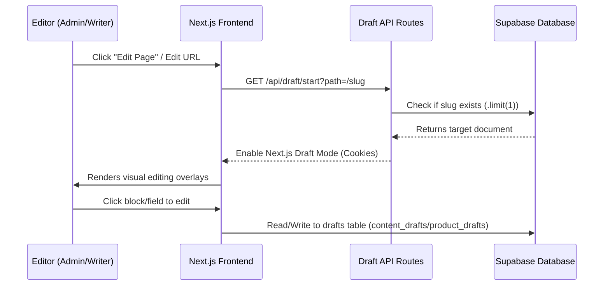

# Live Draft Mode

NextBlock features a real-time visual editing environment called **Live Draft Mode**. It allows editors to click on page elements, blocks, and product fields directly in the frontend website to edit them in-place, saving changes as non-destructive draft versions before publishing them to the live site.

This document describes the architectural design, API endpoints, database schema, component integrations, and local verification steps for Live Draft Mode.

---

## 1. Architecture Overview



Live Draft Mode consists of:
1. **Next.js Draft Mode Endpoints**: Verifies document existence and sets Next.js draft-mode headers/cookies.
2. **Visual Editing Overlays**: DOM attributes (e.g., `data-vercel-edit-info`) that identify editable documents and fields.
3. **Draft Tables**: Database tables (`content_drafts` and `product_drafts`) that store structural block snapshots and metadata.
4. **Draft Mutations**: Server actions (`loadVisualEditingBlockContent`, `saveVisualEditingBlockDraft`) to perform non-destructive updates.

---

## 2. Draft API Endpoints

NextBlock has two primary draft entry-point routes:
* `/api/draft` - Validates token/secret and redirects to the target page with draft mode active.
* `/api/draft/start` - Checks current user session authorization and document existence, then starts draft mode.

### Target Existence Verification
To support multi-language routing, NextBlock allows identical slugs to exist across different languages (e.g., `/articles` can exist in both English and French translation trees).
* **Fix**: Endpoints verify existence using `.limit(1)` rather than `.maybeSingle()`. This prevents Postgrest errors (`PGRST116: multiple rows returned`) when querying shared slugs.

---

## 3. Database Schema

Draft data is separated from live production data to ensure non-destructive previewing.

### Content Drafts (`content_drafts`)
Stores page and post drafts.
* `parent_type`: `"page" | "post"`
* `parent_id`: Foreign key reference to page/post ID (integer).
* `meta`: JSONB object storing draft metadata (title, slug, status, meta fields).
* `blocks`: JSONB array storing all draft blocks associated with the page/post.

### Product Drafts (`product_drafts`)
Stores product drafts.
* `product_id`: Foreign key reference to product ID (UUID string).
* `meta`: JSONB object storing draft product metadata (title, short description, sku, price, etc.).
* `blocks`: JSONB array storing draft description blocks (rich layout).

---

## 4. Visual Editing Integration

Frontend components use the `visualEditing` context to render hover overlays.

### Top-Level & Nested Blocks
Top-level blocks are rendered using `BlockRenderer.tsx`. For each block, `buildVisualEditAttributes()` generates:
* `data-vercel-edit-info`: Encodes document type, ID, slug, language, and block target (index/ID).
* `data-vercel-edit-target`: Target parameters for nested block structures.
* `data-nextblock-visual-edit`: UI identifier (e.g., `top-level:section`).

### Product-Level Visual Editing
Products support two kinds of visual editing:
1. **Field-Level Editing**: Modifying plain-text fields like `title` and `short_description`. Handled in `ProductDetailsLayout.tsx`.
2. **Block-Level Description**: Editing block layouts within the product detail description. Handled via `ProductDetailsBlockRenderer.tsx`.

> [!IMPORTANT]
> **Click Bubbling Prevention**: When block-level descriptions are rendered, the parent wrapper disables the outer `description_json` field editor attributes. This ensures clicks on individual description blocks edit the blocks themselves, avoiding `Invalid product field editor` conflicts.

---

## 5. Local Verification

To test Live Draft Mode locally:

1. **Verify Session Authorization**:
   Make sure you are signed in as an `ADMIN` or `WRITER` in the CMS.
2. **Enter Draft Mode**:
   Visit the start draft endpoint for any page, post, or product path:
   ```http
   GET http://localhost:3000/api/draft/start?path=/product/my-product-slug
   ```
3. **Inspect Overlays**:
   Hover over the page sections. Hover frames and edit buttons should appear.
4. **Run Automated Tests**:
   Verify draft routing rules using the test suite:
   ```powershell
   npx vitest run apps/nextblock/lib/visual-editing/draft-route.test.ts
   ```
