# Technical Specification

# 1. Introduction

## 1.1 EXECUTIVE SUMMARY

### 1.1.1 Project Overview

NextBlock CMS is an AI-Native, Open-Core Content Management System purpose-built for Next.js 16, distributed as an Nx 22.6.0 monorepo that unifies a public-facing website, an authenticated CMS, a collaborative block editor, shared database utilities, a design system, an optional premium e-commerce module, and a command-line scaffolding tool into a single coherent workspace. The project is published under the workspace package identifier `@nextblock/source` (version `0.2.77`) and is licensed under AGPLv3, with premium modules distributed under a source-available, license-gated model.

The system's central value proposition — "Speed. Scalability. AI-Readiness (coming soon)." — is encoded directly in its architectural decisions: a Next.js 16 App Router application (`apps/nextblock`) backed by Supabase, leveraging React Server Components, edge caching, and an image-optimization pipeline targeting a default 100/100 Lighthouse Performance score. Users bootstrap new projects in under thirty seconds via the `npm create nextblock@latest` CLI, which produces a standalone, production-ready Next.js application.

A live sandbox instance at `https://cms.nextblock.ca/` (accessible with demo credentials `demo@nextblock.ca` / `password`) resets daily via a cron-triggered endpoint (`/api/cron/reset-sandbox`) to provide evaluators with a clean-state environment.

### 1.1.2 Core Business Problem

NextBlock CMS addresses a well-known gap in the content-management market positioned between two unsatisfactory poles:

| Pain Point | Typical Manifestation | NextBlock CMS Resolution |
|:--|:--|:--|
| Performance tax of monolithic PHP stacks | WordPress sites slowed by plugin bloat atop PHP + MySQL | Static/edge-first delivery via Next.js 16 RSC + Supabase |
| Configuration friction in headless CMSs | Payload/Strapi require heavy workspace setup | Instant scaffold via `create-nextblock` CLI |
| Distribution overhead for adopters | Cloning large monorepos to start a project | CLI emits a self-contained app consuming published libraries |
| Absence of machine-legible structure | Codebases resist safe AI-agent extension | Repository ships `.agent/skills/` playbooks and strict Nx boundaries |

The core problem statement — "stop cloning heavy repos; start with our CLI and get a production-ready app instantly" — is operationalized through the combination of an Nx monorepo internally and published npm libraries externally, allowing adopters to receive a small, focused application that depends on maintained upstream packages.

### 1.1.3 Key Stakeholders and Users

The system recognizes three database-enforced user roles (defined as the `user_role` enum `ADMIN`, `WRITER`, `USER` in migration `00000000000000_setup_foundation_and_enums.sql`) and three additional implicit stakeholder classes observable from the scaffolding and documentation artifacts.

| Stakeholder | Role / Audience | Primary Entry Point |
|:--|:--|:--|
| Administrator | `ADMIN` — full CMS, payments, users, shipping, taxes | `/cms/admin`, `/cms/users`, `/cms/settings` |
| Content Author | `WRITER` — pages, posts, blocks, media | `/cms` |
| Registered Customer | `USER` — orders, profile | `/profile`, `/cart`, `/checkout` |
| Developer / Integrator | Scaffold adopter | `npm create nextblock@latest` |
| AI Coding Agent | Extension author | `.agent/skills/` playbooks |
| Store Operator | Premium activator | `activate ecommerce` CLI command |

A foundational authorization rule encoded in the database trigger `on_auth_user_created` elevates the first registered user to `ADMIN` and assigns all subsequent users the `USER` role, guaranteeing that every deployment has exactly one guaranteed administrator at bootstrap.

### 1.1.4 Expected Business Impact and Value Proposition

NextBlock CMS's competitive differentiation versus incumbents is explicitly articulated in the repository's root `README.md` and is reproduced below for reference.

| Dimension | NextBlock CMS | WordPress | Payload / Strapi |
|:--|:--|:--|:--|
| Technology Stack | Next.js 16 + Supabase | PHP + MySQL | React / Node.js |
| Architecture | Nx Monorepo | Monolith | Monolith / Workspaces |
| Default Performance | 100/100 Lighthouse | Plugin-bloated | Spec-dependent |
| Security Posture | Static / Edge First | Plugin vulnerabilities | Secure |
| Developer Experience | React Server Components | Legacy PHP Hooks | Config Heavy |
| AI-Readiness | Native | Not supported | Integration required |

The value proposition materializes as (1) a premium commerce package shipping both digital-product licensing (via Freemius) and physical-product checkout (via Stripe), (2) a Tiptap-powered Notion-style editor reusable across content domains, (3) an open-core model where the core is 100% free under AGPLv3 and premium extensions are license-gated via the `package_activations` table, and (4) a monorepo structure that simultaneously enforces architectural discipline (via ESLint's `@nx/enforce-module-boundaries`) and distributes published libraries (`@nextblock-cms/ui`, `@nextblock-cms/utils`, `@nextblock-cms/db`, `@nextblock-cms/editor`, `@nextblock-cms/sdk`) to downstream adopters.

---

## 1.2 SYSTEM OVERVIEW

### 1.2.1 Project Context

#### 1.2.1.1 Business Context and Market Positioning

NextBlock CMS occupies the "sweet spot" between block-editor flexibility (WordPress Gutenberg lineage) and modern server-rendered performance (Next.js React Server Components). Its go-to-market posture is defined by three complementary distribution channels:

1. **Open-Core Core** — All foundational libraries (`libs/ui`, `libs/utils`, `libs/db`, `libs/editor`, `libs/sdk`) are tagged `scope:public` in their Nx project configurations and published under AGPLv3.
2. **Premium Source-Available Extensions** — The `libs/ecommerce` library is tagged `scope:premium` in `libs/ecommerce/project.json` and activated via a license-key-gated installation path (`@nextblock-cms/ecommerce@npm:@nextblock-cms/ecom@latest`).
3. **CLI-Driven Scaffolding** — The `apps/create-nextblock` package (CLI version `0.2.78`) provides the `create` (default) and `activate` commands for respectively bootstrapping a new project and installing premium modules post-scaffold.

#### 1.2.1.2 Current System Limitations Addressed

The project does not replace an existing in-house system; rather, it targets external pain points in the broader CMS ecosystem as articulated in `README.md`. Explicitly addressed limitations include the performance overhead of plugin-heavy PHP stacks, the configuration ceremony required by traditional headless CMSs, and the absence of machine-parseable architectural documentation conducive to AI-assisted extension.

#### 1.2.1.3 Integration with Existing Enterprise Landscape

NextBlock CMS integrates with a specific, opinionated set of external services whose environment requirements are declared in `libs/environment.d.ts` (augmenting `NodeJS.ProcessEnv`) and `.env.exemple`.

| Integration Domain | Provider(s) | Purpose |
|:--|:--|:--|
| Database & Authentication | Supabase (`@supabase/ssr` 0.7.0, `@supabase/supabase-js` 2.77.0) | Postgres storage, Row-Level Security, Auth |
| Object Storage | Cloudflare R2 (S3-compatible via `@aws-sdk/client-s3` 3.920.0) | Media assets, presigned uploads |
| Physical Commerce | Stripe (`stripe` 20.4.1, `@stripe/stripe-js` 8.11.0) | Checkout, payments, Stripe Tax |
| Digital Commerce | Freemius (`@freemius/checkout` 1.4.1, `@freemius/sdk` 0.3.0) | Digital-product checkout, licensing |
| FX Rates | `api.frankfurter.dev` (configurable via `FX_API_BASE_URL`) | Multi-currency rate synchronization |
| Analytics & Observability | `@vercel/speed-insights` 1.3.1, `@next/third-parties` (GTM) 1.1.1 | Performance and behavior tracking |
| Hosting Platform | Vercel (cron jobs defined in `vercel.json`) | Edge delivery, scheduled jobs |
| Email Transport | SMTP (env-configured) | Transactional email |

### 1.2.2 High-Level Description

#### 1.2.2.1 Primary System Capabilities

The system delivers six top-level capability families, each surfaced through dedicated route groups in the Next.js App Router:

1. **Public Content Delivery** — Routes `app/[slug]`, `app/article/[slug]`, shared `app/layout.tsx`, `robots.txt`, and `sitemap.xml` serve marketing pages, articles, and product pages.
2. **Authentication & Account Management** — The `app/(auth-pages)/*` group and `app/auth/callback/route.ts` implement Supabase Auth session exchange, GitHub OAuth (via `components/GitHubLoginButton.tsx`), and profile completion flows.
3. **CMS Administration** — The `app/cms/*` route tree provides block editing, media management, product catalog management, order administration, shipping configuration, tax settings, and user administration, gated by role.
4. **Commerce Surface** — Routes `app/product/*`, `app/cart`, and `app/checkout` implement the customer-facing storefront; `app/api/checkout/route.ts` handles server-side checkout orchestration.
5. **Operational Endpoints** — Routes `app/api/webhooks/*` (Stripe/Freemius) and `app/api/cron/*` (sandbox reset, currency sync) provide the machine-to-machine surface; `app/api/upload` and `app/api/process-image` handle media ingestion and optimization.
6. **Developer Scaffolding** — The `apps/create-nextblock` CLI (distributed as the `create-nextblock` npm package) provides project bootstrap and premium-module activation commands.

#### 1.2.2.2 Major System Components

The workspace is composed of two applications and six libraries, each with an independent version and a well-defined import alias declared in `tsconfig.base.json`.

| Component | Path | Import Alias |
|:--|:--|:--|
| Primary Application (CMS + Public) | `apps/nextblock` | `@nextblock-cms/template` |
| CLI Scaffolder | `apps/create-nextblock` | `create-nextblock` |
| Database Layer | `libs/db` | `@nextblock-cms/db` |
| Reusable Editor | `libs/editor` | `@nextblock-cms/editor` |
| Premium E-Commerce | `libs/ecommerce` | `@nextblock-cms/ecommerce` (pkg: `@nextblock-cms/ecom`) |
| Block SDK | `libs/sdk` | `@nextblock-cms/sdk` |
| UI Design System | `libs/ui` | `@nextblock-cms/ui` |
| Utilities | `libs/utils` | `@nextblock-cms/utils` |

The current published versions are: `apps/nextblock` (private, `0.2.55`), `create-nextblock` (`0.2.78`), `@nextblock-cms/db` (`0.2.32`), `@nextblock-cms/editor` (`0.2.24`), `@nextblock-cms/ecom` (`0.0.10`), `@nextblock-cms/sdk` (`0.2.9`), `@nextblock-cms/ui` (`0.2.19`), `@nextblock-cms/utils` (`0.2.13`).

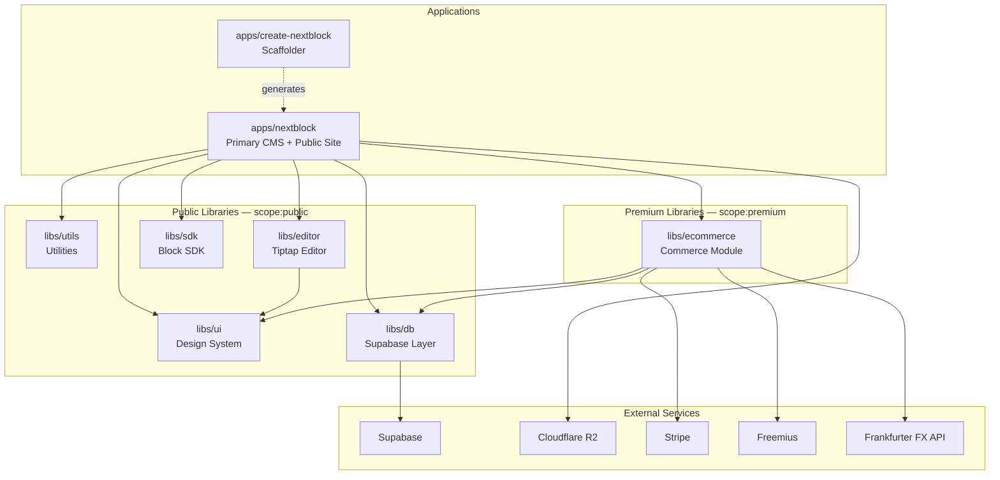
```mermaid
graph TB
    subgraph Apps["Applications"]
        App[apps/nextblock<br/>Primary CMS + Public Site]
        CLI[apps/create-nextblock<br/>Scaffolder]
    end

    subgraph PublicLibs["Public Libraries — scope:public"]
        UI[libs/ui<br/>Design System]
        Utils[libs/utils<br/>Utilities]
        DB[libs/db<br/>Supabase Layer]
        Editor[libs/editor<br/>Tiptap Editor]
        SDK[libs/sdk<br/>Block SDK]
    end

    subgraph PremiumLibs["Premium Libraries — scope:premium"]
        Ecom[libs/ecommerce<br/>Commerce Module]
    end

    subgraph External["External Services"]
        Supabase[Supabase]
        R2[Cloudflare R2]
        Stripe[Stripe]
        Freemius[Freemius]
        Frankfurter[Frankfurter FX API]
    end

    App --> UI
    App --> Utils
    App --> DB
    App --> Editor
    App --> SDK
    App --> Ecom
    CLI -.generates.-> App
    DB --> Supabase
    App --> R2
    Ecom --> Stripe
    Ecom --> Freemius
    Ecom --> Frankfurter
    Editor --> UI
    Ecom --> DB
    Ecom --> UI
```

#### 1.2.2.3 Core Technical Approach

The technical approach combines a React Server Components-first rendering model with a strictly-bounded monorepo topology.

**Core Framework Stack**

| Concern | Technology | Version |
|:--|:--|:--|
| Application Framework | Next.js (App Router) | `16.1.7` |
| UI Runtime | React / react-dom | `19.2.4` |
| Language | TypeScript (strict mode) | `5.9.3` |
| Monorepo Orchestration | Nx | `22.6.0` |

**Styling, UI, and Editor**

| Concern | Technology | Version |
|:--|:--|:--|
| Utility CSS | Tailwind CSS | `4.1.16` |
| Primitive Components | Radix UI (12+ primitives) | Multiple |
| Icon System | lucide-react | `0.548.0` |
| Theme Management | next-themes (light/dark/vibrant/system) | `0.4.6` |
| Rich-Text Engine | Tiptap (40+ extensions) | `3.22.4` |
| Collaboration | Yjs / y-protocols / y-tiptap | `13.6.30` / `1.0.7` |
| Syntax Highlighting | lowlight | `3.3.0` |
| Mathematics | katex | `0.16.25` |

**State, Forms, and Validation**

| Concern | Technology | Version |
|:--|:--|:--|
| Client State | zustand | `5.0.10` |
| Schema Validation | zod | `4.3.6` |
| Form Management | react-hook-form | `7.71.1` |
| Form Resolvers | @hookform/resolvers | `5.2.2` |

**Media, Build, and Operations**

| Concern | Technology | Version |
|:--|:--|:--|
| Image Processing | sharp | `0.34.2` |
| Blur Placeholders | plaiceholder | `3.0.0` |
| Critical CSS | beasties | `0.4.1` |
| Bundle Analysis | @next/bundle-analyzer | `16.0.1` |
| Unit Testing | Vitest (in `libs/utils/tests`) | `4.0.0` |
| Library Build | Vite + vite-plugin-dts | `7.2.6` |
| Local Registry | Verdaccio (`.verdaccio/`) | `6.0.5` |

**Architectural Patterns**

The primary application enforces a request-proxy pattern via `apps/nextblock/proxy.ts` (a deliberate departure from the conventional `middleware.ts` pattern — the documentation in `docs/04-DATABASE-AND-AUTH.md` notes there is no live `middleware.ts` file in the current app). The proxy is responsible for (1) Supabase session synchronization, (2) CMS role-based route guards (WRITER/ADMIN for `/cms`; ADMIN-only for `/cms/admin`, `/cms/users`, `/cms/settings`), (3) locale propagation via the `X-User-Locale` header and `NEXT_USER_LOCALE` cookie, (4) security headers (HSTS `max-age=63072000`, X-Frame-Options, X-Content-Type-Options, Referrer-Policy, Permissions-Policy, COOP), (5) production-only Content-Security-Policy with nonce allowlisting Supabase, R2, Freemius, Vercel, Google Analytics/Tag Manager, and YouTube, and (6) page-type prefetch-priority signaling via `X-Page-Type` and `X-Prefetch-Priority` headers.

Client-side composition follows a strict nested provider order defined in `apps/nextblock/app/providers.tsx`: `AuthProvider → LanguageProvider → CurrencyProvider → CurrentContentProvider → CartTranslator → TranslationBridge → TranslationsProvider → ThemeProvider`.

### 1.2.3 Success Criteria

#### 1.2.3.1 Measurable Objectives

| Objective | Target | Evidence Location |
|:--|:--|:--|
| Default Lighthouse Performance | 100 / 100 | `README.md` product claim |
| Time-to-First-Project via CLI | ≤ 30 seconds | `README.md` product claim |
| Image Cache TTL | 31,536,000 s (1 year) | `apps/nextblock/next.config.js` |
| Public Layout Revalidation | 60 seconds | `apps/nextblock/app/layout.tsx` |
| Package-Activation Check Cache | 60 seconds (`unstable_cache`) | `libs/db/src/lib/package-validation.ts` |
| Strict TypeScript Compliance | `strict: true` | `tsconfig.base.json` |

#### 1.2.3.2 Critical Success Factors

The following architectural invariants are enforced at workspace level and must remain true for the system to operate as designed:

1. **Open-Core Boundary Enforcement** — The rule that `libs/ui` MUST NOT depend on `apps/nextblock` is enforced via ESLint's `@nx/enforce-module-boundaries` plugin, as documented in `.agent/skills/project-architecture/SKILL.md`.
2. **Scope Tag Discipline** — Every Nx project declares a `scope:public` or `scope:premium` tag, enabling dependency-direction enforcement between open and premium tiers.
3. **Security Header Coverage** — All responses emitted from `apps/nextblock/proxy.ts` carry the documented security header set; production responses additionally carry a nonce-based CSP.
4. **License Activation Integrity** — Premium features (commerce) check `package_activations` via `verifyPackageOnline()` before executing gated operations.
5. **First-User Administrator Guarantee** — The DB trigger `on_auth_user_created` ensures a deployment's first registered user becomes `ADMIN`.
6. **Role-Gated CMS Access** — `/cms` requires `WRITER` or `ADMIN`; sensitive administrative routes require `ADMIN` only.

#### 1.2.3.3 Key Performance Indicators (KPIs)

| KPI Category | Metric | Measurement Surface |
|:--|:--|:--|
| Page Delivery | AVIF/WebP image format adoption | `next.config.js` image config |
| Caching Effectiveness | Edge cache hit rate on public routes | `apps/nextblock/app/layout.tsx` revalidation |
| Prefetch Accuracy | Correct `X-Prefetch-Priority` signaling per page-type | `apps/nextblock/proxy.ts` |
| Media Optimization | Blur placeholders generated for uploaded images | `sharp` + `plaiceholder` pipeline |
| Developer Adoption | CLI install success rate | `apps/create-nextblock/bin/create-nextblock.js` |
| Commerce Conversion | Checkout success by provider (Stripe / Freemius) | `app/api/checkout/route.ts` + webhooks |
| Scheduled Job Health | Daily success of reset-sandbox and sync-currencies | `vercel.json` cron configuration |
| Bundle Discipline | Removed console calls in production | `compiler.removeConsole` in `next.config.js` |

---

## 1.3 SCOPE

### 1.3.1 In-Scope: Core Features and Functionalities

#### 1.3.1.1 Must-Have Capabilities — Content Management

**Block Registry** — The application exposes fourteen built-in block types, registered in `apps/nextblock/lib/blocks/blockRegistry.ts`, spanning content and commerce domains. Editors can additionally define data-driven custom block types at runtime (`custom_block_definitions`); see the custom blocks reference.

| Domain | Block Types |
|:--|:--|
| Content | `text`, `heading`, `image`, `button`, `video_embed`, `section`, `form`, `testimonial`, `posts_grid` |
| Commerce | `product_grid`, `featured_product`, `cart`, `checkout`, `product_details` |

**Editor Capabilities** — The `@nextblock-cms/editor` library (version `0.2.24`) exports `Editor`, `NotionEditor`, `EditorToolbar`, `EditorBubbleMenu`, `EditorFloatingMenu`, `EnhancedFloatingMenu`, `SlashCommandList`, `DragHandle`, `HtmlContent`, and `editorExtensions`. Feature set includes Tiptap StarterKit rich text, syntax-highlighted code blocks, tables, task lists, slash commands, drag handles, image handling, character counting, typography, mathematics, emoji, mentions, inline alert and call-to-action widgets, and custom HTML-preserving extensions for `div`, `style`, `script`, `svg`, `span`, and catch-all attribute preservation. A media-picker bridge is exposed via `setOpenImagePicker()`.

**Translation & Localization** — The system supports two locales at present (`en`, `fr` — defined as `SUPPORTED_LOCALES` in `apps/nextblock/proxy.ts`), backed by `languages` and `translations` tables from migration `00000000000001_setup_cms_core.sql`. Content revision history is stored as snapshot + JSON Patch diff (enum `revision_type: snapshot, diff`) per migration `00000000000002_setup_content_tables.sql`.

**Page Lifecycle** — Pages move through `draft`, `published`, and `archived` statuses (enum `page_status`).

**Navigation Menus** — Three menu locations are supported: `HEADER`, `FOOTER`, `SIDEBAR` (enum `menu_location`).

#### 1.3.1.2 Must-Have Capabilities — Commerce (Premium)

| Commerce Concern | Data Model | Runtime Behavior |
|:--|:--|:--|
| Catalog | `products`, `product_media`, `product_attributes`, `product_attribute_terms`, `product_variants`, `variant_attribute_mapping` | Product browsing, variant selection, media display |
| Inventory & Licensing | `inventory_items`, `package_activations`, `freemius_plans`, `freemius_pricing` | Stock tracking, digital-product entitlement |
| Checkout & Fulfillment | `orders`, `order_items`, `shipping_zones`, `shipping_zone_locations`, `shipping_zone_methods`, `tax_rates`, `currencies` | Order orchestration, shipping resolution, tax computation |

**Provider Routing** — Physical products route to Stripe; digital products route to Freemius; mixed-provider carts are rejected at checkout.

**Multi-Currency** — FX rates are synchronized from `https://api.frankfurter.dev` (overridable via `FX_API_BASE_URL`) on a daily cron at 18:00 UTC (`0 18 * * *` in `vercel.json`), guarded by the `CRON_SECRET` environment variable. Rounding modes available: `none`, `nearest`, `up`, `down`, `charm`.

**Tax Modes** — `manual` tax rates or `automatic` via Stripe Tax.

**Order Lifecycle** — Orders transition through `pending`, `paid`, `shipped`, `cancelled`, `refunded`.

#### 1.3.1.3 Primary User Workflows

| Workflow | Actors | Entry Surface |
|:--|:--|:--|
| Register a new project | Developer | `npm create nextblock@latest` |
| Activate premium module | Developer / Store Operator | `create-nextblock activate ecommerce` |
| Sign in to the CMS | ADMIN / WRITER | `app/(auth-pages)/sign-in` |
| Author a page with blocks | WRITER / ADMIN | `/cms` |
| Manage product catalog | ADMIN | `/cms/products/*` |
| Configure shipping zones | ADMIN | `/cms/settings` (shipping) |
| Browse and purchase | USER / anonymous | `/product/*` → `/cart` → `/checkout` |
| Switch locale | Any | Header language switcher |
| Switch theme | Any | Header theme switcher (light/dark/vibrant/system) |

#### 1.3.1.4 Essential Integrations

The following integrations are required for a fully-functional deployment: Supabase (Postgres + Auth + Storage orchestration), Cloudflare R2 (media object storage, S3-compatible), Stripe (physical checkout and optional Stripe Tax), Freemius (digital-product checkout and licensing), Frankfurter FX API (currency rate synchronization), SMTP (transactional email), and optionally Vercel (cron scheduling and Speed Insights).

#### 1.3.1.5 Key Technical Requirements

| Requirement | Constraint |
|:--|:--|
| Node / Framework | Next.js 16 App Router, React 19, TypeScript strict |
| Security | HSTS (2 years), X-Frame-Options, production nonce-CSP |
| Accessibility | bfcache-compatible `Cache-Control: public, max-age=0, must-revalidate` |
| Image Pipeline | AVIF + WebP, 9 device sizes, 9 image sizes, 1-year minimum cache TTL |
| Module Boundaries | `@nx/enforce-module-boundaries` on scope tags |
| Package Isolation | Shared libs transpiled via `transpilePackages` in `next.config.js` |

### 1.3.2 In-Scope: Implementation Boundaries

#### 1.3.2.1 System Boundaries

A single Next.js application (`apps/nextblock`, package identifier `@nextblock-cms/template`) simultaneously serves the public website and the authenticated CMS, distinguished by route groups rather than separate deployments. Premium-feature gating is enforced at two layers: (1) the `package_activations` database table recording active licenses, and (2) the `verifyPackageOnline()` helper in `libs/db/src/lib/package-validation.ts` performing the runtime check (cached for 60 seconds).

The dependency graph follows three rules defined in `.agent/skills/project-architecture/SKILL.md`:

1. `libs/*` may depend on other `libs/*`.
2. `apps/*` may depend on `libs/*`.
3. `libs/ui` MUST NOT depend on `apps/nextblock` (enforced via ESLint).

#### 1.3.2.2 User Groups Covered

| User Group | Role | Privileged Routes |
|:--|:--|:--|
| Administrators | `ADMIN` | `/cms`, `/cms/admin`, `/cms/users`, `/cms/settings` |
| Content Authors | `WRITER` | `/cms` (content editing only) |
| Registered Customers | `USER` | `/profile`, `/cart`, `/checkout`, order history |
| Anonymous Visitors | (none) | Public pages, articles, product browsing |

Profile completion is enforced via a redirect: users without a `full_name` value are routed to `/profile` before being permitted to access additional authenticated surfaces.

#### 1.3.2.3 Geographic and Market Coverage

Shipping resolution operates at country and state granularity. Multi-currency pricing is supported with a configurable default currency seeded in migration `00000000000008_seed_platform_defaults.sql`. The database schema includes a `shipping_zone_locations.postal_code` column for future finer-grained geographic resolution, although the current runtime resolver does not yet consume it.

#### 1.3.2.4 Data Domains Included

| Domain | Representative Tables | Seeded By |
|:--|:--|:--|
| CMS Core | `settings`, `profiles`, `languages`, `media`, `translations`, `logos` | Migration `00000000000001` |
| Content | `pages`, `posts`, `blocks`, `navigation`, `revisions` | Migration `00000000000002` |
| Commerce Catalog | `products`, `product_variants`, `inventory_items`, `package_activations`, `freemius_plans`, `freemius_pricing` | Migrations `00000000000003`–`00000000000006` |
| Commerce Fulfillment | `orders`, `order_items`, `shipping_zones`, `shipping_zone_methods`, `tax_rates`, `currencies` | Migrations `00000000000007`–`00000000000010` |
| Platform Defaults | `footer_copyright`, `enabled_payment_providers`, `ecommerce_inventory_settings`, `invoice_settings` | Migration `00000000000008` |

### 1.3.3 Out-of-Scope

#### 1.3.3.1 Explicitly Excluded Features and Known Limitations

| Exclusion | Current State | Evidence |
|:--|:--|:--|
| AI runtime features | "Coming soon" — no AI inference currently shipping | `README.md` tagline |
| Freemius webhook reconciliation | Events acknowledged; local state not yet reconciled | `docs/02-ECOMMERCE-CAPABILITIES.md` |
| Postal-code shipping matching | Schema present; resolver does not consume at runtime | `docs/02-ECOMMERCE-CAPABILITIES.md` |
| `middleware.ts` surface | Not used; replaced by `proxy.ts` pattern | `docs/04-DATABASE-AND-AUTH.md` |
| `ecommerce:build` Nx target | Standalone build check currently not green | `docs/05-DEVELOPER-GUIDE.md` |
| Package-name alignment | `libs/ecommerce/package.json` is `@nextblock-cms/ecom`; alias `@nextblock-cms/ecommerce` | `libs/ecommerce/package.json` |

#### 1.3.3.2 Features Not in the Current Block Registry

The following block categories are not present in the 15-block registry and are out-of-scope for the current release: native AI-authored / LLM-generated content blocks, native analytics dashboard blocks, and chat or comments blocks.

#### 1.3.3.3 Infrastructure Assumptions (Not Portable)

| Assumption | Implication |
|:--|:--|
| Supabase-only backend | No pluggable database abstraction for alternative providers |
| Next.js-only frontend | No alternative framework targets |
| Vercel-oriented deployment | Cron schedules defined in `vercel.json`; uses `@vercel/speed-insights` |
| Cloudflare R2 for media | S3-compatible endpoint required |
| Frankfurter for FX rates | Alternative providers require custom implementation despite `FX_API_BASE_URL` override |

#### 1.3.3.4 Future Phase Considerations

Based on claims and deferred items in the repository documentation, the following are acknowledged as candidates for future phases but are not part of the current scope: full AI-agent runtime capabilities (currently only structural AI-readiness via `.agent/skills/`), full Freemius reconciliation for licenses and order state, postal-code-precision shipping resolution, standalone `libs/ecommerce` build parity, additional locales beyond `en`/`fr`, and alternative backend provider abstractions.

#### 1.3.3.5 Integration Points Not Covered

The system does not natively integrate with: alternative payment processors beyond Stripe and Freemius, alternative authentication providers beyond Supabase Auth and GitHub OAuth, alternative object-storage providers beyond S3-compatible endpoints (specifically Cloudflare R2 in reference deployments), alternative monorepo orchestrators beyond Nx, or alternative hosting platforms requiring cron-configuration formats other than Vercel's `vercel.json` schema.

---

## 1.4 REFERENCES

### 1.4.1 Root-Level Configuration and Governance Files

- `README.md` — Product value proposition, competitive positioning, feature list, and documentation index
- `package.json` — Root workspace metadata, dependency versions, build scripts, and release tooling
- `LICENSE.md` — AGPLv3 license text and copyright notice (`Copyright (C) 2025 NextBlock CMS`)
- `nx.json` — Nx 22.6.0 workspace configuration, target defaults, and release settings
- `tsconfig.base.json` — Shared TypeScript strict-mode configuration and `@nextblock-cms/*` path aliases
- `components.json` — shadcn/ui configuration (Slate base, CSS variables, RSC)
- `tailwind.config.js` — Root Tailwind CSS theme tokens and dark-mode configuration
- `vercel.json` — Cron schedule definitions (reset-sandbox at 03:00 UTC, sync-currencies at 18:00 UTC)
- `.env.exemple` — Environment variable reference template

### 1.4.2 Documentation Hub (`docs/`)

- `docs/README.md` — Documentation index and audience guide
- `docs/01-PROJECT-OVERVIEW.md` — Monorepo architecture and runtime model
- `docs/02-ECOMMERCE-CAPABILITIES.md` — Commerce data model, provider routing, multi-currency
- `docs/03-CMS-AND-EDITOR.md` — Block registry enumeration and Tiptap editor capabilities
- `docs/04-DATABASE-AND-AUTH.md` — Supabase clients, auth flow, schema overview, RLS
- `docs/05-DEVELOPER-GUIDE.md` — Local setup, commands, environment expectations, known caveats
- `docs/06-CLI-AND-SCAFFOLDING.md` — `create-nextblock` CLI flow and premium activation
- `docs/07-BLOCK-SDK-AND-EXTENSIBILITY.md` — SDK contract shape versus app block registry

### 1.4.3 Application Sources

- `apps/nextblock/package.json` — Primary application package metadata (`@nextblock-cms/template` v0.2.55)
- `apps/nextblock/README.md` — Application-level contributor orientation
- `apps/nextblock/project.json` — Nx project tags `app:nextblock` and `scope:public`
- `apps/nextblock/next.config.js` — Next.js image optimization, CSP, and `transpilePackages` config
- `apps/nextblock/proxy.ts` — Auth proxy, CMS role gating, locale propagation, and security headers
- `apps/nextblock/app/layout.tsx` — Root layout with revalidation policy
- `apps/nextblock/app/page.tsx` — Homepage locale resolution
- `apps/nextblock/app/providers.tsx` — Client provider composition order
- `apps/nextblock/app/api/cron/reset-sandbox/route.ts` — Sandbox reset endpoint
- `apps/create-nextblock/package.json` — CLI package metadata (`create-nextblock` v0.2.78)
- `apps/create-nextblock/bin/create-nextblock.js` — CLI command definitions

### 1.4.4 Library Sources

- `libs/environment.d.ts` — Global `NodeJS.ProcessEnv` augmentation
- `libs/ui/package.json` — `@nextblock-cms/ui` v0.2.19
- `libs/editor/package.json` — `@nextblock-cms/editor` v0.2.24 (+ Tiptap extension manifest)
- `libs/editor/README.md` — Editor capability enumeration
- `libs/ecommerce/package.json` — `@nextblock-cms/ecom` v0.0.10
- `libs/ecommerce/project.json` — `scope:premium` Nx tag
- `libs/db/package.json` — `@nextblock-cms/db` v0.2.32
- `libs/db/src/lib/package-validation.ts` — Premium package activation check (60s cache)
- `libs/sdk/package.json` — `@nextblock-cms/sdk` v0.2.9
- `libs/utils/package.json` — `@nextblock-cms/utils` v0.2.13

### 1.4.5 Database Migrations

- `libs/db/src/supabase/migrations/00000000000000_setup_foundation_and_enums.sql` — Enums: `user_role`, `page_status`, `menu_location`, `revision_type`
- `libs/db/src/supabase/migrations/00000000000001_setup_cms_core.sql` — Languages, translations, media, profiles, settings
- `libs/db/src/supabase/migrations/00000000000002_setup_content_tables.sql` — Pages, posts, blocks, navigation, revisions
- `libs/db/src/supabase/migrations/00000000000008_seed_platform_defaults.sql` — Default settings (footer copyright, payment providers, inventory, invoice settings)
- Migrations 00000000000003 through 00000000000010 — Commerce catalog, fulfillment, and platform seeds

### 1.4.6 Agent Skill Documents

- `.agent/skills/agent-guidelines/SKILL.md` — Project constitution: Open-Core mandate and separation rules
- `.agent/skills/project-architecture/SKILL.md` — High-level layout, dependency graph rules, template syncing
- `.agent/skills/frontend-design/SKILL.md` — Frontend design philosophy

### 1.4.7 Folders Explored

- `apps/` — Two applications (`nextblock`, `create-nextblock`)
- `apps/nextblock/app/` — Next.js App Router route groups, CMS, API, auth, public content
- `apps/nextblock/app/cms/` — CMS area: blocks, products, orders, shipping
- `apps/nextblock/app/api/` — Checkout, cron, media, revalidation, upload, webhooks
- `apps/nextblock/app/api/cron/` — Reset-sandbox and sync-currencies endpoints
- `apps/nextblock/components/` — AppShell, Header, ResponsiveNav, LanguageSwitcher, ThemeSwitcher
- `libs/` — Six library packages plus `environment.d.ts`
- `libs/db/src/` — Database package sources (clients, migrations, package-validation)
- `libs/db/src/lib/` — Database helpers including `package-validation.ts`, `media-actions.ts`
- `libs/db/src/supabase/migrations/` — Eleven migration files (00000000000000–00000000000010)
- `libs/editor/`, `libs/ecommerce/`, `libs/sdk/`, `libs/ui/`, `libs/utils/` — Individual library roots
- `docs/` — Seven numbered reference documents plus index
- `tools/` — Build scripts (`release-lib.js`, `release-cli.js`) and stubs
- `.agent/skills/` — Agent-authored architectural playbooks
- `.verdaccio/` — Local npm registry configuration

# 2. Product Requirements

This section decomposes NextBlock CMS into thirty discrete, testable features organized across content management, security and authorization, premium commerce, and developer/platform concerns. Each feature is traceable to specific source files, database migrations, and documentation artifacts enumerated in section `1.4 REFERENCES`. All requirements herein are grounded in observable repository evidence; no speculative capabilities are introduced. Requirements inherit the scope boundaries established in section `1.3 SCOPE` (including explicit exclusions in `1.3.3`).

## 2.1 FEATURE CATALOG

### 2.1.1 Feature Classification Overview

The feature catalog groups the system's capabilities into four families mirroring the architectural topology documented in section `1.2.2.2`. Open-core features (F-001 through F-012, F-024, F-026 through F-030) are published under AGPLv3 as part of `scope:public` libraries; commerce features (F-013 through F-022) belong to the `scope:premium` `libs/ecommerce` library and are license-gated via the `package_activations` table.

| Family | Feature Range | Scope Tag | License Posture |
|:--|:--|:--|:--|
| Content Management | F-001, F-004–F-009 | scope:public | AGPLv3 |
| Security & Authorization | F-002, F-003, F-011, F-012, F-030 | scope:public | AGPLv3 |
| Premium Commerce | F-013–F-022 | scope:premium | Source-available, license-gated |
| Platform & Developer Experience | F-010, F-023–F-029 | scope:public | AGPLv3 |

### 2.1.2 Content Delivery and Authoring Features

#### 2.1.2.1 F-001: Public Content Delivery

**Feature Metadata**

| Attribute | Value |
|:--|:--|
| Unique ID | F-001 |
| Feature Name | Public Content Delivery |
| Category | Content Rendering / Public Site |
| Priority | Critical |
| Status | Completed |

**Description**

The public content delivery feature provides locale-aware rendering of marketing pages, articles, and product pages via the Next.js 16 App Router. Routes `app/[slug]` and `app/article/[slug]` render content using React Server Components, with the root layout at `app/layout.tsx` applying a 60-second revalidation window (governed by `PUBLIC_LAYOUT_REVALIDATE_SECONDS`). The feature delivers machine-discoverable routes via `robots.txt` and `sitemap.xml`, and incorporates an image-optimization pipeline with AVIF and WebP formats, 11 device breakpoints (320 through 2560 pixels), 9 thumbnail image sizes (16 through 512 pixels), two quality levels (60 and 75), and a one-year minimum image cache TTL (31,536,000 seconds) declared in `apps/nextblock/next.config.js`.

**Business Value:** Realizes the "Speed" pillar of the product value proposition by delivering static/edge-first content at a default 100/100 Lighthouse Performance score. **User Benefits:** Fast page loads, correct SEO metadata, and locale-appropriate URLs without additional configuration. **Technical Context:** Relies on React Server Components and Next.js incremental static regeneration; depends upon the shared provider chain composed in `app/providers.tsx`.

**Dependencies**

| Dependency Type | Details |
|:--|:--|
| Prerequisite Features | F-002 (Auth session context), F-007 (Localization), F-009 (Navigation), F-012 (Proxy) |
| System Dependencies | Supabase (reads published content), Cloudflare R2 (media URLs) |
| External Dependencies | Next.js 16.1.7, React 19.2.4, `@vercel/speed-insights` 1.3.1 |
| Integration Requirements | Upstream `sharp` + `plaiceholder` media pipeline; `next-themes` for class-based theming |

#### 2.1.2.2 F-004: Block-Based Page Builder

**Feature Metadata**

| Attribute | Value |
|:--|:--|
| Unique ID | F-004 |
| Feature Name | Block-Based Page Builder |
| Category | Content Authoring |
| Priority | High |
| Status | Completed |

**Description**

The block-based page builder is implemented as a registry in `apps/nextblock/lib/blocks/blockRegistry.ts` that currently exposes fourteen built-in block types. Content blocks comprise `text`, `heading`, `image`, `button`, `posts_grid`, `video_embed`, `section`, `form`, and `testimonial`; commerce blocks comprise `product_grid`, `featured_product`, `cart`, `checkout`, and `product_details`. Each registration consists of a Zod schema, initial content generator, renderer component, and editor component. Section blocks support nested `column_blocks`, container type variants (`full-width`, `container`, `container-sm`, `container-lg`, `container-xl`), responsive column counts (mobile 1–2, tablet 1–3, desktop 1–4), gap and padding controls, and background modes (gradient, solid, image); legacy `hero` blocks were folded into `section` (carrying an `is_hero` flag) by migration `00000000000021`. Beyond these built-ins, editors can define data-driven custom block types at runtime (`custom_block_definitions`), rendered by a dynamic layout engine.

**Business Value:** Provides a WordPress-Gutenberg-comparable authoring surface while retaining React/TypeScript first-class typing. **User Benefits:** Authors compose layouts without HTML knowledge; schema validation prevents malformed content. **Technical Context:** Registry exposes helper functions `getBlockDefinition()`, `getInitialContent()`, `getBlockSchema()`, `validateBlockContent()`, `generateDefaultContent()`, and `isValidBlockType()`.

**Dependencies**

| Dependency Type | Details |
|:--|:--|
| Prerequisite Features | F-005 (Editor — used by `text` and `product_details`), F-006 (Media — used by `image`, `section`), F-007 (Translations) |
| System Dependencies | `blocks` database table (from migration `00000000000002`) |
| External Dependencies | `zod` 4.3.6 for schema validation |
| Integration Requirements | Commerce blocks (`product_grid`, `featured_product`, `cart`, `checkout`, `product_details`) require `@nextblock-cms/ecommerce` via F-022 |

#### 2.1.2.3 F-005: Tiptap Rich Text Editor

**Feature Metadata**

| Attribute | Value |
|:--|:--|
| Unique ID | F-005 |
| Feature Name | Tiptap Rich Text Editor (`@nextblock-cms/editor`) |
| Category | Content Authoring |
| Priority | High |
| Status | Completed |

**Description**

The editor is a standalone published library at `libs/editor` (version `0.2.24`) exposing `Editor`, `NotionEditor`, `EditorToolbar`, `EditorBubbleMenu`, `EditorFloatingMenu`, `EnhancedFloatingMenu`, `SlashCommandList`, `DragHandle`, `HtmlContent`, and `editorExtensions`. It bundles Tiptap 3.22.4 with 40+ extensions including StarterKit, syntax-highlighted code blocks (via `lowlight` 3.3.0 and `CodeBlockLowlight`), tables, task lists, link handling, TextStyleKit, highlight, subscript/superscript, typography, character counting, slash commands, drag handles, image handling, KaTeX mathematics (`katex` 0.16.25), emoji, mentions, inline alert and call-to-action widgets, and custom HTML-preserving extensions for `div`, `style`, `script`, `svg`, `span`, and catch-all attribute preservation. Collaborative editing infrastructure is supplied by `yjs` 13.6.30, `y-protocols` 1.0.7, and `y-tiptap` 3.0.3.

**Business Value:** Eliminates the need for downstream adopters to build or license a separate rich-text editor. **User Benefits:** Notion-class writing experience with slash commands, drag handles, and live collaboration primitives. **Technical Context:** Extension kit assembled in `libs/editor/src/lib/kit.ts`; advanced features catalogued in `libs/editor/ADVANCED_FEATURES.md`.

**Dependencies**

| Dependency Type | Details |
|:--|:--|
| Prerequisite Features | None (leaf library within `scope:public`) |
| System Dependencies | F-006 media-picker bridge (via `setOpenImagePicker()`) |
| External Dependencies | Tiptap 3.22.4 extension ecosystem, `lowlight` 3.3.0, `katex` 0.16.25, Yjs stack |
| Integration Requirements | Consumed by F-004 for text-oriented block rendering |

#### 2.1.2.4 F-006: Media Management and Image Pipeline

**Feature Metadata**

| Attribute | Value |
|:--|:--|
| Unique ID | F-006 |
| Feature Name | Media Management & Image Pipeline |
| Category | Content / Asset Management |
| Priority | High |
| Status | Completed |

**Description**

Media management combines a Cloudflare R2-backed object store with an image-processing pipeline. Two upload mechanisms are supported: a presigned PUT URL path and a multipart proxy path, both exposed under `apps/nextblock/app/api/upload/`. Processing occurs through `apps/nextblock/app/api/process-image/` using `sharp` 0.34.2 to generate AVIF derivatives and `plaiceholder` 3.0.0 to produce blur placeholders. The `media` table in the Supabase schema stores `object_key`, `file_type`, `size_bytes`, `description`, `width`, `height`, `blur_data_url`, `variants` (JSONB), `folder`, and `file_path`. Upload recording is enforced to the `ADMIN` and `WRITER` roles via `recordMediaUpload` in `libs/db/src/lib/media-actions.ts`.

**Business Value:** Delivers production-grade media handling without requiring adopters to integrate a dedicated DAM. **User Benefits:** Automatic modern-format conversion, blur placeholders, and role-gated uploads. **Technical Context:** Uses `@aws-sdk/client-s3` 3.920.0 and `@aws-sdk/s3-request-presigner` 3.919.0 for S3-compatible R2 access.

**Dependencies**

| Dependency Type | Details |
|:--|:--|
| Prerequisite Features | F-002 (Auth), F-003 (RBAC — ADMIN/WRITER write gate) |
| System Dependencies | Cloudflare R2 bucket (`R2_BUCKET_NAME`), `media` table |
| External Dependencies | `@aws-sdk/client-s3`, `@aws-sdk/s3-request-presigner`, `sharp`, `plaiceholder` |
| Integration Requirements | R2 env vars (`R2_ACCOUNT_ID`, `R2_ACCESS_KEY_ID`, `R2_SECRET_ACCESS_KEY`, `NEXT_PUBLIC_R2_PUBLIC_URL`, `NEXT_PUBLIC_R2_BASE_URL`, `R2_TOKEN_VALUE`) |

#### 2.1.2.5 F-007: Multi-Language Translation System

**Feature Metadata**

| Attribute | Value |
|:--|:--|
| Unique ID | F-007 |
| Feature Name | Multi-Language Translation System |
| Category | Localization |
| Priority | High |
| Status | Completed |

**Description**

Two locales are currently supported — `en` and `fr` — defined as `SUPPORTED_LOCALES` in `apps/nextblock/proxy.ts` and seeded in migration `00000000000008_seed_platform_defaults.sql` (with `en` marked as the single default). The `languages` table enforces a single `is_default` row; the `translations` table stores translation keys with JSONB-per-locale values. Localized content entities (pages, posts, products) are clustered via `translation_group_id` UUIDs. Locale propagation uses the `NEXT_USER_LOCALE` cookie (`maxAge: 31_536_000` seconds, one year) and the `X-User-Locale` request header, both set by the request proxy. The client-side provider chain `LanguageProvider → TranslationsProvider` in `apps/nextblock/app/providers.tsx` bridges server-resolved locale into React context.

**Business Value:** Unlocks multi-market deployments without requiring adopters to integrate a separate i18n library. **User Benefits:** Language switching persists across sessions; same content IDs preserve relationships across translations. **Technical Context:** Implemented at schema level (migration `00000000000001_setup_cms_core.sql`), proxy level, and provider level.

**Dependencies**

| Dependency Type | Details |
|:--|:--|
| Prerequisite Features | F-012 (Proxy — sets locale cookie/header) |
| System Dependencies | `languages` and `translations` tables |
| External Dependencies | None beyond framework |
| Integration Requirements | Consumed by F-004 (block labels), F-009 (navigation), F-013 (product titles), F-018 (currency labels) |

#### 2.1.2.6 F-008: Content Revision History

**Feature Metadata**

| Attribute | Value |
|:--|:--|
| Unique ID | F-008 |
| Feature Name | Content Revision History |
| Category | Content Management |
| Priority | Medium |
| Status | Completed |

**Description**

Revisions are implemented in the `page_revisions` and `post_revisions` tables defined in migration `00000000000002_setup_content_tables.sql`, using a hybrid snapshot/diff model. The `revision_type` enum (`snapshot`, `diff`) distinguishes between full snapshots and JSON Patch diffs (generated via `fast-json-patch` 3.1.1). A UNIQUE constraint on `(page_id, version)` ensures monotonically increasing snapshot versions. The CMS surface resides under `apps/nextblock/app/cms/revisions/`.

**Business Value:** Provides audit trail and rollback capability for authored content. **User Benefits:** Authors can restore prior states; accidental deletions are recoverable. **Technical Context:** Diff generation reduces storage overhead for frequently-updated content.

**Dependencies**

| Dependency Type | Details |
|:--|:--|
| Prerequisite Features | F-002 (Auth), F-003 (RBAC) |
| System Dependencies | `page_revisions`, `post_revisions` tables; `revision_type` enum |
| External Dependencies | `fast-json-patch` 3.1.1 |
| Integration Requirements | Triggered on page/post write paths |

#### 2.1.2.7 F-009: Navigation Menus

**Feature Metadata**

| Attribute | Value |
|:--|:--|
| Unique ID | F-009 |
| Feature Name | Navigation Menus |
| Category | Content Management |
| Priority | Medium |
| Status | Completed |

**Description**

Three menu locations are supported: `HEADER`, `FOOTER`, and `SIDEBAR`, encoded by the `menu_location` enum. The `navigation_items` table (migration `00000000000002_setup_content_tables.sql`) supports hierarchical menus through a `parent_id` self-reference, explicit `order` for sibling sorting, translation group affiliation, and optional page references. Administrative CRUD operations reside at `apps/nextblock/app/cms/navigation/`.

**Dependencies**

| Dependency Type | Details |
|:--|:--|
| Prerequisite Features | F-003 (RBAC), F-007 (Translations) |
| System Dependencies | `navigation_items` table, `menu_location` enum |
| External Dependencies | None |
| Integration Requirements | Rendered by header/footer components in `apps/nextblock/components/` |

### 2.1.3 Security and Access Control Features

#### 2.1.3.1 F-002: Authentication and Account Management

**Feature Metadata**

| Attribute | Value |
|:--|:--|
| Unique ID | F-002 |
| Feature Name | Authentication & Account Management |
| Category | Authentication / Security |
| Priority | Critical |
| Status | Completed |

**Description**

Authentication is layered over Supabase Auth using `@supabase/ssr` 0.7.0 and `@supabase/supabase-js` 2.77.0. Server actions in `apps/nextblock/app/actions.ts` implement sign-in, sign-up, and forgot-password flows, complemented by GitHub OAuth via `components/GitHubLoginButton.tsx`. The `app/auth/callback/route.ts` route exchanges authorization codes for sessions (`supabase.auth.exchangeCodeForSession()`), loads the profile role, and redirects using `resolvePostAuthRedirect()`. Email templates for confirmation, email change, invitation, magic-link, reauthentication, and password recovery reside in `libs/db/src/supabase/templates/`. A `handle_new_user()` trigger function paired with the `on_auth_user_created` trigger on `auth.users` automatically provisions a `profiles` row on registration.

**Business Value:** Eliminates the need for adopters to integrate a separate identity provider. **User Benefits:** Multiple sign-in methods (email/password, GitHub OAuth, magic link) with localized email templates. **Technical Context:** Supabase Auth session cookies are synchronized by the request proxy to Server Components.

**Dependencies**

| Dependency Type | Details |
|:--|:--|
| Prerequisite Features | F-012 (Proxy session sync) |
| System Dependencies | `auth.users` (Supabase-managed), `profiles` table |
| External Dependencies | `@supabase/ssr` 0.7.0, `@supabase/supabase-js` 2.77.0, `nodemailer` 7.0.10 for SMTP |
| Integration Requirements | Supabase project env vars; SMTP env vars |

#### 2.1.3.2 F-003: Role-Based Access Control (RBAC)

**Feature Metadata**

| Attribute | Value |
|:--|:--|
| Unique ID | F-003 |
| Feature Name | Role-Based Access Control |
| Category | Security / Authorization |
| Priority | Critical |
| Status | Completed |

**Description**

RBAC is enforced through a three-valued `user_role` enum (`ADMIN`, `WRITER`, `USER`) defined in migration `00000000000000_setup_foundation_and_enums.sql`. Route-level enforcement is implemented in `apps/nextblock/proxy.ts` (lines 12–17): `/cms` requires `WRITER` or `ADMIN`; `/cms/admin`, `/cms/users`, and `/cms/settings` require `ADMIN` exclusively. A foundational authorization rule encoded in the `on_auth_user_created` trigger elevates the first registered user to `ADMIN` and assigns all subsequent users the `USER` role, guaranteeing each deployment has exactly one guaranteed administrator at bootstrap. Users without a `full_name` value are redirected to `/profile` before being permitted to access other authenticated surfaces. Database-layer enforcement is provided via Row-Level Security with helper functions `get_current_user_role()` and `is_admin()` (both `SECURITY DEFINER`).

**Dependencies**

| Dependency Type | Details |
|:--|:--|
| Prerequisite Features | F-002 (Auth), F-012 (Proxy) |
| System Dependencies | `user_role` enum, `profiles.role` column, `is_admin_created` setting |
| External Dependencies | None |
| Integration Requirements | RLS policies layered atop DB access (migration `00000000000006`) |

#### 2.1.3.3 F-011: Security Headers and Content Security Policy

**Feature Metadata**

| Attribute | Value |
|:--|:--|
| Unique ID | F-011 |
| Feature Name | Security Headers & CSP |
| Category | Security / Network Hardening |
| Priority | Critical |
| Status | Completed |

**Description**

Security headers are emitted on every response by `apps/nextblock/proxy.ts` (lines 200–248). The baseline set includes HSTS (`max-age=63072000; includeSubDomains; preload` — two years), `X-Frame-Options: SAMEORIGIN`, `X-Content-Type-Options: nosniff`, `Referrer-Policy: origin-when-cross-origin`, `Permissions-Policy: camera=(), microphone=(), geolocation=()`, and `Cross-Origin-Opener-Policy: same-origin`. Production responses additionally carry a nonce-based Content Security Policy (nonce generated via `crypto.randomUUID()`), allowlisting Supabase, R2, Freemius, Vercel, Google Analytics/Tag Manager, and YouTube origins. HTML responses emit `Cache-Control: public, max-age=0, must-revalidate` to preserve back-forward cache compatibility.

**Dependencies**

| Dependency Type | Details |
|:--|:--|
| Prerequisite Features | F-012 (Proxy) |
| System Dependencies | Next.js response pipeline |
| External Dependencies | None at runtime |
| Integration Requirements | CSP allowlists must be updated when new third-party origins are introduced |

#### 2.1.3.4 F-012: Request Proxy with Page-Type Signaling

**Feature Metadata**

| Attribute | Value |
|:--|:--|
| Unique ID | F-012 |
| Feature Name | Request Proxy & Page-Type Signaling |
| Category | Performance / Routing / Security |
| Priority | Critical |
| Status | Completed |

**Description**

The request proxy implemented in `apps/nextblock/proxy.ts` replaces the conventional `middleware.ts` pattern (explicitly noted in `docs/04-DATABASE-AND-AUTH.md` as having no live `middleware.ts` file). It is responsible for Supabase session synchronization, CMS role gating (F-003), locale propagation (F-007), security headers (F-011), and page-type prefetch-priority signaling via the `X-Page-Type` and `X-Prefetch-Priority` headers (lines 170–198). Page-type classification maps routes to priorities: auth pages → critical; home → high; articles index → high; article → medium; dynamic-page → medium.

**Dependencies**

| Dependency Type | Details |
|:--|:--|
| Prerequisite Features | None (foundational) |
| System Dependencies | Supabase Auth session cookies |
| External Dependencies | `@supabase/ssr` |
| Integration Requirements | Envoys downstream features F-002, F-003, F-007, F-011 |

#### 2.1.3.5 F-030: User Administration (Admin Only)

**Feature Metadata**

| Attribute | Value |
|:--|:--|
| Unique ID | F-030 |
| Feature Name | User Administration |
| Category | Security / Administration |
| Priority | Medium |
| Status | Completed |

**Description**

The `apps/nextblock/app/cms/users/` route tree provides `ADMIN`-only user management. Listing relies on `auth.admin.listUsers` via a service-role Supabase client. Edit operations (in `apps/nextblock/app/cms/users/actions.ts`) cover `full_name`, phone, role, and addresses. Deletion includes two safety guards: self-deletion prevention and last-admin protection. The feature depends on `CustomerProfileForm` and `normalizeCustomerAddress` imports from `@nextblock-cms/ecommerce`, creating an inter-feature coupling between administration and commerce tooling.

**Dependencies**

| Dependency Type | Details |
|:--|:--|
| Prerequisite Features | F-002 (Auth), F-003 (RBAC — ADMIN gate), F-022 (Package Activation for address components) |
| System Dependencies | Service-role Supabase client, `profiles` table, `user_addresses` table |
| External Dependencies | `@nextblock-cms/ecommerce` (for address normalization) |
| Integration Requirements | `SUPABASE_SERVICE_ROLE_KEY` env var |

### 2.1.4 Premium Commerce Features

All features in this section are gated by F-022 (Package Activation) via `verifyPackageOnline('ecommerce')`. Absence of an active license causes the checkout API, CMS commerce navigation, and gated routes to return errors or redirect.

#### 2.1.4.1 F-013: Product Catalog Management

**Feature Metadata**

| Attribute | Value |
|:--|:--|
| Unique ID | F-013 |
| Feature Name | Product Catalog Management |
| Category | E-Commerce / Catalog |
| Priority | High |
| Status | Completed |

**Description**

Products are modeled in migration `00000000000003_setup_catalog_and_licensing.sql` with fields including `sku`, `slug`, `title`, `type` (`physical` | `digital`), `payment_provider` (`stripe` | `freemius`), `price` as an integer in the smallest currency unit, a multi-currency `prices` JSONB column, `stock`, `status` (`draft` | `active` | `archived`), descriptions, Freemius-specific fields, UPC, and an `is_taxable` flag. A CHECK constraint named `products_type_provider_consistency_check` enforces that `physical` products use `stripe` and `digital` products use `freemius`. Related tables `product_media`, `product_attributes`, `product_attribute_terms`, `product_variants`, and `variant_attribute_mapping` model assets and variations. CMS surfaces at `apps/nextblock/app/cms/products/` provide list, create, edit, media, attribute, and variation management flows.

**Dependencies**

| Dependency Type | Details |
|:--|:--|
| Prerequisite Features | F-022 (Package Activation), F-006 (Media), F-007 (Translations) |
| System Dependencies | Six catalog tables |
| External Dependencies | None |
| Integration Requirements | Product/variant prices consumed by F-015 (Cart/Checkout), F-018 (Currency) |

#### 2.1.4.2 F-014: Inventory Tracking

**Feature Metadata**

| Attribute | Value |
|:--|:--|
| Unique ID | F-014 |
| Feature Name | Inventory Tracking |
| Category | E-Commerce / Stock |
| Priority | Medium |
| Status | Completed |

**Description**

The `inventory_items` table (migration `00000000000003_setup_catalog_and_licensing.sql`) uses SKU as key and enforces `quantity >= 0` via CHECK constraint. Tracking is globally controlled by the `trackQuantities` setting in `ecommerce_inventory_settings`. Inventory deduction during order finalization follows a resilient pattern: the runtime first calls the `apply_order_inventory_deduction()` Postgres RPC, and if that path is unavailable, falls back to direct SQL via the `POSTGRES_URL` or `DATABASE_URL` connection, as coordinated by `libs/ecommerce/src/lib/shared-inventory.ts` and `libs/ecommerce/src/lib/order-inventory.ts`.

**Dependencies**

| Dependency Type | Details |
|:--|:--|
| Prerequisite Features | F-013 (Catalog), F-022 (Package Activation) |
| System Dependencies | `inventory_items` table, `apply_order_inventory_deduction()` RPC |
| External Dependencies | Direct DB connection as fallback path |
| Integration Requirements | Consumed by F-021 (Order Lifecycle) post-payment |

#### 2.1.4.3 F-015: Shopping Cart and Checkout

**Feature Metadata**

| Attribute | Value |
|:--|:--|
| Unique ID | F-015 |
| Feature Name | Shopping Cart & Checkout |
| Category | E-Commerce / Checkout |
| Priority | High |
| Status | Completed |

**Description**

The shopping cart is implemented with Zustand state management in `libs/ecommerce/src/lib/cart-store.ts` and exposed via `libs/ecommerce/src/lib/use-cart.ts`. Client routes `app/cart/` and `app/checkout/` render the cart and checkout experiences. The server-side checkout API at `apps/nextblock/app/api/checkout/route.ts` performs three gating checks: active package activation, billing address presence, and provider-aware item grouping. Two hard constraints are enforced: mixed-provider carts are rejected (error code `ecommerce.checkout_mixed_provider_steps`), and Freemius checkouts are restricted to a single item (error code `ecommerce.checkout_freemius_single_item`).

**Dependencies**

| Dependency Type | Details |
|:--|:--|
| Prerequisite Features | F-013, F-018 (Multi-Currency), F-022, F-019 (Shipping), F-020 (Tax) |
| System Dependencies | `orders` table, `order_items` table |
| External Dependencies | `stripe` 20.4.1, `@freemius/checkout` 1.4.1 |
| Integration Requirements | Provider-specific handoff to F-016 or F-017 based on product type |

#### 2.1.4.4 F-016: Stripe Payment Integration

**Feature Metadata**

| Attribute | Value |
|:--|:--|
| Unique ID | F-016 |
| Feature Name | Stripe Payment Integration |
| Category | E-Commerce / Payment |
| Priority | High |
| Status | Completed |

**Description**

Stripe integration resides in `libs/ecommerce/src/lib/stripe/`. The `StripeProvider.createCheckoutSession()` function validates products, variants, and inventory; resolves shipping cost; calculates taxes (manual, automatic, or Stripe Tax mode); upserts the Stripe customer record; inserts a pending order; and creates a Stripe Checkout Session. The webhook handler at `apps/nextblock/app/api/webhooks/stripe/route.ts` validates signatures and, on `checkout.session.completed`, reloads the session with expanded tax details, finalizes the order, triggers inventory deduction (F-014), and assigns invoice metadata.

**Dependencies**

| Dependency Type | Details |
|:--|:--|
| Prerequisite Features | F-013, F-014, F-018, F-019, F-020, F-021, F-022 |
| System Dependencies | Stripe account, webhook endpoint |
| External Dependencies | `stripe` 20.4.1, `@stripe/stripe-js` 8.11.0 |
| Integration Requirements | `STRIPE_SECRET_KEY`, `STRIPE_WEBHOOK_SECRET`, `NEXT_PUBLIC_STRIPE_PUBLISHABLE_KEY` env vars |

#### 2.1.4.5 F-017: Freemius Licensing and Digital Products

**Feature Metadata**

| Attribute | Value |
|:--|:--|
| Unique ID | F-017 |
| Feature Name | Freemius Licensing & Digital Products |
| Category | E-Commerce / Payment / Licensing |
| Priority | High |
| Status | In Development |

**Description**

Freemius integration lives in `libs/ecommerce/src/lib/providers/` and supports digital-product checkout. The integration accepts a product-scoped JSON mapping (`FREEMIUS_CHECKOUT_PRODUCTS_JSON`), single-product sandbox overrides, and legacy shared environment variables. The webhook handler at `apps/nextblock/app/api/webhooks/freemius/route.ts` performs HMAC SHA-256 signature verification using `FREEMIUS_SECRET_KEY` and acknowledges `install.upgraded` and `license.activated` events. Per `docs/02-ECOMMERCE-CAPABILITIES.md`, webhook events are acknowledged but not yet reconciled back to local database state — this is explicitly noted as a known limitation in section `1.3.3`. When `NEXT_PUBLIC_IS_SANDBOX === 'true'`, signature mismatches are tolerated.

**Dependencies**

| Dependency Type | Details |
|:--|:--|
| Prerequisite Features | F-013 (products with Freemius provider), F-022 |
| System Dependencies | `freemius_plans`, `freemius_pricing` tables |
| External Dependencies | `@freemius/checkout` 1.4.1, `@freemius/sdk` 0.3.0 |
| Integration Requirements | `FREEMIUS_*` env vars |

#### 2.1.4.6 F-018: Multi-Currency Pricing

**Feature Metadata**

| Attribute | Value |
|:--|:--|
| Unique ID | F-018 |
| Feature Name | Multi-Currency Pricing & FX Sync |
| Category | E-Commerce / Currency |
| Priority | Medium |
| Status | Completed |

**Description**

The `currencies` table (migration `00000000000004_setup_fulfillment_shipping_taxes_and_currencies.sql`) stores `exchange_rate` as a `numeric(20,10)`, a single-row `is_default` constraint, `rounding_mode` (`none`, `nearest`, `up`, `down`, `charm`), `rounding_increment`, `rounding_charm_amount`, and flags `auto_update_exchange_rate` and `auto_sync_product_prices`. The default currency must satisfy `exchange_rate = 1`, `auto_update_exchange_rate = false`, and `auto_sync_product_prices = false`. FX rates are pulled from `https://api.frankfurter.dev` (overridable via `FX_API_BASE_URL`). Operations `syncStoreCurrencyRates()` and `rebaseStoreCurrencyExchangeRates()` are exposed by `libs/ecommerce/src/lib/currency-sync.ts`. A daily cron invokes `/api/cron/sync-currencies` at 18:00 UTC (`vercel.json`). Seed migration `00000000000008_seed_platform_defaults.sql` provides USD as the default.

**Dependencies**

| Dependency Type | Details |
|:--|:--|
| Prerequisite Features | F-022, F-025 (Cron) |
| System Dependencies | `currencies` table |
| External Dependencies | Frankfurter FX API |
| Integration Requirements | `FX_API_BASE_URL` (optional override); `CRON_SECRET` for cron auth |

#### 2.1.4.7 F-019: Shipping Zone Resolution

**Feature Metadata**

| Attribute | Value |
|:--|:--|
| Unique ID | F-019 |
| Feature Name | Shipping Zone Resolution |
| Category | E-Commerce / Fulfillment |
| Priority | Medium |
| Status | In Development |

**Description**

Three shipping tables model geographic and rate configurations: `shipping_zones` (with `priority_order`), `shipping_zone_locations` (with `country_code`, `state_code`, `postal_code`), and `shipping_zone_methods` (with `method_type` of `flat_rate` or `free_shipping`, `cost_amount`, `cost_currency`, `currency_pricing_mode` of `auto` or `manual`, `cost_amounts` JSONB, `min_order_amounts` JSONB, and localized names). The resolver in `libs/ecommerce/src/lib/shipping/` and `libs/ecommerce/src/lib/server-actions/shipping-actions.ts` executes an eight-step algorithm: (1) load active currencies; (2) query zone locations by country; (3) prefer state match; (4) fall back to country-wide; (5) fall back to first zone by priority; (6) filter methods by cart-total threshold; (7) convert prices; (8) return the cheapest valid method. A known limitation documented in section `1.3.3`: the `postal_code` column exists in the schema but is not yet consumed by the runtime resolver.

**Dependencies**

| Dependency Type | Details |
|:--|:--|
| Prerequisite Features | F-018 (Currency conversion), F-022 |
| System Dependencies | Three shipping tables |
| External Dependencies | None |
| Integration Requirements | Consumed by F-015 (Checkout) and F-016 (Stripe session creation) |

#### 2.1.4.8 F-020: Tax Calculation

**Feature Metadata**

| Attribute | Value |
|:--|:--|
| Unique ID | F-020 |
| Feature Name | Tax Calculation |
| Category | E-Commerce / Fulfillment |
| Priority | Medium |
| Status | Completed |

**Description**

The `tax_rates` table (migration `00000000000004_setup_fulfillment_shipping_taxes_and_currencies.sql`) supports two modes: `manual` (keyed on country and state, supporting stacked rates such as GST + PST) and `automatic` (delegated to Stripe Tax via tax codes on line items). Mode selection is controlled by the `enableTaxes` and `taxCalculationMode` properties in `ecommerce_inventory_settings`. Schema constraints require `tax_rate` between 0 and 100 and enforce a uniqueness constraint on `(country_code, state_code, lower(tax_name))`. Implementation lives in `libs/ecommerce/src/lib/tax-calculation.ts` and `libs/ecommerce/src/lib/order-tax-details.ts`.

**Dependencies**

| Dependency Type | Details |
|:--|:--|
| Prerequisite Features | F-016 (for automatic mode), F-022 |
| System Dependencies | `tax_rates` table, `ecommerce_inventory_settings` |
| External Dependencies | Stripe Tax (optional) |
| Integration Requirements | Consumed by F-015, F-021 (tax_details JSONB persisted on order) |

#### 2.1.4.9 F-021: Order Lifecycle and Invoicing

**Feature Metadata**

| Attribute | Value |
|:--|:--|
| Unique ID | F-021 |
| Feature Name | Order Lifecycle & Invoicing |
| Category | E-Commerce / Fulfillment |
| Priority | Medium |
| Status | Completed |

**Description**

Orders transition through five statuses — `pending`, `paid`, `shipped`, `cancelled`, `refunded` — and store totals (`total`, `subtotal`, `shipping_total`, `tax_total`), a JSONB `tax_details` breakdown, `exchange_rate_at_purchase` as `numeric(20,10)`, `invoice_number`, `paid_at`, and `inventory_deducted_at`. Stable invoice numbering is produced by the `order_invoice_number_seq` sequence. The `invoice_settings` site-setting (seeded by `00000000000008_seed_platform_defaults.sql`) stores business name, email, address, and tax registrations. UI components `InvoiceDocument` and `InvoiceViewerShell` in `libs/ecommerce/src/lib/` render invoices. Customer order history is surfaced via `libs/ecommerce/src/lib/customer-orders.ts`, with admin management at `apps/nextblock/app/cms/orders/` and customer self-service at `apps/nextblock/app/profile/orders/`.

**Dependencies**

| Dependency Type | Details |
|:--|:--|
| Prerequisite Features | F-014, F-015, F-016, F-017, F-018, F-020, F-022 |
| System Dependencies | `orders`, `order_items` tables, `order_invoice_number_seq` |
| External Dependencies | None beyond payment providers |
| Integration Requirements | `invoice_settings` must be populated for invoicing |

#### 2.1.4.10 F-022: Package Activation and License Gating

**Feature Metadata**

| Attribute | Value |
|:--|:--|
| Unique ID | F-022 |
| Feature Name | Package Activation & License Gating |
| Category | Premium / Licensing |
| Priority | Critical |
| Status | Completed |

**Description**

The `package_activations` table (migration `00000000000003_setup_catalog_and_licensing.sql`) contains `license_key`, `instance_name`, `package_id`, `status` (defaulting to `active`), `meta`, `last_validated_at`, and a UNIQUE constraint on `(license_key, package_id)`. The helper `verifyPackageOnline(packageId, customClient?)` in `libs/db/src/lib/package-validation.ts` returns a boolean based on `status === 'active'` and uses `unstable_cache` with a 60-second revalidation window. This function is invoked from four surfaces: the CMS commerce navigation visibility check, the checkout API gate at `apps/nextblock/app/api/checkout/route.ts` line 36, premium route wrappers injected during scaffold activation, and the CLI's module activation flows.

**Dependencies**

| Dependency Type | Details |
|:--|:--|
| Prerequisite Features | None (foundational to all premium features) |
| System Dependencies | `package_activations` table |
| External Dependencies | None |
| Integration Requirements | Required by all F-013 through F-021 |

### 2.1.5 Platform and Developer Experience Features

#### 2.1.5.1 F-010: Theme Switching

**Feature Metadata**

| Attribute | Value |
|:--|:--|
| Unique ID | F-010 |
| Feature Name | Theme Switching |
| Category | UI / Personalization |
| Priority | Low |
| Status | Completed |

**Description**

Four themes — `light`, `dark`, `vibrant`, and `system` — are provided via `next-themes` 0.4.6 with class-based switching. The `ThemeProvider` is composed as the outermost wrapper in `apps/nextblock/app/providers.tsx` (line 61), and `components/theme-switcher.tsx` exposes the UI toggle.

**Dependencies**

| Dependency Type | Details |
|:--|:--|
| Prerequisite Features | None |
| System Dependencies | None |
| External Dependencies | `next-themes` 0.4.6 |
| Integration Requirements | Tailwind CSS `dark:` variants |

#### 2.1.5.2 F-023: CLI Scaffolding Tool (`create-nextblock`)

**Feature Metadata**

| Attribute | Value |
|:--|:--|
| Unique ID | F-023 |
| Feature Name | CLI Scaffolding Tool |
| Category | Developer Experience |
| Priority | High |
| Status | Completed |

**Description**

The CLI package `apps/create-nextblock` (version `0.2.78`) is published as `create-nextblock` on npm and invoked via `npm create nextblock@latest`. The CLI entry point at `apps/create-nextblock/bin/create-nextblock.js` exposes two commands. The default `create [project-directory]` command prompts for a project name, copies the `templates/nextblock-template` directory, applies client-component/provider adjustments, normalizes editor/UI imports, generates UI proxy modules, rewrites `package.json` to use published packages, writes `.npmrc`, optionally installs dependencies, optionally runs a setup wizard, and initializes git. The `activate [module]` command presently supports only `ecommerce`, installs it via the npm alias `@nextblock-cms/ecommerce@npm:@nextblock-cms/ecom@latest`, and injects route wrappers that call `verifyPackageOnline()` for `/cms/orders`, `/cms/products`, `/cms/payments`, `/checkout/success`, and `/api/checkout`. Package versions are resolved from local workspace `package.json` files.

**Dependencies**

| Dependency Type | Details |
|:--|:--|
| Prerequisite Features | F-022 (for `activate ecommerce`) |
| System Dependencies | `templates/nextblock-template` directory |
| External Dependencies | npm CLI, git |
| Integration Requirements | Generated projects consume published libraries |

#### 2.1.5.3 F-024: Block SDK (Extensibility Contract)

**Feature Metadata**

| Attribute | Value |
|:--|:--|
| Unique ID | F-024 |
| Feature Name | Block SDK (`@nextblock-cms/sdk`) |
| Category | Developer Experience / Extensibility |
| Priority | Medium |
| Status | Completed |

**Description**

The SDK library at `libs/sdk` (version `0.2.9`) provides a typed contract for external block authoring. Main exports from `libs/sdk/src/lib/sdk.ts` include `BlockContentSchema`, `BlockData<TSchema>`, `BlockProps<TSchema>`, `BlockEditorProps<TSchema>`, `BlockConfig<TSchema>`, and `LucideIcon`. A compliant block configuration declares `type`, `label`, optional `icon`, `schema`, `initialContent`, `RendererComponent`, and `EditorComponent`. Renderer props expose `content`, optional `className`, `isInEditor`, and `languageKey`; editor props expose `content`, `block`, and `onChange`. Per `docs/07-BLOCK-SDK-AND-EXTENSIBILITY.md`, the SDK defines the reusable contract, while the built-in CMS implementation resides in `apps/nextblock/lib/blocks/blockRegistry.ts` (F-004).

**Dependencies**

| Dependency Type | Details |
|:--|:--|
| Prerequisite Features | None |
| System Dependencies | None |
| External Dependencies | `zod` 4.3.6, `lucide-react` 0.548.0 |
| Integration Requirements | Referenced by F-004 for conformant implementation |

#### 2.1.5.4 F-025: Scheduled Jobs (Cron Endpoints)

**Feature Metadata**

| Attribute | Value |
|:--|:--|
| Unique ID | F-025 |
| Feature Name | Scheduled Jobs |
| Category | Operations |
| Priority | Medium |
| Status | Completed |

**Description**

Two cron jobs are declared in `vercel.json`. The `/api/cron/reset-sandbox` endpoint runs daily at 03:00 UTC (`0 3 * * *`); it clears R2 storage, executes the generated SQL bootstrap (`SANDBOX_RESET_SQL`), normalizes media records, ensures required assets, seeds commerce and content data, and synchronizes Freemius products (product ID `24851`). The `/api/cron/sync-currencies` endpoint runs daily at 18:00 UTC (`0 18 * * *`) and invokes `syncStoreCurrencyRates()` from `@nextblock-cms/ecommerce/server`. Both endpoints require an `Authorization: Bearer ${CRON_SECRET}` header.

**Dependencies**

| Dependency Type | Details |
|:--|:--|
| Prerequisite Features | F-018 (for sync-currencies), F-026 (for reset-sandbox) |
| System Dependencies | Vercel Cron |
| External Dependencies | Frankfurter FX; Freemius API |
| Integration Requirements | `CRON_SECRET` env var |

#### 2.1.5.5 F-026: Sandbox Mode and Demo Environment

**Feature Metadata**

| Attribute | Value |
|:--|:--|
| Unique ID | F-026 |
| Feature Name | Sandbox Mode & Demo Environment |
| Category | Operations / Demo |
| Priority | Low |
| Status | Completed |

**Description**

Sandbox mode is toggled via the `NEXT_PUBLIC_IS_SANDBOX` environment variable. When enabled, the application renders the `SandboxBanner` and `SandboxCredentialsAlert` components (with demo credentials `demo@nextblock.ca`/`password`), and relaxes Freemius webhook signature verification to tolerate signature mismatches. A live deployment at `https://cms.nextblock.ca/` demonstrates the feature and resets daily via F-025.

**Dependencies**

| Dependency Type | Details |
|:--|:--|
| Prerequisite Features | F-025 (for daily reset) |
| System Dependencies | None |
| External Dependencies | None |
| Integration Requirements | `NEXT_PUBLIC_IS_SANDBOX` flag |

#### 2.1.5.6 F-027: On-Demand Revalidation

**Feature Metadata**

| Attribute | Value |
|:--|:--|
| Unique ID | F-027 |
| Feature Name | On-Demand Revalidation |
| Category | Performance / Cache |
| Priority | Medium |
| Status | Completed |

**Description**

A secure webhook at `apps/nextblock/app/api/revalidate/` validates the shared secret `REVALIDATE_SECRET_TOKEN`, parses Supabase-style change payloads, maps affected rows to path patterns (page and article routes), and invokes `revalidatePath`. A companion logging endpoint at `apps/nextblock/app/api/revalidate-log/` accepts POST bodies containing `path` and logs `isr_revalidate` events for observability.

**Dependencies**

| Dependency Type | Details |
|:--|:--|
| Prerequisite Features | F-001 (public routes benefit from invalidation) |
| System Dependencies | Next.js ISR infrastructure |
| External Dependencies | Supabase webhook sender |
| Integration Requirements | `REVALIDATE_SECRET_TOKEN` env var |

#### 2.1.5.7 F-028: Nx Monorepo Architecture and Module Boundaries

**Feature Metadata**

| Attribute | Value |
|:--|:--|
| Unique ID | F-028 |
| Feature Name | Nx Monorepo & Module Boundaries |
| Category | Platform / Architecture |
| Priority | Critical |
| Status | Completed |

**Description**

The workspace is an Nx 22.6.0 monorepo whose ESLint configuration in `eslint.config.mjs` enables `@nx/enforce-module-boundaries`. Scope tags `scope:public` (applied to `libs/ui`, `libs/utils`, `libs/db`, `libs/editor`, `libs/sdk`) and `scope:premium` (applied to `libs/ecommerce`) differentiate license boundaries. Per `.agent/skills/project-architecture/SKILL.md`, three dependency rules are enforced: (1) `libs/*` may depend on other `libs/*`; (2) `apps/*` may depend on `libs/*`; (3) `libs/ui` MUST NOT depend on `apps/nextblock`. Published library versions are: `@nextblock-cms/ui` 0.2.19, `@nextblock-cms/utils` 0.2.13, `@nextblock-cms/db` 0.2.32, `@nextblock-cms/editor` 0.2.24, `@nextblock-cms/sdk` 0.2.9, and `@nextblock-cms/ecom` 0.0.10.

**Dependencies**

| Dependency Type | Details |
|:--|:--|
| Prerequisite Features | None |
| System Dependencies | Nx CLI |
| External Dependencies | Nx 22.6.0, ESLint `@nx/enforce-module-boundaries` plugin |
| Integration Requirements | `nx.json`, individual `project.json` files |

#### 2.1.5.8 F-029: Feedback System

**Feature Metadata**

| Attribute | Value |
|:--|:--|
| Unique ID | F-029 |
| Feature Name | Feedback System |
| Category | Developer / CMS Engagement |
| Priority | Low |
| Status | Completed |

**Description**

CMS users can submit feedback through the `FeedbackModal` component in `apps/nextblock/app/cms/components/FeedbackModal.tsx`. The server action `submitFeedback` in `apps/nextblock/app/actions/feedback.ts` dispatches email via `nodemailer` to the fixed inbox `feedback@nextblock.ca` with a `[CMS Feedback]` subject prefix.

**Dependencies**

| Dependency Type | Details |
|:--|:--|
| Prerequisite Features | F-002 (Auth) |
| System Dependencies | SMTP transport |
| External Dependencies | `nodemailer` 7.0.10 |
| Integration Requirements | SMTP env vars |

## 2.2 FUNCTIONAL REQUIREMENTS

This subsection provides the detailed, testable requirements that operationalize each feature. Requirement IDs follow the format `F-XXX-RQ-YYY` for traceability.

### 2.2.1 Content Delivery Requirements (F-001, F-004 through F-009)

#### 2.2.1.1 Requirement Details — Content Delivery

| Requirement ID | Description | Priority | Complexity |
|:--|:--|:--|:--|
| F-001-RQ-001 | Root layout MUST revalidate at 60-second intervals via `PUBLIC_LAYOUT_REVALIDATE_SECONDS` | Must-Have | Low |
| F-001-RQ-002 | Image pipeline MUST emit AVIF + WebP with the 11 device sizes and 9 image sizes declared in `next.config.js` | Must-Have | Medium |
| F-001-RQ-003 | Public routes MUST respect `Cache-Control: public, max-age=0, must-revalidate` for HTML (bfcache compatibility) | Must-Have | Low |
| F-001-RQ-004 | Sitemap and robots.txt MUST enumerate all publishable pages and articles | Must-Have | Low |
| F-004-RQ-001 | Block registry MUST expose 14 built-in block types with Zod schemas, renderers, and editors | Must-Have | High |
| F-004-RQ-002 | Helper functions `getBlockDefinition`, `getBlockSchema`, `validateBlockContent`, `generateDefaultContent`, `isValidBlockType` MUST be exported | Must-Have | Low |
| F-004-RQ-003 | Section blocks MUST support nested columns with responsive breakpoints (mobile 1–2, tablet 1–3, desktop 1–4) | Must-Have | Medium |
| F-005-RQ-001 | Editor library MUST export `Editor`, `NotionEditor`, `EditorToolbar`, `EditorBubbleMenu`, `EditorFloatingMenu`, `EnhancedFloatingMenu`, `SlashCommandList`, `DragHandle`, `HtmlContent`, `editorExtensions` | Must-Have | Medium |
| F-005-RQ-002 | Editor MUST preserve custom HTML constructs (`div`, `style`, `script`, `svg`, `span`) and unrecognized attributes | Must-Have | High |
| F-006-RQ-001 | Media uploads MUST record metadata (`object_key`, `file_type`, `size_bytes`, `width`, `height`, `blur_data_url`, `variants`) in the `media` table | Must-Have | Medium |
| F-006-RQ-002 | `recordMediaUpload` MUST reject non-`ADMIN`/non-`WRITER` callers | Must-Have | Low |
| F-007-RQ-001 | Locale MUST propagate via `NEXT_USER_LOCALE` cookie (1-year max age) and `X-User-Locale` header | Must-Have | Low |
| F-008-RQ-001 | Content revisions MUST use the hybrid snapshot/diff model keyed by `revision_type` enum | Must-Have | Medium |
| F-009-RQ-001 | Navigation items MUST support `HEADER`, `FOOTER`, `SIDEBAR` locations with hierarchy and ordering | Must-Have | Low |

#### 2.2.1.2 Technical Specifications — Content Delivery

| Requirement ID | Input | Output / Response | Performance Criteria |
|:--|:--|:--|:--|
| F-001-RQ-001 | HTTP GET on layout-rendered route | React Server Component HTML | Revalidation window ≤ 60 s |
| F-001-RQ-002 | Uploaded image file | AVIF/WebP variants, blur placeholder | Image cache TTL = 31,536,000 s |
| F-004-RQ-001 | Block type string, content object | Validated block content or ZodError | Schema validation synchronous |
| F-005-RQ-002 | HTML or Tiptap JSON | Rendered editor content preserving DOM | No HTML loss across round-trip |
| F-006-RQ-001 | Multipart file or presigned PUT | `media` row with metadata | Upload completes within browser timeout |
| F-007-RQ-001 | `lang` URL parameter or header | Locale cookie + `X-User-Locale` header | Proxy overhead < 5 ms |

#### 2.2.1.3 Validation Rules — Content Delivery

| Requirement ID | Business / Data Rules | Security Requirements |
|:--|:--|:--|
| F-001-RQ-002 | Image MIME must be in supported list | Only R2-served URLs accepted by next/image loader |
| F-004-RQ-001 | Block `type` MUST exist in registry; content MUST pass Zod schema | Schema prevents XSS via typed fields |
| F-006-RQ-001 | `size_bytes` must be non-negative; `object_key` unique | RLS: ADMIN/WRITER write; public read |
| F-007-RQ-001 | Locale MUST be in `SUPPORTED_LOCALES` (`en`, `fr`) | Cookie uses default security attributes |
| F-008-RQ-001 | Snapshot version MUST be unique per `page_id` | Writes RLS-restricted to ADMIN/WRITER |
| F-009-RQ-001 | `menu_location` MUST be one of the three enum values | Writes RLS-restricted to ADMIN/WRITER |

### 2.2.2 Security and Access Control Requirements (F-002, F-003, F-011, F-012, F-030)

#### 2.2.2.1 Requirement Details — Security

| Requirement ID | Description | Priority | Complexity |
|:--|:--|:--|:--|
| F-002-RQ-001 | Supabase Auth session exchange MUST succeed via `app/auth/callback/route.ts` | Must-Have | Medium |
| F-002-RQ-002 | GitHub OAuth MUST be available as an alternative sign-in path | Should-Have | Low |
| F-002-RQ-003 | `handle_new_user()` trigger MUST provision a `profiles` row on every `auth.users` insert | Must-Have | Medium |
| F-003-RQ-001 | First registered user MUST become `ADMIN`; subsequent users MUST become `USER` | Must-Have | Medium |
| F-003-RQ-002 | `/cms` MUST require `WRITER` or `ADMIN`; `/cms/admin`, `/cms/users`, `/cms/settings` MUST require `ADMIN` only | Must-Have | Medium |
| F-003-RQ-003 | Users without `full_name` MUST be redirected to `/profile` before accessing protected surfaces | Must-Have | Low |
| F-011-RQ-001 | All responses MUST carry HSTS, X-Frame-Options, X-Content-Type-Options, Referrer-Policy, Permissions-Policy, COOP | Must-Have | Low |
| F-011-RQ-002 | Production responses MUST carry nonce-based CSP allowlisting configured origins | Must-Have | High |
| F-012-RQ-001 | Proxy MUST emit `X-Page-Type` and `X-Prefetch-Priority` headers per page category | Should-Have | Medium |
| F-030-RQ-001 | Self-deletion MUST be prevented; last-admin deletion MUST be rejected | Must-Have | Medium |

#### 2.2.2.2 Technical Specifications — Security

| Requirement ID | Input | Output / Response | Data Requirements |
|:--|:--|:--|:--|
| F-002-RQ-001 | Auth code from Supabase redirect | Session cookie + role-based redirect | `profiles` row with `role` |
| F-003-RQ-001 | Auth sign-up event | Profile row with assigned role | `is_admin_created` setting toggle |
| F-003-RQ-002 | Incoming request with session | Allow / redirect / 403 | `profiles.role` lookup |
| F-011-RQ-001 | Any HTTP response | Response headers appended | Static header values |
| F-011-RQ-002 | Production response | CSP header with `crypto.randomUUID()` nonce | Allowlist of third-party origins |
| F-030-RQ-001 | User deletion request | 200 OK or 403 Forbidden | Admin count, caller identity |

#### 2.2.2.3 Validation Rules — Security

| Requirement ID | Business Rules | Security Requirements | Compliance |
|:--|:--|:--|:--|
| F-002-RQ-001 | Session MUST be server-validated | TLS required; cookies HttpOnly/Secure | SOC2-aligned session handling |
| F-003-RQ-001 | Triggered atomically with `auth.users` insert | SECURITY DEFINER function | Deployment invariant |
| F-003-RQ-002 | Role check on every authenticated request | Defense-in-depth with RLS | Least-privilege per route group |
| F-011-RQ-001 | HSTS `max-age=63072000; includeSubDomains; preload` | No mixed content permitted | Modern browser hardening baseline |
| F-011-RQ-002 | Nonce fresh per request | CSP violations SHOULD be reported | XSS mitigation |
| F-030-RQ-001 | At least one `ADMIN` must remain after deletion | Service-role client required | Audit log recommended |

### 2.2.3 Commerce Requirements (F-013 through F-022)

#### 2.2.3.1 Requirement Details — Commerce

| Requirement ID | Description | Priority | Complexity |
|:--|:--|:--|:--|
| F-013-RQ-001 | Product `type` and `payment_provider` MUST satisfy `products_type_provider_consistency_check` (physical↔stripe, digital↔freemius) | Must-Have | Medium |
| F-013-RQ-002 | Product prices MUST be stored as integers in the smallest currency unit | Must-Have | Low |
| F-013-RQ-003 | Products MUST support status `draft`, `active`, `archived` | Must-Have | Low |
| F-014-RQ-001 | `inventory_items.quantity` MUST satisfy `>= 0` CHECK constraint | Must-Have | Low |
| F-014-RQ-002 | Inventory deduction MUST attempt the `apply_order_inventory_deduction` RPC before falling back to direct SQL | Must-Have | High |
| F-015-RQ-001 | Checkout MUST reject mixed-provider carts with error `ecommerce.checkout_mixed_provider_steps` | Must-Have | Medium |
| F-015-RQ-002 | Checkout MUST reject multi-item Freemius carts with error `ecommerce.checkout_freemius_single_item` | Must-Have | Low |
| F-015-RQ-003 | Checkout MUST require a billing address and an active ecommerce package license | Must-Have | Medium |
| F-016-RQ-001 | Stripe webhook handler MUST validate signatures and finalize orders on `checkout.session.completed` | Must-Have | High |
| F-017-RQ-001 | Freemius webhook handler MUST verify HMAC SHA-256 signatures with `FREEMIUS_SECRET_KEY` | Must-Have | Medium |
| F-017-RQ-002 | Sandbox mode (`NEXT_PUBLIC_IS_SANDBOX === 'true'`) MAY tolerate signature mismatches | Could-Have | Low |
| F-018-RQ-001 | Default currency MUST satisfy `exchange_rate = 1`, `auto_update_exchange_rate = false`, `auto_sync_product_prices = false` | Must-Have | Medium |
| F-018-RQ-002 | Currencies MUST support rounding modes `none`, `nearest`, `up`, `down`, `charm` | Must-Have | Medium |
| F-019-RQ-001 | Shipping resolver MUST apply the eight-step priority algorithm | Must-Have | High |
| F-019-RQ-002 | Postal-code matching is OUT OF SCOPE for the current resolver (schema present only) | N/A | N/A |
| F-020-RQ-001 | `tax_rate` MUST satisfy `0 ≤ rate ≤ 100` | Must-Have | Low |
| F-020-RQ-002 | Tax mode MUST be controlled by `enableTaxes` and `taxCalculationMode` settings | Must-Have | Medium |
| F-021-RQ-001 | Orders MUST have status in {`pending`, `paid`, `shipped`, `cancelled`, `refunded`} | Must-Have | Low |
| F-021-RQ-002 | Invoices MUST receive stable sequential numbers from `order_invoice_number_seq` | Must-Have | Medium |
| F-022-RQ-001 | `verifyPackageOnline(packageId)` MUST return `true` only when a row has `status = 'active'` | Must-Have | Medium |
| F-022-RQ-002 | Activation check MUST be cached for 60 seconds via `unstable_cache` | Must-Have | Low |

#### 2.2.3.2 Technical Specifications — Commerce

| Requirement ID | Input | Output / Response | Performance Criteria |
|:--|:--|:--|:--|
| F-013-RQ-001 | INSERT/UPDATE on `products` | Constraint violation on mismatch | Constraint evaluated at write |
| F-015-RQ-001 | Cart line items | HTTP 400 with error code on mixed-provider | Single API call sufficient |
| F-016-RQ-001 | Stripe `POST /webhook` with signed body | 200 OK; order row finalized | Webhook MUST respond within Stripe timeout |
| F-017-RQ-001 | Freemius webhook payload + `x-signature` | 200 OK on valid HMAC; 400 otherwise | Webhook MUST respond within provider timeout |
| F-018-RQ-001 | Currency INSERT/UPDATE with default flag | Constraint violation if invariants broken | Validated at write |
| F-019-RQ-001 | Cart + billing country/state | Cheapest valid shipping method | Resolution synchronous in checkout path |
| F-022-RQ-001 | Package ID string | Boolean | Cache TTL = 60 s; avoids DB hit on warm path |

#### 2.2.3.3 Validation Rules — Commerce

| Requirement ID | Business Rules | Data Validation | Security Requirements |
|:--|:--|:--|:--|
| F-013-RQ-001 | Provider consistency enforced at DB | CHECK constraint | RLS: public read active; ADMIN write |
| F-015-RQ-001 | Single-provider carts only | Validate `payment_provider` per item | License gate precedes provider dispatch |
| F-016-RQ-001 | Orders transition `pending → paid` on webhook success | Validate event type, session ID | Signature validation required |
| F-017-RQ-001 | HMAC SHA-256 with secret key | Body integrity preserved | Sandbox bypass only when flag set |
| F-018-RQ-001 | Exactly one default currency | Single-row constraint | Writes ADMIN-gated |
| F-020-RQ-001 | Rate must be a percentage | Numeric bounds 0–100 | Unique `(country, state, lower(name))` |
| F-021-RQ-002 | Invoice numbers monotonically increasing | Sequence-backed | Writes service-role only |
| F-022-RQ-001 | License status must equal `active` | UNIQUE `(license_key, package_id)` | Cached result prevents race on rapid calls |

### 2.2.4 Platform and Developer Experience Requirements (F-010, F-023 through F-029)

#### 2.2.4.1 Requirement Details — Platform

| Requirement ID | Description | Priority | Complexity |
|:--|:--|:--|:--|
| F-010-RQ-001 | Theme options MUST include `light`, `dark`, `vibrant`, `system` | Must-Have | Low |
| F-023-RQ-001 | `create [project-directory]` MUST scaffold a standalone Next.js app in under 30 seconds (excluding dependency install) | Must-Have | High |
| F-023-RQ-002 | `activate ecommerce` MUST install the alias `@nextblock-cms/ecommerce@npm:@nextblock-cms/ecom@latest` and inject route wrappers with `verifyPackageOnline()` | Must-Have | High |
| F-024-RQ-001 | SDK MUST expose `BlockContentSchema`, `BlockData`, `BlockProps`, `BlockEditorProps`, `BlockConfig`, `LucideIcon` | Must-Have | Low |
| F-024-RQ-002 | External block authoring MUST follow the contract shape documented in `docs/07-BLOCK-SDK-AND-EXTENSIBILITY.md` | Must-Have | Medium |
| F-025-RQ-001 | `/api/cron/reset-sandbox` MUST run daily at 03:00 UTC with `Bearer CRON_SECRET` authorization | Must-Have | Medium |
| F-025-RQ-002 | `/api/cron/sync-currencies` MUST run daily at 18:00 UTC with `Bearer CRON_SECRET` authorization | Must-Have | Low |
| F-026-RQ-001 | Sandbox banner and credential alert MUST render when `NEXT_PUBLIC_IS_SANDBOX === 'true'` | Should-Have | Low |
| F-027-RQ-001 | `/api/revalidate` MUST validate `REVALIDATE_SECRET_TOKEN` before calling `revalidatePath` | Must-Have | Medium |
| F-028-RQ-001 | ESLint `@nx/enforce-module-boundaries` MUST enforce the three dependency rules from `.agent/skills/project-architecture/SKILL.md` | Must-Have | Medium |
| F-029-RQ-001 | Feedback submissions MUST be routed to `feedback@nextblock.ca` with `[CMS Feedback]` subject prefix | Should-Have | Low |

#### 2.2.4.2 Technical Specifications and Validation — Platform

| Requirement ID | Input / Output | Validation Rules |
|:--|:--|:--|
| F-023-RQ-001 | Project directory name → scaffolded Next.js app | `package.json` rewritten to published packages; `.npmrc` written |
| F-023-RQ-002 | Module name (`ecommerce`) → updated app files | Unrecognized modules MUST be rejected |
| F-025-RQ-001 | `POST` with `Bearer CRON_SECRET` → sandbox reset orchestration | Missing/invalid secret → 401 |
| F-025-RQ-002 | `POST` with `Bearer CRON_SECRET` → rate sync | Missing/invalid secret → 401 |
| F-027-RQ-001 | Supabase-style change payload → `revalidatePath` calls | Invalid token → 401; unknown table → no-op |
| F-028-RQ-001 | Cross-project import → ESLint rule evaluation | Violating imports fail lint |

## 2.3 FEATURE RELATIONSHIPS

### 2.3.1 Feature Dependency Map

The following diagram captures the dependencies that are directly evidenced in source code, migrations, or the agent skill documents. No speculative relationships have been introduced.

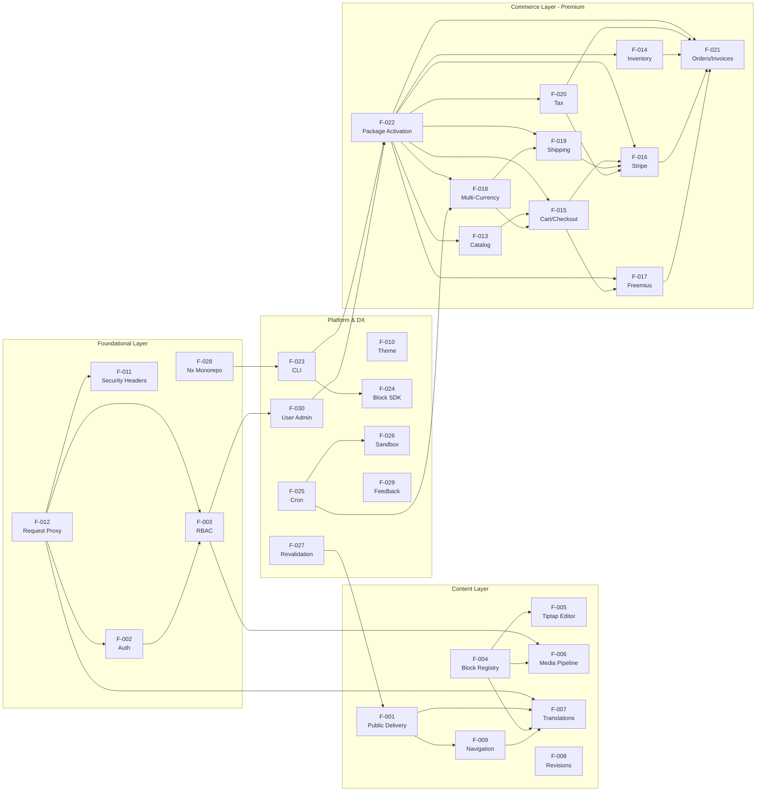
```mermaid
graph LR
    subgraph Foundation["Foundational Layer"]
        F028[F-028<br/>Nx Monorepo]
        F012[F-012<br/>Request Proxy]
        F011[F-011<br/>Security Headers]
        F002[F-002<br/>Auth]
        F003[F-003<br/>RBAC]
    end

    subgraph Content["Content Layer"]
        F001[F-001<br/>Public Delivery]
        F004[F-004<br/>Block Registry]
        F005[F-005<br/>Tiptap Editor]
        F006[F-006<br/>Media Pipeline]
        F007[F-007<br/>Translations]
        F008[F-008<br/>Revisions]
        F009[F-009<br/>Navigation]
    end

    subgraph Commerce["Commerce Layer - Premium"]
        F022[F-022<br/>Package Activation]
        F013[F-013<br/>Catalog]
        F014[F-014<br/>Inventory]
        F015[F-015<br/>Cart/Checkout]
        F016[F-016<br/>Stripe]
        F017[F-017<br/>Freemius]
        F018[F-018<br/>Multi-Currency]
        F019[F-019<br/>Shipping]
        F020[F-020<br/>Tax]
        F021[F-021<br/>Orders/Invoices]
    end

    subgraph Platform["Platform & DX"]
        F010[F-010<br/>Theme]
        F023[F-023<br/>CLI]
        F024[F-024<br/>Block SDK]
        F025[F-025<br/>Cron]
        F026[F-026<br/>Sandbox]
        F027[F-027<br/>Revalidation]
        F029[F-029<br/>Feedback]
        F030[F-030<br/>User Admin]
    end

    F012 --> F002
    F012 --> F003
    F012 --> F007
    F012 --> F011
    F002 --> F003
    F003 --> F006
    F003 --> F030

    F001 --> F007
    F001 --> F009
    F004 --> F005
    F004 --> F006
    F004 --> F007
    F009 --> F007

    F022 --> F013
    F022 --> F014
    F022 --> F015
    F022 --> F016
    F022 --> F017
    F022 --> F018
    F022 --> F019
    F022 --> F020
    F022 --> F021
    F013 --> F015
    F015 --> F016
    F015 --> F017
    F018 --> F015
    F018 --> F019
    F019 --> F016
    F020 --> F016
    F020 --> F021
    F014 --> F021
    F016 --> F021
    F017 --> F021

    F023 --> F022
    F023 --> F024
    F025 --> F018
    F025 --> F026
    F027 --> F001
    F030 --> F022
    F028 --> F023
```

### 2.3.2 Integration Points

| Integration Point | Participating Features | Evidence |
|:--|:--|:--|
| Supabase Auth callback | F-002, F-003, F-012 | `app/auth/callback/route.ts`, `proxy.ts` |
| R2 presigned upload | F-006, F-004 (image block) | `app/api/upload/`, `app/api/process-image/` |
| Checkout API gate | F-015, F-016, F-017, F-018, F-019, F-020, F-022 | `app/api/checkout/route.ts` line 36 |
| Stripe webhook | F-016, F-014, F-021 | `app/api/webhooks/stripe/route.ts` |
| Freemius webhook | F-017, F-022 (gated) | `app/api/webhooks/freemius/route.ts` |
| Currency sync cron | F-018, F-025 | `app/api/cron/sync-currencies/route.ts` |
| Sandbox reset cron | F-025, F-026, all seeded tables | `app/api/cron/reset-sandbox/route.ts` |
| On-demand revalidation | F-027, F-001 | `app/api/revalidate/` |
| CLI project scaffold | F-023, all published libraries | `apps/create-nextblock/bin/create-nextblock.js` |

### 2.3.3 Shared Components and Common Services

| Shared Component | Consumers | Location |
|:--|:--|:--|
| Supabase clients | All server features | `libs/db/src/lib/supabase/*` |
| `verifyPackageOnline()` | F-015, F-022, CLI-injected route wrappers | `libs/db/src/lib/package-validation.ts` |
| `recordMediaUpload` | F-006 | `libs/db/src/lib/media-actions.ts` |
| `normalizeCustomerAddress` | F-015 (checkout), F-030 (users admin) | `@nextblock-cms/ecommerce` export |
| `@nextblock-cms/ui` design system | All UI surfaces | `libs/ui` |
| `@nextblock-cms/utils` | Email, translations, R2 utilities | `libs/utils` |
| Client provider chain | All client routes | `apps/nextblock/app/providers.tsx` |
| Cached layout data (languages, currencies, navigation) | F-001 | `apps/nextblock/app/layout.tsx` |

### 2.3.4 Traceability Matrix

The following matrix links features to the sections of the technical specification where they are discussed and to the primary evidence artifacts. Features are cross-referenced to sections `1.2 SYSTEM OVERVIEW`, `1.3 SCOPE`, and `1.4 REFERENCES`.

| Feature ID | Primary Evidence | Spec Cross-Reference | Downstream Impact |
|:--|:--|:--|:--|
| F-001 | `app/layout.tsx`, `app/[slug]`, `next.config.js` | §1.2.2.1(1), §1.2.3.1 | 100/100 Lighthouse target |
| F-002 | `app/actions.ts`, `app/auth/callback/route.ts` | §1.1.3, §1.2.2.1(2) | First-user ADMIN invariant |
| F-003 | Migration `...000000`, `proxy.ts` lines 12–17 | §1.1.3, §1.3.2.2 | CMS access control |
| F-004 | `lib/blocks/blockRegistry.ts` | §1.3.1.1 (15-block enum) | Authoring surface |
| F-005 | `libs/editor/*` | §1.3.1.1 (editor capabilities) | Published library |
| F-006 | `app/api/upload/`, `libs/db/src/lib/media-actions.ts` | §1.2.1.3 | Media ingestion pipeline |
| F-007 | Migration `...000001`, `proxy.ts` | §1.3.1.1, §1.3.3.4 | Localization baseline |
| F-008 | Migration `...000002`, `revision_type` enum | §1.3.1.1 | Audit/rollback |
| F-009 | Migration `...000002`, `menu_location` enum | §1.3.1.1 | Navigation rendering |
| F-010 | `providers.tsx` line 61, `theme-switcher.tsx` | §1.2.2.3 | UI personalization |
| F-011 | `proxy.ts` lines 200–248 | §1.2.2.3(4)(5), §1.2.3.2(3) | Security posture |
| F-012 | `proxy.ts` | §1.2.2.3, §1.3.3.1 (no middleware) | Foundational routing |
| F-013 | Migration `...000003` | §1.3.1.2 | Catalog surface |
| F-014 | `libs/ecommerce/src/lib/shared-inventory.ts` | §1.3.1.2 | Stock tracking |
| F-015 | `app/api/checkout/route.ts`, `cart-store.ts` | §1.3.1.2 (provider routing) | Checkout orchestration |
| F-016 | `libs/ecommerce/src/lib/stripe/`, Stripe webhook | §1.3.1.2 | Physical-product checkout |
| F-017 | Freemius webhook, `libs/ecommerce/src/lib/providers/` | §1.3.3.1 (reconciliation pending) | Digital-product checkout |
| F-018 | Migration `...000004`, `currency-sync.ts` | §1.3.1.2 (rounding modes), §1.2.1.3 | FX normalization |
| F-019 | Migration `...000004`, shipping actions | §1.3.2.3, §1.3.3.1 (postal_code OOS) | Shipping cost |
| F-020 | Migration `...000004`, `tax-calculation.ts` | §1.3.1.2 (manual/automatic) | Tax computation |
| F-021 | Migration `...000004`, `invoice.ts` | §1.3.1.2 (status lifecycle) | Order finalization |
| F-022 | `libs/db/src/lib/package-validation.ts`, migration `...000003` | §1.2.3.2(4), §1.3.2.1 | License gate |
| F-023 | `apps/create-nextblock/bin/create-nextblock.js` | §1.2.1.1(3), §1.2.3.1 | Scaffolding |
| F-024 | `libs/sdk/src/lib/sdk.ts` | §1.2.2.2 | Extensibility contract |
| F-025 | `vercel.json`, cron route handlers | §1.2.3.3 (job health), §1.2.1.3 | Scheduled operations |
| F-026 | `.env.exemple`, `SandboxBanner` | §1.1.1 (demo credentials) | Evaluator experience |
| F-027 | `app/api/revalidate/` | §1.2.3.3 (caching) | Cache invalidation |
| F-028 | `nx.json`, `.agent/skills/project-architecture/SKILL.md` | §1.2.2.2, §1.2.3.2(1)(2) | Architectural discipline |
| F-029 | `app/actions/feedback.ts`, `FeedbackModal.tsx` | (N/A) | Adopter signal |
| F-030 | `app/cms/users/actions.ts` | §1.3.2.2 | Administrator management |

## 2.4 IMPLEMENTATION CONSIDERATIONS

### 2.4.1 Technical Constraints

| Concern | Constraint | Affected Features |
|:--|:--|:--|
| Backend | Supabase-only; no pluggable DB abstraction (per §1.3.3.3) | All server-side features |
| Frontend | Next.js 16 App Router; no alternative framework targets | F-001, F-012, F-023 |
| Middleware | `middleware.ts` NOT used; replaced by `proxy.ts` (per §1.3.3.1) | F-002, F-003, F-011, F-012 |
| Storage | S3-compatible endpoint required (Cloudflare R2 in reference deployment) | F-006 |
| FX Source | Default Frankfurter; alternative providers require custom implementation despite `FX_API_BASE_URL` override | F-018 |
| Payment Providers | Exactly two: Stripe (physical) and Freemius (digital); mixed-provider carts rejected at checkout | F-015, F-016, F-017 |
| Package Alignment | `libs/ecommerce/package.json` is `@nextblock-cms/ecom`; import alias is `@nextblock-cms/ecommerce` (per §1.3.3.1) | F-013–F-022, F-023 |
| Build Status | `ecommerce:build` Nx standalone target currently not green (per §1.3.3.1) | F-013–F-022 |
| Freemius Reconciliation | Webhook events acknowledged only; DB reconciliation pending (per §1.3.3.1) | F-017, F-021 |
| Postal Code Shipping | Schema present; runtime resolver does not consume (per §1.3.3.1) | F-019 |
| Locale Count | Only `en` and `fr` in current release (per §1.3.3.4) | F-007, F-009, F-013 |
| Module Boundaries | `libs/ui` MUST NOT depend on `apps/nextblock` | F-028 |

### 2.4.2 Performance Requirements

| Feature | Requirement | Evidence |
|:--|:--|:--|
| F-001 | 100/100 default Lighthouse Performance | `README.md` product claim |
| F-001 | Layout revalidation window = 60 s | `PUBLIC_LAYOUT_REVALIDATE_SECONDS` in `app/layout.tsx` |
| F-001 | Image cache TTL = 31,536,000 s (1 year) | `next.config.js` |
| F-006 | Modern format adoption (AVIF + WebP) | `next.config.js` image config |
| F-022 | Activation check cached 60 s via `unstable_cache` | `libs/db/src/lib/package-validation.ts` |
| F-023 | Time-to-first-project ≤ 30 seconds | `README.md` product claim |
| F-012 | `X-Prefetch-Priority` signaling by page type | `proxy.ts` lines 170–198 |
| F-011 | bfcache-compatible `Cache-Control: public, max-age=0, must-revalidate` | `proxy.ts` |
| F-025 | Cron jobs MUST complete within Vercel execution limits | `vercel.json` |

### 2.4.3 Scalability Considerations

| Dimension | Consideration | Affected Features |
|:--|:--|:--|
| Horizontal scale | Stateless Next.js servers; session state held in Supabase | F-001, F-002, F-012 |
| Edge caching | ISR + on-demand revalidation decouple request load from DB | F-001, F-027 |
| Media delivery | R2 CDN-backed; image optimization at build/request time | F-006 |
| Checkout concurrency | Inventory deduction uses RPC with SQL fallback for resilience | F-014, F-015, F-016 |
| Currency sync | Daily cron amortizes FX API calls across the deployment | F-018, F-025 |
| Revision storage | JSON Patch diffs minimize storage growth for frequently-edited content | F-008 |
| License gate | 60-second `unstable_cache` avoids DB hit on hot path | F-022 |
| Provider routing | Mixed-provider cart rejection bounds the orchestration state space | F-015 |

### 2.4.4 Security Implications

| Concern | Mitigation | Affected Features |
|:--|:--|:--|
| Session hijacking | Supabase-managed cookies with proxy-level synchronization | F-002, F-012 |
| Privilege escalation | Three-valued `user_role` enum with RLS helpers `get_current_user_role()` and `is_admin()` (SECURITY DEFINER) | F-003 |
| First-admin bootstrap | DB trigger `on_auth_user_created` guarantees first user becomes ADMIN; `is_admin_created` setting prevents escalation | F-003 |
| Last-admin protection | Self-deletion and last-admin deletion both rejected | F-030 |
| Transport | HSTS `max-age=63072000` (two years) with `includeSubDomains; preload` | F-011 |
| XSS | Nonce-based CSP in production; typed block schemas | F-004, F-011 |
| Clickjacking | `X-Frame-Options: SAMEORIGIN`, `COOP: same-origin` | F-011 |
| Webhook integrity | Stripe signature verification; Freemius HMAC SHA-256 | F-016, F-017 |
| Cron endpoint abuse | `Authorization: Bearer CRON_SECRET` required | F-025 |
| Revalidation abuse | `REVALIDATE_SECRET_TOKEN` shared secret validation | F-027 |
| Media upload abuse | Role gate (`ADMIN` or `WRITER`) on `recordMediaUpload` | F-006 |
| Public data exposure | RLS policies restrict writes to authenticated roles; public read only for intended surfaces | All DB-backed features |
| License fraud | `verifyPackageOnline()` consulted at CMS navigation, checkout API, CLI injection, and premium route wrappers | F-022 |

### 2.4.5 Maintenance Requirements

| Activity | Description | Affected Features |
|:--|:--|:--|
| Migration versioning | Eleven numbered migration files in `libs/db/src/supabase/migrations/` must remain applied in order | All DB-backed features |
| Library releases | Each of the six libraries is independently versioned and published | F-004, F-005, F-024, F-028 |
| CLI release cadence | `apps/create-nextblock` version must track the template's consumed library versions | F-023 |
| Email templates | Six templates in `libs/db/src/supabase/templates/` must be kept in sync with Supabase Auth flow changes | F-002 |
| Environment variable drift | Changes must be reflected in `.env.exemple` and `libs/environment.d.ts` `NodeJS.ProcessEnv` augmentation | All env-dependent features |
| CSP allowlist | Must be updated whenever new third-party origins are introduced | F-011 |
| Cron secrets | `CRON_SECRET` rotation requires coordinated env var update | F-025 |
| FX override | `FX_API_BASE_URL` toggle allows switching provider without code change | F-018 |
| Sandbox dataset | `SANDBOX_RESET_SQL` in `/api/cron/reset-sandbox/route.ts` must be regenerated as schema evolves | F-025, F-026 |
| Package alignment | `@nextblock-cms/ecom` package name vs. `@nextblock-cms/ecommerce` alias (per §1.3.3.1) requires coordination when republished | F-013–F-022 |
| Locale expansion | Adding locales beyond `en`/`fr` requires updates to `SUPPORTED_LOCALES` and seed data | F-007 |
| Block registry updates | New block types must satisfy F-024 contract and register in `blockRegistry.ts` | F-004, F-024 |
| RLS policy review | Migration `00000000000006_setup_rls_and_grants.sql` should be audited on new table introduction | All DB-backed features |

### 2.4.6 Assumptions and Constraints Summary

| Category | Assumption or Constraint |
|:--|:--|
| Deployment Target | Vercel (cron schedules declared in `vercel.json`; `@vercel/speed-insights` 1.3.1 integrated) |
| Infrastructure | Supabase + Cloudflare R2 + SMTP required for any deployment; Stripe + Freemius + Frankfurter required for premium commerce |
| First-User Rule | Exactly one `ADMIN` guaranteed at bootstrap; subsequent users default to `USER` (per §1.1.3) |
| License Model | Open core under AGPLv3; premium modules source-available and license-gated (per §1.1.1) |
| Version Alignment | Library versions are independent; CLI's generated template is pinned to specific published versions at scaffold time |
| Testability | All requirements in §2.2 are stated as MUST/SHOULD/COULD statements with observable acceptance criteria |
| Requirement Versioning | Requirements herein correspond to the workspace state at `@nextblock/source` version `0.2.77` (per §1.1.1) |

## 2.5 REFERENCES

### 2.5.1 Files Examined

- `README.md` — Product value proposition, competitive positioning, Lighthouse and CLI claims
- `package.json` — Workspace dependency versions (Next.js 16.1.7, React 19.2.4, TypeScript 5.9.3, Nx 22.6.0, Tailwind 4.1.16, Tiptap 3.22.4)
- `nx.json` — Nx 22.6.0 plugin and release configuration
- `vercel.json` — Cron schedule definitions (reset-sandbox 03:00 UTC; sync-currencies 18:00 UTC)
- `.env.exemple` — Environment variable reference template
- `eslint.config.mjs` — `@nx/enforce-module-boundaries` scope-tag rules (F-028)
- `apps/nextblock/next.config.js` — Image format/device-size config; CSP; `transpilePackages`
- `apps/nextblock/proxy.ts` — Auth proxy, RBAC gating, locale propagation, security headers, page-type signaling (F-002, F-003, F-007, F-011, F-012)
- `apps/nextblock/app/layout.tsx` — 60-second public revalidation (F-001)
- `apps/nextblock/app/providers.tsx` — Client provider composition (F-007, F-010)
- `apps/nextblock/app/actions.ts` — Sign-in/sign-up/forgot-password server actions (F-002)
- `apps/nextblock/app/auth/callback/route.ts` — Session exchange (F-002)
- `apps/nextblock/app/api/checkout/route.ts` — Provider routing, mixed-cart rejection, package gate (F-015, F-022)
- `apps/nextblock/app/api/webhooks/stripe/route.ts` — Stripe webhook handler (F-016)
- `apps/nextblock/app/api/webhooks/freemius/route.ts` — Freemius HMAC verification (F-017)
- `apps/nextblock/app/api/cron/sync-currencies/route.ts` — Currency sync cron (F-018, F-025)
- `apps/nextblock/app/api/cron/reset-sandbox/route.ts` — Sandbox reset orchestration (F-025, F-026)
- `apps/nextblock/app/api/upload/` — R2 upload endpoints (F-006)
- `apps/nextblock/app/api/process-image/` — Image processing endpoint (F-006)
- `apps/nextblock/app/api/revalidate/` — On-demand revalidation (F-027)
- `apps/nextblock/app/api/revalidate-log/` — Revalidation logging (F-027)
- `apps/nextblock/app/cms/users/actions.ts` — User admin operations (F-030)
- `apps/nextblock/app/actions/feedback.ts` — Feedback submission (F-029)
- `apps/nextblock/lib/blocks/blockRegistry.ts` — 15-block registry (F-004)
- `apps/nextblock/components/theme-switcher.tsx` — Theme toggle (F-010)
- `apps/nextblock/components/SandboxBanner.tsx`, `SandboxCredentialsAlert.tsx` — Sandbox UI (F-026)
- `apps/create-nextblock/bin/create-nextblock.js` — CLI `create` and `activate` commands (F-023)
- `libs/db/src/lib/package-validation.ts` — `verifyPackageOnline()` with 60 s cache (F-022)
- `libs/db/src/lib/media-actions.ts` — Role-gated media recording (F-006)
- `libs/db/src/supabase/migrations/00000000000000_setup_foundation_and_enums.sql` — `user_role`, `page_status`, `menu_location`, `revision_type` enums
- `libs/db/src/supabase/migrations/00000000000001_setup_cms_core.sql` — languages, translations, media, profiles (F-002, F-006, F-007)
- `libs/db/src/supabase/migrations/00000000000002_setup_content_tables.sql` — pages, posts, blocks, navigation, revisions (F-004, F-008, F-009)
- `libs/db/src/supabase/migrations/00000000000003_setup_catalog_and_licensing.sql` — products, variants, attributes, inventory, package_activations (F-013, F-014, F-022)
- `libs/db/src/supabase/migrations/00000000000004_setup_fulfillment_shipping_taxes_and_currencies.sql` — orders, shipping zones, tax rates, currencies (F-018–F-021)
- `libs/db/src/supabase/migrations/00000000000005_setup_functions_and_triggers.sql` — `handle_new_user()`, `on_auth_user_created` (F-002, F-003)
- `libs/db/src/supabase/migrations/00000000000006_setup_rls_and_grants.sql` — RLS policies and helper functions
- `libs/db/src/supabase/migrations/00000000000008_seed_platform_defaults.sql` — Default settings, USD currency, `en`/`fr` languages
- `libs/db/src/supabase/templates/` — Six Supabase Auth email templates (F-002)
- `libs/editor/README.md` — Public editor surface exports (F-005)
- `libs/editor/ADVANCED_FEATURES.md` — Enhanced floating menu, placeholder behaviors (F-005)
- `libs/editor/src/lib/kit.ts` — Tiptap extension kit composition (F-005)
- `libs/ecommerce/src/lib/cart-store.ts`, `use-cart.ts` — Zustand cart (F-015)
- `libs/ecommerce/src/lib/stripe/` — Stripe provider (F-016)
- `libs/ecommerce/src/lib/providers/` — Freemius provider (F-017)
- `libs/ecommerce/src/lib/currency.ts`, `currency-sync.ts` — Currency rate operations (F-018)
- `libs/ecommerce/src/lib/shipping/`, `server-actions/shipping-actions.ts` — Shipping resolver (F-019)
- `libs/ecommerce/src/lib/tax-calculation.ts`, `order-tax-details.ts` — Tax computation (F-020)
- `libs/ecommerce/src/lib/invoice.ts`, `invoice-server.ts`, `customer-orders.ts` — Orders/invoicing (F-021)
- `libs/ecommerce/src/lib/shared-inventory.ts`, `order-inventory.ts` — Inventory deduction (F-014)
- `libs/sdk/src/lib/sdk.ts` — Block SDK exports (F-024)
- `libs/environment.d.ts` — `NodeJS.ProcessEnv` augmentation
- `docs/01-PROJECT-OVERVIEW.md` — Monorepo architecture overview
- `docs/02-ECOMMERCE-CAPABILITIES.md` — Commerce feature list, Freemius reconciliation limitation
- `docs/03-CMS-AND-EDITOR.md` — Block registry enumeration, Tiptap capabilities
- `docs/04-DATABASE-AND-AUTH.md` — Supabase clients, absence of live `middleware.ts`
- `docs/05-DEVELOPER-GUIDE.md` — Local setup, known caveats (`ecommerce:build`)
- `docs/06-CLI-AND-SCAFFOLDING.md` — CLI flow and premium activation
- `docs/07-BLOCK-SDK-AND-EXTENSIBILITY.md` — SDK contract shape
- `.agent/skills/project-architecture/SKILL.md` — Three dependency rules, scope tags
- `.agent/skills/agent-guidelines/SKILL.md` — Open-Core constitution

### 2.5.2 Folders Examined

- `apps/` — Application projects
- `apps/nextblock/app/` — Next.js App Router route groups (cms, api, auth-pages, checkout, profile)
- `apps/nextblock/app/cms/` — CMS admin area (blocks, products, orders, settings, users, revisions)
- `apps/nextblock/app/api/` — Backend endpoints (checkout, cron, media, revalidate, upload, webhooks)
- `apps/nextblock/app/api/cron/` — Cron endpoints (reset-sandbox, sync-currencies)
- `apps/nextblock/app/api/webhooks/` — Webhook handlers (stripe, freemius)
- `apps/nextblock/components/` — AppShell, Header, ResponsiveNav, LanguageSwitcher, ThemeSwitcher
- `apps/create-nextblock/` — CLI scaffold application
- `libs/` — Six library packages plus `environment.d.ts`
- `libs/ecommerce/src/lib/` — Commerce implementation (currency, cart, checkout, stripe, providers, shipping, invoice, orders)
- `libs/db/src/supabase/migrations/` — Eleven numbered migration files (00000000000000–00000000000010)
- `libs/db/src/supabase/templates/` — Supabase Auth email templates
- `libs/editor/src/lib/` — Editor kit composition
- `libs/sdk/src/lib/` — SDK contract exports
- `docs/` — Numbered reference documents
- `.agent/skills/` — Agent-authored architectural playbooks

### 2.5.3 Technical Specification Cross-References

- Section `1.1 EXECUTIVE SUMMARY` — Product overview, stakeholders, value proposition
- Section `1.2 SYSTEM OVERVIEW` — System capabilities, components, technical approach, success criteria
- Section `1.3 SCOPE` — In-scope features, implementation boundaries, explicit exclusions
- Section `1.4 REFERENCES` — Canonical list of configuration, documentation, source, and migration artifacts

# 3. Technology Stack

The NextBlock CMS technology stack is a deliberately opinionated, TypeScript-first selection optimized for a Next.js 16 App Router runtime, a Supabase Postgres backend, and a Vercel-native deployment topology. Every technology choice documented below is traceable to a concrete file in the workspace at `@nextblock/source` version `0.2.77` — there is no theoretical dependency in this catalog. The stack departs meaningfully from the default reference stack specified for this project (AWS, Docker, Terraform, GitHub Actions, Python/Flask, MongoDB, Auth0, Langchain, React-Native, Swift, Kotlin, Objective-C, ElectronJS); these deviations are enumerated explicitly in Section 3.7 along with the justifications for each divergence.

The selections align with the critical success factors defined in Section 1.2.3.2 — strict TypeScript compliance, open-core scope-tag discipline via Nx module boundaries, production nonce-based CSP coverage, premium license integrity via the `package_activations` table, the first-user ADMIN trigger guarantee, and role-gated CMS access.

## 3.1 PROGRAMMING LANGUAGES

### 3.1.1 Language Catalog

| Language | Version / Dialect | Primary Usage | Evidence |
|:--|:--|:--|:--|
| TypeScript | `^5.9.3` (strict mode) | Application, library, editor, CLI, tooling source | `package.json`, `tsconfig.base.json` |
| JavaScript | ES2022 / ESM + CommonJS | Configuration files, tooling scripts, CLI entry | `next.config.js`, `tools/scripts/*` |
| SQL (PostgreSQL) | PostgreSQL dialect | Schema migrations, RLS policies, triggers, RPCs | `libs/db/src/supabase/migrations/` |

### 3.1.2 TypeScript — Primary Language

TypeScript is the workspace's mandatory implementation language for production source. All six libraries (`libs/db`, `libs/ecommerce`, `libs/editor`, `libs/sdk`, `libs/ui`, `libs/utils`) and both applications (`apps/nextblock`, `apps/create-nextblock` — excluding its JavaScript bin entry) are authored in TypeScript and compiled with strict type checking.

#### 3.1.2.1 Compiler Configuration

The shared `tsconfig.base.json` file pins the workspace compiler profile to the following settings:

| Setting | Value | Rationale |
|:--|:--|:--|
| `target` | `es2022` | Aligns with modern Node LTS runtime semantics |
| `module` | `esnext` | Preserves ESM semantics through the bundler |
| `moduleResolution` | `bundler` | Enables exports-map aware resolution used by published packages |
| `jsx` | `react-jsx` | New automatic JSX runtime (no `React` import required) |
| `lib` | `["esnext", "dom"]` | Unified library surface across server and client code |
| `strict` | `true` | Non-negotiable per §1.2.3.2 Critical Success Factors |
| `composite` | `true` | Enables project references and incremental builds |
| `emitDecoratorMetadata` | `true` | Required for future reflection-based extension points |
| `experimentalDecorators` | `true` | Paired with `emitDecoratorMetadata` above |

The application-level `apps/nextblock/tsconfig.json` registers the Next.js TypeScript plugin, narrows `target` to `ES2017` for broader browser compatibility in the rendered payload, and preserves the `bundler` module resolution strategy.

#### 3.1.2.2 Selection Justification

TypeScript's strict mode is enumerated as a **Critical Success Factor** in Section 1.2.3.2 and enforces type safety across monorepo library boundaries. The strict posture specifically enables three architectural guarantees: compile-time verification of the block schema contract (F-024) exported from `@nextblock-cms/sdk`, sound typing of the augmented `NodeJS.ProcessEnv` declared in `libs/environment.d.ts`, and contract-consistency between `libs/db` and its Supabase-generated types produced via `supabase gen types typescript --schema public`. No dynamic-language equivalent (Python, Ruby, JavaScript) would satisfy the simultaneous requirements of React Server Component boundary enforcement, Zod-derived static inference, and multi-package versioned API surfaces.

### 3.1.3 JavaScript — Tooling and Configuration

JavaScript serves a narrow, well-defined role: configuration files consumed by the Node runtime (e.g., `next.config.js`, `postcss.config.js`, `tailwind.config.js`, `eslint.config.mjs`), the CLI entry point at `apps/create-nextblock/bin/create-nextblock.js` (which uses an ES module shebang to remain Node-native), and release automation scripts under `tools/scripts/` (a mix of `.js`, `.cjs`, `.mjs`, and `.ts` per the consuming execution context). The package manager is pinned via the `packageManager` field in the root `package.json` to `npm@10.9.4`.

### 3.1.4 SQL — PostgreSQL Dialect

Eleven numbered migration files located in `libs/db/src/supabase/migrations/` (named `00000000000000` through `00000000000010`) define the complete database schema, including enums, tables, Row-Level Security (RLS) policies, the `on_auth_user_created` trigger that guarantees first-user ADMIN provisioning, and the `handle_new_user()` trigger function. RLS helpers `get_current_user_role()` and `is_admin()` are declared with `SECURITY DEFINER` per the requirements established in Section 2.4.4. The migrations represent the canonical source of truth for the data model; their ordering must be preserved per the maintenance requirements in Section 2.4.5.

## 3.2 FRAMEWORKS AND LIBRARIES

### 3.2.1 Core Application Framework Stack

| Technology | Version | Purpose | Evidence |
|:--|:--|:--|:--|
| Next.js (App Router) | `16.1.7` | Full-stack React framework with RSC | `package.json` line 138 |
| React / react-dom | `^19.2.4` | UI runtime with Server Components | `package.json` lines 146, 149 |
| TypeScript | `^5.9.3` | Strict-mode language runtime | `package.json` line 157 |
| Nx | `22.6.0` | Monorepo orchestration, task graph, caching | `package.json`, `nx.json` |

#### 3.2.1.1 Next.js 16 — Justification

Next.js 16 was selected as the sole application framework per the scope constraint in Section 1.3.3.3 ("Next.js-only frontend — no alternative framework targets"). The App Router architecture directly enables three capabilities recorded as measurable objectives in Section 1.2.3.1:

1. **React Server Components-first rendering** for the public surface (F-001) delivering the 100/100 Lighthouse Performance default score.
2. **Incremental Static Regeneration** with the 60-second `PUBLIC_LAYOUT_REVALIDATE_SECONDS` window configured in `apps/nextblock/app/layout.tsx`.
3. **Route handlers** for machine-to-machine surfaces (webhooks at `/api/webhooks/*`, crons at `/api/cron/*`, and the revalidation endpoint at `/api/revalidate`).

The `transpilePackages` array in `apps/nextblock/next.config.js` lists `@nextblock-cms/utils`, `@nextblock-cms/ui`, and `@nextblock-cms/editor`, ensuring the shared libraries are transformed by Next.js's bundler to support the strict React Server Components boundary semantics.

#### 3.2.1.2 React 19 — Justification

React 19.2.4 is required by Next.js 16's App Router and provides Server Components, Server Actions, and the new `use()` hook semantics used by the provider chain composed in `apps/nextblock/app/providers.tsx` (`AuthProvider → LanguageProvider → CurrencyProvider → CurrentContentProvider → CartTranslator → TranslationBridge → TranslationsProvider → ThemeProvider`).

#### 3.2.1.3 Nx 22.6.0 — Justification

Nx 22.6.0 is selected per the scope constraint in Section 1.3.3.5 ("no alternative monorepo orchestrators beyond Nx"). Its value proposition rests on three invariants enforced at the workspace level:

1. **Module boundary enforcement** via `@nx/enforce-module-boundaries` in `eslint.config.mjs`, which encodes the architectural rule that `libs/ui` MUST NOT depend on `apps/nextblock`.
2. **Scope-tag discipline** partitioning the workspace into `scope:public` libraries (AGPLv3) and `scope:premium` libraries (source-available, license-gated).
3. **Task graph caching** enabling the `nx run-many -t build -p ui -p utils -p db -p editor -p sdk` pattern used in `npm run lib-builds`.

#### 3.2.1.4 Registered Nx Plugins

The following Nx plugins are registered in `nx.json` and installed as devDependencies in the root `package.json`:

| Plugin | Version | Role |
|:--|:--|:--|
| `@nx/esbuild` | `22.6.0` | esbuild-based compilation |
| `@nx/eslint` + `@nx/eslint-plugin` | `22.6.0` | Linting integration |
| `@nx/js` | `22.6.0` | TypeScript library builder |
| `@nx/key` | `^5.0.0` | Nx Powerpack license key |
| `@nx/next` | `22.6.0` | Next.js app executor |
| `@nx/node` | `22.6.0` | Node application support |
| `@nx/powerpack-license` | `^5.0.0` | Powerpack license enforcement |
| `@nx/react` | `22.6.0` | React support |
| `@nx/vite` | `22.6.0` | Vite executor for libraries |
| `@nx/vitest` | `22.6.0` | Vitest test runner integration |
| `@nx/web` | `22.6.0` | Web target support |
| `@nx/workspace` | `22.6.0` | Workspace primitives |

### 3.2.2 Styling and Design System Libraries

Tailwind CSS 4 is the workspace's sole styling system, layered with Radix UI primitives and shadcn/ui-generated components to produce a cohesive design system.

#### 3.2.2.1 Utility CSS and Post-Processing

| Library | Version | Purpose |
|:--|:--|:--|
| `tailwindcss` | `^4.1.16` | Utility-first CSS framework |
| `@tailwindcss/postcss` | `^4.1.16` | Tailwind 4 PostCSS integration |
| `postcss` | `^8.5.6` | CSS transformation pipeline |
| `autoprefixer` | `^10.4.21` | Vendor prefix generation |
| `tailwindcss-animate` | `^1.0.7` | Pre-built animation utilities |
| `tailwind-merge` | `^3.3.1` | Class-name conflict resolution |
| `clsx` | `^2.1.1` | Conditional class composition |
| `class-variance-authority` | `^0.7.1` | Variant-based styling primitives |

The root `tailwind.config.js` declares `darkMode: ['class']` for next-themes compatibility, content globs spanning `apps/**` and `libs/**`, HSL variable-based theme tokens (`primary`, `secondary`, `accent`, `muted`, `destructive`, `warning`, `popover`, `card`), and keyframe animations for accordion interactions.

#### 3.2.2.2 Component Library — shadcn/ui + Radix Primitives

The `components.json` file at the workspace root registers shadcn/ui with the `slate` base color palette, CSS variables-based theming, React Server Components support, and TSX component format. Twelve `@radix-ui/*` headless primitives supply the underlying accessibility-compliant behavior:

| Primitive | Version | Primitive | Version |
|:--|:--|:--|:--|
| `@radix-ui/react-avatar` | `^1.1.10` | `@radix-ui/react-progress` | `^1.1.7` |
| `@radix-ui/react-checkbox` | `^1.3.3` | `@radix-ui/react-radio-group` | `^1.3.8` |
| `@radix-ui/react-dialog` | `^1.1.15` | `@radix-ui/react-select` | `^2.2.6` |
| `@radix-ui/react-dropdown-menu` | `^2.1.16` | `@radix-ui/react-separator` | `^1.1.7` |
| `@radix-ui/react-label` | `^2.1.7` | `@radix-ui/react-slot` | `^1.2.3` |
| `@radix-ui/react-popover` | `^1.1.15` | `@radix-ui/react-tooltip` | `^1.2.8` |

#### 3.2.2.3 Iconography and Theming

- **lucide-react** — `^0.548.0` at workspace level; `^0.534.0` in the published template package. Provides the typed icon set consumed by `@nextblock-cms/sdk` block configurations (F-024).
- **next-themes** — `^0.4.6` enabling light/dark/vibrant/system theme switching (F-010) via class-based strategy, composed as the outermost provider in `apps/nextblock/app/providers.tsx`.

### 3.2.3 Rich-Text Editor Stack — `libs/editor`

The `@nextblock-cms/editor` library (version `0.2.24`) bundles Tiptap 3.22.4 with more than 40 extensions and the Yjs collaboration stack. This is the substrate that powers the F-005 editor feature documented in Section 2.1.2.3.

#### 3.2.3.1 Tiptap Core and Extensions

| Extension Family | Extensions |
|:--|:--|
| Core | `@tiptap/core`, `@tiptap/react`, `@tiptap/starter-kit`, `@tiptap/pm`, `@tiptap/suggestion` |
| Inline Marks | bold, italic, underline, strike, code, subscript, superscript, highlight, link, color, font-family, text-align, text-style, blockquote |
| Block Nodes | bullet-list, ordered-list, list-item, task-item, task-list, heading, code-block-lowlight, details, horizontal-rule, hard-break, table/-cell/-header/-row, image |
| Interactions | bubble-menu, floating-menu, drag-handle, drag-handle-react, focus, placeholder, character-count, dropcursor, gapcursor, emoji, mention, node-range, typography, history, mathematics, youtube |

All extensions are pinned at version `^3.22.4` (matching the Tiptap core release).

#### 3.2.3.2 Collaboration Layer

| Library | Version | Role |
|:--|:--|:--|
| `@tiptap/extension-collaboration` | `^3.22.4` | Tiptap collaboration plugin |
| `@tiptap/y-tiptap` | `^3.0.3` | Tiptap ↔ Yjs bridge |
| `yjs` | `^13.6.30` | CRDT backbone |
| `y-protocols` | `^1.0.7` | Awareness and sync protocols |

#### 3.2.3.3 Auxiliary Editor Dependencies

- **lowlight** `^3.3.0` — Syntax highlighting engine used by `CodeBlockLowlight`.
- **katex** `^0.16.25` — Mathematical notation rendering for the `@tiptap/extension-mathematics` extension.

### 3.2.4 Forms, Validation, and State Management

| Library | Version | Role | Evidence |
|:--|:--|:--|:--|
| `zod` | `^4.3.6` | Schema validation (block schemas, API validation, form resolvers) | F-004, F-024 |
| `react-hook-form` | `^7.71.1` | Form state management | Admin CMS forms |
| `@hookform/resolvers` | `^5.2.2` | Zod ↔ react-hook-form adapter | Admin CMS forms |
| `zustand` | `^5.0.10` | Client-side cart store (F-015) | `libs/ecommerce/src/lib/cart-store.ts` |

Zod is selected as the universal validation layer because it simultaneously satisfies the typed block-schema contract required by F-024 (`BlockContentSchema`) and provides server-action input validation in line with the "typed block schemas" mitigation for XSS enumerated in Section 2.4.4.

### 3.2.5 Interaction and UI Behavior Libraries

| Library | Version | Purpose |
|:--|:--|:--|
| `@dnd-kit/core` | `^6.3.1` | Drag-and-drop primitives for block reordering |
| `@dnd-kit/sortable` | `^10.0.0` | Sortable list implementation |
| `@dnd-kit/utilities` | `^3.2.2` | DnD helpers |
| `@floating-ui/dom` | `^1.7.4` | Floating element positioning |
| `@floating-ui/react` | `^0.27.16` | React bindings for floating-ui |

### 3.2.6 Media and Performance Libraries

| Library | Version | Purpose |
|:--|:--|:--|
| `sharp` | `^0.34.2` | AVIF/WebP derivative generation |
| `plaiceholder` | `^3.0.0` | Blur placeholder generation |
| `beasties` | `^0.4.1` | Critical CSS extraction |
| `@next/bundle-analyzer` | `^16.0.1` | Bundle size analysis |
| `@next/third-parties` | `^16.1.1` | Optimized third-party script loading (GTM) |

The `sharp` + `plaiceholder` combination underpins F-006 (Media Management) as documented in Section 2.1.2.4.

### 3.2.7 Supporting Libraries

| Library | Version | Purpose |
|:--|:--|:--|
| `date-fns` | `^4.1.0` | Date formatting |
| `html-react-parser` | `^5.2.7` | HTML-to-React parsing |
| `react-hot-toast` | `^2.6.0` | Toast notifications |
| `sonner` | `^2.0.7` | Alternative toast notifications |
| `react-transition-group` | `^4.4.5` | Transition animations |
| `react-color` | `^2.19.3` | Color-picker primitive |
| `react-colorful` | `^5.6.1` | Minimal color picker |
| `react-day-picker` | `^9.13.0` | Date-picker component |
| `fast-json-patch` | `^3.1.1` | JSON Patch generation for F-008 content revisions |
| `js-cookie` | `^3.0.5` | Cookie manipulation helper |
| `lodash.debounce` | `^4.0.8` | Debounced event handlers |
| `uuid` | `^11.0.4` | UUID generation (published template) |
| `server-only` | `^0.0.1` | Next.js server-only import guard |

## 3.3 OPEN SOURCE DEPENDENCIES

### 3.3.1 Package Registries

#### 3.3.1.1 Public npm Registry

All third-party dependencies are resolved from the public npm registry (`registry.npmjs.org`). Generated projects produced by the `create-nextblock` CLI receive an `.npmrc` file that pins the `@nextblock-cms` scope to this public registry, ensuring downstream adopters install the same versions available to the core workspace.

#### 3.3.1.2 Verdaccio — Local Development Registry

The workspace includes a Verdaccio 6.0.5 configuration at `.verdaccio/config.yml` providing a local npm registry for release testing without publishing to the public registry. Key parameters:

| Parameter | Value |
|:--|:--|
| Port | `4873` |
| Storage | `tmp/local-registry/storage` |
| Uplink | `npmjs` with `maxage: 60m` |
| Nx target | `local-registry` defined on the root `project.json` via `@nx/js:verdaccio` |

### 3.3.2 Published Workspace Libraries

Each library publishes an independent version to the public npm registry. The table below summarizes workspace-source state at `@nextblock/source` version `0.2.77`:

| Package | Workspace Path | Version | Publish Access | Scope Tag |
|:--|:--|:--|:--|:--|
| `@nextblock-cms/ui` | `libs/ui` | `0.2.19` | `public` | `scope:public` |
| `@nextblock-cms/utils` | `libs/utils` | `0.2.13` | `public` | `scope:public` |
| `@nextblock-cms/db` | `libs/db` | `0.2.32` | `public` | `scope:public` |
| `@nextblock-cms/editor` | `libs/editor` | `0.2.24` | `public` | `scope:public` |
| `@nextblock-cms/sdk` | `libs/sdk` | `0.2.9` | `public` | `scope:public` |
| `@nextblock-cms/ecom` | `libs/ecommerce` | `0.0.10` | `public` | `scope:premium` |
| `create-nextblock` | `apps/create-nextblock` | `0.2.78` | `public` | — |
| `@nextblock-cms/template` | `apps/nextblock` | `0.2.55` | `private: true` | — |
| `@nextblock/source` | (root) | `0.2.77` | `private: true` | — |

#### 3.3.2.1 Package Alias Convention for Premium Modules

Per the known-issue enumeration in Section 1.3.3.1, `libs/ecommerce/package.json` declares the name `@nextblock-cms/ecom` while the TypeScript path alias in `tsconfig.base.json` is `@nextblock-cms/ecommerce`. This bifurcation is resolved at install time by the npm alias directive `@nextblock-cms/ecommerce@npm:@nextblock-cms/ecom@latest`, which is injected by the `create-nextblock activate ecommerce` command (F-023). This alias convention is intentional: it preserves a clean `@nextblock-cms/ecommerce` import surface in application code while keeping the published package short and branded.

### 3.3.3 npm Overrides

The root `package.json` declares four npm overrides to resolve transitive dependency conflicts and security advisories:

| Override | Target |
|:--|:--|
| `glob` | `^10.4.5` |
| `whatwg-encoding` | `npm:@exodus/bytes@latest` |
| `node-domexception` | `npm:domexception@latest` |
| `keygrip` | `npm:keygrip@latest` |

### 3.3.4 CLI Tool Dependencies

The `apps/create-nextblock` scaffolding CLI depends on a focused set of command-line interaction libraries:

| Dependency | Version | Purpose |
|:--|:--|:--|
| `@clack/prompts` | `^0.8.1` | Modern interactive prompts |
| `@nextblock-cms/db` | `latest` | Database schema utilities during scaffold |
| `chalk` | `^5.6.2` | Terminal text styling |
| `commander` | `^14.0.1` | Command-line argument parsing |
| `execa` | `^9.3.0` | Subprocess execution (npm install, git init) |
| `fs-extra` | `^11.3.2` | File-system utilities |
| `inquirer` | `^12.10.0` | Interactive prompts (legacy path) |
| `open` | `^10.1.0` | URL opening in default browser |
| `ora` | `^8.0.1` | Terminal spinners |
| `picocolors` | `^1.1.1` | Minimal color utility |

### 3.3.5 Type Definitions

The following `@types/*` packages are installed as devDependencies to supply ambient types for untyped or partially-typed dependencies:

| Package | Version |
|:--|:--|
| `@types/deno` | `^2.5.0` |
| `@types/fs-extra` | `^11.0.4` |
| `@types/inquirer` | `^9.0.9` |
| `@types/js-cookie` | `^3.0.6` |
| `@types/lodash.debounce` | `^4.0.9` |
| `@types/node` | `^24.9.1` |
| `@types/nodemailer` | `^7.0.3` |
| `@types/react` | `^19.2.2` |
| `@types/react-dom` | `^19.2.2` |
| `@types/react-color` | `^3.0.13` |
| `@types/react-transition-group` | `^4.4.12` |

## 3.4 THIRD-PARTY SERVICES

Every external integration listed below is declared in `libs/environment.d.ts` (augmenting `NodeJS.ProcessEnv`) and documented via the `.env.exemple` template. The integration set corresponds exactly to the eight integration domains enumerated in Section 1.2.1.3.

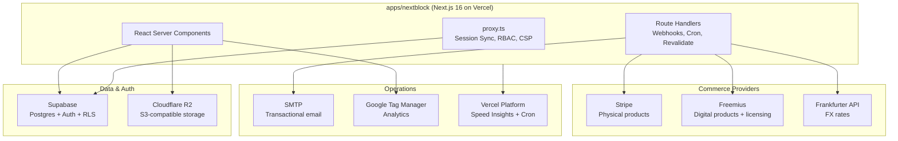
```mermaid
graph TB
    subgraph App["apps/nextblock (Next.js 16 on Vercel)"]
        Proxy[proxy.ts<br/>Session Sync, RBAC, CSP]
        RSC[React Server Components]
        Routes[Route Handlers<br/>Webhooks, Cron, Revalidate]
    end

    subgraph Data["Data & Auth"]
        SB[Supabase<br/>Postgres + Auth + RLS]
        R2[Cloudflare R2<br/>S3-compatible storage]
    end

    subgraph Commerce["Commerce Providers"]
        Stripe[Stripe<br/>Physical products]
        Freemius[Freemius<br/>Digital products + licensing]
        FX[Frankfurter API<br/>FX rates]
    end

    subgraph Ops["Operations"]
        SMTP[SMTP<br/>Transactional email]
        GTM[Google Tag Manager<br/>Analytics]
        Vercel[Vercel Platform<br/>Speed Insights + Cron]
    end

    Proxy --> SB
    RSC --> SB
    RSC --> R2
    Routes --> Stripe
    Routes --> Freemius
    Routes --> FX
    Routes --> SMTP
    RSC --> GTM
    App --> Vercel
```

### 3.4.1 Supabase — Database and Authentication

| Library | Version | Role |
|:--|:--|:--|
| `@supabase/ssr` | `^0.7.0` | SSR-safe cookie-based Supabase client |
| `@supabase/supabase-js` | `^2.77.0` | Core Supabase SDK |
| `supabase` (CLI) | `^2.65.0` | Migration management, type generation (devDependency) |

#### 3.4.1.1 Responsibilities

Supabase provides PostgreSQL data storage, Row-Level Security, authentication (F-002), and session cookie management. GitHub OAuth is layered on top via the `components/GitHubLoginButton.tsx` component. Six email templates for the authentication flow (confirmation, email change, invitation, magic-link, reauthentication, password recovery) reside in `libs/db/src/supabase/templates/` and are synchronized with Supabase through `npm run configure:supabase-auth`.

#### 3.4.1.2 Environment Variables

| Variable | Role |
|:--|:--|
| `NEXT_PUBLIC_SUPABASE_URL` | Public API URL |
| `NEXT_PUBLIC_SUPABASE_ANON_KEY` | Public anonymous key |
| `SUPABASE_SERVICE_ROLE_KEY` | Service-role key (server-only, required by F-030) |
| `SUPABASE_ACCESS_TOKEN` | Management API token for CLI operations |
| `SUPABASE_PROJECT_ID` | Project identifier |
| `POSTGRES_URL` / `DATABASE_URL` | Direct SQL fallback for inventory deduction (F-014) |

### 3.4.2 Cloudflare R2 — Object Storage

| Library | Version | Role |
|:--|:--|:--|
| `@aws-sdk/client-s3` | `^3.920.0` | S3-compatible client |
| `@aws-sdk/s3-request-presigner` | `^3.919.0` (workspace) / `^3.920.0` (published) | Presigned URL generation |

Cloudflare R2 serves as the media object store with an S3-compatible endpoint, per the infrastructure assumption in Section 1.3.3.3. It is accessed via two upload mechanisms: a presigned PUT URL path and a multipart proxy path, both exposed under `apps/nextblock/app/api/upload/`. The required environment variables are `R2_ACCOUNT_ID`, `R2_ACCESS_KEY_ID`, `R2_SECRET_ACCESS_KEY`, `R2_S3_ENDPOINT`, `R2_REGION`, `R2_BUCKET_NAME`, `R2_TOKEN_VALUE`, `NEXT_PUBLIC_R2_PUBLIC_URL`, and `NEXT_PUBLIC_R2_BASE_URL`.

### 3.4.3 Stripe — Physical Products Payment

| Library | Version | Role |
|:--|:--|:--|
| `stripe` | `^20.4.1` | Server-side Stripe SDK |
| `@stripe/stripe-js` | `^8.11.0` | Client-side Stripe.js loader |

Stripe handles all physical-product checkout flows (F-016) including Stripe Tax integration for automatic tax calculation (F-020). Webhook processing at `apps/nextblock/app/api/webhooks/stripe/route.ts` validates signatures using `STRIPE_WEBHOOK_SECRET` per the security mitigation declared in Section 2.4.4. A development helper script (`npm run stripe`) invokes `stripe listen --forward-to localhost:4200/api/webhooks/stripe` to forward webhook events during local development.

### 3.4.4 Freemius — Digital Products and Licensing

| Library | Version | Role |
|:--|:--|:--|
| `@freemius/checkout` | `^1.4.1` | Checkout widget |
| `@freemius/sdk` | `^0.3.0` | Freemius SDK for server operations |

Freemius handles digital-product checkout and licensing (F-017) including the premium license-gating surface that enables F-022. Webhook verification uses HMAC SHA-256 signature validation via `FREEMIUS_SECRET_KEY`. Per the known-issue enumeration in Section 1.3.3.1, webhook events are currently acknowledged but not yet reconciled back to the local database state. The Freemius environment variable surface is comparatively broad — `FREEMIUS_STORE_ID`, `FREEMIUS_PRODUCT_ID`, `FREEMIUS_PUBLIC_KEY`, `FREEMIUS_SECRET_KEY`, `FREEMIUS_API_KEY`, `FREEMIUS_CHECKOUT_PRODUCTS_JSON`, `FREEMIUS_ECOMMERCE_SANDBOX_PUBLIC_KEY`, `FREEMIUS_ECOMMERCE_SANDBOX_SECRET_KEY`, `FREEMIUS_SANDBOX_ENABLED`, `FREEMIUS_DEVELOPER_ID`, `FREEMIUS_ECOMMERCE_SANDBOX_KEY` — reflecting the mixture of store-scoped and product-scoped identifiers plus sandbox-aware duplication.

### 3.4.5 Frankfurter — Foreign Exchange Rates

The `https://api.frankfurter.dev` public endpoint supplies daily FX rates for the multi-currency pricing feature (F-018). The endpoint is overridable via `FX_API_BASE_URL` to accommodate alternative providers — however, per the maintenance note in Section 2.4.1, swapping providers requires custom implementation because the response schema is not abstracted. Synchronization runs as a daily Vercel cron job at 18:00 UTC.

### 3.4.6 SMTP — Transactional Email

| Library | Version | Role |
|:--|:--|:--|
| `nodemailer` | `^7.0.10` | SMTP client for transactional email |

SMTP is used both by Supabase Auth (via the templates in `libs/db/src/supabase/templates/`) and directly by the CMS feedback feature (F-029). Environment variables: `SMTP_HOST`, `SMTP_PORT`, `SMTP_USER`, `SMTP_PASS`, `SMTP_FROM_EMAIL`, `SMTP_FROM_NAME`, `SUPABASE_AUTH_RATE_LIMIT_EMAIL_SENT`.

### 3.4.7 Vercel — Hosting Platform and Observability

| Library | Version | Role |
|:--|:--|:--|
| `@vercel/speed-insights` | `^1.3.1` | RUM performance telemetry |
| `@vercel/analytics` | `^1.6.1` | Page-view analytics (published template) |

#### 3.4.7.1 Cron Job Declarations

The `vercel.json` file declares two scheduled jobs:

| Path | Schedule (UTC) | Purpose |
|:--|:--|:--|
| `/api/cron/reset-sandbox` | `0 3 * * *` (03:00 daily) | Resets sandbox R2 + data for the demo deployment (F-025, F-026) |
| `/api/cron/sync-currencies` | `0 18 * * *` (18:00 daily) | FX rate synchronization (F-018, F-025) |

Both endpoints enforce `Authorization: Bearer ${CRON_SECRET}` per the security mitigation in Section 2.4.4.

### 3.4.8 Google Tag Manager — Analytics Delivery

Google Tag Manager is loaded via `@next/third-parties` (`^16.1.1`) using the GTM container id configured in the CMS at **Settings → Privacy** and stored in the `site_settings` table (`privacy_settings.gtm_id`); there is no `NEXT_PUBLIC_GTM_ID` environment variable. The id is read in the root layout via `getPrivacySettings()` and passed through the consent gate, so the tag loads only after the visitor accepts analytics. The production CSP allowlist emitted by `apps/nextblock/proxy.ts` explicitly includes `googletagmanager.com`, `google-analytics.com`, and `analytics.google.com` per F-011's origin allowlist.

## 3.5 DATABASES AND STORAGE

### 3.5.1 Primary Database — Supabase PostgreSQL

Supabase PostgreSQL is the authoritative data store for all structured data in the system, per the scope constraint in Section 1.3.3.3 ("Supabase-only backend — no pluggable database abstraction").

#### 3.5.1.1 Schema Migration Inventory

| Migration File | Purpose |
|:--|:--|
| `00000000000000_setup_foundation_and_enums.sql` | Enums: `user_role`, `page_status`, `menu_location`, `revision_type` |
| `00000000000001_setup_cms_core.sql` | `languages`, `translations`, `media`, `profiles`, `settings`, `logos` |
| `00000000000002_setup_content_tables.sql` | `pages`, `posts`, `blocks`, `navigation_items`, `page_revisions`, `post_revisions` |
| `00000000000003_setup_catalog_and_licensing.sql` | `products`, `product_variants`, `inventory_items`, `package_activations` |
| `00000000000004_setup_fulfillment_shipping_taxes_and_currencies.sql` | `currencies`, `tax_rates`, shipping tables |
| `00000000000005` through `00000000000007` | Commerce extensions |
| `00000000000006_setup_rls_and_grants.sql` | Row-Level Security policies |
| `00000000000008_seed_platform_defaults.sql` | Default settings, USD currency, English language |
| `00000000000009` — `00000000000010` | Additional platform seeds |
| `00000000000011` through `00000000000016` | Cortex AI settings, coupons, audit, drafts, and page feature images |
| `00000000000017` through `00000000000024` | Product blocks, bot-protection settings, product categories + translations, hero→section migration, Cortex AI guide seed, custom block definitions, and cart sessions |

Per the maintenance constraint in Section 2.4.5, these numbered files must remain applied in order; out-of-sequence application will violate referential integrity. Live/shared database changes must be appended as new non-destructive migrations rather than by rewriting existing files.

#### 3.5.1.2 TypeScript Type Generation

The `npm run db:types` script executes `supabase gen types typescript --schema public`, producing a strongly-typed database interface consumed by `@nextblock-cms/db`. This workflow ensures that schema changes propagate compile-time errors to library and application consumers.

#### 3.5.1.3 Direct SQL Fallback

The `postgres` library (`^3.8`) is installed as a secondary data path used by the inventory deduction resilience pattern documented in F-014. The fallback path activates when the `apply_order_inventory_deduction()` Postgres RPC is unavailable, connecting directly via `POSTGRES_URL` or `DATABASE_URL`.

### 3.5.2 Object Storage — Cloudflare R2

R2 is used for all binary media assets including user-uploaded images, AVIF and WebP derivatives generated by `sharp`, and blur placeholders generated by `plaiceholder`. Access is S3-compatible via the AWS SDK for S3; public URLs route through the Cloudflare edge cache.

### 3.5.3 Caching Strategies

The workspace implements a layered caching strategy aligned with the performance requirements in Section 2.4.2:

| Cache Surface | TTL | Purpose | Evidence |
|:--|:--|:--|:--|
| `unstable_cache` (package activation) | 60 s | Avoids DB hit on every F-022 license check | `libs/db/src/lib/package-validation.ts` |
| Next.js ISR (public layout) | 60 s (`PUBLIC_LAYOUT_REVALIDATE_SECONDS`) | Public content revalidation | `apps/nextblock/app/layout.tsx` |
| Image cache TTL | 31,536,000 s (1 year) | Immutable optimized-image responses | `next.config.js` |
| Locale cookie | 31,536,000 s (1 year) | Persistent locale preference | `proxy.ts` |
| On-demand revalidation | N/A | Per-path invalidation via `REVALIDATE_SECRET_TOKEN` | `/api/revalidate` (F-027) |
| bfcache-compatible HTML | `max-age=0, must-revalidate` | Preserves back-forward cache | `proxy.ts` |

### 3.5.4 Image Optimization Configuration

The Next.js image optimizer is configured in `apps/nextblock/next.config.js` with the following parameters per F-001 requirements:

| Setting | Value |
|:--|:--|
| `formats` | `['image/avif', 'image/webp']` |
| `imageSizes` | `[16, 32, 48, 64, 96, 128, 256, 384, 512]` |
| `deviceSizes` | `[320, 480, 640, 750, 828, 1080, 1200, 1440, 1920, 2048, 2560]` |
| `qualities` | `[60, 75]` |
| `minimumCacheTTL` | `31,536,000` seconds |
| `dangerouslyAllowSVG` | `false` |
| `contentSecurityPolicy` | `"default-src 'self'; script-src 'none'; sandbox;"` |

## 3.6 DEVELOPMENT AND DEPLOYMENT

### 3.6.1 Development Tools

#### 3.6.1.1 Linting and Code Quality

| Tool | Version | Role |
|:--|:--|:--|
| `eslint` | `^9.38.0` | Flat-config linter |
| `typescript-eslint` | `^8.46.2` | TypeScript parser + plugin meta-package |
| `@typescript-eslint/eslint-plugin` | `^8.46.2` | TypeScript lint rules |
| `@typescript-eslint/parser` | `^8.46.2` | TypeScript ESLint parser |
| `eslint-config-next` | `16.1.6` | Next.js ESLint preset |
| `eslint-config-prettier` | `^10.1.8` | Prettier compatibility |
| `eslint-plugin-import` | `^2.32.0` | Import sort/group rules |
| `eslint-plugin-jsx-a11y` | `^6.10.2` | Accessibility rules |
| `eslint-plugin-react` | `^7.37.5` | React rules |
| `eslint-plugin-react-hooks` | `^7.0.1` | React Hooks rules |
| `@next/eslint-plugin-next` | `^16.0.1` | Next.js core-web-vitals rules |
| `eslint-import-resolver-typescript` | `^4.4.4` | TS path resolution |
| `jsonc-eslint-parser` | `^2.4.1` | JSONC parsing support |
| `prettier` | `^3.6.2` | Code formatter |

#### 3.6.1.2 Nx Module Boundary Rules

The `eslint.config.mjs` file enforces the `@nx/enforce-module-boundaries` rule with the following depConstraints per Section 1.3.2.1:

- `scope:public` projects may depend on `scope:public` and `scope:premium`
- `scope:premium` projects may depend on `scope:premium` and `scope:public`
- `libs/ui` MUST NOT depend on `apps/nextblock` (enforced through the workspace rule defined in `.agent/skills/project-architecture/SKILL.md`)

### 3.6.2 Build System

The workspace operates a dual build strategy: Next.js's native build pipeline for applications and Vite (with `@nx/vite:build` executor) for library packages.

#### 3.6.2.1 Library Bundling — Vite

| Tool | Version | Role |
|:--|:--|:--|
| `vite` | `^7.2.6` | Library bundler |
| `vite-plugin-dts` | `~4.5.0` | TypeScript declaration emission |
| `@vitejs/plugin-react` | `^5.1.0` | React/JSX transformation |
| `vite-tsconfig-paths` | `^5.1.4` | TypeScript path alias resolution |

Libraries `libs/ui`, `libs/db`, `libs/editor`, `libs/sdk`, and `libs/utils` are bundled via Vite. Each library's `vite.config.ts` imposes package-specific concerns — `libs/ui` patches client directives, `libs/utils` separates client/server entries, and `libs/db` appends a `copy-db-supabase.cjs` post-step to propagate migration assets.

#### 3.6.2.2 Library Bundling — `@nx/js:tsc`

The `libs/ecommerce` premium library uses the `@nx/js:tsc` executor to produce output at `dist/libs/ecommerce`. Per Section 1.3.3.1, the standalone `ecommerce:build` Nx target is currently not green — a known limitation tracked for resolution.

#### 3.6.2.3 Transpilation and Runtime Compilation

| Tool | Version | Role |
|:--|:--|:--|
| `esbuild` | `^0.25.11` | Fast bundler used by Nx |
| `@swc-node/register` | `1.11.1` | SWC-based Node register |
| `@swc/cli` | `0.7.10` | SWC CLI |
| `@swc/core` | `^1.15.8` | SWC compiler core |
| `@swc/helpers` | `0.5.18` | SWC runtime helpers |
| `@swc/wasm` | `^1.15.8` | SWC WASM build |
| `@babel/core` | `^7.28.5` | Babel core |
| `@babel/preset-react` | `^7.28.5` | Babel React preset |
| `ts-node` | `^10.9.2` | TypeScript execution |
| `tsx` | `^4.20.6` | TypeScript execute for scripts |
| `jiti` | `^2.6.1` | Runtime TypeScript loader |

#### 3.6.2.4 Environment Variable Tooling

| Tool | Version | Role |
|:--|:--|:--|
| `dotenv` | `^17.3.1` | `.env` file loader |
| `dotenv-cli` | `^10.0.0` | CLI wrapper for dotenv |
| `cross-env` | `^10.1.0` | Cross-platform env-var setter |

#### 3.6.2.5 Key Build Targets

| Script | Effect |
|:--|:--|
| `npm run all-builds` | `nx run-many --target=build --all --exclude nextblock-template,create-nextblock` |
| `npm run lib-builds` | `nx run-many -t build -p ui -p utils -p db -p editor -p sdk` |
| `npm run build:{utils\|ui\|db\|editor\|sdk\|ecom}` | Per-library build via `tools/scripts/release-lib.js` |
| `npm run build:cli` | CLI build via `tools/scripts/release-cli.js` |
| `npm run nx:build:nextblock` | `nx build nextblock` (two-step: `build` → `build-base`) |

### 3.6.3 Testing

| Tool | Version | Role |
|:--|:--|:--|
| `vitest` | `4.0.0` | Unit test runner |
| `@vitest/ui` | `4.0.0` | Vitest web UI |
| `jsdom` | `^27.0.1` | Browser environment shim |
| `ajv` | `^8.17.2` | JSON schema validation |
| `baseline-browser-mapping` | `^2.9.19` | Browser compatibility data |

The Vitest configuration is integrated via `@nx/vitest` with `testTargetName: "test"`. The `libs/utils/tests/` directory contains Vitest coverage for translation-workspace helpers.

### 3.6.4 Containerization — Not Used

The workspace does **not** include a `Dockerfile`, `docker-compose.yml`, or any container orchestration configuration. This is a deliberate choice: the application is designed for **Vercel-native deployment**, which manages runtime provisioning internally without requiring a container artifact. The absence of containerization is a conscious divergence from the Default Technology Stack and is covered in Section 3.7.

### 3.6.5 CI/CD — Vercel-Native with Node-Script Release Pipeline

No `.github/workflows/` directory exists in the repository, so GitHub Actions is not used for CI/CD despite being specified in the Default Technology Stack. Instead, the workspace operates a hybrid model:

1. **Application deployment** is Vercel-native via Git integration. Pushes to the deployment branch trigger Vercel's build pipeline.
2. **Library releases** are performed through Node automation scripts under `tools/scripts/`:
   - `release-lib.js` — version bump, Nx build, npm publish for a named library.
   - `release-cli.js` — CLI version bump, template sync, publish to npm.
   - `deploy-supabase.js` — Supabase project link, db push, config push.

The scheduled-job surface uses Vercel Cron (defined in `vercel.json`), not GitHub Actions scheduled workflows.

### 3.6.6 Infrastructure as Code — Declarative, Not Terraform

The workspace does **not** use Terraform. Infrastructure configuration is declarative and distributed across four locations:

| Source | Purpose |
|:--|:--|
| `vercel.json` | Cron schedules |
| `libs/db/src/supabase/migrations/` | Database schema (ordered append-only migration files) |
| `libs/db/src/supabase/config.toml` | Supabase local development configuration |
| `.env.exemple` | Environment variable template |
| `nx.json` + per-project `project.json` | Workspace orchestration topology |

### 3.6.7 Workspace Automation Scripts

#### 3.6.7.1 Supabase Workflow Scripts

- `db:backup`, `db:restore`, `db:types`, `db:link`, `db:migrate:check`, `db:migrate`, `db:migrate:repair-history`, `db:reset`, `db:push`
- `configure:supabase-auth` — Synchronize auth templates with Supabase
- `deploy:supabase` — End-to-end Supabase deployment

#### 3.6.7.2 Sandbox Automation

- `generate:sandbox` — Regenerate the `SANDBOX_RESET_SQL` dataset
- `sandbox:reset` — Invoke the reset-sandbox cron endpoint locally
- `sync:create-nextblock` — Synchronize template with current workspace library versions

#### 3.6.7.3 Development Helpers

- `setup` → `node tools/scripts/setup.mjs` — Interactive env-var setup wizard
- `stripe` → Forward webhook events to `localhost:4200/api/webhooks/stripe`

## 3.7 DEVIATIONS FROM DEFAULT TECHNOLOGY STACK

The Default Technology Stack specified for this project included assumptions that do **not** apply to this codebase. Each deviation is documented below with the actual implementation and its justification, so downstream consumers can calibrate expectations.

### 3.7.1 Deviation Matrix

| Default Stack Item | Actual Implementation | Justification |
|:--|:--|:--|
| **AWS** cloud platform | Vercel + Cloudflare R2 | Vercel provides first-class Next.js 16 RSC support; R2 eliminates egress fees for media delivery |
| **Docker** containerization | None (Vercel-native) | Vercel manages runtime without container artifacts |
| **Terraform** IaC | Declarative configs (`vercel.json`, Supabase migrations, `project.json`) | Application-layer declarative configuration suffices given the managed-service stack |
| **GitHub Actions** CI/CD | Vercel Git deploy + Node release scripts | Release cadence and library publishing managed via `tools/scripts/*` |
| **Python / Flask** backend | TypeScript + Next.js 16 route handlers | Monolithic Next.js model enables RSC co-located with API routes |
| **Auth0** authentication | Supabase Auth + GitHub OAuth | Supabase Auth unifies database and identity for RLS-driven authorization (F-003) |
| **MongoDB** database | Supabase PostgreSQL | Relational schema with RLS is better suited to the commerce and content data model |
| **Langchain** AI framework | Not present (structural AI-readiness only) | Per §1.3.3.1, AI runtime features are "coming soon" |
| **React-Native** mobile | Not used — web-only Next.js | Out-of-scope per §1.3.3.5 |
| **Swift / Kotlin / Objective-C** native apps | Not used | Out-of-scope per §1.3.3.5 |
| **ElectronJS** desktop | Not used | Out-of-scope per §1.3.3.5 |

### 3.7.2 Architectural Rationale

The stack substitutions collectively preserve the four cross-cutting architectural invariants articulated in Section 1.2.3.2:

1. **Open-core boundary enforcement** — Nx 22.6.0 + ESLint's `@nx/enforce-module-boundaries` plugin implement the invariant. No equivalent exists in a Python/Flask monorepo.
2. **Scope tag discipline** — Nx scope tags (`scope:public`, `scope:premium`) are project-local metadata that cannot be expressed in the Default Stack's toolchain.
3. **Security header coverage** — The `proxy.ts` pattern requires a Node/Edge runtime with access to the Next.js response pipeline, unattainable with a Python web server.
4. **License activation integrity** — `verifyPackageOnline()` leans on Next.js's `unstable_cache` for its 60-second memoization window.

## 3.8 KEY ARCHITECTURAL PATTERNS ENABLED BY THE STACK

### 3.8.1 Request Proxy Pattern (Substitution for `middleware.ts`)

The `apps/nextblock/proxy.ts` file is a deliberate substitute for the conventional Next.js `middleware.ts` file (this deviation is documented both in Section 1.3.3.1 and `docs/04-DATABASE-AND-AUTH.md`). It consolidates six responsibilities traditionally split across middleware, layouts, and handlers:

1. Supabase session synchronization via `@supabase/ssr` `createServerClient`
2. CMS role-based route guards (WRITER/ADMIN for `/cms`; ADMIN-only for `/cms/admin`, `/cms/users`, `/cms/settings`)
3. Locale propagation via the `X-User-Locale` header and `NEXT_USER_LOCALE` cookie (1-year maxAge)
4. Security headers (HSTS `max-age=63072000`, X-Frame-Options: SAMEORIGIN, X-Content-Type-Options: nosniff, Referrer-Policy: origin-when-cross-origin, Permissions-Policy, COOP: same-origin)
5. Production nonce-based CSP allowlisting Supabase, R2, Freemius, Vercel, Google Analytics/Tag Manager, and YouTube origins
6. Page-type classification headers (`X-Page-Type`, `X-Prefetch-Priority`)

### 3.8.2 Path Alias Topology

The `tsconfig.base.json` path aliases produce a stable import surface independent of workspace location:

- `@/*` → `./apps/nextblock/*`
- `@nextblock-cms/db`, `@nextblock-cms/db/server`
- `@nextblock-cms/ecommerce`, `/server`, `/actions`
- `@nextblock-cms/editor`, `@nextblock-cms/editor/*`
- `@nextblock-cms/sdk`
- `@nextblock-cms/ui`, `@nextblock-cms/ui/styles/*`, `@nextblock-cms/ui/*`, `@nextblock-cms/ui/tailwind.config.js`
- `@nextblock-cms/utils`, `@nextblock-cms/utils/server`

### 3.8.3 Open-Core Topology — Scope Tag Enforcement

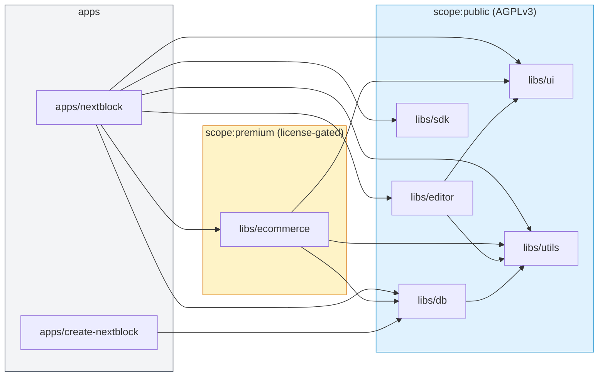
```mermaid
graph LR
    subgraph PublicScope["scope:public (AGPLv3)"]
        UI[libs/ui]
        Utils[libs/utils]
        DB[libs/db]
        Editor[libs/editor]
        SDK[libs/sdk]
    end

    subgraph PremiumScope["scope:premium (license-gated)"]
        Ecom[libs/ecommerce]
    end

    subgraph AppScope["apps"]
        App[apps/nextblock]
        CLI[apps/create-nextblock]
    end

    App --> UI
    App --> Utils
    App --> DB
    App --> Editor
    App --> SDK
    App --> Ecom
    Ecom --> UI
    Ecom --> DB
    Ecom --> Utils
    Editor --> UI
    Editor --> Utils
    DB --> Utils
    CLI --> DB

    style PublicScope fill:#e0f2fe,stroke:#0284c7
    style PremiumScope fill:#fef3c7,stroke:#d97706
    style AppScope fill:#f3f4f6,stroke:#4b5563
```

The premium `libs/ecommerce` is guarded at runtime by the `verifyPackageOnline('ecommerce')` helper in `libs/db/src/lib/package-validation.ts`, which reads the `package_activations` table and caches the result for 60 seconds via `unstable_cache`.

## 3.9 REFERENCES

### 3.9.1 Files Examined

- `package.json` — Root workspace package metadata, all dependency versions, and npm scripts
- `nx.json` — Nx workspace configuration, registered plugins, generators, and targets
- `tsconfig.base.json` — Shared TypeScript strict-mode configuration and monorepo path aliases
- `vercel.json` — Cron schedules for `reset-sandbox` (03:00 UTC) and `sync-currencies` (18:00 UTC)
- `tailwind.config.js` — Root Tailwind CSS theme tokens, dark-mode configuration, content globs
- `postcss.config.js` — PostCSS pipeline with `@tailwindcss/postcss` and `autoprefixer`
- `eslint.config.mjs` — Flat ESLint configuration with `@nx/enforce-module-boundaries` rules
- `components.json` — shadcn/ui configuration (slate base, CSS variables, RSC, TSX)
- `project.json` — Root Nx project with Verdaccio `local-registry` target
- `.env.exemple` — Environment variable reference template
- `.verdaccio/config.yml` — Local npm registry configuration (port 4873)
- `apps/nextblock/package.json` — `@nextblock-cms/template` v0.2.55 dependencies
- `apps/nextblock/next.config.js` — Image optimization, CSP, `transpilePackages`, Turbopack
- `apps/nextblock/proxy.ts` — Session sync, RBAC, locale, security headers, CSP
- `apps/nextblock/tsconfig.json` — App-level TypeScript configuration (ES2017 target, bundler resolution)
- `apps/nextblock/eslint.config.mjs` — App ESLint with Next.js Core Web Vitals
- `apps/create-nextblock/package.json` — CLI package v0.2.78 dependencies
- `apps/create-nextblock/bin/create-nextblock.js` — CLI entry point (ES module shebang)
- `libs/db/package.json` — `@nextblock-cms/db` v0.2.32
- `libs/ui/package.json` — `@nextblock-cms/ui` v0.2.19 with exports map
- `libs/editor/package.json` — `@nextblock-cms/editor` v0.2.24 with Tiptap + Yjs dependencies
- `libs/ecommerce/package.json` — `@nextblock-cms/ecom` v0.0.10 with `scope:premium` Nx tag
- `libs/utils/package.json` — `@nextblock-cms/utils` v0.2.13
- `libs/sdk/package.json` — `@nextblock-cms/sdk` v0.2.9
- `libs/environment.d.ts` — `NodeJS.ProcessEnv` augmentation for all environment variables
- `libs/db/src/lib/package-validation.ts` — `verifyPackageOnline` with 60-second `unstable_cache`
- `libs/db/vite.config.ts` — Vite library build + `copy-db-supabase.cjs` post-step
- `libs/ui/vite.config.ts` — Vite build with client-directive patching
- `libs/utils/vite.config.ts` — Vite build with client/server separation
- `libs/editor/vite.config.ts` — Vite build with workspace alias resolution
- `docs/04-DATABASE-AND-AUTH.md` — Proxy-vs-middleware rationale
- `docs/05-DEVELOPER-GUIDE.md` — Operational handbook

### 3.9.2 Folders Explored

- `apps/nextblock/` — Primary CMS + public site application
- `apps/create-nextblock/` — CLI scaffolding tool
- `libs/db/` — Supabase integration package
- `libs/db/src/supabase/migrations/` — Eleven numbered PostgreSQL migration files
- `libs/db/src/supabase/templates/` — Six Supabase Auth email templates
- `libs/ui/` — Design-system library (Radix + shadcn/ui)
- `libs/editor/` — Tiptap-based rich-text editor library
- `libs/ecommerce/` — Premium commerce module (source-available)
- `libs/utils/` — Shared helpers with client/server split
- `libs/sdk/` — Block SDK extensibility contract
- `tools/scripts/` — Release, deployment, and sandbox automation scripts
- `.verdaccio/` — Local npm registry configuration
- `docs/` — Eight documentation files including developer guide and database/auth deep-dive

### 3.9.3 Cross-Referenced Technical Specification Sections

- **§1.2.1.3 Integration with Existing Enterprise Landscape** — Eight integration domains feeding §3.4
- **§1.2.2.3 Core Technical Approach** — Framework stack tables feeding §3.2
- **§1.2.3.2 Critical Success Factors** — TypeScript strictness and open-core invariants feeding §3.1.2.2 and §3.7.2
- **§1.3.1.4 Essential Integrations** — Validated integration surface documented in §3.4
- **§1.3.3 Out-of-Scope** — Infrastructure assumptions and package-alignment known issues feeding §3.3.2.1 and §3.7
- **§2.1 Feature Catalog** — Feature-level dependency versions reconciled throughout §3.2 and §3.4
- **§2.4.1 Technical Constraints** — Supabase-only, Next.js-only, and module-boundary constraints governing stack choices
- **§2.4.4 Security Implications** — Webhook integrity, CSP, HSTS, and RLS mitigations feeding §3.4.3, §3.4.4, and §3.8.1
- **§2.4.5 Maintenance Requirements** — Migration, library release, and package-alignment maintenance concerns feeding §3.3.2.1 and §3.5.1.1

# 4. Process Flowchart

This section provides comprehensive process flow documentation for the NextBlock CMS system. It captures the end-to-end business workflows, integration sequences, state transitions, and error-handling patterns evidenced in the repository source code, database migrations, and configuration files. Each flow in this section is grounded in the feature catalog enumerated in Section 2.1 and the dependency topology in Section 2.3, ensuring traceability from flowchart to implementation.

## 4.1 SYSTEM WORKFLOWS OVERVIEW

### 4.1.1 Workflow Classification

The NextBlock CMS system exhibits fifteen distinct workflow categories that span the foundational request pipeline, authentication, content authoring, commerce, media processing, webhook integration, scheduled operations, and developer scaffolding. These workflows are grounded in the feature catalog (F-001 through F-030) documented in Section 2.1 and the integration dependencies mapped in Section 2.3.1.

| Workflow Category | Primary Features | Canonical Entry Point |
|:--|:--|:--|
| Request Proxy Pipeline | F-002, F-003, F-007, F-011, F-012 | `apps/nextblock/proxy.ts` |
| Authentication | F-002, F-003 | `apps/nextblock/app/actions.ts`, `app/auth/callback/route.ts` |
| Checkout Orchestration | F-015, F-016, F-017, F-022 | `apps/nextblock/app/api/checkout/route.ts` |
| Payment Webhook Reconciliation | F-016, F-017, F-021 | `app/api/webhooks/{stripe\|freemius}/route.ts` |
| Inventory Deduction | F-014, F-021 | `libs/ecommerce/src/lib/order-inventory.ts` |
| Media Ingestion | F-006 | `app/api/upload/*`, `app/api/process-image/` |
| Cache Invalidation | F-001, F-027 | `app/api/revalidate/route.ts` |
| Scheduled Jobs | F-018, F-025, F-026 | `app/api/cron/*` |
| Shipping Resolution | F-019 | `libs/ecommerce/src/lib/shipping/resolver.ts` |
| Tax Calculation | F-020 | `libs/ecommerce/src/lib/tax-calculation.ts` |
| License Gating | F-022 | `libs/db/src/lib/package-validation.ts` |
| CLI Scaffolding | F-023 | `apps/create-nextblock/bin/create-nextblock.js` |

### 4.1.2 High-Level System Workflow

The following diagram illustrates the canonical request flow through the system, from external traffic entry to response egress, showing how the request proxy coordinates authentication, authorization, localization, and security header injection before any application route handler executes.

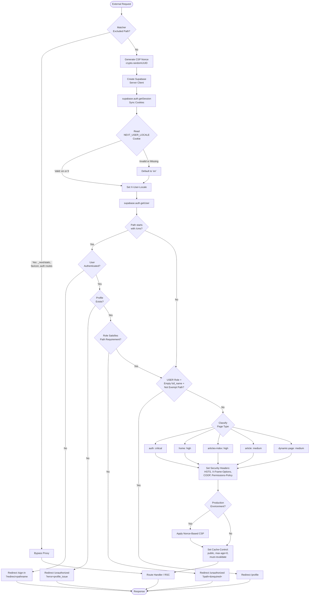
```mermaid
flowchart TB
    Start([External Request]) --> Matcher{Matcher<br/>Excluded Path?}
    Matcher -->|Yes: _next/static,<br/>favicon, auth routes| Bypass[Bypass Proxy]
    Matcher -->|No| Nonce[Generate CSP Nonce<br/>crypto.randomUUID]
    
    Nonce --> Supabase[Create Supabase<br/>Server Client]
    Supabase --> SyncSession[supabase.auth.getSession<br/>Sync Cookies]
    SyncSession --> Locale{Read<br/>NEXT_USER_LOCALE<br/>Cookie}
    
    Locale -->|Valid: en or fr| SetLocaleHeader[Set X-User-Locale]
    Locale -->|Invalid or Missing| DefaultEn[Default to 'en']
    DefaultEn --> SetLocaleHeader
    
    SetLocaleHeader --> GetUser[supabase.auth.getUser]
    GetUser --> CmsGuard{Path starts<br/>with /cms?}
    
    CmsGuard -->|Yes| AuthCheck{User<br/>Authenticated?}
    CmsGuard -->|No| ProfileGate
    
    AuthCheck -->|No| SignInRedirect[Redirect /sign-in<br/>?redirect=pathname]
    AuthCheck -->|Yes| ProfileCheck{Profile<br/>Exists?}
    
    ProfileCheck -->|No| UnauthProfile[Redirect /unauthorized<br/>?error=profile_issue]
    ProfileCheck -->|Yes| RoleCheck{Role Satisfies<br/>Path Requirement?}
    
    RoleCheck -->|No| UnauthRole[Redirect /unauthorized<br/>?path=&required=]
    RoleCheck -->|Yes| ProfileGate
    
    ProfileGate{USER Role +<br/>Empty full_name +<br/>Not Exempt Path?}
    ProfileGate -->|Yes| ProfileRedirect[Redirect /profile]
    ProfileGate -->|No| PageType{Classify<br/>Page Type}
    
    PageType --> AuthPage[auth: critical]
    PageType --> HomePage[home: high]
    PageType --> ArticlesIdx[articles-index: high]
    PageType --> ArticlePage[article: medium]
    PageType --> DynamicPage[dynamic-page: medium]
    
    AuthPage --> SetHeaders
    HomePage --> SetHeaders
    ArticlesIdx --> SetHeaders
    ArticlePage --> SetHeaders
    DynamicPage --> SetHeaders
    
    SetHeaders[Set Security Headers:<br/>HSTS, X-Frame-Options,<br/>COOP, Permissions-Policy]
    SetHeaders --> CSPGate{Production<br/>Environment?}
    CSPGate -->|Yes| CSP[Apply Nonce-Based CSP]
    CSPGate -->|No| HTMLCache
    CSP --> HTMLCache[Set Cache-Control:<br/>public, max-age=0,<br/>must-revalidate]
    HTMLCache --> Route[Route Handler / RSC]
    Bypass --> Route
    Route --> Response([Response])
    SignInRedirect --> Response
    UnauthProfile --> Response
    UnauthRole --> Response
    ProfileRedirect --> Response
```

## 4.2 CORE BUSINESS PROCESSES

### 4.2.1 Request Proxy Pipeline

The request proxy at `apps/nextblock/proxy.ts` is the single entry point for all non-excluded requests and supplants the conventional `middleware.ts` pattern. As documented in Section 3.8.1, this file consolidates six responsibilities: Supabase session synchronization, CMS role-based route guards, locale propagation, security header injection, production-only nonce-based CSP, and page-type prefetch-priority signaling.

#### 4.2.1.1 CMS Route Guard Decision Logic

The proxy enforces path-level permissions using a routing table that maps CMS route prefixes to required roles. The `/cms` base path requires either the `WRITER` or `ADMIN` role; the more sensitive paths `/cms/admin`, `/cms/users`, and `/cms/settings` require the `ADMIN` role exclusively.

```mermaid
flowchart LR
    Request[/cms/* Request] --> SessionCheck{Session<br/>Active?}
    SessionCheck -->|No| UnauthRedirect[/sign-in<br/>?redirect=pathname]
    SessionCheck -->|Yes| ProfileLookup[Query profiles table<br/>role, full_name]
    
    ProfileLookup --> ProfileExists{Profile<br/>Found?}
    ProfileExists -->|No| ProfileIssue[/unauthorized<br/>?error=profile_issue]
    ProfileExists -->|Yes| PathMatch{Match Path<br/>Prefix}
    
    PathMatch -->|/cms/admin<br/>/cms/users<br/>/cms/settings| AdminReq{Role ==<br/>ADMIN?}
    PathMatch -->|/cms/*| WriterReq{Role in<br/>WRITER, ADMIN?}
    
    AdminReq -->|Yes| Allow[Continue Request]
    AdminReq -->|No| UnauthRole[/unauthorized<br/>?path=&required=ADMIN]
    
    WriterReq -->|Yes| Allow
    WriterReq -->|No| UnauthRoleW[/unauthorized<br/>?path=&required=WRITER]
```

### 4.2.2 Authentication Workflows

Authentication (F-002) is layered over Supabase Auth via `@supabase/ssr` 0.7.0. Server actions in `apps/nextblock/app/actions.ts` orchestrate email/password sign-up, sign-in, and password-reset flows, while `app/auth/callback/route.ts` handles OAuth authorization-code exchange.

#### 4.2.2.1 Sign-Up Flow

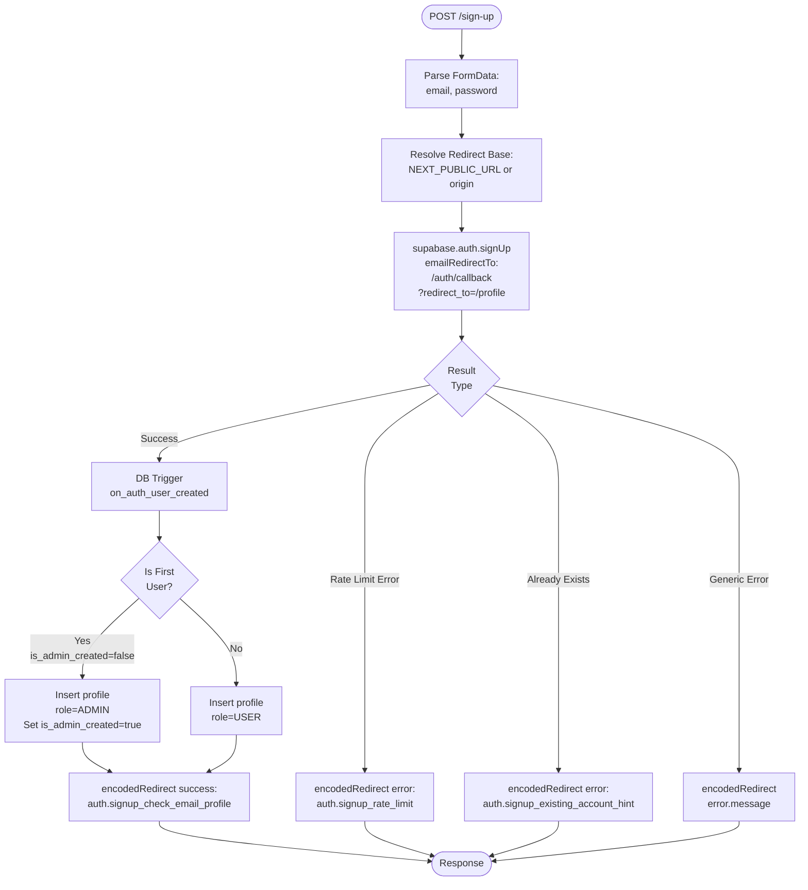
```mermaid
flowchart TB
    Start([POST /sign-up]) --> Parse[Parse FormData:<br/>email, password]
    Parse --> ResolveBase[Resolve Redirect Base:<br/>NEXT_PUBLIC_URL or origin]
    ResolveBase --> SignUp[supabase.auth.signUp<br/>emailRedirectTo:<br/>/auth/callback<br/>?redirect_to=/profile]
    
    SignUp --> Result{Result<br/>Type}
    Result -->|Rate Limit Error| RateErr[encodedRedirect error:<br/>auth.signup_rate_limit]
    Result -->|Already Exists| ExistsErr[encodedRedirect error:<br/>auth.signup_existing_account_hint]
    Result -->|Generic Error| GenErr[encodedRedirect<br/>error.message]
    Result -->|Success| DbTrigger[DB Trigger<br/>on_auth_user_created]
    
    DbTrigger --> FirstUser{Is First<br/>User?}
    FirstUser -->|Yes<br/>is_admin_created=false| AssignAdmin[Insert profile<br/>role=ADMIN<br/>Set is_admin_created=true]
    FirstUser -->|No| AssignUser[Insert profile<br/>role=USER]
    
    AssignAdmin --> CheckEmail[encodedRedirect success:<br/>auth.signup_check_email_profile]
    AssignUser --> CheckEmail
    CheckEmail --> End([Response])
    RateErr --> End
    ExistsErr --> End
    GenErr --> End
```

The database trigger `on_auth_user_created` (defined in migration `00000000000005`) enforces the First-User Administrator Guarantee documented in Section 1.2.3.2(5): the first registered user is elevated to `ADMIN`, while all subsequent users receive the `USER` role.

#### 4.2.2.2 Sign-In and Post-Auth Redirect Resolution

The sign-in flow combines Supabase's password authentication with a deterministic post-authentication redirect resolver in `apps/nextblock/lib/auth-redirects.ts`. The resolver enforces safe-path validation, role-based landing pages, and profile-completion gates.

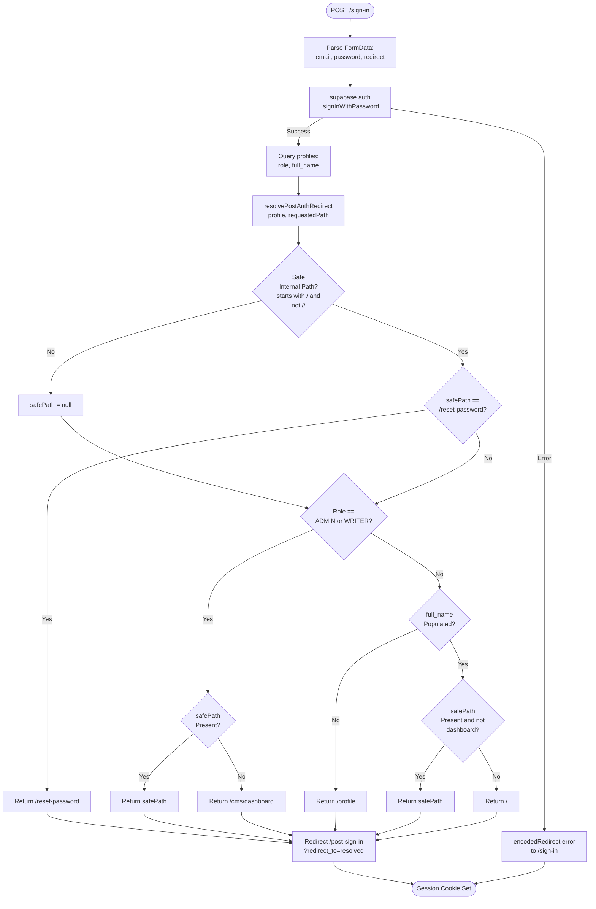
```mermaid
flowchart TB
    SignIn([POST /sign-in]) --> ParseForm[Parse FormData:<br/>email, password, redirect]
    ParseForm --> Auth[supabase.auth<br/>.signInWithPassword]
    Auth -->|Error| SignInErr[encodedRedirect error<br/>to /sign-in]
    Auth -->|Success| LoadProfile[Query profiles:<br/>role, full_name]
    
    LoadProfile --> Resolver[resolvePostAuthRedirect<br/>profile, requestedPath]
    Resolver --> SafeCheck{Safe<br/>Internal Path?<br/>starts with / and<br/>not //}
    
    SafeCheck -->|No| SafeNull[safePath = null]
    SafeCheck -->|Yes| CheckReset{safePath ==<br/>/reset-password?}
    SafeNull --> RoleBranch
    
    CheckReset -->|Yes| ReturnReset[Return /reset-password]
    CheckReset -->|No| RoleBranch{Role ==<br/>ADMIN or WRITER?}
    
    RoleBranch -->|Yes| RoleLanding{safePath<br/>Present?}
    RoleBranch -->|No| ProfileComplete{full_name<br/>Populated?}
    
    RoleLanding -->|Yes| ReturnSafe[Return safePath]
    RoleLanding -->|No| ReturnDash[Return /cms/dashboard]
    
    ProfileComplete -->|No| ReturnProfile[Return /profile]
    ProfileComplete -->|Yes| UserPath{safePath<br/>Present and not<br/>dashboard?}
    UserPath -->|Yes| ReturnUserPath[Return safePath]
    UserPath -->|No| ReturnHome[Return /]
    
    ReturnReset --> PostSignIn[Redirect /post-sign-in<br/>?redirect_to=resolved]
    ReturnSafe --> PostSignIn
    ReturnDash --> PostSignIn
    ReturnProfile --> PostSignIn
    ReturnUserPath --> PostSignIn
    ReturnHome --> PostSignIn
    PostSignIn --> End([Session Cookie Set])
    SignInErr --> End
```

#### 4.2.2.3 OAuth Callback Flow

The OAuth callback at `app/auth/callback/route.ts` exchanges a short-lived authorization code for a Supabase session and delegates redirect resolution to the same resolver used for email/password sign-in. The flow is designed to degrade gracefully — if the code exchange fails, the user is redirected back to their originally requested path rather than being shown an error.

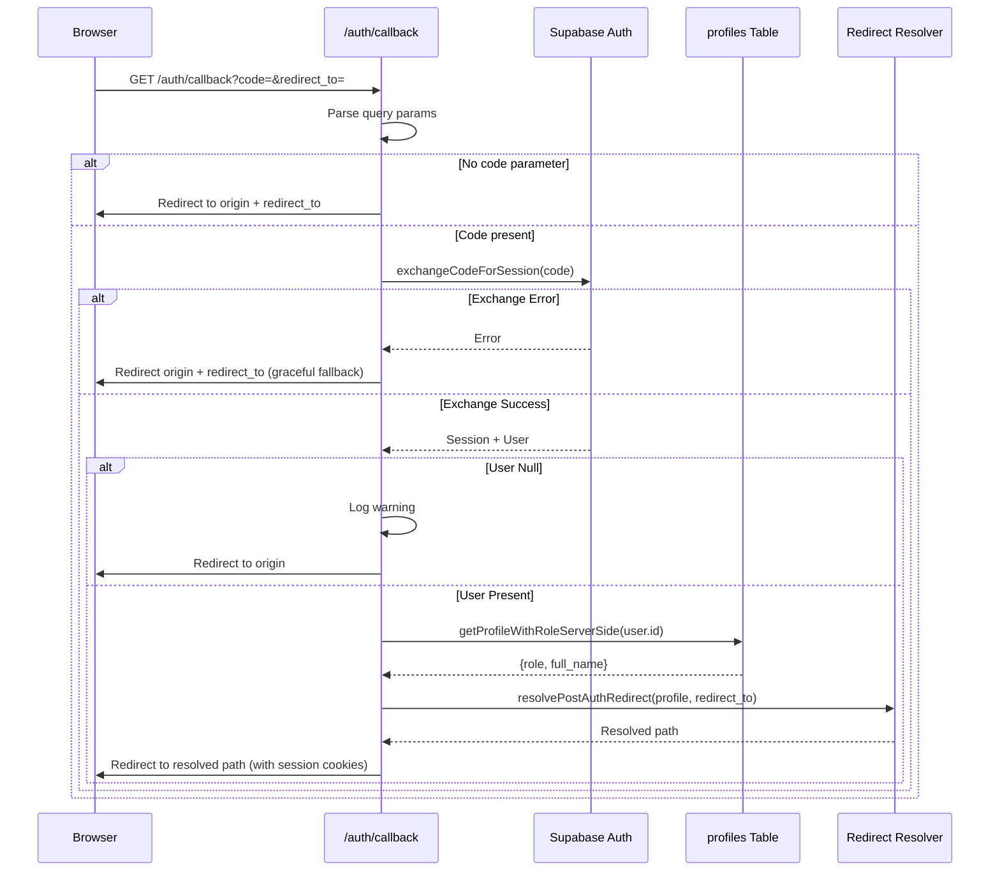
```mermaid
sequenceDiagram
    participant B as Browser
    participant CB as /auth/callback
    participant SB as Supabase Auth
    participant DB as profiles Table
    participant R as Redirect Resolver
    
    B->>CB: GET /auth/callback?code=&redirect_to=
    CB->>CB: Parse query params
    alt No code parameter
        CB->>B: Redirect to origin + redirect_to
    else Code present
        CB->>SB: exchangeCodeForSession(code)
        alt Exchange Error
            SB-->>CB: Error
            CB->>B: Redirect origin + redirect_to (graceful fallback)
        else Exchange Success
            SB-->>CB: Session + User
            alt User Null
                CB->>CB: Log warning
                CB->>B: Redirect to origin
            else User Present
                CB->>DB: getProfileWithRoleServerSide(user.id)
                DB-->>CB: {role, full_name}
                CB->>R: resolvePostAuthRedirect(profile, redirect_to)
                R-->>CB: Resolved path
                CB->>B: Redirect to resolved path (with session cookies)
            end
        end
    end
```

#### 4.2.2.4 Password Reset Flow

Password reset is implemented by two server actions in `apps/nextblock/app/actions.ts`: `forgotPasswordAction` sends a password reset email via `supabase.auth.resetPasswordForEmail`, and `resetPasswordAction` validates matching passwords and calls `supabase.auth.updateUser`. The redirect pattern routes the user through `/auth/callback?redirect_to=/reset-password`, which allows the code-exchange flow to authenticate the session before the password can be updated.

### 4.2.3 Content Authoring Workflow (CMS)

The CMS authoring surface under `apps/nextblock/app/cms/*` is composed from block definitions registered in `apps/nextblock/lib/blocks/blockRegistry.ts`. Authoring follows a consistent pattern: block creation from the registry, schema-validated state mutation, revision snapshot generation (F-008), and on-demand revalidation of affected public routes (F-027).

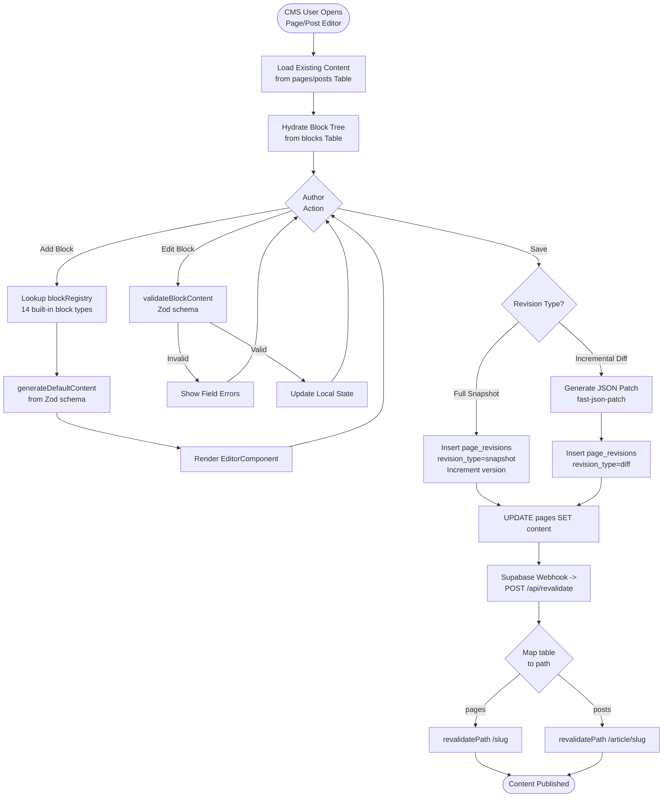
```mermaid
flowchart TB
    Start([CMS User Opens<br/>Page/Post Editor]) --> LoadContent[Load Existing Content<br/>from pages/posts Table]
    LoadContent --> HydrateBlocks[Hydrate Block Tree<br/>from blocks Table]
    HydrateBlocks --> AuthoringLoop{Author<br/>Action}
    
    AuthoringLoop -->|Add Block| Registry[Lookup blockRegistry<br/>14 built-in block types]
    Registry --> InitContent[generateDefaultContent<br/>from Zod schema]
    InitContent --> RenderEditor[Render EditorComponent]
    
    AuthoringLoop -->|Edit Block| Validate[validateBlockContent<br/>Zod schema]
    Validate -->|Invalid| EditorErr[Show Field Errors]
    Validate -->|Valid| UpdateState[Update Local State]
    
    AuthoringLoop -->|Save| CreateRevision{Revision Type?}
    CreateRevision -->|Full Snapshot| SnapshotInsert[Insert page_revisions<br/>revision_type=snapshot<br/>Increment version]
    CreateRevision -->|Incremental Diff| DiffGen[Generate JSON Patch<br/>fast-json-patch]
    DiffGen --> DiffInsert[Insert page_revisions<br/>revision_type=diff]
    
    SnapshotInsert --> UpdateMain[UPDATE pages SET content]
    DiffInsert --> UpdateMain
    UpdateMain --> RevalWebhook[Supabase Webhook -><br/>POST /api/revalidate]
    RevalWebhook --> PathMap{Map table<br/>to path}
    PathMap -->|pages| RevalSlug[revalidatePath /slug]
    PathMap -->|posts| RevalArticle[revalidatePath /article/slug]
    RevalSlug --> End([Content Published])
    RevalArticle --> End
    EditorErr --> AuthoringLoop
    UpdateState --> AuthoringLoop
    RenderEditor --> AuthoringLoop
```

### 4.2.4 E-Commerce Checkout Workflow

The checkout workflow is the most complex orchestration in the system, spanning client-side cart state (Zustand), server-side provider routing, payment gateway integration, and post-payment fulfillment. The API at `apps/nextblock/app/api/checkout/route.ts` performs three gating checks: active package activation (F-022), provider-aware item grouping, and billing address presence.

#### 4.2.4.1 Cart State Management

The cart is implemented with Zustand and `persist` middleware targeting `localStorage` under the key `'cart-storage'`, with `skipHydration: true` to prevent SSR/CSR mismatches. The add-item decision tree enforces distinct business rules for digital and physical items:

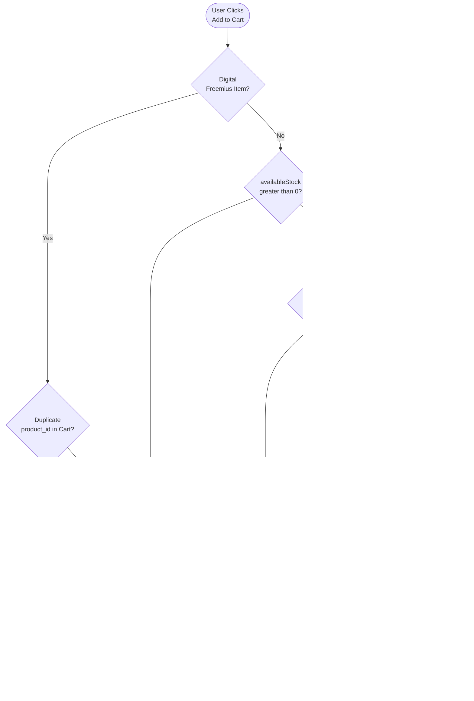
```mermaid
flowchart TB
    AddItem([User Clicks<br/>Add to Cart]) --> ItemType{Digital<br/>Freemius Item?}
    
    ItemType -->|Yes| DigitalCheck{Duplicate<br/>product_id in Cart?}
    DigitalCheck -->|Yes| DigitalReject[Reject:<br/>This software license<br/>is already in your cart]
    DigitalCheck -->|No| DigitalAdd[Push item<br/>quantity=1<br/>Skip stock checks]
    
    ItemType -->|No| StockCheck{availableStock<br/>greater than 0?}
    StockCheck -->|No| OutOfStock[Reject:<br/>This item is out of stock]
    StockCheck -->|Yes| AllocCheck{allocatedSkuQuantity<br/>less than availableStock?}
    
    AllocCheck -->|No| AllocRejected[Reject:<br/>Only N available for this SKU]
    AllocCheck -->|Yes| ExistsCheck{Item Already<br/>In Cart?}
    
    ExistsCheck -->|Yes| IncrementQty[Increment Existing<br/>item.quantity]
    ExistsCheck -->|No| PushNew[Push New Item<br/>quantity=1]
    
    DigitalAdd --> OpenCart[Set isOpen=true<br/>Auto-open Cart Drawer]
    IncrementQty --> OpenCart
    PushNew --> OpenCart
    OpenCart --> Persist[Persist to<br/>localStorage]
    Persist --> End([Cart Updated])
    DigitalReject --> End
    OutOfStock --> End
    AllocRejected --> End
```

#### 4.2.4.2 Checkout API Provider Resolution

Provider resolution in `apps/nextblock/app/api/checkout/route.ts` follows a strict priority order designed to enforce type-provider consistency (also enforced at the database level via the `products_type_provider_consistency_check` constraint described in F-013):

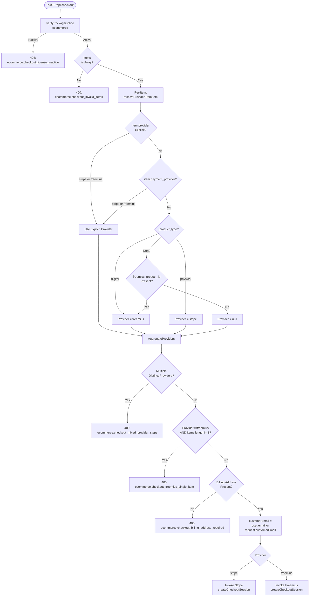
```mermaid
flowchart TB
    Start([POST /api/checkout]) --> License[verifyPackageOnline<br/>ecommerce]
    License -->|Inactive| LicErr[403:<br/>ecommerce.checkout_license_inactive]
    License -->|Active| ValidateItems{items<br/>is Array?}
    ValidateItems -->|No| InvalidErr[400:<br/>ecommerce.checkout_invalid_items]
    ValidateItems -->|Yes| ResolveLoop[Per-Item:<br/>resolveProviderFromItem]
    
    ResolveLoop --> P1{item.provider<br/>Explicit?}
    P1 -->|stripe or freemius| SetProvider[Use Explicit Provider]
    P1 -->|No| P2{item.payment_provider?}
    P2 -->|stripe or freemius| SetProvider
    P2 -->|No| P3{product_type?}
    P3 -->|digital| UseFreemius[Provider = freemius]
    P3 -->|physical| UseStripe[Provider = stripe]
    P3 -->|None| P4{freemius_product_id<br/>Present?}
    P4 -->|Yes| UseFreemius
    P4 -->|No| NullProvider[Provider = null]
    
    SetProvider --> AggregateProviders
    UseFreemius --> AggregateProviders
    UseStripe --> AggregateProviders
    NullProvider --> AggregateProviders
    
    AggregateProviders --> MixedCheck{Multiple<br/>Distinct Providers?}
    MixedCheck -->|Yes| MixedErr[400:<br/>ecommerce.checkout_mixed_provider_steps]
    MixedCheck -->|No| FreemiusSolo{Provider==freemius<br/>AND items length != 1?}
    
    FreemiusSolo -->|Yes| SoloErr[400:<br/>ecommerce.checkout_freemius_single_item]
    FreemiusSolo -->|No| BillingCheck{Billing Address<br/>Present?}
    
    BillingCheck -->|No| BillErr[400:<br/>ecommerce.checkout_billing_address_required]
    BillingCheck -->|Yes| EmailResolve[customerEmail =<br/>user.email or<br/>request.customerEmail]
    
    EmailResolve --> Dispatch{Provider}
    Dispatch -->|stripe| StripeFlow[Invoke Stripe<br/>createCheckoutSession]
    Dispatch -->|freemius| FreemiusFlow[Invoke Freemius<br/>createCheckoutSession]
```

#### 4.2.4.3 Stripe Checkout Session Creation

The Stripe checkout orchestration in `libs/ecommerce/src/lib/providers/stripe.ts` executes a 19-step sequence involving product validation, inventory verification, shipping cost resolution, tax calculation, pending-order persistence, and Stripe Session creation. The order is inserted with `status: 'pending'` before the Stripe Session is created, enabling the webhook to reconcile by `metadata.orderId` lookup (preferred) or `stripe_session_id` (fallback).

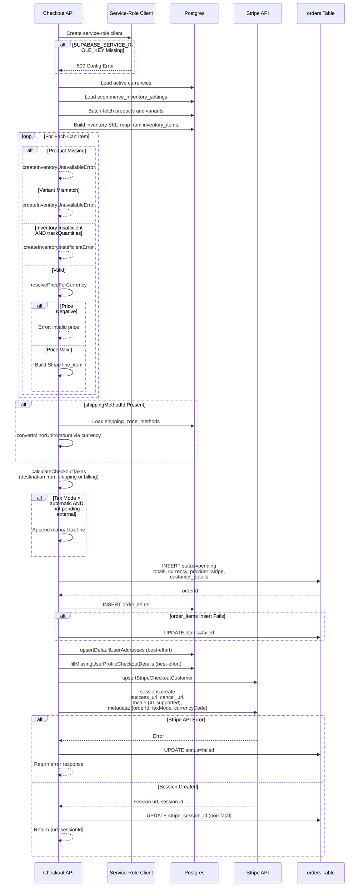
```mermaid
sequenceDiagram
    participant API as Checkout API
    participant SR as Service-Role Client
    participant DB as Postgres
    participant Stripe as Stripe API
    participant Order as orders Table
    
    API->>SR: Create service-role client
    alt SUPABASE_SERVICE_ROLE_KEY Missing
        SR-->>API: 500 Config Error
    end
    
    API->>DB: Load active currencies
    API->>DB: Load ecommerce_inventory_settings
    API->>DB: Batch-fetch products and variants
    API->>DB: Build inventory SKU map from inventory_items
    
    loop For Each Cart Item
        alt Product Missing
            API-->>API: createInventoryUnavailableError
        else Variant Mismatch
            API-->>API: createInventoryUnavailableError
        else Inventory Insufficient AND trackQuantities
            API-->>API: createInventoryInsufficientError
        else Valid
            API->>API: resolvePriceForCurrency
            alt Price Negative
                API-->>API: Error: invalid price
            else Price Valid
                API->>API: Build Stripe line_item
            end
        end
    end
    
    alt shippingMethodId Present
        API->>DB: Load shipping_zone_methods
        API->>API: convertMinorUnitAmount via currency
    end
    
    API->>API: calculateCheckoutTaxes<br/>(destination from shipping or billing)
    
    alt Tax Mode = automatic AND not pending external
        API->>API: Append manual tax line
    end
    
    API->>Order: INSERT status=pending<br/>totals, currency, provider=stripe,<br/>customer_details
    Order-->>API: orderId
    
    API->>DB: INSERT order_items
    alt order_items Insert Fails
        API->>Order: UPDATE status=failed
    end
    
    API->>DB: upsertDefaultUserAddresses (best-effort)
    API->>DB: fillMissingUserProfileCheckoutDetails (best-effort)
    API->>Stripe: upsertStripeCheckoutCustomer
    
    API->>Stripe: sessions.create<br/>success_url, cancel_url,<br/>locale (41 supported),<br/>metadata: {orderId, taxMode, currencyCode}
    
    alt Stripe API Error
        Stripe-->>API: Error
        API->>Order: UPDATE status=failed
        API-->>API: Return error response
    else Session Created
        Stripe-->>API: session.url, session.id
        API->>Order: UPDATE stripe_session_id (non-fatal)
        API-->>API: Return {url, sessionId}
    end
```

#### 4.2.4.4 Freemius Checkout Session Creation

The Freemius provider in `libs/ecommerce/src/lib/providers/freemius.ts` implements a credentials-resolution priority chain that supports four configuration modes: product-scoped JSON mappings, single-product sandbox overrides, single-product environment variables, and legacy shared credentials. Sandbox token generation prefers the `@freemius/sdk` native implementation but falls back to a manually computed MD5 hash on SDK failure.

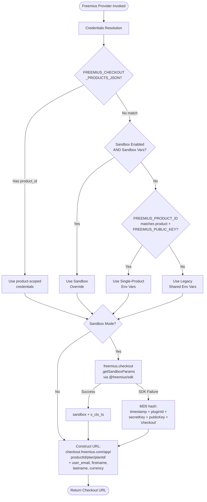
```mermaid
flowchart TB
    Start([Freemius Provider Invoked]) --> CredResolve[Credentials Resolution]
    CredResolve --> C1{FREEMIUS_CHECKOUT<br/>_PRODUCTS_JSON?}
    C1 -->|Has product_id| UseJson[Use product-scoped<br/>credentials]
    C1 -->|No match| C2{Sandbox Enabled<br/>AND Sandbox Vars?}
    
    C2 -->|Yes| UseSandbox[Use Sandbox<br/>Override]
    C2 -->|No| C3{FREEMIUS_PRODUCT_ID<br/>matches product +<br/>FREEMIUS_PUBLIC_KEY?}
    C3 -->|Yes| UseSingleProd[Use Single-Product<br/>Env Vars]
    C3 -->|No| UseLegacy[Use Legacy<br/>Shared Env Vars]
    
    UseJson --> SandboxGen{Sandbox Mode?}
    UseSandbox --> SandboxGen
    UseSingleProd --> SandboxGen
    UseLegacy --> SandboxGen
    
    SandboxGen -->|Yes| SdkGen[freemius.checkout<br/>.getSandboxParams<br/>via @freemius/sdk]
    SandboxGen -->|No| BuildUrl
    
    SdkGen -->|Success| TokenOk[sandbox + s_ctx_ts]
    SdkGen -->|SDK Failure| FallbackHash[MD5 hash:<br/>timestamp + pluginId +<br/>secretKey + publicKey +<br/>'checkout']
    
    TokenOk --> BuildUrl
    FallbackHash --> BuildUrl
    
    BuildUrl[Construct URL:<br/>checkout.freemius.com/app/<br/>productId/plan/planId/<br/>+ user_email, firstname,<br/>lastname, currency]
    BuildUrl --> Response([Return Checkout URL])
```

### 4.2.5 Order Fulfillment Workflow

Order fulfillment occurs at `/checkout/success` via the `fulfillOrderAction` server action in `apps/nextblock/app/checkout/success/actions.ts`. The action discriminates between Stripe (session ID prefix `cs_`) and Freemius (non-`cs_` treated as order ID) paths and ensures idempotent processing via explicit already-paid branches.

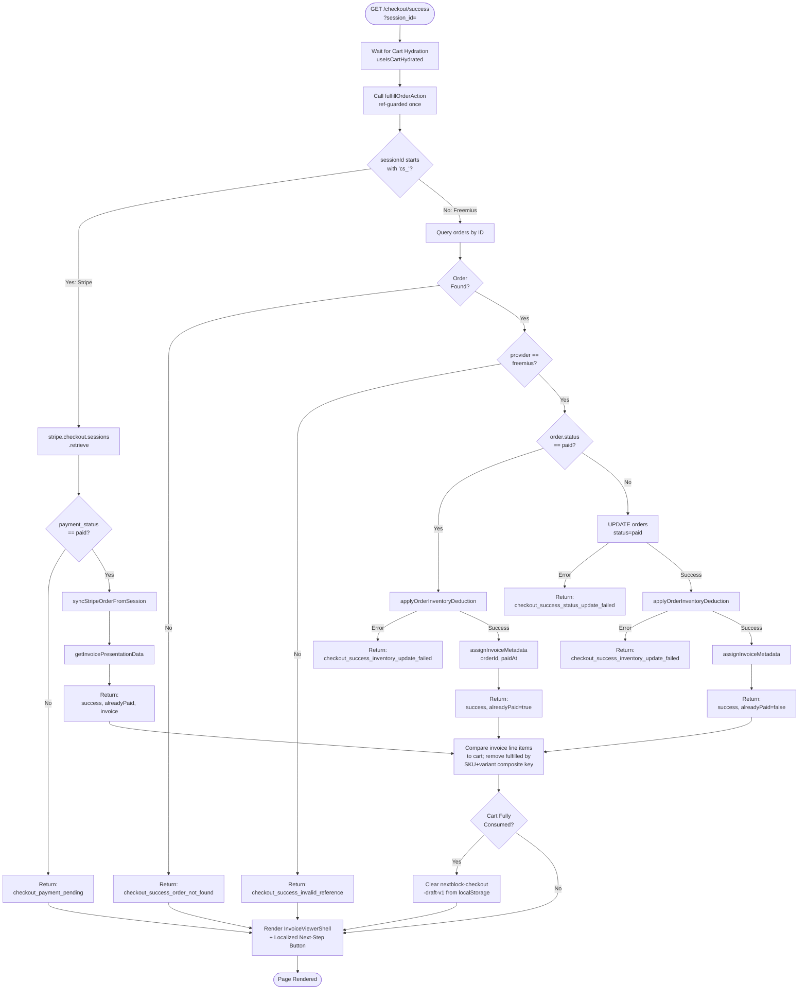
```mermaid
flowchart TB
    Start([GET /checkout/success<br/>?session_id=]) --> WaitHydration[Wait for Cart Hydration<br/>useIsCartHydrated]
    WaitHydration --> CallFulfill[Call fulfillOrderAction<br/>ref-guarded once]
    
    CallFulfill --> Branch{sessionId starts<br/>with 'cs_'?}
    
    Branch -->|Yes: Stripe| StripeRetr[stripe.checkout.sessions<br/>.retrieve]
    StripeRetr --> StripePaid{payment_status<br/>== paid?}
    StripePaid -->|No| PaymentPending[Return:<br/>checkout_payment_pending]
    StripePaid -->|Yes| SyncStripe[syncStripeOrderFromSession]
    SyncStripe --> LoadInvoice[getInvoicePresentationData]
    LoadInvoice --> ReturnStripe[Return:<br/>success, alreadyPaid, invoice]
    
    Branch -->|No: Freemius| QueryOrder[Query orders by ID]
    QueryOrder --> OrderFound{Order<br/>Found?}
    OrderFound -->|No| NotFound[Return:<br/>checkout_success_order_not_found]
    OrderFound -->|Yes| ProviderCheck{provider ==<br/>freemius?}
    
    ProviderCheck -->|No| InvalidRef[Return:<br/>checkout_success_invalid_reference]
    ProviderCheck -->|Yes| AlreadyPaid{order.status<br/>== paid?}
    
    AlreadyPaid -->|Yes| DedupInv[applyOrderInventoryDeduction]
    DedupInv -->|Error| InvErr1[Return:<br/>checkout_success_inventory_update_failed]
    DedupInv -->|Success| AssignMetaYes[assignInvoiceMetadata<br/>orderId, paidAt]
    AssignMetaYes --> ReturnYes[Return:<br/>success, alreadyPaid=true]
    
    AlreadyPaid -->|No| UpdateStatus[UPDATE orders<br/>status=paid]
    UpdateStatus -->|Error| StatusErr[Return:<br/>checkout_success_status_update_failed]
    UpdateStatus -->|Success| DedupInv2[applyOrderInventoryDeduction]
    DedupInv2 -->|Error| InvErr2[Return:<br/>checkout_success_inventory_update_failed]
    DedupInv2 -->|Success| AssignMetaNo[assignInvoiceMetadata]
    AssignMetaNo --> ReturnNo[Return:<br/>success, alreadyPaid=false]
    
    ReturnStripe --> ClientClear[Compare invoice line items<br/>to cart; remove fulfilled by<br/>SKU+variant composite key]
    ReturnYes --> ClientClear
    ReturnNo --> ClientClear
    PaymentPending --> Render
    NotFound --> Render
    InvalidRef --> Render
    
    ClientClear --> CartEmpty{Cart Fully<br/>Consumed?}
    CartEmpty -->|Yes| ClearDraft[Clear nextblock-checkout<br/>-draft-v1 from localStorage]
    CartEmpty -->|No| Render
    ClearDraft --> Render[Render InvoiceViewerShell<br/>+ Localized Next-Step Button]
    Render --> End([Page Rendered])
```

## 4.3 INTEGRATION WORKFLOWS

### 4.3.1 Stripe Webhook Integration

The Stripe webhook transport at `apps/nextblock/app/api/webhooks/stripe/route.ts` reads the raw request body via `req.text()` (critical for signature verification) and delegates to the shared handler in `libs/ecommerce/src/lib/stripe/webhooks.ts`. The shared handler performs strict signature verification via `stripe.webhooks.constructEvent`, dispatches `checkout.session.completed` events to the order-sync routine, and ignores unhandled event types.

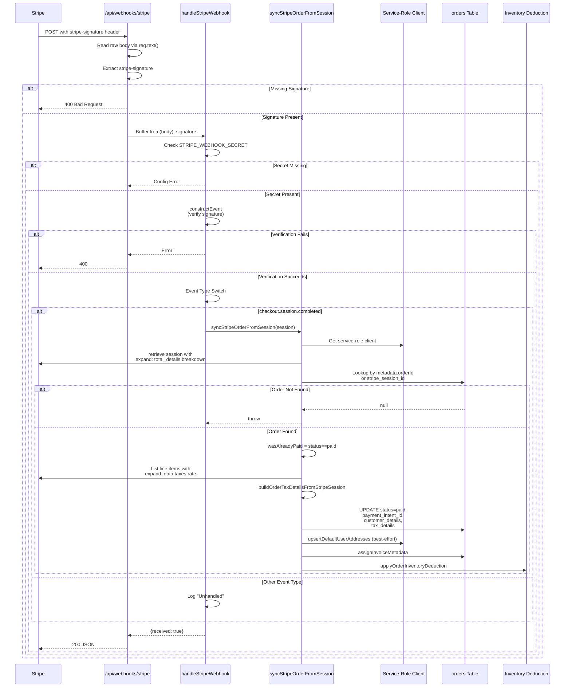
```mermaid
sequenceDiagram
    participant Stripe as Stripe
    participant Route as /api/webhooks/stripe
    participant Handler as handleStripeWebhook
    participant Sync as syncStripeOrderFromSession
    participant SR as Service-Role Client
    participant Orders as orders Table
    participant Inv as Inventory Deduction
    
    Stripe->>Route: POST with stripe-signature header
    Route->>Route: Read raw body via req.text()
    Route->>Route: Extract stripe-signature
    alt Missing Signature
        Route-->>Stripe: 400 Bad Request
    else Signature Present
        Route->>Handler: Buffer.from(body), signature
        Handler->>Handler: Check STRIPE_WEBHOOK_SECRET
        alt Secret Missing
            Handler-->>Route: Config Error
        else Secret Present
            Handler->>Handler: constructEvent<br/>(verify signature)
            alt Verification Fails
                Handler-->>Route: Error
                Route-->>Stripe: 400
            else Verification Succeeds
                Handler->>Handler: Event Type Switch
                alt checkout.session.completed
                    Handler->>Sync: syncStripeOrderFromSession(session)
                    Sync->>SR: Get service-role client
                    Sync->>Stripe: retrieve session with<br/>expand: total_details.breakdown
                    Sync->>Orders: Lookup by metadata.orderId<br/>or stripe_session_id
                    alt Order Not Found
                        Orders-->>Sync: null
                        Sync-->>Handler: throw
                    else Order Found
                        Sync->>Sync: wasAlreadyPaid = status==paid
                        Sync->>Stripe: List line items with<br/>expand: data.taxes.rate
                        Sync->>Sync: buildOrderTaxDetailsFromStripeSession
                        Sync->>Orders: UPDATE status=paid,<br/>payment_intent_id,<br/>customer_details,<br/>tax_details
                        Sync->>SR: upsertDefaultUserAddresses (best-effort)
                        Sync->>Orders: assignInvoiceMetadata
                        Sync->>Inv: applyOrderInventoryDeduction
                    end
                else Other Event Type
                    Handler->>Handler: Log "Unhandled"
                end
                Handler-->>Route: {received: true}
                Route-->>Stripe: 200 JSON
            end
        end
    end
```

### 4.3.2 Freemius Webhook Integration

The Freemius webhook at `apps/nextblock/app/api/webhooks/freemius/route.ts` implements HMAC SHA-256 signature verification using `FREEMIUS_SECRET_KEY`. A sandbox escape hatch tolerates signature mismatches when `NEXT_PUBLIC_IS_SANDBOX === 'true'`. Currently, only `install.upgraded` and `license.activated` events are processed; reconciliation to local database state is documented as a known limitation (Section 1.3.3.1).

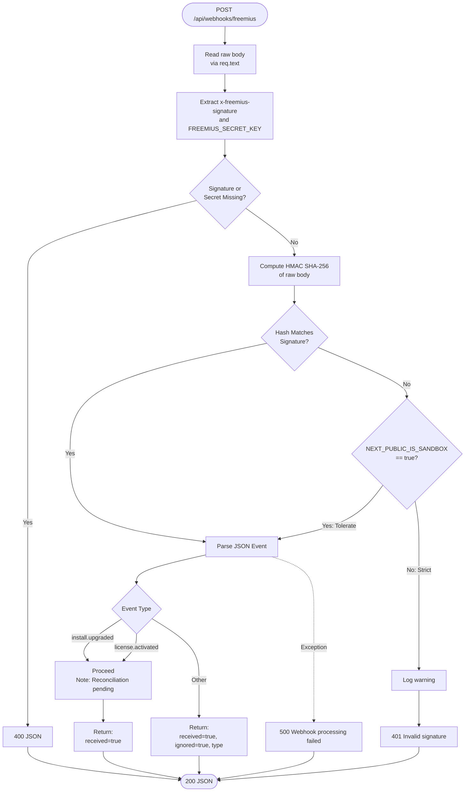
```mermaid
flowchart TB
    Start([POST /api/webhooks/freemius]) --> ReadBody[Read raw body<br/>via req.text]
    ReadBody --> ExtractSig[Extract x-freemius-signature<br/>and FREEMIUS_SECRET_KEY]
    
    ExtractSig --> Missing{Signature or<br/>Secret Missing?}
    Missing -->|Yes| MissingErr[400 JSON]
    Missing -->|No| ComputeHmac[Compute HMAC SHA-256<br/>of raw body]
    
    ComputeHmac --> Match{Hash Matches<br/>Signature?}
    Match -->|Yes| ParseEvent[Parse JSON Event]
    Match -->|No| SandboxCheck{NEXT_PUBLIC_IS_SANDBOX<br/>== true?}
    
    SandboxCheck -->|Yes: Tolerate| ParseEvent
    SandboxCheck -->|No: Strict| LogMismatch[Log warning]
    LogMismatch --> Unauthorized[401 Invalid signature]
    
    ParseEvent --> EventType{Event Type}
    EventType -->|install.upgraded| Process[Proceed<br/>Note: Reconciliation pending]
    EventType -->|license.activated| Process
    EventType -->|Other| Ignore[Return:<br/>received=true, ignored=true, type]
    
    Process --> Received[Return:<br/>received=true]
    Received --> End([200 JSON])
    Ignore --> End
    MissingErr --> End
    Unauthorized --> End
    
    ParseEvent -.->|Exception| Caught[500 Webhook processing failed]
    Caught --> End
```

### 4.3.3 Inventory Deduction Integration (Resilient Dual-Path)

Inventory deduction in `libs/ecommerce/src/lib/order-inventory.ts` implements a resilient dual-path strategy: the primary path calls the `apply_order_inventory_deduction` Postgres RPC, and a direct SQL fallback executes when the RPC is unavailable. Both paths are idempotent via the `orders.inventory_deducted_at` sentinel. This pattern is documented in F-014 of the feature catalog.

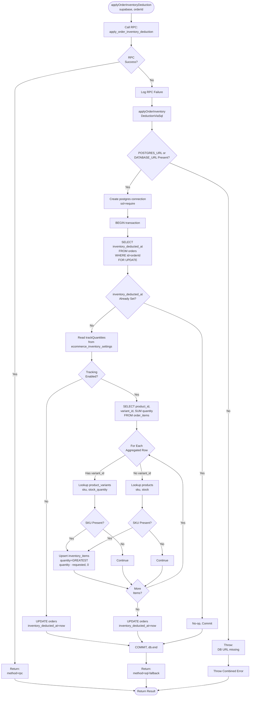
```mermaid
flowchart TB
    Start([applyOrderInventoryDeduction<br/>supabase, orderId]) --> RpcTry[Call RPC:<br/>apply_order_inventory_deduction]
    
    RpcTry --> RpcResult{RPC<br/>Success?}
    RpcResult -->|Yes| RpcReturn[Return:<br/>method=rpc]
    RpcResult -->|No| LogFailure[Log RPC Failure]
    
    LogFailure --> SqlFallback[applyOrderInventory<br/>DeductionViaSql]
    SqlFallback --> ConnCheck{POSTGRES_URL or<br/>DATABASE_URL Present?}
    ConnCheck -->|No| MissingDb[Throw:<br/>DB URL missing]
    ConnCheck -->|Yes| Connect[Create postgres connection<br/>ssl=require]
    
    Connect --> BeginTx[BEGIN transaction]
    BeginTx --> LockOrder[SELECT inventory_deducted_at<br/>FROM orders<br/>WHERE id=orderId<br/>FOR UPDATE]
    
    LockOrder --> Idempotent{inventory_deducted_at<br/>Already Set?}
    Idempotent -->|Yes| NoOp[No-op, Commit]
    Idempotent -->|No| ReadSettings[Read trackQuantities<br/>from ecommerce_inventory_settings]
    
    ReadSettings --> TrackOn{Tracking<br/>Enabled?}
    TrackOn -->|No| JustUpdate[UPDATE orders<br/>inventory_deducted_at=now]
    TrackOn -->|Yes| Aggregate[SELECT product_id,<br/>variant_id, SUM quantity<br/>FROM order_items]
    
    Aggregate --> ItemLoop{For Each<br/>Aggregated Row}
    ItemLoop -->|Has variant_id| VarLookup[Lookup product_variants<br/>sku, stock_quantity]
    ItemLoop -->|No variant_id| ProdLookup[Lookup products<br/>sku, stock]
    
    VarLookup --> SkuCheck1{SKU Present?}
    ProdLookup --> SkuCheck2{SKU Present?}
    SkuCheck1 -->|No| Skip1[Continue]
    SkuCheck2 -->|No| Skip2[Continue]
    SkuCheck1 -->|Yes| UpsertDec[Upsert inventory_items<br/>quantity=GREATEST<br/>quantity - requested, 0]
    SkuCheck2 -->|Yes| UpsertDec
    
    UpsertDec --> NextItem{More<br/>Items?}
    Skip1 --> NextItem
    Skip2 --> NextItem
    NextItem -->|Yes| ItemLoop
    NextItem -->|No| FinalUpdate[UPDATE orders<br/>inventory_deducted_at=now]
    
    JustUpdate --> Commit[COMMIT, db.end]
    FinalUpdate --> Commit
    NoOp --> Commit
    Commit --> SqlReturn[Return:<br/>method=sql-fallback]
    
    RpcReturn --> End([Return Result])
    SqlReturn --> End
    MissingDb --> Throw[Throw Combined Error]
    Throw --> End
```

### 4.3.4 On-Demand Revalidation Integration

The revalidation webhook at `apps/nextblock/app/api/revalidate/route.ts` receives Supabase Webhook payloads on content mutations and maps table-level changes to Next.js ISR path revalidation. Authentication uses header-based `REVALIDATE_SECRET_TOKEN` comparison.

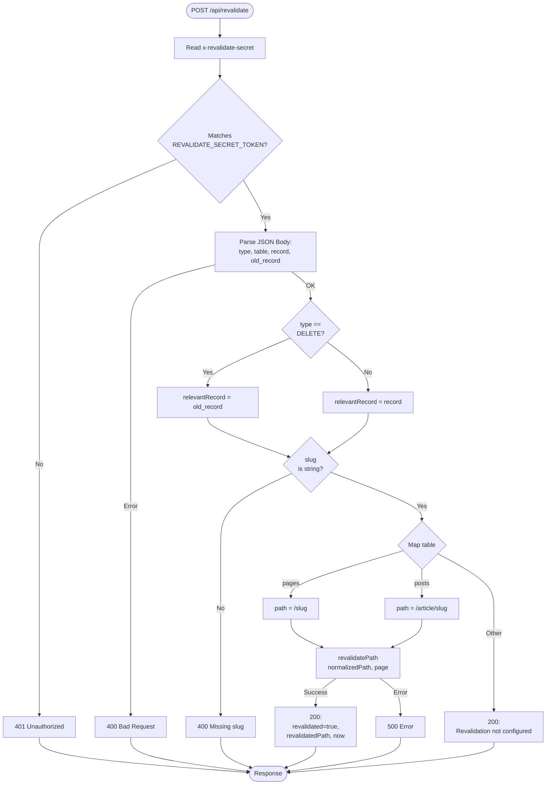
```mermaid
flowchart TB
    Start([POST /api/revalidate]) --> ReadHeader[Read x-revalidate-secret]
    ReadHeader --> AuthCheck{Matches<br/>REVALIDATE_SECRET_TOKEN?}
    AuthCheck -->|No| Unauth[401 Unauthorized]
    AuthCheck -->|Yes| ParseJson[Parse JSON Body:<br/>type, table, record, old_record]
    
    ParseJson -->|Error| ParseErr[400 Bad Request]
    ParseJson -->|OK| SelectRecord{type ==<br/>DELETE?}
    SelectRecord -->|Yes| UseOld[relevantRecord = old_record]
    SelectRecord -->|No| UseNew[relevantRecord = record]
    
    UseOld --> SlugCheck{slug<br/>is string?}
    UseNew --> SlugCheck
    SlugCheck -->|No| SlugErr[400 Missing slug]
    SlugCheck -->|Yes| TableMap{Map table}
    
    TableMap -->|pages| PagesPath[path = /slug]
    TableMap -->|posts| PostsPath[path = /article/slug]
    TableMap -->|Other| NotConfigured[200:<br/>Revalidation not configured]
    
    PagesPath --> Revalidate[revalidatePath<br/>normalizedPath, page]
    PostsPath --> Revalidate
    
    Revalidate -->|Success| SuccessResp[200:<br/>revalidated=true,<br/>revalidatedPath, now]
    Revalidate -->|Error| ErrResp[500 Error]
    
    SuccessResp --> End([Response])
    NotConfigured --> End
    Unauth --> End
    ParseErr --> End
    SlugErr --> End
    ErrResp --> End
```

### 4.3.5 Currency Synchronization Integration

The currency sync workflow (F-018) executes daily via the `/api/cron/sync-currencies` endpoint and pulls exchange rates from `https://api.frankfurter.dev` (overridable via `FX_API_BASE_URL`). Authentication uses `Authorization: Bearer ${CRON_SECRET}`.

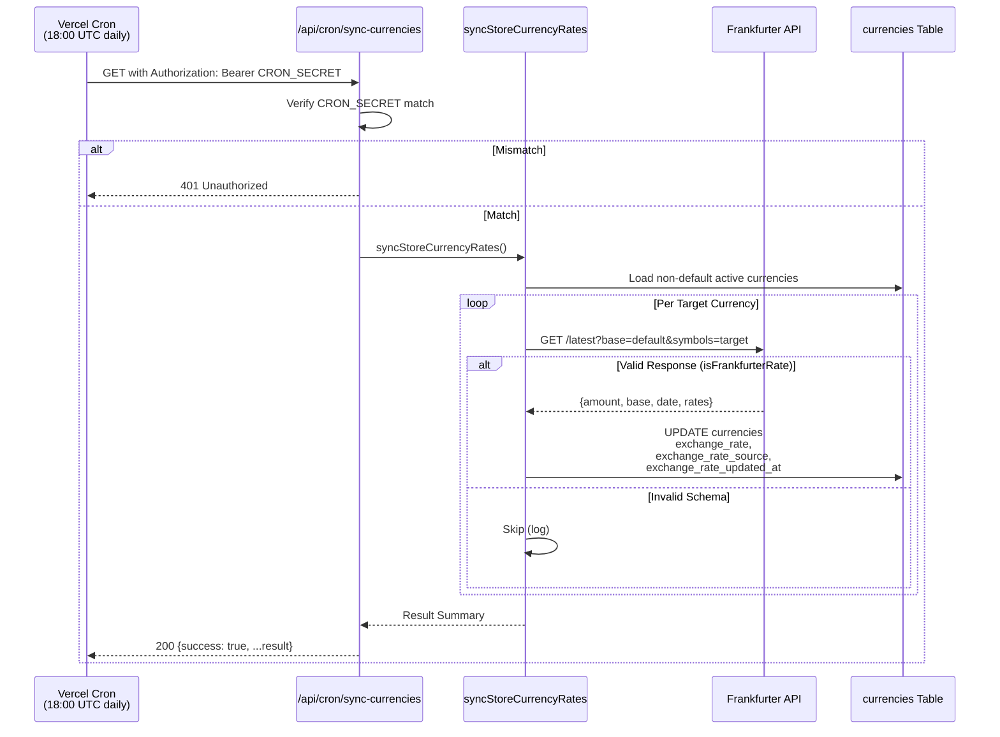
```mermaid
sequenceDiagram
    participant Vercel as Vercel Cron<br/>(18:00 UTC daily)
    participant API as /api/cron/sync-currencies
    participant Sync as syncStoreCurrencyRates
    participant FX as Frankfurter API
    participant DB as currencies Table
    
    Vercel->>API: GET with Authorization: Bearer CRON_SECRET
    API->>API: Verify CRON_SECRET match
    alt Mismatch
        API-->>Vercel: 401 Unauthorized
    else Match
        API->>Sync: syncStoreCurrencyRates()
        Sync->>DB: Load non-default active currencies
        loop Per Target Currency
            Sync->>FX: GET /latest?base=default&symbols=target
            alt Valid Response (isFrankfurterRate)
                FX-->>Sync: {amount, base, date, rates}
                Sync->>DB: UPDATE currencies<br/>exchange_rate,<br/>exchange_rate_source,<br/>exchange_rate_updated_at
            else Invalid Schema
                Sync->>Sync: Skip (log)
            end
        end
        Sync-->>API: Result Summary
        API-->>Vercel: 200 {success: true, ...result}
    end
```

## 4.4 MEDIA AND ASSET PROCESSING WORKFLOWS

### 4.4.1 Direct Upload via Presigned URL

The presigned URL upload path at `/api/upload/presigned-url/` generates a time-limited S3-compatible PUT URL against Cloudflare R2. Role-based access control restricts uploads to `ADMIN` and `WRITER` users; file size is hard-capped at 10 MB with a 300-second URL expiration.

```mermaid
flowchart TB
    Start([POST /api/upload/<br/>presigned-url]) --> Auth[Authenticate User]
    Auth -->|Unauthenticated| Unauth[401]
    Auth -->|Authenticated| Role[Query profiles.role]
    Role -->|Not WRITER/ADMIN| Forbidden[403]
    Role -->|WRITER or ADMIN| BucketCheck{R2_BUCKET_NAME<br/>Set?}
    BucketCheck -->|No| ConfigErr[500 Config Error]
    BucketCheck -->|Yes| ParseBody[Parse: filename,<br/>contentType, size]
    
    ParseBody --> SizeLimit{size LE 10 MB?}
    SizeLimit -->|No| TooLarge[400 File Too Large]
    SizeLimit -->|Yes| Sanitize[sanitizeFolder:<br/>strip unsafe chars,<br/>default uploads/]
    
    Sanitize --> GenKey[Generate objectKey:<br/>folder + filename]
    GenKey --> Presign[getSignedUrl with<br/>PutObjectCommand<br/>expires=300s]
    Presign --> Respond[Return:<br/>presignedUrl, objectKey, method=PUT]
    Respond --> End([Response])
    Unauth --> End
    Forbidden --> End
    ConfigErr --> End
    TooLarge --> End
```

### 4.4.2 Proxy Upload Flow

The proxy upload path at `/api/upload/proxy/` accepts multipart form uploads, buffering the file in memory and writing directly to R2 via `PutObjectCommand`. This path is used when direct browser-to-R2 uploads are not suitable (e.g., server-side transformations).

```mermaid
flowchart TB
    Start([POST /api/upload/proxy]) --> Bucket{R2_BUCKET_NAME<br/>Set?}
    Bucket -->|No| Cfg[500 Config Error]
    Bucket -->|Yes| Auth[Authenticate User]
    Auth -->|Unauthenticated| Unauth[401]
    Auth -->|Authenticated| S3Client{S3 Client<br/>Creates OK?}
    S3Client -->|No| S3Err[500]
    S3Client -->|Yes| Parse[Parse FormData:<br/>file, folder]
    
    Parse -->|No file| NoFile[400]
    Parse -->|OK| SanFolder[sanitizeFolder<br/>+ timestamp suffix]
    SanFolder --> ReadFile[file.arrayBuffer<br/>Buffer.from]
    ReadFile --> Put[PutObjectCommand:<br/>contentType, size,<br/>metadata: uploader-user-id]
    Put --> Resp[Return:<br/>objectKey, message]
    Resp --> End([Response])
    Cfg --> End
    Unauth --> End
    S3Err --> End
    NoFile --> End
```

### 4.4.3 Image Processing Pipeline

The image processing endpoint at `/api/process-image/` generates modern-format derivatives using `sharp` and a blur placeholder using `plaiceholder`. The pipeline caps source width at 2560 pixels and emits five AVIF derivatives at widths 1920, 1280, 768, 384, and 128 plus an optional `original_avif` variant.

```mermaid
flowchart TB
    Start([POST /api/process-image]) --> EnvCheck{R2 env vars<br/>all present?}
    EnvCheck -->|No| CfgErr[500]
    EnvCheck -->|Yes| ParseKey[Parse:<br/>objectKey, contentType]
    ParseKey -->|Missing| BadReq[400]
    ParseKey -->|OK| MimeCheck{Is Image<br/>MIME?}
    MimeCheck -->|No| EmptyReturn[Return:<br/>processedVariants=[],<br/>blurDataURL=null]
    MimeCheck -->|Yes| Download[Download source<br/>from R2 stream to buffer]
    
    Download --> Inspect[sharp().metadata<br/>Enforce max 2560px]
    Inspect --> WidthLoop{Iterate widths:<br/>1920, 1280, 768,<br/>384, 128}
    WidthLoop --> CreateAvif[Create AVIF variant<br/>at target width]
    CreateAvif --> Label[Label: xlarge_avif,<br/>large_avif, medium_avif,<br/>small_avif, thumbnail_avif]
    Label --> Upload[PutObjectCommand<br/>with content type]
    Upload --> NextW{More<br/>widths?}
    NextW -->|Yes| WidthLoop
    NextW -->|No| SrcAvif{Source is<br/>AVIF?}
    
    SrcAvif -->|No| OrigAvif[Create original_avif<br/>at source dimensions]
    SrcAvif -->|Yes| Placeholder
    OrigAvif --> UploadOrig[Upload original_avif]
    UploadOrig --> Placeholder[plaiceholder.getPlaiceholder<br/>Generate Blur Placeholder]
    
    Placeholder --> Respond[Return:<br/>objectKey,<br/>processedVariants,<br/>blurDataURL]
    Respond --> End([Response])
    EmptyReturn --> End
    CfgErr --> End
    BadReq --> End
```

### 4.4.4 Media Record Persistence

After upload and processing, `/api/media/record/` persists a row in the `media` table and invalidates the `/cms/media` CMS listing via `revalidatePath`. The route enforces the same `ADMIN`/`WRITER` role gate as the upload endpoints.

```mermaid
flowchart LR
    Start([POST /api/media/record]) --> Parse[Parse JSON:<br/>fileName, r2OriginalKey]
    Parse --> Auth[Authenticate User]
    Auth -->|No| Unauth[401]
    Auth -->|Yes| Role{Role in<br/>ADMIN, WRITER?}
    Role -->|No| Forbidden[403]
    Role -->|Yes| Normalize[Normalize storage keys<br/>and folder paths]
    
    Normalize --> Dedup[Deduplicate variants<br/>by object key]
    Dedup --> Primary[Select primary variant<br/>by priority order]
    Primary --> DeriveDesc{description<br/>Provided?}
    DeriveDesc -->|No| FromFilename[Derive from filename]
    DeriveDesc -->|Yes| Insert
    FromFilename --> Insert[INSERT public.media]
    Insert --> RevalMedia[revalidatePath /cms/media]
    RevalMedia --> End([200])
    Unauth --> End
    Forbidden --> End
```

## 4.5 SCHEDULED AND OPERATIONAL WORKFLOWS

### 4.5.1 Sandbox Reset Cron

The sandbox reset cron at `/api/cron/reset-sandbox/` executes daily at 03:00 UTC and performs a comprehensive environment rebuild: R2 storage deletion and re-seeding, database bootstrap via generated `SANDBOX_RESET_SQL`, and seeding of commerce products, localized content, and navigation entries. The endpoint requires `NEXT_PUBLIC_IS_SANDBOX === 'true'` and rejects execution in production environments.

```mermaid
flowchart TB
    Start([GET /api/cron/<br/>reset-sandbox]) --> SandboxEnv{NEXT_PUBLIC<br/>_IS_SANDBOX==true?}
    SandboxEnv -->|No| RejectEnv[Reject]
    SandboxEnv -->|Yes| AuthCheck{Bearer CRON_SECRET<br/>matches?}
    AuthCheck -->|No| Unauth401[401]
    AuthCheck -->|Yes| EnvCheck[Validate Supabase,<br/>Postgres, R2, site<br/>origin env vars]
    
    EnvCheck -->|Incomplete| MissingVars[Error: missing env]
    EnvCheck -->|Valid| R2Reset[R2 Storage Reset]
    
    R2Reset --> Enumerate[ListObjectsV2Command]
    Enumerate --> Batch[DeleteObjectsCommand<br/>batched]
    Batch --> Seed[Re-upload seed assets<br/>from site origin]
    
    Seed --> DbOpen[Open Postgres Connection]
    DbOpen --> ExecSql[Execute SANDBOX_RESET_SQL<br/>generated from migrations]
    ExecSql --> NormalizeMedia[Normalize legacy<br/>media records]
    NormalizeMedia --> EnsureMedia[Ensure required<br/>media records]
    EnsureMedia --> FreemiusSeed[Insert Freemius<br/>sandbox activation<br/>product_id 24851]
    FreemiusSeed --> FreemiusSync[Sync Freemius products<br/>update payment settings]
    
    FreemiusSync --> LocaleSeed[Resolve locale IDs<br/>seed Commerce Pro,<br/>apparel catalog,<br/>variants, inventory]
    LocaleSeed --> PageSeed[Create localized<br/>shop + boutique pages]
    PageSeed --> NavSeed[Create navigation entries]
    NavSeed --> Finally[finally: Close DB Connection]
    Finally --> RespOk[JSON Success Response]
    RespOk --> End([Response])
    
    RejectEnv --> End
    Unauth401 --> End
    MissingVars --> Finally
```

### 4.5.2 Revalidation Logging Endpoint

The companion endpoint at `/api/revalidate-log/` is a best-effort observability hook. It accepts POST payloads containing `path` and emits `isr_revalidate` structured log events, enabling operators to correlate external revalidation triggers with cache-miss behavior.

## 4.6 SHIPPING AND TAX RESOLUTION WORKFLOWS

### 4.6.1 Shipping Zone Resolution (F-019)

The shipping resolver at `libs/ecommerce/src/lib/shipping/resolver.ts` implements an eight-step algorithm that prioritizes state-level matches, falls back to country-wide zones, honors zone priority order, filters by cart-total thresholds, and returns only the cheapest valid method. The `postal_code` column exists in the schema but is not yet consumed by the runtime resolver (documented as a known limitation in Section 1.3.3.1).

```mermaid
flowchart TB
    Start([resolveShippingOptions<br/>cartTotal, destination,<br/>languageCode, currencyCode]) --> Step1[Step 1: Load active currencies<br/>normalize via getDefaultCurrency]
    
    Step1 --> Step2[Step 2: Query<br/>shipping_zone_locations<br/>inner-join shipping_zones priority<br/>filter by country_code<br/>order by priority_order ASC]
    
    Step2 --> NoMatch{Matches<br/>Empty?}
    NoMatch -->|Yes| EmptyReturn[Return empty array]
    NoMatch -->|No| Step3[Step 3: State Match<br/>matches.find<br/>state_code==destination.state]
    
    Step3 --> StateFound{State<br/>Match?}
    StateFound -->|Yes| ZoneResolved[zone_id = state match]
    StateFound -->|No| Step4[Step 4: Country-Wide Fallback<br/>matches.find not state_code<br/>and not postal_code]
    
    Step4 --> CountryFound{Country-Wide<br/>Match?}
    CountryFound -->|Yes| ZoneResolved
    CountryFound -->|No| Step5[Step 5: Priority Fallback<br/>matches 0 .zone_id]
    Step5 --> ZoneResolved
    
    ZoneResolved --> Step6[Step 6: Load<br/>shipping_zone_methods<br/>for resolved zone]
    Step6 --> Step7[Step 7: Filter by<br/>cart-total threshold:<br/>resolveShippingRateAmountForCurrency<br/>keep cartTotal >= threshold]
    
    Step7 --> Step8a[Step 8a: Per-method<br/>Currency Conversion +<br/>Localization:<br/>resolveTranslatedText name]
    Step8a --> Step8b[Step 8b: Sort ASC by amount<br/>Return single cheapest method]
    Step8b --> End([Return array])
    EmptyReturn --> End
```

### 4.6.2 Tax Calculation (F-020)

Tax calculation supports two modes controlled by `ecommerce_inventory_settings.taxCalculationMode`: `manual` (locally computed via `tax_rates` table with state/country match) and `automatic` (delegated to Stripe Tax). Schema constraints require `tax_rate` between 0 and 100 and enforce uniqueness on `(country_code, state_code, lower(tax_name))`.

```mermaid
flowchart TB
    Start([calculateCheckoutTaxes<br/>items, destination, settings]) --> Enabled{enableTaxes<br/>==true?}
    Enabled -->|No| NoTax[Return:<br/>tax_total=0, tax_details=null]
    Enabled -->|Yes| Mode{taxCalculationMode}
    
    Mode -->|manual| Manual[Manual Mode]
    Mode -->|automatic| Auto[Automatic Mode]
    
    Manual --> M1[Filter items:<br/>product.is_taxable==true]
    M1 --> M2[Normalize destination<br/>shipping over billing]
    M2 --> M3[Load tax_rates by<br/>country_code, state_code]
    M3 --> M4[Stack rates<br/>e.g. GST + PST]
    M4 --> M5[Calculate per-line taxes]
    M5 --> M6[Return:<br/>tax_total, tax_details JSONB]
    
    Auto --> A1[Mark line_items with<br/>tax_code from<br/>getStripeTaxCodeForProduct]
    A1 --> A2[Stripe session uses<br/>automatic_tax: enabled=true]
    A2 --> A3[Initial order stores<br/>provisional tax_details]
    A3 --> A4[Webhook resync replaces<br/>with finalized Stripe data<br/>via buildOrderTaxDetailsFromStripeSession]
    A4 --> A5[Final tax_details<br/>persisted on order]
    
    M6 --> End([Return])
    A5 --> End
    NoTax --> End
```

## 4.7 STATE MANAGEMENT AND STATE TRANSITIONS

### 4.7.1 Order Status Lifecycle (F-021)

Orders transition through five statuses defined in migration `00000000000004`. The transitions are driven by a combination of automatic (payment webhook) and manual (CMS admin action) events. Inventory deduction is idempotent via the `inventory_deducted_at` sentinel and is applied on transition to `paid`.

```mermaid
stateDiagram-v2
    [*] --> pending: Checkout API<br/>creates order
    
    pending --> paid: Stripe webhook<br/>checkout.session.completed<br/>or Freemius fulfillment
    pending --> failed: order_items insert fails<br/>or Stripe session creation error
    pending --> cancelled: Manual/User<br/>cancellation
    
    paid --> shipped: Manual CMS<br/>Admin action
    paid --> refunded: Manual CMS<br/>Admin action
    
    shipped --> refunded: Manual CMS<br/>Admin action
    
    failed --> [*]
    cancelled --> [*]
    refunded --> [*]
    shipped --> [*]
    
    note right of pending
        Initial insert:
        status, total, currency,
        exchange_rate_at_purchase,
        subtotal, shipping_total,
        tax_total, tax_details,
        provider, user_id,
        customer_details
    end note
    
    note right of paid
        Sentinels set on paid:
        paid_at = now()
        inventory_deducted_at = now()
        invoice_number (from sequence)
    end note
```

### 4.7.2 Page/Post Content Lifecycle (F-001, F-008)

Content status transitions are enforced by the `page_status` enum defined in the content migration. Revision history (F-008) is created on transitions to `published` via hybrid snapshot/diff storage in `page_revisions` and `post_revisions`.

```mermaid
stateDiagram-v2
    [*] --> draft: Author creates<br/>page/post
    
    draft --> published: Publish action<br/>Create revision snapshot<br/>Trigger revalidation
    draft --> archived: Archive action
    
    published --> draft: Unpublish / Edit<br/>Creates diff revision
    published --> archived: Archive action<br/>Trigger revalidation
    
    archived --> draft: Restore action
    
    note right of published
        Triggers:
        - INSERT page_revisions
          (snapshot or diff)
        - Supabase webhook
          to /api/revalidate
        - revalidatePath /slug
          or /article/slug
    end note
```

### 4.7.3 User Role Bootstrap State (F-003)

The `on_auth_user_created` trigger enforces the First-User Administrator Guarantee. The `is_admin_created` boolean in the `profiles` schema acts as a one-way latch: once a deployment has elevated its first user to `ADMIN`, all subsequent users receive the `USER` role.

```mermaid
stateDiagram-v2
    [*] --> PreFirstUser: Fresh deployment<br/>is_admin_created=false
    
    PreFirstUser --> FirstUserCreated: First auth.users INSERT<br/>Trigger on_auth_user_created
    FirstUserCreated --> AdminProvisioned: Insert profile<br/>role=ADMIN<br/>Set is_admin_created=true
    
    AdminProvisioned --> SubsequentUser: Nth auth.users INSERT<br/>(N greater than 1)
    SubsequentUser --> UserProvisioned: Insert profile<br/>role=USER
    UserProvisioned --> SubsequentUser: Another registration
    
    note right of AdminProvisioned
        Guaranteed ADMIN:
        - Can access /cms/admin
        - Can access /cms/users
        - Can access /cms/settings
    end note
    
    note right of UserProvisioned
        USER role:
        - Storefront access
        - Profile management
        - No CMS access
        - Writer role promotion
          requires ADMIN action
    end note
```

### 4.7.4 Cart State Lifecycle

The client cart operates as a Zustand store with `persist` middleware. State transitions include hydration from localStorage (deferred via `skipHydration: true`), item additions with stock validation, quantity updates with digital-item guards, and full clearing on checkout success.

```mermaid
stateDiagram-v2
    [*] --> Unhydrated: Initial render<br/>skipHydration=true
    Unhydrated --> Hydrated: useIsCartHydrated resolves<br/>Read from localStorage<br/>key=cart-storage
    
    Hydrated --> HasItems: addItem<br/>(digital or physical)
    Hydrated --> Empty: No persisted items
    
    HasItems --> HasItems: updateQuantity<br/>(stock-aware cap)
    HasItems --> HasItems: addItem<br/>(increment or push)
    HasItems --> Empty: removeItem (last)<br/>or clearCart
    
    Empty --> HasItems: addItem
    
    HasItems --> Checkout: User navigates<br/>to /checkout
    Checkout --> Paying: Checkout API<br/>returns session URL
    Paying --> Fulfilled: /checkout/success<br/>fulfillOrderAction ok
    
    Fulfilled --> PartialCart: Some items remain<br/>(non-fulfilled)
    Fulfilled --> Empty: All items fulfilled<br/>Clear cart + draft
    
    PartialCart --> HasItems: Return to shopping
    
    note right of Fulfilled
        Cleanup actions:
        - Compare invoice lines
          to cart by SKU+variant
        - Remove fulfilled items
        - If empty: clear
          nextblock-checkout-draft-v1
    end note
```

### 4.7.5 Currency State (F-018)

The `currencies` table enforces a single-default row constraint and specific invariants on the default currency: `exchange_rate = 1`, `auto_update_exchange_rate = false`, and `auto_sync_product_prices = false`. Rounding modes include `none`, `nearest`, `up`, `down`, and `charm`, with `exchange_rate_source` and `exchange_rate_updated_at` tracking FX provenance.

## 4.8 ERROR HANDLING AND RECOVERY

### 4.8.1 Error Taxonomy

The system uses structured error keys across the commerce surface to enable locale-aware error messaging via the translation system (F-007). The error response contract returns `{ error, errorKey, errorParams, status }`.

| Category | Error Key | HTTP Status | Source |
|:--|:--|:--|:--|
| Checkout Gate | `ecommerce.checkout_license_inactive` | 403 | `api/checkout/route.ts` |
| Checkout Input | `ecommerce.checkout_invalid_items` | 400 | `api/checkout/route.ts` |
| Checkout Routing | `ecommerce.checkout_mixed_provider_steps` | 400 | `api/checkout/route.ts` |
| Freemius Constraint | `ecommerce.checkout_freemius_single_item` | 400 | `api/checkout/route.ts` |
| Customer Data | `ecommerce.checkout_billing_address_required` | 400 | `api/checkout/route.ts` |
| Generic Fallback | `ecommerce.checkout_internal_server_error` | 500 | `api/checkout/route.ts` |
| Session Missing | `ecommerce.checkout_missing_session_id` | — | `success/actions.ts` |
| Payment State | `ecommerce.checkout_payment_pending` | — | `success/actions.ts` |
| Order Missing | `ecommerce.checkout_success_order_not_found` | — | `success/actions.ts` |
| Reference Invalid | `ecommerce.checkout_success_invalid_reference` | — | `success/actions.ts` |
| Inventory | `ecommerce.checkout_success_inventory_update_failed` | — | `success/actions.ts` |
| Status Write | `ecommerce.checkout_success_status_update_failed` | — | `success/actions.ts` |
| Inventory | `createInventoryUnavailableError(title)` | — | Stripe provider |
| Inventory | `createInventoryInsufficientError(title, available)` | — | Stripe provider |

### 4.8.2 Retry and Fallback Patterns

The system employs five distinct resilience patterns across its integration surfaces. These patterns are intentionally differentiated by operation criticality: strict failure for security-sensitive paths (webhook signatures) versus best-effort degradation for observability and profile-enrichment paths.

```mermaid
flowchart LR
    subgraph Critical[" Critical Path - Strict Failure "]
        direction TB
        StripeSig[Stripe Webhook:<br/>strict constructEvent<br/>Any failure → 400]
        RevalSec[Revalidation:<br/>header token<br/>Any mismatch → 401]
        CronSec[Cron Endpoints:<br/>Bearer CRON_SECRET<br/>Any mismatch → 401]
    end
    
    subgraph Resilient[" Resilient Path - Dual Path "]
        direction TB
        InvDeduct[Inventory Deduction:<br/>RPC primary<br/>SQL fallback<br/>Throw if both fail]
        FreeSig[Freemius Webhook:<br/>HMAC strict<br/>Sandbox escape hatch<br/>IS_SANDBOX=true]
    end
    
    subgraph BestEffort[" Best-Effort - Graceful Degrade "]
        direction TB
        StripeExpand[Session Rehydration:<br/>expand total_details<br/>Log on failure, continue]
        AddrUpsert[Address Upsert:<br/>upsertDefaultUserAddresses<br/>Catch, log, continue]
        ProfileFill[Profile Fill:<br/>fillMissingUserProfileCheckoutDetails<br/>Catch, log, continue]
        RevalLog[Revalidation Log:<br/>observability endpoint<br/>Best-effort]
    end
```

### 4.8.3 Error Notification Flows

The primary error notification path is the Feedback System (F-029), which allows CMS users to submit feedback via the `FeedbackModal` component. The `submitFeedback` server action dispatches emails via `nodemailer` to the fixed inbox `feedback@nextblock.ca` with a `[CMS Feedback]` subject prefix.

```mermaid
flowchart LR
    CmsUser[CMS User] -->|Click Feedback| Modal[FeedbackModal<br/>Component]
    Modal --> Submit[submitFeedback<br/>server action]
    Submit --> Auth{Authenticated?}
    Auth -->|No| Rejected[Reject]
    Auth -->|Yes| Nodemailer[nodemailer transport]
    Nodemailer --> SMTP[SMTP Server]
    SMTP --> Inbox[feedback@nextblock.ca<br/>Subject: CMS Feedback]
```

## 4.9 CLI SCAFFOLDING WORKFLOWS (F-023)

### 4.9.1 Create Command Flow

The `create` command orchestrates seventeen steps to produce a production-ready project from the bundled template, resolving workspace dependencies to their published npm versions and normalizing client component boundaries.

```mermaid
flowchart TB
    Start([npm create nextblock-latest]) --> S1[1. Parse/prompt<br/>project name<br/>default: nextblock-cms]
    S1 --> S2[2. ensureEmptyDirectory]
    S2 -->|Not Empty| AbortEmpty[Abort]
    S2 -->|Empty| S3[3. copyTemplateTo<br/>from templates/<br/>nextblock-template]
    
    S3 --> S4[4. removeBackups]
    S4 --> S5[5. ensureClientComponents<br/>apply use client directives]
    S5 --> S6[6. ensureClientProviders<br/>wrap providers]
    S6 --> S7[7. sanitizeBlockEditorImports]
    S7 --> S8[8. sanitizeUiImports]
    S8 --> S9[9. ensureUiProxies<br/>generate 20 UI proxy modules]
    S9 --> S10[10. ensureEditorUtils]
    S10 --> S11[11. ensureGitignore,<br/>ensureEnvExample]
    S11 --> S12[12. sanitizeLayout,<br/>TailwindConfig,<br/>Tsconfig, NextConfig]
    S12 --> S13[13. transformPackageJson<br/>rewrite workspace deps to<br/>PACKAGE_VERSION_SOURCES]
    S13 --> S14[14. ensurePublicNpmrc]
    
    S14 --> InstallBranch{skipInstall<br/>flag?}
    InstallBranch -->|No| S15[15. installDependencies<br/>npm install]
    InstallBranch -->|Yes| WizardBranch
    S15 --> WizardBranch{yes flag?}
    WizardBranch -->|No: Interactive| S16[16. runSetupWizard]
    WizardBranch -->|Yes: Skip| S17
    S16 --> S17[17. initializeGit<br/>git init]
    S17 --> End([Project Ready<br/>target: less than 30s])
    AbortEmpty --> End
```

### 4.9.2 Activate Command Flow

The `activate [module]` command currently supports only `ecommerce`. It installs the premium package via the npm alias `@nextblock-cms/ecommerce@npm:@nextblock-cms/ecom@latest` and injects eight route wrappers that perform license-gated execution via `verifyPackageOnline('ecommerce')`.

```mermaid
flowchart TB
    Start([npm create nextblock<br/>activate ecommerce]) --> Validate{module==<br/>ecommerce?}
    Validate -->|No| Exit1[Exit 1]
    Validate -->|Yes| Install[npm install<br/>@nextblock-cms/ecommerce<br/>@npm:@nextblock-cms/ecom@latest]
    
    Install --> Inject[Inject Route Wrappers]
    Inject --> W1[/cms/orders/page.tsx/]
    Inject --> W2[/cms/orders/[id]/page.tsx/]
    Inject --> W3[/cms/products/page.tsx/]
    Inject --> W4[/cms/products/new/page.tsx/]
    Inject --> W5[/cms/products/[id]/edit/page.tsx/]
    Inject --> W6[/cms/payments/page.tsx/]
    Inject --> W7[/checkout/success/page.tsx<br/>uses notFound]
    Inject --> W8[/api/checkout/route.ts<br/>full checkout handler]
    
    W1 --> Pattern
    W2 --> Pattern
    W3 --> Pattern
    W4 --> Pattern
    W5 --> Pattern
    W6 --> Pattern
    W7 --> Pattern
    W8 --> Pattern
    
    Pattern[Each wrapper pattern:<br/>await verifyPackageOnline<br/>if not online redirect to<br/>/cms/settings/packages<br/>else return Component]
    Pattern --> End([Module Activated])
    Exit1 --> End
```

## 4.10 LICENSE GATE WORKFLOW (F-022)

The license gate is centralized in `libs/db/src/lib/package-validation.ts` via the `verifyPackageOnline(packageId, customClient?)` helper, which returns a boolean based on `package_activations.status === 'active'`. Results are cached for 60 seconds via `unstable_cache`. As documented in Section 2.3.3, this helper is invoked from four distinct surfaces.

```mermaid
flowchart TB
    Start([verifyPackageOnline<br/>packageId, customClient?]) --> Custom{customClient<br/>Provided?}
    Custom -->|Yes| DirectQuery[queryPackageActivation<br/>packageId, customClient<br/>BYPASS CACHE]
    Custom -->|No| EnvCheck{NEXT_PUBLIC_SUPABASE_URL<br/>AND SERVICE_KEY or ANON_KEY?}
    EnvCheck -->|Yes| Cached[verifyPackageOnlineCached<br/>unstable_cache<br/>revalidate 60s<br/>tags: package-activation]
    EnvCheck -->|No| Fallback[createClient<br/>from supabase/server<br/>queryPackageActivation]
    
    DirectQuery --> Query
    Cached --> Query
    Fallback --> Query
    
    Query[Query package_activations<br/>WHERE package_id==packageId]
    Query --> StatusCheck{status==active?}
    StatusCheck -->|Yes| ReturnTrue[Return true]
    StatusCheck -->|No data<br/>or Error<br/>or Exception| ReturnFalse[Return false]
    
    ReturnTrue --> End([Boolean])
    ReturnFalse --> End
    
    End --> Consumers{Consumer Surface}
    Consumers --> C1[CMS Navigation Visibility]
    Consumers --> C2[/api/checkout/route.ts<br/>line 36]
    Consumers --> C3[CLI-Injected<br/>Route Wrappers]
    Consumers --> C4[Package Activation<br/>activatePackage action]
```

## 4.11 VALIDATION RULES AND COMPLIANCE CHECKPOINTS

### 4.11.1 Cross-Workflow Validation Matrix

Validation rules are enforced at multiple layers of the system: request-time in the proxy, API-time in route handlers, database-level via check constraints and RLS policies, and client-side via Zod schemas. The following matrix consolidates validation gates across the primary workflows.

| Gate | Layer | Rule | Enforcement Point |
|:--|:--|:--|:--|
| Authentication | Proxy | Session cookies must be valid for `/cms/*` | `proxy.ts` lines 87–128 |
| Authorization | Proxy | Path-prefix role mapping: WRITER/ADMIN for `/cms`; ADMIN for `/cms/admin`, `/cms/users`, `/cms/settings` | `proxy.ts` lines 12–17 |
| Profile Completion | Proxy | `USER` with empty `full_name` → redirect `/profile` (exempts `/cms/*`, `/profile`, `/reset-password`, `/checkout/success`) | `proxy.ts` lines 130–146 |
| License Gate | API | `package_activations.status === 'active'` for `ecommerce` | `api/checkout/route.ts` line 36 |
| Provider Consistency | API | Single provider per cart | `api/checkout/route.ts` |
| Freemius Single-Item | API | Freemius checkout requires exactly one item | `api/checkout/route.ts` |
| Billing Address | API | Billing address required on checkout | `api/checkout/route.ts` |
| Product-Provider Consistency | Database | `products_type_provider_consistency_check`: physical↔stripe, digital↔freemius | Migration `00000000000003` |
| Inventory Quantity | Database | `inventory_items.quantity >= 0` CHECK | Migration `00000000000003` |
| Tax Rate Range | Database | `tax_rate` BETWEEN 0 AND 100 | Migration `00000000000004` |
| Tax Rate Uniqueness | Database | UNIQUE `(country_code, state_code, lower(tax_name))` | Migration `00000000000004` |
| Default Currency | Database | Exactly one `is_default=true`; `exchange_rate=1`, `auto_update_exchange_rate=false`, `auto_sync_product_prices=false` | Migration `00000000000004` |
| Revision Uniqueness | Database | UNIQUE `(page_id, version)` on `page_revisions` | Migration `00000000000002` |
| RBAC Bootstrap | Database Trigger | First user → ADMIN, subsequent → USER | `on_auth_user_created` trigger |
| Block Content | Client | Zod schema validation per block type | `blockRegistry.ts` |
| Media Upload | API | 10 MB max; `ADMIN`/`WRITER` role | `api/upload/presigned-url` |
| Webhook Signature | API | `stripe.webhooks.constructEvent` (strict); HMAC SHA-256 for Freemius | Webhook handlers |
| Cron Auth | API | `Authorization: Bearer ${CRON_SECRET}` | `api/cron/*` |
| Revalidation | API | `x-revalidate-secret` matches `REVALIDATE_SECRET_TOKEN` | `api/revalidate` |

### 4.11.2 Authorization Checkpoints

The following diagram illustrates the layered authorization model, which combines proxy-level path guards, API-level service-role escalation, and database-level Row-Level Security (RLS) policies with helper functions `get_current_user_role()` and `is_admin()` (both `SECURITY DEFINER`).

```mermaid
flowchart TB
    Request[Incoming Request] --> ProxyLayer[Proxy Layer<br/>apps/nextblock/proxy.ts]
    
    ProxyLayer --> Path{Path Prefix}
    Path -->|/cms/admin<br/>/cms/users<br/>/cms/settings| AdminGate[ADMIN only]
    Path -->|/cms/*| WriterGate[WRITER or ADMIN]
    Path -->|Other| NoGate[No role gate]
    
    AdminGate --> RouteHandler
    WriterGate --> RouteHandler
    NoGate --> RouteHandler
    
    RouteHandler[Route Handler] --> ClientChoice{Client Type}
    ClientChoice -->|User-scoped| UserClient[Supabase Server Client<br/>with user session cookies]
    ClientChoice -->|Admin ops| ServiceClient[Service-Role Client<br/>SUPABASE_SERVICE_ROLE_KEY]
    
    UserClient --> RlsLayer[RLS Policies<br/>Migration 000000000006]
    ServiceClient --> RlsBypass[Bypasses RLS]
    
    RlsLayer --> Helpers{RLS Helper<br/>Function}
    Helpers -->|get_current_user_role| CheckRole[Compare to required role]
    Helpers -->|is_admin| CheckAdmin[Boolean ADMIN check]
    
    CheckRole --> DbAccess[Authorized DB Access]
    CheckAdmin --> DbAccess
    RlsBypass --> DbAccess
```

## 4.12 TIMING AND SLA CONSIDERATIONS

The following table consolidates all documented timing constraints and SLAs across the system. These values are encoded in configuration files, environment variables, and inline constants throughout the codebase.

| Concern | Value | Source |
|:--|:--|:--|
| Public Layout Revalidation | 60 seconds | `PUBLIC_LAYOUT_REVALIDATE_SECONDS` in `app/layout.tsx` |
| Package Activation Cache | 60 seconds | `unstable_cache` in `package-validation.ts` |
| Image Cache TTL | 31,536,000 s (1 year) | `next.config.js` |
| Locale Cookie maxAge | 31,536,000 s (1 year) | `proxy.ts` |
| HSTS max-age | 63,072,000 s (2 years) | `proxy.ts` |
| Presigned URL Expiration | 300 seconds | `api/upload/presigned-url` |
| Presigned Upload Max Size | 10 MB | `api/upload/presigned-url` |
| Sync-Currencies maxDuration | 30 seconds | `api/cron/sync-currencies` |
| Reset-Sandbox maxDuration | 60 seconds | `api/cron/reset-sandbox` |
| Currency Sync Schedule | 18:00 UTC daily (`0 18 * * *`) | `vercel.json` |
| Sandbox Reset Schedule | 03:00 UTC daily (`0 3 * * *`) | `vercel.json` |
| Max Source Image Width | 2560 pixels | `api/process-image` |
| Image Derivative Widths | 1920, 1280, 768, 384, 128 | `api/process-image` |
| Lighthouse Performance Target | 100/100 | `README.md` |
| CLI Scaffold Target | ≤ 30 seconds | `README.md` |

### 4.12.1 Timing SLA Categorization

```mermaid
flowchart LR
    subgraph Immediate[" Immediate < 1s "]
        ProxyExec[Proxy Execution]
        LicenseCheck[License Check<br/>Cached 60s]
        RbacEval[RBAC Evaluation]
    end
    
    subgraph Short[" Short 1-60s "]
        Scaffold[CLI Scaffold<br/>less than 30s]
        CurrencyCron[Sync Currencies<br/>maxDuration=30s]
        Presigned[Presigned URL<br/>300s expiry]
        LayoutRev[Layout Revalidate<br/>60s window]
    end
    
    subgraph Long[" Long > 60s "]
        SandboxReset[Sandbox Reset<br/>maxDuration=60s]
        ImageCache[Image Cache<br/>1 year TTL]
        LocaleCookie[Locale Cookie<br/>1 year maxAge]
        HstsHeader[HSTS Header<br/>2 years max-age]
    end
    
    subgraph Scheduled[" Scheduled Daily "]
        CurrencyDay[18:00 UTC<br/>Sync Currencies]
        ResetDay[03:00 UTC<br/>Sandbox Reset]
    end
```

---

#### References

#### Files Examined

- `apps/nextblock/proxy.ts` - Full request proxy implementation (session sync, RBAC, locale, CSP, page-type headers)
- `apps/nextblock/app/actions.ts` - Sign-up/sign-in/password reset server actions
- `apps/nextblock/app/auth/callback/route.ts` - OAuth callback handler (code exchange, role-based redirect)
- `apps/nextblock/lib/auth-redirects.ts` - Post-auth redirect resolver decision tree
- `apps/nextblock/app/providers.tsx` - Client provider composition chain
- `apps/nextblock/app/layout.tsx` - Root layout with cached language/currency/nav data
- `apps/nextblock/app/api/checkout/route.ts` - Checkout API orchestration with provider resolution
- `apps/nextblock/app/api/webhooks/stripe/route.ts` - Stripe webhook transport wrapper
- `apps/nextblock/app/api/webhooks/freemius/route.ts` - Freemius HMAC verification + event filtering
- `apps/nextblock/app/checkout/success/actions.ts` - Order fulfillment logic for Stripe + Freemius paths
- `apps/nextblock/app/checkout/success/page.tsx` - Client-side success page with cart cleanup
- `apps/nextblock/app/api/cron/sync-currencies/route.ts` - Currency cron endpoint with CRON_SECRET auth
- `apps/nextblock/app/api/cron/reset-sandbox/route.ts` - Sandbox reset cron
- `apps/nextblock/app/api/revalidate/route.ts` - ISR revalidation webhook (table→path mapping)
- `apps/nextblock/app/api/revalidate-log/route.ts` - Observability logging endpoint
- `apps/nextblock/app/api/upload/presigned-url/route.ts` - Presigned R2 PUT URL generator
- `apps/nextblock/app/api/upload/proxy/route.ts` - Proxy upload to R2
- `apps/nextblock/app/api/process-image/route.ts` - Image processing pipeline (AVIF + blur)
- `apps/nextblock/app/api/media/record/route.ts` - Media record persistence
- `apps/nextblock/app/cms/CmsClientLayout.tsx` - CMS shell with role-gated navigation
- `libs/ecommerce/src/lib/cart-store.ts` - Zustand cart store with digital/physical item rules
- `libs/ecommerce/src/lib/stripe/webhooks.ts` - Stripe signature verification + event dispatcher
- `libs/ecommerce/src/lib/stripe/order-sync.ts` - Order reconciliation from Stripe session
- `libs/ecommerce/src/lib/providers/stripe.ts` - Stripe checkout session creation
- `libs/ecommerce/src/lib/providers/freemius.ts` - Freemius checkout + signature + product sync
- `libs/ecommerce/src/lib/order-inventory.ts` - RPC + SQL fallback inventory deduction
- `libs/ecommerce/src/lib/shipping/resolver.ts` - Eight-step shipping resolution algorithm
- `libs/ecommerce/src/lib/tax-calculation.ts` - Manual + automatic tax mode dispatch
- `libs/ecommerce/src/lib/currency-sync.ts` - Frankfurter FX synchronization
- `libs/db/src/lib/package-validation.ts` - License gate with unstable_cache
- `libs/db/src/lib/media-actions.ts` - Media upload actions with RBAC
- `apps/create-nextblock/bin/create-nextblock.js` - CLI create + activate commands
- `apps/nextblock/app/actions/feedback.ts` - Feedback submission server action
- `vercel.json` - Cron schedule declarations

#### Database Migrations Referenced

- `00000000000000_setup_foundation_and_enums.sql` - `user_role` enum
- `00000000000001_setup_cms_core.sql` - Translations schema
- `00000000000002_setup_content_tables.sql` - Pages, posts, revisions, navigation
- `00000000000003_setup_catalog_and_licensing.sql` - Products, inventory, package_activations
- `00000000000004_setup_fulfillment_shipping_taxes_and_currencies.sql` - Orders, tax, shipping, currencies
- `00000000000005_*.sql` - `on_auth_user_created` trigger (first-user ADMIN rule)
- `00000000000006_*.sql` - RLS policies and helper functions
- `00000000000008_seed_platform_defaults.sql` - Default currency, languages, invoice settings

#### Folders Explored

- `apps/nextblock/app/api/` - Full API surface (checkout, webhooks, cron, upload, media, revalidate)
- `apps/nextblock/app/cms/` - CMS admin routes
- `apps/nextblock/app/auth/` - Auth callback area
- `apps/nextblock/app/checkout/` - Checkout and success page
- `libs/ecommerce/src/lib/` - Commerce implementation (providers, shipping, stripe, components)
- `libs/db/src/lib/` - Database layer (validation, media actions, Supabase clients)
- `apps/create-nextblock/` - CLI scaffolding app
- `docs/` - Documentation hub (`02-ECOMMERCE-CAPABILITIES.md`, `04-DATABASE-AND-AUTH.md`)

#### Technical Specification Cross-References

- Section 1.2 SYSTEM OVERVIEW - Architectural context and integration landscape
- Section 1.3 SCOPE - Known limitations (Freemius reconciliation, postal_code)
- Section 2.1 FEATURE CATALOG - Feature identifiers F-001 through F-030
- Section 2.3 FEATURE RELATIONSHIPS - Integration points and dependency graph
- Section 3.4 THIRD-PARTY SERVICES - External service contracts
- Section 3.8 KEY ARCHITECTURAL PATTERNS - Request proxy pattern and scope tag topology

# 5. System Architecture

## 5.1 HIGH-LEVEL ARCHITECTURE

### 5.1.1 System Overview

NextBlock CMS is architected as an **Nx-orchestrated monorepo** that composes a single Next.js 16 App Router application with six independently-versioned TypeScript libraries to deliver an **AI-Native Open-Core CMS**. The architecture follows five reinforcing principles, each of which is enforced by a concrete artifact in the workspace rather than by convention alone.

#### 5.1.1.1 Architectural Principles

- **Server-Components-First Rendering.** The application is built on the React Server Components model introduced by the Next.js App Router. The system uses Next.js (App Router) version `16.1.7` as its application framework, React / react-dom `19.2.4` as its UI runtime, and TypeScript `5.9.3` under strict mode as the implementation language. Public layouts such as `apps/nextblock/app/layout.tsx` fetch cached data through `unstable_cache` and render on the server, while client islands (cart, editors, switchers) hydrate inside the provider chain declared in `apps/nextblock/app/providers.tsx`.

- **Open-Core Boundary Enforcement.** The workspace is partitioned into two dependency tiers via Nx scope tags. All foundational libraries (`libs/ui`, `libs/utils`, `libs/db`, `libs/editor`, `libs/sdk`) are tagged `scope:public` and published under AGPLv3, while `libs/ecommerce` is tagged `scope:premium` and activated through a license-key-gated installation path (`@nextblock-cms/ecommerce@npm:@nextblock-cms/ecom@latest`). The rule that `libs/ui` MUST NOT depend on `apps/nextblock` is enforced via ESLint's `@nx/enforce-module-boundaries` plugin, as documented in `.agent/skills/project-architecture/SKILL.md`, and every Nx project declares a `scope:public` or `scope:premium` tag, enabling dependency-direction enforcement between open and premium tiers.

- **Request-Proxy-at-the-Edge.** Rather than using the conventional `middleware.ts` convention, the application concentrates all cross-cutting request concerns into `apps/nextblock/proxy.ts`. This file is a deliberate substitute for the conventional Next.js `middleware.ts` file and consolidates six responsibilities traditionally split across middleware, layouts, and handlers.

- **License-Gated Premium Runtime.** Premium capabilities are not dormant code paths; they are runtime-verified against a database-backed activation store. The premium `libs/ecommerce` is guarded at runtime by the `verifyPackageOnline('ecommerce')` helper in `libs/db/src/lib/package-validation.ts`, which reads the `package_activations` table and caches the result for 60 seconds via `unstable_cache`.

- **Vercel-Native Deployment Surface.** There is no container orchestration layer. Deployments leverage Vercel-managed edge delivery, serverless functions, and scheduled crons, with persistent state kept in Supabase and static assets in Cloudflare R2.

#### 5.1.1.2 System Boundaries and Major Interfaces

The trust boundary runs between the Next.js application and its eight external service integrations. The external service landscape is composed of Supabase (`@supabase/ssr` 0.7.0, `@supabase/supabase-js` 2.77.0) for Postgres storage, Row-Level Security, and Auth; Cloudflare R2 (S3-compatible via `@aws-sdk/client-s3` 3.920.0) for media assets and presigned uploads; Stripe (`stripe` 20.4.1, `@stripe/stripe-js` 8.11.0) for Checkout, payments, and Stripe Tax; Freemius (`@freemius/checkout` 1.4.1, `@freemius/sdk` 0.3.0) for digital-product checkout and licensing; `api.frankfurter.dev` (configurable via `FX_API_BASE_URL`) for multi-currency rate synchronization; `@vercel/speed-insights` 1.3.1 and `@next/third-parties` (GTM) 1.1.1 for performance and behavior tracking; Vercel for edge delivery and scheduled jobs defined in `vercel.json`; and SMTP (env-configured) for transactional email.

Major interfaces are exposed at six Next.js route surfaces:

1. **Public Content Delivery** via `app/[slug]`, `app/article/[slug]`, shared `app/layout.tsx`, `robots.txt`, and `sitemap.xml`.
2. **Authentication & Account Management** via `app/(auth-pages)/*` and `app/auth/callback/route.ts`.
3. **CMS Administration** via `app/cms/*` (block editing, media, catalog, orders, shipping, tax, users).
4. **Commerce Surface** via `app/product/*`, `app/cart`, `app/checkout`, and `app/api/checkout/route.ts`.
5. **Operational Endpoints** via `app/api/webhooks/*`, `app/api/cron/*`, `app/api/upload`, and `app/api/process-image`.
6. **Developer Scaffolding** via the `apps/create-nextblock` CLI.

```mermaid
graph TB
    subgraph Client["Client (Browser)"]
        Browser[Next.js Edge-Delivered HTML<br/>+ React 19 Client Islands]
    end

    subgraph VercelEdge["Vercel Edge / Serverless"]
        Proxy[proxy.ts<br/>Session · RBAC · Locale · CSP · Page-Type]
        AppRouter[App Router<br/>Server Components + Actions]
        Routes[API Routes<br/>checkout · webhooks · cron · upload · revalidate]
        Cron[Vercel Cron<br/>reset-sandbox · sync-currencies]
    end

    subgraph Libs["Nx Libraries"]
        DB[libs/db<br/>@nextblock-cms/db]
        Ecom[libs/ecommerce<br/>@nextblock-cms/ecom]
        Editor[libs/editor<br/>@nextblock-cms/editor]
        UI[libs/ui<br/>@nextblock-cms/ui]
        SDK[libs/sdk<br/>@nextblock-cms/sdk]
        Utils[libs/utils<br/>@nextblock-cms/utils]
    end

    subgraph External["External Services"]
        Supabase[(Supabase<br/>Postgres · Auth · Storage)]
        R2[(Cloudflare R2<br/>Media)]
        Stripe[Stripe<br/>Physical Checkout]
        Freemius[Freemius<br/>Digital Checkout]
        Frankfurter[Frankfurter FX]
        SMTP[SMTP<br/>Transactional Email]
        GTM[Google Tag Manager]
    end

    Browser --> Proxy
    Proxy --> AppRouter
    Proxy --> Routes
    AppRouter --> DB
    AppRouter --> Ecom
    AppRouter --> Editor
    AppRouter --> UI
    AppRouter --> SDK
    AppRouter --> Utils
    Routes --> DB
    Routes --> Ecom
    Cron --> Routes
    DB --> Supabase
    Ecom --> Stripe
    Ecom --> Freemius
    Ecom --> Frankfurter
    Utils --> R2
    Utils --> SMTP
    Browser --> GTM
```

### 5.1.2 Core Components Table

The workspace decomposes into eight first-class components (two applications and six libraries). Each has an independent version and a stable import alias declared in `tsconfig.base.json`.

#### 5.1.2.1 Components: Responsibilities and Dependencies

| Component Name | Primary Responsibility | Key Dependencies |
|---|---|---|
| `apps/nextblock` (`@nextblock-cms/template`, v0.2.55) | Public site, CMS admin, checkout, API/cron/webhooks, proxy | All six libraries + Supabase, R2, Stripe, Freemius |
| `apps/create-nextblock` (`create-nextblock`, v0.2.78) | CLI scaffolder (`create`, `activate`) | `@clack/prompts`, `commander`, `execa`, `fs-extra` |
| `libs/db` (`@nextblock-cms/db`, v0.2.32) | Supabase clients, migrations, package-activation gate, media actions | `@supabase/ssr`, `@supabase/supabase-js`, `postgres` |
| `libs/ui` (`@nextblock-cms/ui`, v0.2.19) | Shared design system, Radix primitives, Tailwind config, styles | Radix UI, `tailwindcss`, `lucide-react` |
| `libs/editor` (`@nextblock-cms/editor`, v0.2.24) | Tiptap rich-text editor, slash menu, block widgets | Tiptap 3.x, Yjs, lowlight, katex |
| `libs/sdk` (`@nextblock-cms/sdk`, v0.2.9) | Block registration contract (schemas, props) | `zod`, peer: React |
| `libs/utils` (`@nextblock-cms/utils`, v0.2.13) | Client/server helpers, email, R2 client, translations | `nodemailer`, `@aws-sdk/client-s3` |
| `libs/ecommerce` (`@nextblock-cms/ecom`, v0.0.10) | Catalog, cart, checkout, payments, shipping, tax, orders | Stripe, Freemius, Zustand, `@nextblock-cms/db` |

#### 5.1.2.2 Components: Integration Points and Considerations

| Component Name | Integration Points | Critical Considerations |
|---|---|---|
| `apps/nextblock` | Vercel platform, all externals, cron | Only app with `middleware`-equivalent (`proxy.ts`); hosts all route handlers |
| `apps/create-nextblock` | npm registry, local workspace | Must stay in sync with primary app via `scripts/sync-template.js` |
| `libs/db` | Supabase (primary + service-role), Postgres direct URL | Sole owner of 11 migration files and RLS/grants |
| `libs/ui` | Consumed by every UI surface | MUST NOT import from `apps/nextblock` (ESLint-enforced) |
| `libs/editor` | Depends on `libs/ui`, `libs/utils` | Image picker bridges to CMS media pipeline |
| `libs/sdk` | Public contract for external block authors | Narrow surface; separate from in-app `blockRegistry.ts` |
| `libs/utils` | R2, SMTP, translation helpers | Dual client/server entrypoints |
| `libs/ecommerce` | Stripe, Freemius, Frankfurter, Supabase | License-gated; `scope:premium`; activated post-install |

### 5.1.3 Data Flow Description

#### 5.1.3.1 Primary Public-Content Flow

A browser request first hits `proxy.ts`, which rotates Supabase session cookies, attaches security headers, classifies page-type, and propagates locale. The App Router then renders the route; for public layouts, cached fetchers backed by `unstable_cache` retrieve languages, currencies, translations, navigation, copyright, and active logo settings from Supabase. Cache invalidation is handled either by time-based expiry (the 60-second `PUBLIC_LAYOUT_REVALIDATE_SECONDS`) or by the on-demand revalidation webhook wired from Supabase to `/api/revalidate`.

#### 5.1.3.2 Primary Commerce Flow

The Zustand-backed cart (with `persist` middleware) captures items in the browser. Checkout invocations hit `app/api/checkout/route.ts`, which first consults `verifyPackageOnline('ecommerce')`. After license verification, cart items are routed to a single payment provider (Stripe for physical products; Freemius for digital licenses). Successful Stripe sessions return through `app/api/webhooks/stripe/route.ts`, which delegates to `handleStripeWebhook` in the shared ecommerce package to persist order state, deduct inventory, and synthesize invoices.

#### 5.1.3.3 Primary Authoring Flow

Authors sign in via Supabase Auth or GitHub OAuth, whose callback is handled at `app/auth/callback/route.ts`. After the role-based redirect from `lib/auth-redirects.ts`, authors enter `/cms/*` surfaces, which use Tiptap-based editors and the in-app `blockRegistry.ts` to compose pages. Published content triggers a Supabase webhook to `/api/revalidate`, which calls `revalidatePath` for `/slug` (pages) or `/article/slug` (posts).

#### 5.1.3.4 Integration, Transformation, and Storage

The checkout API normalizes billing and shipping addresses via `normalizeCustomerAddress` before they reach the provider. The shipping resolver executes an 8-step zone match to compute a shipping cost. The tax calculator operates in two modes (manual rules from the `tax_rates` table, or Stripe Tax automatic collection). The media upload pipeline generates an R2 presigned URL, then post-processes via `sharp` to derive AVIF/WebP variants and `plaiceholder` blur placeholders. Currency rates are synchronized nightly from Frankfurter.

The authoritative store is **Supabase Postgres**, governed by 11 SQL migrations in `libs/db/src/supabase/migrations`. Media binaries live in **Cloudflare R2**. Browser-local state is held in **Zustand** (cart) and **localStorage** (cart persistence, theme). Server-side caches include **Next.js Data Cache** (`unstable_cache` wrappers with 60-second TTLs in layout and in `verifyPackageOnline`) and **Next.js Image Cache** with a 1-year `minimumCacheTTL`.

### 5.1.4 External Integration Points

The integration landscape comprises eight external domains declared in `libs/environment.d.ts` and `.env.exemple`:

#### 5.1.4.1 Integration Types and Exchange Patterns

| System Name | Integration Type | Data Exchange Pattern |
|---|---|---|
| Supabase | Database & Auth (PostgreSQL over HTTPS) | Cookie-based session, service-role for admin ops |
| Cloudflare R2 | Object Storage (S3-compatible) | Presigned URL upload (TTL 300s, ≤10 MB), direct GET |
| Stripe | Payments & Tax | Hosted Checkout session + signed webhook delivery |
| Freemius | Digital Licensing & Payments | Hosted checkout + HMAC-SHA-256 webhook |
| Frankfurter FX | Currency Rates | REST GET (pull) from `api.frankfurter.dev` |
| SMTP | Transactional Email | Nodemailer client, TLS on env-configured host |
| Vercel | Hosting + Cron | Git-push deploy, declarative cron in `vercel.json` |
| Google Tag Manager | Analytics | Client-side script via `@next/third-parties` |

#### 5.1.4.2 Protocols and SLA Requirements

| System Name | Protocol/Format | SLA Requirements |
|---|---|---|
| Supabase | HTTPS + Postgres wire | Session refresh on every request; 60s public-layout cache |
| Cloudflare R2 | HTTPS (S3 v4) | Presigned URL valid 300s |
| Stripe | HTTPS + `stripe-signature` | Strict signature; response must be fast (< 10s) |
| Freemius | HTTPS + `x-freemius-signature` (HMAC SHA-256) | Sandbox bypass when `NEXT_PUBLIC_IS_SANDBOX===true` |
| Frankfurter FX | HTTPS (JSON) | Cron runs 18:00 UTC daily; `maxDuration: 30s` |
| SMTP | SMTP + TLS | Best-effort from server actions |
| Vercel Cron | HTTPS + Bearer `CRON_SECRET` | 03:00 UTC (reset-sandbox, 60s); 18:00 UTC (sync-currencies, 30s) |
| Google Tag Manager | HTTPS (JS) | GTM id from `privacy_settings` (site_settings); allowlisted in CSP |

## 5.2 COMPONENT DETAILS

### 5.2.1 Primary Application — `apps/nextblock`

#### 5.2.1.1 Purpose and Technologies

The primary Next.js application is the sole runtime surface; it hosts the public website, the CMS admin, the customer storefront, and all API/webhook/cron/upload handlers. It is the only component that owns `proxy.ts`, `next.config.js`, and `app/providers.tsx`.

The application stack comprises Next.js App Router 16.1.7, React 19.2.4, TypeScript 5.9.3 in strict mode, Tailwind CSS 4.1.16 with 12+ Radix UI primitives, lucide-react 0.548.0 for icons, next-themes 0.4.6 for theme management with light/dark/vibrant/system variants, Tiptap 3.22.4 for rich text, Zustand 5.0.10 for client state, Zod 4.3.6 for schemas, react-hook-form 7.71.1 for forms, @hookform/resolvers 5.2.2, sharp 0.34.2 for image processing, plaiceholder 3.0.0 for blur placeholders, beasties 0.4.1 for critical CSS, @next/bundle-analyzer 16.0.1, Vitest 4.0.0 for unit tests, and Verdaccio 6.0.5 as a local registry.

#### 5.2.1.2 Key Interfaces and APIs

The route tree is divided into authoring (`app/cms/*`), public content (`app/[slug]`, `app/article/[slug]`), commerce (`app/cart`, `app/checkout`, `app/product/*`), and operational APIs (`app/api/checkout`, `app/api/webhooks/stripe|freemius`, `app/api/cron/reset-sandbox|sync-currencies`, `app/api/revalidate`, `app/api/upload`, `app/api/process-image`, `app/api/media`, `app/api/revalidate-log`). Server actions are co-located in `app/actions/*.ts` (email, feedback, forms, language, packages, posts) and in per-feature `actions.ts` files inside `app/cms/*`.

#### 5.2.1.3 Scaling and Client Composition

The application is stateless at the edge layer: session state is held in signed Supabase cookies, cart state is client-local, and all persistent state is in Supabase. This enables horizontal scaling on Vercel without sticky sessions. The 60-second `PUBLIC_LAYOUT_REVALIDATE_SECONDS` bounds cold-compute for public pages, while `revalidatePath` provides immediate invalidation on publish.

Client-side composition follows a strict nested provider order defined in `apps/nextblock/app/providers.tsx`: `AuthProvider → LanguageProvider → CurrencyProvider → CurrentContentProvider → CartTranslator → TranslationBridge → TranslationsProvider → ThemeProvider`.

```mermaid
sequenceDiagram
    actor Browser
    participant Proxy as proxy.ts
    participant App as App Router
    participant Layout as app/layout.tsx
    participant Supabase
    participant Cache as unstable_cache

    Browser->>Proxy: GET /some-page
    Proxy->>Supabase: refreshSession (cookies)
    Supabase-->>Proxy: session + role
    Proxy->>Proxy: Attach X-User-Locale, X-Page-Type, CSP, HSTS
    Proxy->>App: Forward request
    App->>Layout: Render root layout
    Layout->>Cache: getCachedLanguages/Currencies/Nav
    Cache-->>Layout: Cached rows (TTL 60s)
    Layout-->>App: HTML + providers chain
    App-->>Proxy: Streamed HTML
    Proxy-->>Browser: Response + headers
```

### 5.2.2 Request Proxy (`apps/nextblock/proxy.ts`)

#### 5.2.2.1 Purpose and Responsibilities

The proxy is the sole enforcement surface for session synchronization, CMS access control, locale propagation, security headers, CSP, and page-type classification. It runs in front of every request, including API routes. The proxy consolidates six responsibilities:

1. Supabase session synchronization via `@supabase/ssr` `createServerClient`
2. CMS role-based route guards (WRITER/ADMIN for `/cms`; ADMIN-only for `/cms/admin`, `/cms/users`, `/cms/settings`)
3. Locale propagation via the `X-User-Locale` header and `NEXT_USER_LOCALE` cookie (1-year maxAge)
4. Security headers (HSTS `max-age=63072000`, X-Frame-Options: SAMEORIGIN, X-Content-Type-Options: nosniff, Referrer-Policy: origin-when-cross-origin, Permissions-Policy, COOP: same-origin)
5. Production nonce-based CSP allowlisting Supabase, R2, Freemius, Vercel, Google Analytics/Tag Manager, and YouTube origins
6. Page-type classification headers (`X-Page-Type`, `X-Prefetch-Priority`)

#### 5.2.2.2 Proxy Execution Flow

```mermaid
flowchart TD
    In[Incoming Request] --> CreateClient[Create Supabase server client<br/>with cookie handlers]
    CreateClient --> RefreshSession[Refresh session + fetch profile.role]
    RefreshSession --> LocaleDecide[Resolve locale<br/>profile then cookie then accept-language]
    LocaleDecide --> RouteMatch{Path prefix match?}

    RouteMatch -->|/cms/admin or /cms/users<br/>or /cms/settings| AdminOnly{role == ADMIN?}
    AdminOnly -->|No| Redirect401[Redirect /unauthorized]
    AdminOnly -->|Yes| Continue[Continue]

    RouteMatch -->|/cms| CmsGate{role is WRITER or ADMIN?}
    CmsGate -->|No| Redirect401
    CmsGate -->|Yes| Continue

    RouteMatch -->|Other| Continue
    Continue --> PageType[Classify X-Page-Type<br/>auth · home · articles-index<br/>· article · dynamic-page]
    PageType --> Headers[Attach HSTS · XFO · COOP<br/>Permissions-Policy · Referrer-Policy]
    Headers --> CSP{NODE_ENV is production?}
    CSP -->|Yes| NonceCSP[Emit nonce CSP allowlisting<br/>Supabase · R2 · Freemius<br/>· Vercel · GTM · YouTube]
    CSP -->|No| NoCSP[No CSP]
    NonceCSP --> Forward[Forward with X-User-Locale<br/>+ NEXT_USER_LOCALE cookie]
    NoCSP --> Forward
    Forward --> Out[Next handler]
```

### 5.2.3 Database Layer — `libs/db`

#### 5.2.3.1 Purpose and Key Exports

Owns every database artifact: Supabase client factories, generated types, the 11 canonical SQL migrations, the package-activation license gate, and media ingestion helpers. Exports are routed via `@nextblock-cms/db` (browser client, types) and `@nextblock-cms/db/server` (SSR/middleware/SSG clients, `verifyPackageOnline`, `recordMediaUpload`). Two Vite entrypoints build a client bundle and a server bundle.

#### 5.2.3.2 Data Persistence and Migrations

The canonical schema is defined by eleven migrations: `000_foundation_and_enums`, `001_cms_core`, `002_content_tables`, `003_catalog_and_licensing`, `004_fulfillment_shipping_taxes_currencies`, `005_functions_and_triggers`, `006_rls_and_grants`, `007_indexes`, `008_seed_platform_defaults`, `009_seed_translations`, and `010_seed_content_scaffold`.

#### 5.2.3.3 Scaling, Resilience, and License Gate

The primary Supabase client is used for standard authenticated requests; a service-role client is used from server-only paths such as cron and webhooks. For inventory deduction under write pressure, the package implements a dual path (RPC primary, direct-SQL fallback via `postgres` against `POSTGRES_URL`/`DATABASE_URL` with `ssl=require`).

The premium `libs/ecommerce` is guarded at runtime by `verifyPackageOnline('ecommerce')` in `libs/db/src/lib/package-validation.ts`, which reads the `package_activations` table and caches the result for 60 seconds via `unstable_cache`. Three execution paths exist in `package-validation.ts`: direct `customClient` bypass, cached env-based lookup, and a server-client fallback via `./supabase/server`.

### 5.2.4 Premium Commerce Library — `libs/ecommerce`

#### 5.2.4.1 Purpose and Technologies

Encapsulates the entire commerce domain: catalog rendering, cart persistence, checkout orchestration, payment provider routing, currency conversion, shipping zone resolution, tax calculation, order sync, and invoice synthesis. Technologies include Stripe 20.4.1 and @stripe/stripe-js 8.11.0 for physical-product checkout, @freemius/checkout 1.4.1 and @freemius/sdk 0.3.0 for digital-product checkout and licensing, and Zustand 5.0.10 for the cart store with persist middleware.

#### 5.2.4.2 Key Interfaces and Provider Routing

Three subpath exports via the `@nextblock-cms/ecommerce` alias (the package is `@nextblock-cms/ecom`): root (client pieces such as `normalizeCustomerAddress`), `/server` (checkout orchestration, webhook handlers, order sync), and `/actions` (server actions for customer/product/shipping/tax).

Each cart item is tagged with an explicit or derivable provider. The `resolveProviderFromItem` helper in `app/api/checkout/route.ts` uses the priority chain `item.provider` → `item.payment_provider` → `product_type` (digital→freemius, physical→stripe) → `freemius_product_id` → null. Mixed-provider carts are rejected with `ecommerce.checkout_mixed_provider_steps`; Freemius carts are further constrained to a single item.

```mermaid
flowchart LR
    Cart[Cart Items] --> Resolve[resolveProviderFromItem]
    Resolve --> Check{Same provider<br/>for all items?}
    Check -->|No| Reject1[400 checkout_mixed_provider_steps]
    Check -->|Yes| Gate[verifyPackageOnline<br/>ecommerce]
    Gate -->|inactive| Reject2[403 checkout_license_inactive]
    Gate -->|active| Route{Which provider?}
    Route -->|stripe| Stripe[provider/stripe.ts<br/>createCheckoutSession]
    Route -->|freemius| SingleCheck{Single item?}
    SingleCheck -->|No| Reject3[400 checkout_freemius_single_item]
    SingleCheck -->|Yes| Freemius[provider/freemius.ts<br/>createCheckoutSession]
    Stripe --> Webhook[/api/webhooks/stripe/]
    Freemius --> WebhookF[/api/webhooks/freemius/]
    Webhook --> Orders[(orders table)]
    WebhookF --> LicAck[Event acknowledged<br/>No DB reconciliation]
```

#### 5.2.4.3 Data Persistence

Commerce tables live in migrations `003_catalog_and_licensing` (products, variants, package_activations) and `004_fulfillment_shipping_taxes_currencies` (orders, order_items, inventory, shipping_zones, shipping_methods, tax_rates, currencies). The `currencies` table enforces a single-default row constraint and specific invariants on the default currency: `exchange_rate = 1`, `auto_update_exchange_rate = false`, and `auto_sync_product_prices = false`. Rounding modes include `none`, `nearest`, `up`, `down`, and `charm`, with `exchange_rate_source` and `exchange_rate_updated_at` tracking FX provenance.

### 5.2.5 Editor Library — `libs/editor`

#### 5.2.5.1 Purpose and Technologies

Exports a Tiptap-based rich text editor with a slash menu, draggable nodes, inline widgets, image picker bridging, and HTML-preserving behavior suitable for the in-app block registry. Technologies: Tiptap 3.22.4 with 40+ extensions, Yjs 13.6.30 with y-protocols 1.0.7 and y-tiptap for collaboration, lowlight 3.3.0 for syntax highlighting, and katex 0.16.25 for mathematical typesetting.

#### 5.2.5.2 Interfaces

Consumed via `@nextblock-cms/editor` by in-app block editors; transpiled in `next.config.js` via `transpilePackages`.

### 5.2.6 UI and Utility Libraries

#### 5.2.6.1 `libs/ui` — Design System

Design system library with Radix primitives, Tailwind 4 config, CSS entrypoints, and icon wrappers. Exports map publishes root index plus `tailwind.config.js` and `/styles/*` subpaths. The rule that `libs/ui` MUST NOT depend on `apps/nextblock` is enforced via ESLint's `@nx/enforce-module-boundaries` plugin, as documented in `.agent/skills/project-architecture/SKILL.md`.

#### 5.2.6.2 `libs/utils` — Shared Utilities

Dual client/server entrypoints. The server entry exposes the R2 S3 client, `deleteMediaFiles`, translation helpers, and email utilities. The client entry exposes locale/format helpers.

#### 5.2.6.3 `libs/sdk` — Public Block Contract

Narrow public contract for external block authors, defined in `README.md`: `BlockContentSchema`, `BlockData`, `BlockProps`, `BlockEditorProps`, and `BlockConfig`. This is separate from the richer in-app `apps/nextblock/lib/blocks/blockRegistry.ts`.

### 5.2.7 CLI Scaffolder — `apps/create-nextblock`

#### 5.2.7.1 Purpose and Commands

Distributed as the public `create-nextblock` npm package, it bootstraps a new NextBlock project and optionally activates premium modules. The `create [project-directory]` command (default) scaffolds a fresh project; `activate [module]` injects premium ecommerce into an existing project by rewriting route wrappers and adding dependencies. The CLI uses `@clack/prompts`, `commander`, `execa`, `chalk`, `fs-extra`, and `open`.

#### 5.2.7.2 Template Synchronization

`scripts/sync-template.js` copies `apps/nextblock` into the CLI's template directory and rewrites package versions from the local workspace so scaffolded projects always reflect the currently-released library versions.

### 5.2.8 Component Interaction Diagram

```mermaid
graph TB
    subgraph AppsTier["Applications"]
        Primary[apps/nextblock<br/>Next.js App Router<br/>+ proxy.ts + providers.tsx]
        CLI[apps/create-nextblock<br/>CLI Scaffolder]
    end

    subgraph PublicLibs["Public Libraries - scope:public (AGPLv3)"]
        UI[libs/ui<br/>Design System]
        Utils[libs/utils<br/>R2 · Email · i18n]
        DB[libs/db<br/>Supabase · Migrations · License Gate]
        Editor[libs/editor<br/>Tiptap + Extensions]
        SDK[libs/sdk<br/>Block Contract]
    end

    subgraph PremiumLibs["Premium Libraries - scope:premium"]
        Ecom[libs/ecommerce<br/>Catalog · Cart · Checkout<br/>· Payments · Shipping · Tax]
    end

    Primary --> UI
    Primary --> Utils
    Primary --> DB
    Primary --> Editor
    Primary --> SDK
    Primary --> Ecom
    Ecom --> DB
    Ecom --> UI
    Ecom --> Utils
    Editor --> UI
    Editor --> Utils
    DB --> Utils
    CLI --> DB
    CLI -.generates.-> Primary

    style PublicLibs fill:#e0f2fe,stroke:#0284c7
    style PremiumLibs fill:#fef3c7,stroke:#d97706
    style AppsTier fill:#f3f4f6,stroke:#4b5563
```

### 5.2.9 Order State Transitions

Orders transition through five statuses defined in migration `00000000000004`. The transitions are driven by a combination of automatic (payment webhook) and manual (CMS admin action) events. Inventory deduction is idempotent via the `inventory_deducted_at` sentinel and is applied on transition to `paid`.

```mermaid
stateDiagram-v2
    [*] --> pending: Checkout API creates order
    pending --> paid: Stripe webhook / Freemius fulfillment
    pending --> failed: order_items insert fails / session creation error
    pending --> cancelled: Manual or user cancellation
    paid --> shipped: CMS admin action
    paid --> refunded: CMS admin action
    shipped --> refunded: CMS admin action
    failed --> [*]
    cancelled --> [*]
    refunded --> [*]
    shipped --> [*]

    note right of paid
        Sentinels set:
        paid_at = now()
        inventory_deducted_at = now()
        invoice_number from sequence
    end note
```

### 5.2.10 Content Lifecycle

Content status transitions are enforced by the `page_status` enum defined in the content migration. Revision history (F-008) is created on transitions to `published` via hybrid snapshot/diff storage in `page_revisions` and `post_revisions`.

```mermaid
stateDiagram-v2
    [*] --> draft: Author creates page/post
    draft --> published: Publish action<br/>create snapshot<br/>trigger revalidation
    draft --> archived: Archive action
    published --> draft: Unpublish/Edit creates diff revision
    published --> archived: Archive + revalidate
    archived --> draft: Restore action

    note right of published
        On publish:
        INSERT page_revisions (snapshot or diff)
        Supabase webhook to /api/revalidate
        revalidatePath /slug or /article/slug
    end note
```

### 5.2.11 User Role Bootstrap

The `on_auth_user_created` trigger enforces the First-User Administrator Guarantee. The `is_admin_created` boolean in the `profiles` schema acts as a one-way latch: once a deployment has elevated its first user to `ADMIN`, all subsequent users receive the `USER` role.

```mermaid
stateDiagram-v2
    [*] --> PreFirstUser: Fresh deployment<br/>is_admin_created=false
    PreFirstUser --> AdminProvisioned: First auth.users INSERT<br/>trigger on_auth_user_created<br/>role=ADMIN + latch=true
    AdminProvisioned --> UserProvisioned: Nth auth.users INSERT<br/>role=USER
    UserProvisioned --> UserProvisioned: Another registration

    note right of AdminProvisioned
        Guaranteed ADMIN can reach:
        /cms/admin
        /cms/users
        /cms/settings
    end note
```

### 5.2.12 Cart Lifecycle

The client cart operates as a Zustand store with `persist` middleware. State transitions include hydration from localStorage (deferred via `skipHydration: true`), item additions with stock validation, quantity updates with digital-item guards, and full clearing on checkout success.

```mermaid
stateDiagram-v2
    [*] --> Unhydrated: Initial render<br/>skipHydration=true
    Unhydrated --> Hydrated: useIsCartHydrated<br/>read cart-storage
    Hydrated --> HasItems: addItem
    Hydrated --> Empty: No persisted items
    HasItems --> HasItems: updateQuantity
    HasItems --> Empty: removeItem(last) / clearCart
    Empty --> HasItems: addItem
    HasItems --> Checkout: navigate /checkout
    Checkout --> Paying: API returns session URL
    Paying --> Fulfilled: /checkout/success OK
    Fulfilled --> Empty: All items fulfilled
    Fulfilled --> PartialCart: Some items remain
    PartialCart --> HasItems: Return to shopping
```

## 5.3 TECHNICAL DECISIONS

### 5.3.1 Architecture Style Decisions and Tradeoffs

The Nx monorepo orchestrator runs at version 22.6.0, supporting atomic commits across apps and libraries.

| Decision | Choice | Rationale |
|---|---|---|
| Monorepo vs. polyrepo | Nx monorepo (22.6.0) | Atomic commits across apps and libs; single lint/test config |
| Rendering model | React Server Components + App Router | Minimal client JS; server-side data fetching; caching primitives |
| Middleware form | `proxy.ts` (explicit) | Single chokepoint for auth, RBAC, locale, CSP, page-type |
| Premium distribution | Scope tag + license gate | Open core without exposing premium source |
| Hosting | Vercel-native (no Docker/K8s) | Zero-ops edge delivery; built-in cron; git-push deploy |
| Testing strategy | Vitest in `libs/utils/tests` | Fast, ESM-first |

| Decision | Tradeoff Accepted |
|---|---|
| Nx monorepo | Single cloning footprint; requires Nx learning curve |
| RSC + App Router | Locks to Next.js 16 release cadence |
| `proxy.ts` | Deviates from Next.js convention; requires developer onboarding |
| Scope tag + license gate | Requires migration row for activation; adds runtime check |
| Vercel-native | Vendor coupling to Vercel primitives |
| Vitest-only | Limited end-to-end coverage |

### 5.3.2 Communication Pattern Choices

| Pattern | Where Used | Protocol |
|---|---|---|
| Request/Response (HTTPS) | Public routes, APIs, webhooks | HTTP/1.1 + TLS |
| Webhook Push (Stripe/Freemius) | `/api/webhooks/*` | HTTPS + signed headers |
| Webhook Pull (Frankfurter) | Daily cron | HTTPS GET |
| Server Actions | CMS mutations, form submits | Next.js RSC Actions |
| Cookie-Based Sessions | Auth, locale | HTTP cookies |
| Client State (Zustand persist) | Cart, theme | localStorage |

Each pattern was selected to match the operational constraints of its surface: Vercel-native simplicity for request/response, provider-standard event delivery for Stripe/Freemius push webhooks, deterministic pulls for Frankfurter (which has no push mechanism), co-location benefits of RSC server actions for CMS mutations, Supabase SSR compatibility for cookie-based sessions, and zero-latency UI for Zustand persist on the cart.

### 5.3.3 Data Storage Solution Rationale

| Concern | Choice | Reasoning |
|---|---|---|
| Primary OLTP | Supabase Postgres | Native RLS, auth, storage; SQL power; matches TypeScript types via codegen |
| Object Storage | Cloudflare R2 | Egress-free; S3 API compatibility via `@aws-sdk/client-s3` 3.920.0 |
| Browser-local State | Zustand 5.0.10 + persist | Minimal client JS; first-class TypeScript |
| Server-side cache | `unstable_cache` (Next.js Data Cache) | Tag-based invalidation; 60s TTL on hot paths |

**Why not MongoDB or Prisma?** The tech stack deviations in Section 3.7 note that MongoDB, Langchain, and the Default Stack's container/Terraform/GitHub Actions tooling are not used. The decision to use Postgres was reinforced by the need for strict relational constraints (CHECK constraints on `products.type`/`provider`, `tax_rates` ranges, single-default currency enforcement) and RLS policies, both of which are idiomatic in Postgres.

### 5.3.4 Caching Strategy Justification

The system uses a layered cache with distinct TTLs per concern:

| Cache Layer | TTL | Invalidation |
|---|---|---|
| Public layout data | 60s (`PUBLIC_LAYOUT_REVALIDATE_SECONDS`) | Tag-based + time |
| Package activation | 60s (`unstable_cache`) | Tag `'package-activation'` |
| Next.js Image Cache | 31,536,000s (1 year) | Versioned path |
| Locale cookie | 31,536,000s (1 year) | Overwritten on locale change |
| HSTS | 63,072,000s (2 years) | N/A (client-enforced) |
| Presigned Upload URL | 300s | Expiry |
| Supabase webhook → revalidate | Immediate | `revalidatePath` |

Measurable targets tie these caches to outcomes: default Lighthouse performance 100/100, CLI time-to-first-project ≤30 seconds, image cache TTL 31,536,000s (1 year) per `apps/nextblock/next.config.js`, public layout revalidation 60 seconds per `apps/nextblock/app/layout.tsx`, package-activation check cache 60 seconds via `unstable_cache` per `libs/db/src/lib/package-validation.ts`, and strict TypeScript compliance via `strict: true` in `tsconfig.base.json`.

### 5.3.5 Security Mechanism Selection

All responses emitted from `apps/nextblock/proxy.ts` carry the documented security header set; production responses additionally carry a nonce-based CSP. Security concerns are addressed at distinct layers:

| Concern | Mechanism | Location |
|---|---|---|
| Session integrity | Supabase SSR signed cookies | `libs/db/src/lib/supabase/middleware.ts` |
| RBAC | Path-prefix role guards | `proxy.ts` (`cmsRoutePermissions`) |
| Transport | HSTS 2-year, TLS enforced by Vercel | `proxy.ts` |
| Framing/MIME/Referrer | XFO SAMEORIGIN, `nosniff`, `origin-when-cross-origin` | `proxy.ts` |
| Content injection | Nonce-based CSP (production only) | `proxy.ts` |
| Webhook authenticity | Stripe signature + Freemius HMAC-SHA-256 | `app/api/webhooks/*/route.ts` |
| Cron authorization | Bearer `CRON_SECRET` | `app/api/cron/*/route.ts` |
| Revalidation authorization | `x-revalidate-secret` header | `app/api/revalidate/route.ts` |
| Database authorization | Row-Level Security + grants | Migration `006_rls_and_grants` |
| License enforcement | `verifyPackageOnline('ecommerce')` | `libs/db/src/lib/package-validation.ts` |

### 5.3.6 Architecture Decision Tree

```mermaid
flowchart TD
    Start[Request arrives at Vercel edge] --> Proxy{proxy.ts}
    Proxy --> SessionRefresh[Refresh Supabase session]
    SessionRefresh --> PathPrefix{Path prefix?}
    PathPrefix -->|/cms/admin or<br/>/cms/users or<br/>/cms/settings| IsAdmin{role == ADMIN?}
    PathPrefix -->|/cms/*| IsWriterOrAdmin{role is WRITER or ADMIN?}
    PathPrefix -->|/api/cron| Bearer{Bearer CRON_SECRET?}
    PathPrefix -->|/api/webhooks/stripe| StripeSig{Valid stripe-signature?}
    PathPrefix -->|/api/webhooks/freemius| HMAC{Valid HMAC?}
    PathPrefix -->|/api/checkout| LicGate{verifyPackageOnline active?}
    PathPrefix -->|/api/revalidate| RevSec{x-revalidate-secret?}
    PathPrefix -->|Public| Public[Serve public content]

    IsAdmin -->|No| Reject401[Redirect /unauthorized]
    IsWriterOrAdmin -->|No| Reject401
    Bearer -->|No| Reject401
    StripeSig -->|No| Reject400[400 signature invalid]
    HMAC -->|No| SandboxBypass{IS_SANDBOX==true?}
    SandboxBypass -->|Yes| Continue[Continue]
    SandboxBypass -->|No| Reject400
    LicGate -->|No| Reject403[403 checkout_license_inactive]
    RevSec -->|No| Reject401
    Public --> Continue
```

### 5.3.7 Architecture Decision Records

#### 5.3.7.1 ADR-01: Replace `middleware.ts` with `proxy.ts`

Selected to centralize session, RBAC, locale, CSP, page-type, and security header logic in a single file while preserving the Next.js edge-run semantics. Confirmed by the absence of a live `middleware.ts` in the workspace. The tradeoff is a documentation burden (newcomers expect `middleware.ts`), mitigated by `.agent/skills/project-architecture/SKILL.md` and `docs/04-DATABASE-AND-AUTH.md`.

#### 5.3.7.2 ADR-02: Open-core via scope tags

The project publishes open libraries under AGPLv3 (`scope:public`) and ships the commerce module as `scope:premium`, activated by installing `@nextblock-cms/ecommerce@npm:@nextblock-cms/ecom@latest`. Enforcement is provided by `@nx/enforce-module-boundaries` plus the runtime gate in `verifyPackageOnline`.

#### 5.3.7.3 ADR-03: Vercel-native deployment (no Docker, no Terraform)

The tech stack deviations in Section 3.7 document that the system diverges from the Default Stack (AWS, Docker, Terraform, GitHub Actions) in favor of Vercel Git deployment, declarative configuration (`vercel.json`, `nx.json`), and Node-based release scripts.

#### 5.3.7.4 ADR-04: Payment provider segregation by product type

Physical products route to Stripe; digital licenses route to Freemius. Mixed-provider carts are rejected. This was chosen to match each provider's strengths (Stripe for physical logistics and tax; Freemius for software licensing) while keeping the checkout API free of provider-specific conditionals beyond the routing layer.

#### 5.3.7.5 ADR-05: Inventory deduction dual-path

RPC is the primary code path; a direct-`postgres` SQL fallback activates when the RPC is unavailable. Both paths throw if they fail, ensuring that `paid` transitions never proceed without inventory effects.

## 5.4 CROSS-CUTTING CONCERNS

### 5.4.1 Monitoring and Observability Approach

Observability instrumentation includes @vercel/speed-insights 1.3.1 for performance metrics and @next/third-parties (GTM) 1.1.1 for client-side analytics. Server-side observability is achieved via structured `console.log`/`console.error` (with `compiler.removeConsole` stripping debug logs in production), `/api/revalidate-log` for best-effort revalidation telemetry, and the Speed Insights dashboard.

#### 5.4.1.1 Key Performance Indicators Tracked

| KPI Category | Metric | Surface |
|---|---|---|
| Page Delivery | AVIF/WebP adoption | `next.config.js` image config |
| Cache Effectiveness | Edge cache hit rate on public routes | `app/layout.tsx` revalidation |
| Prefetch Accuracy | Correct `X-Prefetch-Priority` per page-type | `proxy.ts` |
| Media Optimization | Blur placeholders on uploads | sharp + plaiceholder pipeline |
| Commerce Conversion | Checkout success by provider | `app/api/checkout/route.ts` + webhooks |
| Scheduled Job Health | Daily success of sandbox reset + currency sync | `vercel.json` cron configuration |
| Bundle Discipline | Removed console calls in production | `compiler.removeConsole` in `next.config.js` |

### 5.4.2 Logging and Tracing Strategy

Each route handler uses structured `console` logging for request outcomes, with critical paths (webhook signature failures, cron auth failures, license gate rejections) producing `console.warn`/`console.error`. Stripe webhooks preserve the raw request body via `await req.text()` for signature validation before any parsing. The revalidation endpoint logs payload shape for observability of incoming Supabase webhooks. Because `compiler.removeConsole` strips debug-level calls in production, critical failure diagnostics are routed through `console.warn` and `console.error` which survive the build.

### 5.4.3 Error Handling Patterns

The system uses structured error keys across the commerce surface to enable locale-aware error messaging via the translation system (F-007). The error response contract returns `{ error, errorKey, errorParams, status }`.

#### 5.4.3.1 Checkout API Error Taxonomy

| Error Key | HTTP | Source |
|---|---|---|
| `ecommerce.checkout_license_inactive` | 403 | `api/checkout/route.ts` |
| `ecommerce.checkout_invalid_items` | 400 | `api/checkout/route.ts` |
| `ecommerce.checkout_mixed_provider_steps` | 400 | `api/checkout/route.ts` |
| `ecommerce.checkout_freemius_single_item` | 400 | `api/checkout/route.ts` |
| `ecommerce.checkout_billing_address_required` | 400 | `api/checkout/route.ts` |
| `ecommerce.checkout_internal_server_error` | 500 | `api/checkout/route.ts` |

Success-path error keys emitted from `success/actions.ts` include: `checkout_missing_session_id`, `checkout_payment_pending`, `checkout_success_order_not_found`, `checkout_success_invalid_reference`, `checkout_success_inventory_update_failed`, and `checkout_success_status_update_failed`.

#### 5.4.3.2 Resilience Pattern Classification

The system employs five distinct resilience patterns across its integration surfaces. These patterns are intentionally differentiated by operation criticality: strict failure for security-sensitive paths (webhook signatures) versus best-effort degradation for observability and profile-enrichment paths.

```mermaid
flowchart LR
    subgraph Critical[" Critical Path - Strict Failure "]
        direction TB
        StripeSig[Stripe Webhook<br/>strict constructEvent<br/>Any failure → 400]
        RevalSec[Revalidation<br/>x-revalidate-secret<br/>Mismatch → 401]
        CronSec[Cron Endpoints<br/>Bearer CRON_SECRET<br/>Mismatch → 401]
    end

    subgraph Resilient[" Resilient - Dual Path "]
        direction TB
        InvDeduct[Inventory Deduction<br/>RPC primary<br/>postgres SQL fallback]
        FreeSig[Freemius Webhook<br/>HMAC strict<br/>Sandbox bypass]
    end

    subgraph BestEffort[" Best-Effort - Graceful Degrade "]
        direction TB
        StripeExpand[Session Rehydration<br/>expand total_details<br/>Log on failure]
        AddrUpsert[Address Upsert<br/>Catch, log, continue]
        ProfileFill[Profile Fill<br/>Catch, log, continue]
        RevalLog[Revalidation Log<br/>Observability only]
    end
```

#### 5.4.3.3 Pattern Descriptions

**Critical-path strict failure.** Stripe webhook signature verification, revalidation header token authentication, and cron Bearer authentication all fail closed with HTTP 400 or 401. No data is mutated on failure.

**Resilient dual-path.** Inventory deduction tries an RPC first and falls back to direct `postgres` SQL using `POSTGRES_URL`/`DATABASE_URL` with `ssl=require`; both paths throw on failure, ensuring the `paid` transition never occurs without inventory effect. Freemius webhooks validate HMAC strictly but tolerate mismatch when `NEXT_PUBLIC_IS_SANDBOX==='true'`.

**Best-effort graceful degrade.** Stripe session rehydration (`expand total_details`), address upsert (`upsertDefaultUserAddresses`), profile fill (`fillMissingUserProfileCheckoutDetails`), and revalidation logging catch errors, log them, and continue so that the primary fulfillment path is not blocked by profile-enrichment failures.

#### 5.4.3.4 Error Notification Path

The primary error notification path is the Feedback System (F-029), which allows CMS users to submit feedback via the `FeedbackModal` component. The `submitFeedback` server action dispatches emails via `nodemailer` to the fixed inbox `feedback@nextblock.ca` with a `[CMS Feedback]` subject prefix.

### 5.4.4 Authentication and Authorization Framework

#### 5.4.4.1 Authentication

Supabase Auth provides email/password, magic-link, and GitHub OAuth. Sign-in server actions live in `app/actions.ts`; the OAuth callback resolves to `app/auth/callback/route.ts`, which exchanges the code for a session and then delegates to `lib/auth-redirects.ts` for the post-auth destination. The redirect resolver validates that any `next` parameter is a safe internal path, preserves `/reset-password`, routes `ADMIN`/`WRITER` to `safePath` or `/cms/dashboard`, sends `USER` without `full_name` to `/profile`, and otherwise falls back to `/`.

#### 5.4.4.2 Authorization Model

Three database roles (`ADMIN`, `WRITER`, `USER`) are defined; the first user is elevated to `ADMIN` via the `on_auth_user_created` trigger. Path-prefix guards in `proxy.ts` enforce `/cms` (WRITER/ADMIN) and `/cms/admin|users|settings` (ADMIN only). Row-Level Security policies on content and commerce tables enforce data-layer authorization; the `verifyPackageOnline` gate enforces premium-module authorization.

#### 5.4.4.3 Authentication Sequence

```mermaid
sequenceDiagram
    actor User
    participant Browser
    participant Proxy
    participant Auth as Supabase Auth
    participant Callback as /auth/callback
    participant Redirect as lib/auth-redirects.ts
    participant CMS as /cms/*

    User->>Browser: Submit credentials or OAuth
    Browser->>Auth: Sign in
    Auth-->>Browser: OAuth code or session
    Browser->>Callback: GET /auth/callback?code=...
    Callback->>Auth: exchangeCodeForSession
    Auth-->>Callback: Session set-cookie
    Callback->>Redirect: resolvePostAuthRedirect(role, profile, next)
    Redirect-->>Callback: Target URL
    Callback-->>Browser: 302 to Target URL
    Browser->>Proxy: GET /cms/...
    Proxy->>Auth: refreshSession
    Auth-->>Proxy: Session + profile.role
    Proxy->>Proxy: Check cmsRoutePermissions
    Proxy->>CMS: Forward with X-User-Locale
    CMS-->>Browser: Render CMS page
```

### 5.4.5 Performance Requirements and SLAs

Measurable performance objectives include 100/100 Lighthouse performance, a CLI time-to-first-project of ≤30 seconds, a 1-year image cache TTL, and 60-second public layout revalidation.

| Surface | Target | Control |
|---|---|---|
| Public layout | 60s revalidate | `unstable_cache` |
| Package activation | 60s cache | `unstable_cache` with tag |
| Image pipeline | AVIF + WebP, 9 sizes [16..512], 11 devices [320..2560] | `next.config.js` |
| Image quality | qualities `[60, 75]` | `next.config.js` |
| Lighthouse | 100/100 | README product claim |
| Cron `reset-sandbox` | 60s maxDuration | `vercel.json` |
| Cron `sync-currencies` | 30s maxDuration | `vercel.json` |
| CLI scaffold | ≤30s | README product claim |
| Presigned upload | ≤10 MB, 300s TTL | `/api/upload` |

### 5.4.6 Disaster Recovery Procedures

#### 5.4.6.1 Sandbox Reset

The `/api/cron/reset-sandbox` endpoint, scheduled daily at 03:00 UTC, reconstructs the demo environment end-to-end: it clears and repopulates Cloudflare R2 media, runs a generated SQL bootstrap (`sandboxResetSql.ts`) against Supabase, normalizes legacy media records, ensures required media assets exist, and seeds commerce/content data. The endpoint only executes when in sandbox mode and after verifying the Bearer `CRON_SECRET`.

#### 5.4.6.2 Currency Synchronization

The `/api/cron/sync-currencies` endpoint at 18:00 UTC invokes `syncStoreCurrencyRates` from `@nextblock-cms/ecommerce/server`, refreshing exchange rates against Frankfurter.

#### 5.4.6.3 Content Recovery

Revisions are stored in `page_revisions` and `post_revisions` with hybrid snapshot/diff semantics and `UNIQUE (page_id, version)` on revisions, enabling rollback to any published state.

#### 5.4.6.4 Database Recovery

Supabase provides point-in-time recovery at the platform level; the eleven canonical migrations in `libs/db/src/supabase/migrations` allow deterministic schema reconstruction.

#### 5.4.6.5 Scheduled Recovery Flows

```mermaid
flowchart LR
    subgraph Scheduled["Daily Schedules (Vercel Cron)"]
        Reset[03:00 UTC<br/>/api/cron/reset-sandbox<br/>maxDuration 60s]
        Sync[18:00 UTC<br/>/api/cron/sync-currencies<br/>maxDuration 30s]
    end

    subgraph ResetFlow["reset-sandbox flow"]
        ClearR2[Clear R2 bucket]
        RunSQL[Run sandboxResetSql.ts]
        NormalizeMedia[Normalize legacy media]
        SeedAssets[Ensure required media]
        SeedCommerce[Seed products/pages/nav]
    end

    subgraph SyncFlow["sync-currencies flow"]
        CallFrank[Call api.frankfurter.dev]
        UpdateRates[UPDATE currencies<br/>WHERE auto_update_exchange_rate=true]
        LogResult[Return JSON result]
    end

    Reset --> ClearR2
    ClearR2 --> RunSQL
    RunSQL --> NormalizeMedia
    NormalizeMedia --> SeedAssets
    SeedAssets --> SeedCommerce
    Sync --> CallFrank
    CallFrank --> UpdateRates
    UpdateRates --> LogResult
```

### 5.4.7 Scope Tag and Boundary Enforcement

The scope tag topology is enforced via ESLint with two classes: `scope:public` (AGPLv3) comprising `libs/ui`, `libs/utils`, `libs/db`, `libs/editor`, and `libs/sdk`; and `scope:premium` (license-gated) comprising `libs/ecommerce`. Applications `apps/nextblock` and `apps/create-nextblock` consume both tiers.

```mermaid
graph LR
    subgraph PublicScope["scope:public (AGPLv3)"]
        UI[libs/ui]
        Utils[libs/utils]
        DB[libs/db]
        Editor[libs/editor]
        SDK[libs/sdk]
    end

    subgraph PremiumScope["scope:premium (license-gated)"]
        Ecom[libs/ecommerce]
    end

    subgraph AppScope["apps"]
        App[apps/nextblock]
        CLI[apps/create-nextblock]
    end

    App --> UI
    App --> Utils
    App --> DB
    App --> Editor
    App --> SDK
    App --> Ecom
    Ecom --> UI
    Ecom --> DB
    Ecom --> Utils
    Editor --> UI
    Editor --> Utils
    DB --> Utils
    CLI --> DB

    style PublicScope fill:#e0f2fe,stroke:#0284c7
    style PremiumScope fill:#fef3c7,stroke:#d97706
    style AppScope fill:#f3f4f6,stroke:#4b5563
```

### 5.4.8 Workflow and Integration Topology

The workflow layer is organized across fifteen categories documented in Section 4.1, surfaced at three entry points: direct UI actions, signed webhooks, and cron. The feature dependency graph in Section 2.3 shows that foundational capabilities (F-002 Auth, F-003 RBAC, F-012 Request Proxy) underpin every downstream surface, while F-022 Package Activation gates the entire Commerce Layer (F-013–F-021).

#### 5.4.8.1 Key Integration Points

| Integration Point | Participating Features | Evidence Location |
|---|---|---|
| Supabase Auth callback | F-002, F-003, F-012 | `app/auth/callback/route.ts`, `proxy.ts` |
| R2 presigned upload | F-006, F-004 (image block) | `app/api/upload/`, `app/api/process-image/` |
| Checkout API gate | F-015, F-016, F-017, F-018, F-019, F-020, F-022 | `app/api/checkout/route.ts` line 36 |
| Stripe webhook | F-016, F-014, F-021 | `app/api/webhooks/stripe/route.ts` |
| Freemius webhook | F-017, F-022 (gated) | `app/api/webhooks/freemius/route.ts` |
| Currency sync cron | F-018, F-025 | `app/api/cron/sync-currencies/route.ts` |
| Sandbox reset cron | F-025, F-026, all seeded tables | `app/api/cron/reset-sandbox/route.ts` |
| On-demand revalidation | F-027, F-001 | `app/api/revalidate/` |
| CLI project scaffold | F-023, all published libraries | `apps/create-nextblock/bin/create-nextblock.js` |

---

#### References

#### Technical Specification Sections Cross-Referenced

- `1.2 SYSTEM OVERVIEW` — Business context, primary capabilities, major components, technical approach, critical success factors, KPIs
- `2.3 FEATURE RELATIONSHIPS` — Feature dependency graph, integration points, shared components, traceability matrix
- `3.4 THIRD-PARTY SERVICES` — Supabase, R2, Stripe, Freemius, Frankfurter, SMTP, Vercel, GTM integration details
- `3.7 DEVIATIONS FROM DEFAULT TECHNOLOGY STACK` — Rationale for non-use of MongoDB, Docker, Terraform, GitHub Actions
- `3.8 KEY ARCHITECTURAL PATTERNS ENABLED BY THE STACK` — Request proxy pattern, path alias topology, scope tag enforcement
- `4.1 SYSTEM WORKFLOWS OVERVIEW` — Workflow category taxonomy
- `4.7 STATE MANAGEMENT AND STATE TRANSITIONS` — Order, content, user role, cart, and currency state lifecycles
- `4.8 ERROR HANDLING AND RECOVERY` — Error taxonomy, resilience patterns, notification flows
- `4.10 LICENSE GATE WORKFLOW (F-022)` — `verifyPackageOnline` behavior and consumer surfaces
- `4.12 TIMING AND SLA CONSIDERATIONS` — Consolidated timing constraints table

#### Files Examined

- `apps/nextblock/proxy.ts` — Request proxy implementation (session sync, RBAC, locale, CSP, page-type headers)
- `apps/nextblock/app/providers.tsx` — Client provider composition chain
- `apps/nextblock/app/layout.tsx` — Root layout with cached language/currency/nav data
- `apps/nextblock/next.config.js` — Image cache, quality/sizes, `transpilePackages`, `compiler.removeConsole`
- `apps/nextblock/app/api/checkout/route.ts` — Checkout orchestration with provider resolution and license gate
- `apps/nextblock/app/api/webhooks/stripe/route.ts` — Stripe signature verification + event dispatcher
- `apps/nextblock/app/api/webhooks/freemius/route.ts` — Freemius HMAC verification + sandbox bypass
- `apps/nextblock/app/api/cron/reset-sandbox/route.ts` — Sandbox reset cron
- `apps/nextblock/app/api/cron/sync-currencies/route.ts` — Currency cron endpoint
- `apps/nextblock/app/api/revalidate/route.ts` — ISR revalidation webhook
- `apps/nextblock/app/auth/callback/route.ts` — OAuth callback with role-based redirect
- `apps/nextblock/lib/auth-redirects.ts` — Post-auth redirect resolver
- `apps/nextblock/lib/blocks/blockRegistry.ts` — In-app block registry
- `apps/nextblock/app/actions/feedback.ts` — Feedback submission server action
- `libs/db/src/lib/package-validation.ts` — License gate with `unstable_cache`
- `libs/db/src/lib/media-actions.ts` — Media upload actions with RBAC
- `libs/db/src/lib/supabase/middleware.ts` — Supabase session synchronization
- `libs/ecommerce/src/lib/cart-store.ts` — Zustand cart store with digital/physical rules
- `libs/ecommerce/src/lib/order-inventory.ts` — RPC + SQL fallback inventory deduction
- `libs/ecommerce/src/lib/providers/stripe.ts` — Stripe checkout session creation
- `libs/ecommerce/src/lib/providers/freemius.ts` — Freemius checkout + signature + product sync
- `libs/ecommerce/src/lib/shipping/resolver.ts` — Eight-step shipping resolution algorithm
- `libs/ecommerce/src/lib/tax-calculation.ts` — Manual + automatic tax mode dispatch
- `libs/ecommerce/src/lib/currency-sync.ts` — Frankfurter FX synchronization
- `apps/create-nextblock/bin/create-nextblock.js` — CLI create + activate commands
- `package.json` — Dependency versions
- `vercel.json` — Cron schedule declarations
- `nx.json` — Nx orchestration configuration
- `tsconfig.base.json` — Path aliases and strict TypeScript
- `.agent/skills/project-architecture/SKILL.md` — Boundary enforcement documentation

#### Database Migrations Referenced

- `000_foundation_and_enums` — `user_role` enum
- `001_cms_core` — Translations schema
- `002_content_tables` — Pages, posts, revisions, navigation, `page_status` enum
- `003_catalog_and_licensing` — Products, inventory, `package_activations`
- `004_fulfillment_shipping_taxes_currencies` — Orders, tax, shipping, currencies
- `005_functions_and_triggers` — `on_auth_user_created` trigger (first-user ADMIN rule)
- `006_rls_and_grants` — RLS policies and helper functions
- `007_indexes` — Performance indexes
- `008_seed_platform_defaults` — Default currency, languages, invoice settings
- `009_seed_translations` — Translation seed data
- `010_seed_content_scaffold` — Initial content structure

#### Folders Explored

- `apps/nextblock/app/api/` — Full API surface (checkout, webhooks, cron, upload, media, revalidate)
- `apps/nextblock/app/cms/` — CMS admin routes (dashboard, users, admin, settings)
- `apps/nextblock/app/auth/` — Auth callback and auth-pages group
- `apps/nextblock/app/checkout/` — Checkout and success page
- `apps/nextblock/app/actions/` — Co-located server actions
- `apps/nextblock/components/` — Shared UI components
- `apps/nextblock/context/` — React context providers
- `apps/nextblock/lib/` — App-local utilities and block registry
- `libs/ecommerce/src/lib/` — Commerce implementation (providers, shipping, stripe, components, server-actions)
- `libs/db/src/lib/` — Database layer (validation, media actions, Supabase clients)
- `libs/db/src/supabase/migrations/` — Canonical SQL migration set
- `libs/editor/src/` — Tiptap-based editor
- `libs/ui/` — Design system
- `libs/sdk/src/` — Public block contract
- `libs/utils/src/` — Client/server utility split
- `apps/create-nextblock/` — CLI scaffolder
- `docs/` — Documentation hub (`02-ECOMMERCE-CAPABILITIES.md`, `04-DATABASE-AND-AUTH.md`)

# 6. SYSTEM COMPONENTS DESIGN

## 6.1 Core Services Architecture

### 6.1.1 Applicability Assessment

#### 6.1.1.1 Architectural Classification

**Core Services Architecture is not applicable for this system in its traditional microservices sense.** NextBlock CMS is not a microservices or distributed services system. It is architected as an **Nx-orchestrated monorepo** that composes a **single Next.js 16 App Router application** with six independently-versioned TypeScript libraries, deployed to Vercel's serverless platform as one indivisible unit.

Consequently, the following concepts associated with microservices architectures **do not apply** to this system:

| Microservices Concept | Applicability | Rationale |
|:--|:--|:--|
| Service boundaries with network protocols | Not applicable | Only one deployable application exists |
| Inter-service communication (RPC, gRPC, message bus) | Not applicable | Code is composed via in-process imports |
| Service discovery (Consul, Eureka, K8s DNS) | Not applicable | No inter-service network calls |
| Load balancing across service instances | Not applicable | Vercel performs platform-level request distribution |
| Circuit breakers (Hystrix, resilience4j) | Not applicable | No synchronous service-to-service calls |
| Per-service CI/CD pipelines | Not applicable | Single Git-push-to-Vercel deployment |

#### 6.1.1.2 Rationale for Monolithic-with-Library-Decomposition

The monolithic deployment model is a deliberate architectural choice, documented in Sections 3.7 (Deviations from Default Technology Stack), 5.1 (High-Level Architecture), and 5.3 (Technical Decisions). The rationale rests on five reinforcing factors:

1. **Vercel-Native Deployment Surface.** There is no container orchestration layer; the workspace does not include a `Dockerfile`, `docker-compose.yml`, or any Kubernetes configuration. Deployments leverage Vercel-managed edge delivery, serverless functions, and scheduled crons declared in `vercel.json`.
2. **Zero-Ops Edge Delivery.** The business objective prioritizes developer experience (≤ 30 seconds time-to-first-project per CLI product claim) and operational simplicity over independent deployability.
3. **Open-Core Product Model.** The boundary of interest is legal/licensing (AGPLv3 vs. license-gated premium), not runtime isolation. Scope tags enforce this at compile time.
4. **Monorepo Atomicity.** Atomic cross-library commits via Nx outweigh the coordination overhead of a distributed-services topology for a single-tenant product.
5. **Stateless Edge Architecture.** Persistent state lives entirely in Supabase (structured) and Cloudflare R2 (binary media); the runtime carries only signed cookies, enabling horizontal scaling without orchestration.

#### 6.1.1.3 Deployment Topology Diagram

The following diagram illustrates the single-deployable topology and its external integrations, clarifying why no internal service mesh exists:

```mermaid
graph TB
    subgraph Client["Client Tier"]
        Browser[Browser<br/>React 19 Client Islands<br/>Zustand Cart]
    end

    subgraph VercelPlatform["Vercel Managed Platform - Single Deployable"]
        Proxy[proxy.ts<br/>Session · RBAC · Locale · CSP]
        subgraph AppRuntime["apps/nextblock - Monolith"]
            RSC[App Router<br/>Server Components]
            APIRoutes[API Route Handlers<br/>Serverless Functions]
            Cron[Scheduled Crons<br/>reset-sandbox · sync-currencies]
        end
        subgraph Libs["In-Process Libraries"]
            LibsAll[libs/db · libs/ecommerce<br/>libs/ui · libs/editor<br/>libs/sdk · libs/utils]
        end
    end

    subgraph External["External Services - Out of Process"]
        Supabase[(Supabase<br/>Postgres + Auth + RLS)]
        R2[(Cloudflare R2<br/>S3 Compatible)]
        Stripe[Stripe<br/>Physical Checkout]
        Freemius[Freemius<br/>Digital Checkout]
        Frankfurter[Frankfurter FX]
        SMTP[SMTP Host]
        GTM[Google Tag Manager]
    end

    Browser --> Proxy
    Proxy --> RSC
    Proxy --> APIRoutes
    Cron --> APIRoutes
    RSC --> LibsAll
    APIRoutes --> LibsAll
    LibsAll --> Supabase
    LibsAll --> R2
    LibsAll --> Stripe
    LibsAll --> Freemius
    LibsAll --> Frankfurter
    LibsAll --> SMTP
    Browser --> GTM

    style VercelPlatform fill:#e0f2fe,stroke:#0284c7
    style External fill:#fef3c7,stroke:#d97706
    style Client fill:#f3f4f6,stroke:#4b5563
```

The boundary of interest in this system is the **Vercel platform boundary**: everything inside executes in-process within a single serverless-function lifecycle; everything outside is consumed through HTTPS with well-defined authentication schemes.

---

### 6.1.2 Monolithic Application with Library Decomposition

Although there are no internal services, the codebase is decomposed into eight first-class components (two applications and six libraries), each independently versioned and governed by a scope tag. These are **library boundaries**, enforced at build time by ESLint, not service boundaries enforced at runtime by networking.

#### 6.1.2.1 Library Boundaries and Responsibilities

The eight components of the workspace are summarized below. Each has a stable path alias defined in `tsconfig.base.json` and a scope tag declared in the respective `project.json`.

| Component | Version | Scope Tag |
|:--|:--|:--|
| `apps/nextblock` | 0.2.55 | `scope:public` |
| `apps/create-nextblock` | 0.2.78 | (apps) |
| `libs/db` (`@nextblock-cms/db`) | 0.2.32 | `scope:public` |
| `libs/ui` (`@nextblock-cms/ui`) | 0.2.19 | `scope:public` |
| `libs/editor` (`@nextblock-cms/editor`) | 0.2.24 | `scope:public` |
| `libs/sdk` (`@nextblock-cms/sdk`) | 0.2.9 | `scope:public` |
| `libs/utils` (`@nextblock-cms/utils`) | 0.2.13 | `scope:public` |
| `libs/ecommerce` (`@nextblock-cms/ecom`) | 0.0.10 | `scope:premium` |

Component-level responsibilities and dependencies are documented exhaustively in Section 5.2. For this section's purposes, the salient observation is that **all eight components are bundled into a single Next.js build output** deployed to Vercel — they are not independently deployable services.

#### 6.1.2.2 Module Boundary Enforcement

The workspace enforces **compile-time module boundaries** via the ESLint `@nx/enforce-module-boundaries` plugin, configured in `eslint.config.mjs`. This is a static-analysis substitute for network-level boundary enforcement:

| Boundary Rule | Permitted Dependency Direction |
|:--|:--|
| `scope:public` projects | May depend on `scope:public` and `scope:premium` |
| `scope:premium` projects | May depend on `scope:premium` and `scope:public` |
| `libs/ui` | MUST NOT depend on `apps/nextblock` |

The prohibition on `libs/ui` → `apps/nextblock` imports is documented in `.agent/skills/project-architecture/SKILL.md` and prevents the design system from becoming app-coupled.

#### 6.1.2.3 Route Surfaces within the Single Application

Rather than six services, the application exposes six **route surfaces** (documented in Section 5.1.1.2) handled by a single Next.js runtime:

| Route Surface | Path Pattern | Handler Type |
|:--|:--|:--|
| Public Content Delivery | `app/[slug]`, `app/article/[slug]` | Server Component (RSC) |
| Authentication & Account | `app/(auth-pages)/*`, `app/auth/callback` | Server Component + Route Handler |
| CMS Administration | `app/cms/*` | Server Components + Actions |
| Commerce Surface | `app/product/*`, `app/cart`, `app/checkout` | Server Components |
| Operational Endpoints | `app/api/webhooks/*`, `app/api/cron/*` | Serverless Route Handlers |
| Developer Scaffolding | `apps/create-nextblock` CLI | Node CLI (out-of-band) |

#### 6.1.2.4 In-Process Component Interaction Pattern

Because there are no internal services, components communicate via **synchronous in-process function calls** rather than network protocols. The interaction topology is therefore a dependency graph, not a service mesh:

```mermaid
graph LR
    subgraph Runtime["Vercel Serverless Function - Same Process"]
        Route[API Route / RSC]
        DB[libs/db<br/>Supabase Clients]
        Ecom[libs/ecommerce<br/>Checkout · Orders · Payments]
        Utils[libs/utils<br/>R2 · Email · i18n]
        UI[libs/ui]
        Editor[libs/editor]
        SDK[libs/sdk]
    end

    Route -->|import| Ecom
    Route -->|import| DB
    Route -->|import| Utils
    Ecom -->|import| DB
    Ecom -->|import| Utils
    Editor -->|import| UI
    Editor -->|import| Utils
    DB -->|import| Utils

    style Runtime fill:#e0f2fe,stroke:#0284c7
```

Interactions have **no network latency, no partial-failure mode, and no independent scaling**: every call is a TypeScript function invocation within the same Node runtime.

---

### 6.1.3 External Service Integration Patterns

The only "services" in the architecture are the **eight external third-party domains** the system communicates with. These are not internal microservices but integration partners. The system's integration patterns are therefore the analog of what inter-service communication would be in a microservices architecture.

#### 6.1.3.1 External Services Inventory

Eight external integration points are declared in `libs/environment.d.ts` and `.env.exemple`:

| Service | Purpose | Protocol |
|:--|:--|:--|
| Supabase | Postgres + Auth + RLS + Storage | HTTPS + Postgres wire |
| Cloudflare R2 | S3-compatible media storage | HTTPS (S3 v4) |
| Stripe | Physical product checkout + Tax | HTTPS + signed webhook |
| Freemius | Digital licensing + checkout | HTTPS + HMAC-SHA-256 webhook |
| Frankfurter FX | Currency rate synchronization | HTTPS (JSON) |
| SMTP | Transactional email | SMTP over TLS |
| Vercel | Hosting + cron schedule | Git deploy + cron JSON |
| Google Tag Manager | Client-side analytics | HTTPS (JS) |

#### 6.1.3.2 Communication Patterns by Integration

Each integration follows one of four distinct patterns. Note that all patterns are **HTTPS request/response or HTTPS webhook delivery** — there is no internal message bus, no gRPC, and no service mesh.

| Pattern | Services Using It | Key Controls |
|:--|:--|:--|
| Outbound HTTPS (request/response) | Supabase, R2, Frankfurter, Stripe API | Bearer token or signed URLs |
| Inbound HTTPS Webhook (signed) | Stripe, Freemius | Signature/HMAC verification |
| Inbound HTTPS Webhook (token) | Supabase → `/api/revalidate` | `x-revalidate-secret` header |
| Scheduled Inbound (Vercel Cron) | `/api/cron/*` endpoints | `Authorization: Bearer CRON_SECRET` |

#### 6.1.3.3 Provider Abstraction Pattern (Payment Routing)

For the two payment providers (Stripe and Freemius), the `libs/ecommerce` library implements a **compile-time factory pattern** that selects the concrete provider based on cart item metadata. This is the closest analog to service routing in the codebase, but it executes in-process:

```mermaid
flowchart LR
    Cart[Cart Items] --> Resolve[resolveProviderFromItem]
    Resolve --> Priority{Provider<br/>Priority Chain}
    Priority -->|1| Explicit[item.provider]
    Priority -->|2| Alt[item.payment_provider]
    Priority -->|3| TypeD[product_type = digital]
    Priority -->|4| TypeP[product_type = physical]
    Priority -->|5| FreemID[freemius_product_id set]
    Priority -->|null| Reject[Reject item]

    Explicit --> Check{Mixed-provider<br/>cart?}
    Alt --> Check
    TypeD --> Check
    TypeP --> Check
    FreemID --> Check
    Check -->|Yes| Err1[400 checkout_mixed_provider_steps]
    Check -->|No| Gate[verifyPackageOnline<br/>ecommerce license]
    Gate -->|inactive| Err2[403 checkout_license_inactive]
    Gate -->|active| Factory[getPaymentProvider]
    Factory -->|stripe| StripeSvc[StripeProvider]
    Factory -->|freemius| FreeCheck{Single item?}
    FreeCheck -->|No| Err3[400 checkout_freemius_single_item]
    FreeCheck -->|Yes| FreeSvc[FreemiusProvider]
```

The factory is defined in `libs/ecommerce/src/lib/factory.ts` as a switch over `'stripe' | 'freemius'`. The resolution chain is implemented in `apps/nextblock/app/api/checkout/route.ts` (lines 10–32).

#### 6.1.3.4 Authentication Controls for External Communication

Each external integration has a distinct authentication mechanism, summarized below. Mismatches are treated under the resilience classification described in Section 6.1.5.

| Integration | Inbound Auth | Outbound Auth |
|:--|:--|:--|
| Stripe | `stripe-signature` constructEvent | Secret API key |
| Freemius | `x-freemius-signature` HMAC-SHA-256 | SDK with developer + secret keys |
| Vercel Cron | `Authorization: Bearer CRON_SECRET` | (n/a) |
| Supabase → `/api/revalidate` | `x-revalidate-secret` token | (n/a) |
| Supabase (outbound) | (n/a) | Cookie session + service-role key |
| Cloudflare R2 | (n/a) | S3 v4 signature + presigned URLs (300s TTL) |
| Frankfurter | (n/a) | Unauthenticated public API |
| SMTP | (n/a) | TLS + env-configured credentials |

---

### 6.1.4 Scalability Design

The scalability model is **horizontal, stateless, and platform-managed**. All scaling decisions are delegated to the Vercel platform, which instantiates serverless function instances on demand. There is no container orchestration to configure and no auto-scaling rule to author at the application level.

#### 6.1.4.1 Horizontal Scaling Approach

Per Section 5.2.1.3, the application is stateless at the edge layer: session state is held in signed Supabase cookies, cart state is client-local (Zustand with `persist` middleware), and all persistent state is in Supabase. **This enables horizontal scaling on Vercel without sticky sessions.**

Any serverless function instance can service any incoming request, and Vercel provisions additional instances in response to concurrent request demand. No application-level configuration controls this behavior.

```mermaid
graph TB
    subgraph LB["Vercel Edge Network - Global"]
        Edge[Edge POP<br/>TLS Termination]
        Router[Request Routing<br/>Region Selection]
    end

    subgraph Fleet["Serverless Function Fleet - Auto-Scaling"]
        Inst1[Instance 1<br/>Stateless]
        Inst2[Instance 2<br/>Stateless]
        Inst3[Instance N<br/>Stateless]
    end

    subgraph State["Authoritative State - Out of Process"]
        Cookies[Signed Supabase<br/>Session Cookies]
        DB[(Supabase Postgres)]
        R2Store[(Cloudflare R2)]
    end

    Client1[Client A] --> Edge
    Client2[Client B] --> Edge
    Client3[Client C] --> Edge
    Edge --> Router
    Router --> Inst1
    Router --> Inst2
    Router --> Inst3
    Inst1 -.reads.-> Cookies
    Inst2 -.reads.-> Cookies
    Inst3 -.reads.-> Cookies
    Inst1 --> DB
    Inst2 --> DB
    Inst3 --> DB
    Inst1 --> R2Store

    style Fleet fill:#e0f2fe,stroke:#0284c7
    style State fill:#fef3c7,stroke:#d97706
    style LB fill:#f3f4f6,stroke:#4b5563
```

#### 6.1.4.2 Vertical Scaling Controls (Per-Function Limits)

Vertical scaling is expressed through **per-function duration limits** declared in the route handler via the `maxDuration` export or inferred from Vercel defaults. The two declared limits protect against runaway cron executions:

| Surface | Limit | Declaration |
|:--|:--|:--|
| `/api/cron/reset-sandbox` | `maxDuration: 60s` | Route handler + `vercel.json` |
| `/api/cron/sync-currencies` | `maxDuration: 30s` | Route handler + `vercel.json` |
| Presigned upload URL | `10 MB` payload, `300s` TTL | `/api/upload/presigned-url` |
| Public layout | `60s` revalidation window | `PUBLIC_LAYOUT_REVALIDATE_SECONDS` |
| Image cache | `31,536,000s` (1 year) | `next.config.js` `minimumCacheTTL` |

#### 6.1.4.3 Auto-Scaling Triggers

Because scaling is platform-managed, there are no explicit auto-scaling rules (such as CPU thresholds or queue depths) configured in this repository. The effective triggers are Vercel's platform primitives:

| Trigger | Response | Control Point |
|:--|:--|:--|
| Concurrent request burst | New function instance cold-started | Vercel (platform) |
| Request timeout approaching `maxDuration` | Function terminated with error | `maxDuration` export |
| Cron schedule tick | Cron-invoked function execution | `vercel.json` `crons[]` |
| Supabase publish webhook | `/api/revalidate` execution | Supabase webhook |

#### 6.1.4.4 Resource Allocation Strategy

Resource allocation is achieved through **caching tiers** rather than CPU/memory quotas. The goal is to minimize the number of downstream requests to Supabase and R2 per user-facing page render. The layered caching strategy is:

| Cache Layer | TTL | Invalidation |
|:--|:--|:--|
| Public layout data | 60s | Tag-based + time expiry via `unstable_cache` |
| Package activation gate | 60s | Tag `'package-activation'` via `unstable_cache` |
| Next.js Image Cache | 1 year | Versioned URL path |
| Presigned Upload URL | 300s | Natural expiry |
| HSTS | 2 years | Client-enforced |
| Locale cookie | 1 year | Overwritten on change |
| Supabase webhook → revalidate | Immediate | `revalidatePath` |

#### 6.1.4.5 Performance Optimization Techniques

Performance targets (Section 5.4.5) include a 100/100 Lighthouse score, ≤30 s CLI time-to-first-project, and a 1-year image cache TTL. The optimization techniques employed are:

1. **React Server Components First.** Public layouts (`apps/nextblock/app/layout.tsx`) fetch cached data via `unstable_cache` and render on the server, minimizing client JavaScript.
2. **Image Pipeline Pre-optimization.** The `next.config.js` configures AVIF + WebP formats, nine image sizes (16 – 512 px), eleven device sizes (320 – 2560 px), quality tiers `[60, 75]`, and a 1-year `minimumCacheTTL`. Uploads are post-processed by `sharp` and `plaiceholder` to derive derivatives at widths 1920/1280/768/384/128 with blur placeholders.
3. **Critical CSS Inlining.** `beasties` 0.4.1 inlines critical CSS at build.
4. **ISR + On-Demand Revalidation.** Supabase webhooks call `/api/revalidate`, which invokes `revalidatePath(normalizedPath, 'page')` to surgically invalidate changed routes.
5. **Prefetch Priority Signaling.** `proxy.ts` attaches `X-Prefetch-Priority` headers based on page type (`critical`, `high`, `medium`) to guide client-side prefetch decisions.
6. **bfcache Compatibility.** `proxy.ts` emits `Cache-Control: public, max-age=0, must-revalidate` to enable back/forward cache reuse.
7. **License Gate Caching.** `verifyPackageOnline` uses `unstable_cache` with a 60-second TTL to avoid hitting the `package_activations` table on every hot-path request.

#### 6.1.4.6 Capacity Planning Guidelines

Because the application is deployed on a managed platform with automatic scaling, capacity planning focuses on **external integration limits** rather than application instance counts.

| Dimension | Guideline | Source |
|:--|:--|:--|
| Supabase connection pool | Use Supabase connection pooler; service-role only on server paths | Section 5.2.3 |
| Postgres direct URL | Used only in SQL fallback path via `postgres ^3.8` | `libs/ecommerce/src/lib/order-inventory.ts` |
| R2 upload rate | 10 MB max per presigned URL; TTL 300s | `/api/upload/presigned-url` |
| Stripe webhook latency | Response must complete rapidly; all processing inline | `/api/webhooks/stripe/route.ts` |
| Frankfurter API | One daily cron call amortizes across all stores | `/api/cron/sync-currencies` |
| Cron execution budget | Fit within declared `maxDuration` (30s / 60s) | `vercel.json` |
| Revision storage | Use JSON Patch diffs over snapshots to minimize growth | `fast-json-patch` 3.1.1 |

Additional scalability considerations documented in Section 2.4.3:

| Dimension | Approach | Affected Features |
|:--|:--|:--|
| Edge caching | ISR + on-demand revalidation decouple request load from DB | F-001, F-027 |
| Checkout concurrency | Inventory deduction uses RPC with SQL fallback | F-014, F-015, F-016 |
| License gate | 60-second `unstable_cache` avoids DB hit on hot path | F-022 |
| Provider routing | Mixed-provider cart rejection bounds orchestration state space | F-015 |

---

### 6.1.5 Resilience Patterns

Although the system has no inter-service network calls to protect (and therefore no circuit breakers), it does exhibit a deliberate resilience vocabulary on the external integration surface. Section 5.4.3 classifies these patterns into five canonical behaviors across three categories.

#### 6.1.5.1 Five-Pattern Resilience Classification

Resilience patterns are intentionally differentiated by operation criticality: **strict failure for security-sensitive paths versus best-effort degradation for observability and profile-enrichment paths.**

```mermaid
flowchart TB
    subgraph Critical[" Critical Path - Strict Failure "]
        direction LR
        StripeSig{{Stripe Webhook<br/>stripe.webhooks.constructEvent<br/>Any failure → HTTP 400}}
        RevalSec{{/api/revalidate<br/>x-revalidate-secret mismatch<br/>→ HTTP 401}}
        CronSec{{/api/cron/*<br/>Bearer CRON_SECRET mismatch<br/>→ HTTP 401}}
    end

    subgraph Resilient[" Resilient - Dual Path "]
        direction LR
        InvDeduct{{Inventory Deduction<br/>RPC primary<br/>postgres SQL fallback}}
        FreeSig{{Freemius Webhook<br/>HMAC strict<br/>Sandbox bypass}}
    end

    subgraph BestEffort[" Best-Effort - Graceful Degrade "]
        direction LR
        StripeExpand{{Session Rehydration<br/>expand total_details<br/>Log on failure}}
        AddrUpsert{{Address Upsert<br/>Catch · log · continue}}
        ProfileFill{{Profile Fill<br/>Catch · log · continue}}
        RevalLog{{Revalidation Log<br/>Observability only}}
    end

    Req[Incoming Operation] --> Classify{Operation<br/>Criticality}
    Classify -->|Security| Critical
    Classify -->|Fulfillment| Resilient
    Classify -->|Enrichment| BestEffort
```

#### 6.1.5.2 Fault Tolerance Mechanisms

The system employs four explicit fault-tolerance mechanisms:

1. **Stateless Edge Architecture.** Since any serverless instance can handle any request, the failure of a single instance is transparent to clients. Vercel automatically routes to a healthy instance.
2. **Supabase Session Synchronization.** The proxy refreshes session cookies on every request via `@supabase/ssr` `createServerClient`, so a stale cookie never propagates to downstream handlers (logic in `libs/db/src/lib/supabase/middleware.ts`).
3. **License Gate Caching and Multi-Path Lookup.** `verifyPackageOnline` in `libs/db/src/lib/package-validation.ts` uses three execution paths: custom client bypass, cached env-based lookup, and server-client fallback. All three return `false` (deny) safely on error — this is **fail-closed** behavior for security with a 60-second cache to prevent cascading database failures.
4. **Dual-Path Inventory Deduction.** See Section 6.1.5.3.

#### 6.1.5.3 Dual-Path Inventory Deduction (Retry/Fallback Pattern)

The most explicit resilience primitive in the codebase is the **RPC-primary / SQL-fallback pattern** for inventory deduction, implemented in `libs/ecommerce/src/lib/order-inventory.ts` (lines 167–192). This is the system's analog to a retry-with-fallback policy that would otherwise be delivered by a circuit breaker library.

```mermaid
flowchart TD
    Start[applyOrderInventoryDeduction<br/>orderId] --> RPC[Supabase RPC:<br/>apply_order_inventory_deduction]
    RPC --> RPCOk{error?}
    RPCOk -->|No| ReturnRPC[Return method = rpc]
    RPCOk -->|Yes| LogRPC[console.error RPC failure]
    LogRPC --> SQLFallback[applyOrderInventoryDeductionViaSql<br/>postgres ^3.8<br/>ssl: require]
    SQLFallback --> SQLOk{throw?}
    SQLOk -->|No| ReturnSQL[Return method = sql-fallback]
    SQLOk -->|Yes| ThrowBoth[Throw: Failed to reconcile inventory]

    ThrowBoth --> Caller[Caller rejects paid transition]
    ReturnRPC --> PaidOk[Order → paid]
    ReturnSQL --> PaidOk

    style RPC fill:#e0f2fe,stroke:#0284c7
    style SQLFallback fill:#fef3c7,stroke:#d97706
    style ThrowBoth fill:#fee2e2,stroke:#dc2626
```

The SQL fallback uses the `postgres` driver (^3.8) directly with `ssl: 'require'` against the `POSTGRES_URL` / `DATABASE_URL` environment variable. **Both paths throw on failure**, ensuring the `paid` state transition never occurs without a corresponding inventory effect. This pattern guarantees consistency without requiring a distributed transaction protocol.

#### 6.1.5.4 Retry and Fallback Mechanism Summary

| Operation | Primary Path | Fallback / Retry Behavior |
|:--|:--|:--|
| Inventory deduction | Supabase RPC | Direct `postgres` SQL; both throw on failure |
| Freemius webhook verification | HMAC-SHA-256 strict | Bypass when `NEXT_PUBLIC_IS_SANDBOX==='true'` |
| License activation lookup | Custom client | Cached env-based lookup, then server-client |
| Image remote patterns | Parsed from env URLs | Malformed URLs silently ignored (`next.config.js` lines 54–55, 68–69, 84–86) |
| Session rehydration (Stripe) | `expand total_details` | Log on failure, continue |
| Address upsert / Profile fill | Attempt after checkout | Catch, log, continue — never blocks fulfillment |

#### 6.1.5.5 Service Degradation Policies

The codebase defines four explicit degradation policies:

1. **License Gate Fail-Closed Degradation.** `verifyPackageOnline` returns `false` (deny access) if environment variables are missing, the query fails, or `status !== 'active'`. Combined with the 60-second `unstable_cache` TTL, this prevents a transient Supabase outage from cascading into repeated expensive failures.
2. **Freemius Sandbox Bypass.** HMAC verification mismatches are tolerated **only** when `NEXT_PUBLIC_IS_SANDBOX === 'true'`. Production environments fail closed with HTTP 401.
3. **Image Fallback.** `remotePatterns` in `next.config.js` are dynamically derived from `NEXT_PUBLIC_R2_PUBLIC_URL`, `NEXT_PUBLIC_R2_BASE_URL`, and `NEXT_PUBLIC_URL`. Malformed URLs are silently ignored rather than crashing the build.
4. **Best-Effort Profile Enrichment.** Per Section 5.4.3.3, "address upsert, profile fill, and revalidation logging catch errors, log them, and continue so that the primary fulfillment path is not blocked by profile-enrichment failures."

#### 6.1.5.6 Absence of Circuit Breakers — Justification

Circuit breakers are notably absent. The justification is architectural:

- **No internal synchronous service calls** exist to protect.
- **Outbound calls to Supabase and R2** are the dominant path; Supabase is a foundational dependency without which the system cannot function, making a circuit breaker semantically equivalent to denying service.
- **Webhook-driven integrations** (Stripe, Freemius) are inbound and short-lived; retry responsibility belongs to the upstream provider (Stripe and Freemius both retry failed webhook deliveries).
- **Read-heavy paths** are protected by `unstable_cache`, which serves stale-to-age-limit data and thereby absorbs transient downstream failure.

---

### 6.1.6 Disaster Recovery

#### 6.1.6.1 Data Redundancy Approach

Data lives in four distinct storage tiers, each with a different redundancy model:

| Storage Tier | Contents | Redundancy Model |
|:--|:--|:--|
| Supabase Postgres | Structured data (content, catalog, orders, users) | Platform-managed replication + PITR |
| Cloudflare R2 | Media binaries + AVIF/WebP derivatives | Platform-managed object-storage durability |
| Zustand localStorage | Client cart (`cart-storage` key) | Device-local; not persisted server-side |
| Next.js Data / Image Cache | Computed derivations | Reconstructable from authoritative sources |

**Supabase Postgres is authoritative** for all structured state. All other tiers are either reconstructable or scoped to a single client.

#### 6.1.6.2 Scheduled Recovery Flows (Vercel Cron)

Two scheduled recovery flows are declared in `vercel.json` and serve both routine maintenance and disaster-recovery rehearsal roles:

```mermaid
flowchart LR
    subgraph Schedules["vercel.json crons[]"]
        Reset03[03:00 UTC daily<br/>/api/cron/reset-sandbox<br/>maxDuration 60s]
        Sync18[18:00 UTC daily<br/>/api/cron/sync-currencies<br/>maxDuration 30s]
    end

    subgraph ResetFlow["Sandbox Reset Flow"]
        R1[Verify Bearer CRON_SECRET]
        R2[Clear R2 bucket<br/>ListObjectsV2 + DeleteObjects]
        R3[Run SANDBOX_RESET_SQL<br/>postgres client]
        R4[Normalize legacy media]
        R5[Ensure required assets]
        R6[syncFreemiusProductsToSupabase]
        R7[Seed commerce + content]
    end

    subgraph SyncFlow["Currency Sync Flow"]
        C1[Verify Bearer CRON_SECRET]
        C2[syncStoreCurrencyRates]
        C3[GET api.frankfurter.dev/v2/rates]
        C4[UPDATE currencies<br/>auto_update_exchange_rate=true]
        C5[Return skippedCurrencies]
    end

    Reset03 --> R1
    R1 --> R2
    R2 --> R3
    R3 --> R4
    R4 --> R5
    R5 --> R6
    R6 --> R7

    Sync18 --> C1
    C1 --> C2
    C2 --> C3
    C3 --> C4
    C4 --> C5
```

The sandbox reset (`apps/nextblock/app/api/cron/reset-sandbox/route.ts`) only executes when in sandbox mode, providing a self-healing loop for the public demo environment. It serves as a **nightly reconstruction rehearsal** that validates the schema migrations and seed scripts.

#### 6.1.6.3 Content Recovery via Revisions

Content recovery is available through a hybrid snapshot/diff revision scheme:

- Revisions are stored in `page_revisions` and `post_revisions` tables.
- `revision_type` enum values are `snapshot` | `diff`.
- `UNIQUE (page_id, version)` ensures monotonic versioning.
- Diffs use JSON Patch via `fast-json-patch` 3.1.1.

This enables rollback to any published state without requiring a database restore.

#### 6.1.6.4 Database Recovery

Two layers of database recovery are available:

1. **Platform-Level Point-in-Time Recovery (PITR).** Supabase provides PITR at the platform level; no application-level action is required.
2. **Schema Reconstruction.** Eleven canonical migrations in `libs/db/src/supabase/migrations` (`000_foundation_and_enums` through `010_seed_content_scaffold`) enable deterministic schema reconstruction on any Supabase project.

#### 6.1.6.5 On-Demand Revalidation

The `/api/revalidate` endpoint in `apps/nextblock/app/api/revalidate/route.ts` acts as the cache-recovery mechanism. On content publication:

1. Supabase webhook POSTs with `{ type, table, record, old_record }`.
2. The `x-revalidate-secret` header is validated against `REVALIDATE_SECRET_TOKEN`.
3. Path mapping is applied: `pages` → `/${slug}`, `posts` → `/article/${slug}`.
4. `revalidatePath(normalizedPath, 'page')` surgically invalidates the edge cache.

#### 6.1.6.6 Failover Configuration Summary

Failover behavior is **implicit via Vercel's platform** and **explicit via dual-path and graceful-degrade code**. There are no service-level failover configurations because there are no services to fail over between.

| Failure Mode | Mitigation | Responsible Layer |
|:--|:--|:--|
| Single function instance crash | Vercel routes to another instance | Platform |
| Region outage | Vercel edge routing to healthy region | Platform |
| Supabase PITR event | Schema reconstructable via migrations | Application + Platform |
| R2 object loss | Media re-uploadable; derivatives regenerable | Application |
| Freemius / Stripe outage | Webhooks retried by provider; inbound queue not required | Provider |
| Frankfurter FX outage | Next cron run retries; `skippedCurrencies` recorded | Application |
| Inventory RPC failure | SQL fallback via `postgres` direct connection | Application |

---

### 6.1.7 Summary and Cross-References

#### 6.1.7.1 Key Takeaways

- NextBlock CMS is a **single-deployable monolithic Next.js application**, not a microservices system. Classical microservices concepts (service discovery, circuit breakers, inter-service RPC) do not apply.
- The workspace uses **library decomposition** (eight components in an Nx monorepo) with boundaries enforced at compile time by ESLint `@nx/enforce-module-boundaries`.
- **Scalability is platform-delegated**: Vercel provides automatic horizontal scaling of stateless serverless functions. Application-level tuning is confined to cache TTLs, `maxDuration`, and caching layers.
- **Resilience is expressed at the integration surface** via a five-pattern classification (strict failure, dual-path, and graceful degrade), exemplified by the RPC + SQL fallback inventory deduction.
- **Disaster recovery** rests on Supabase platform PITR, 11 canonical migrations, `page_revisions`/`post_revisions` hybrid snapshot/diff content history, and a nightly sandbox-reset cron that doubles as a reconstruction rehearsal.

#### 6.1.7.2 Cross-References

| Topic | Authoritative Section |
|:--|:--|
| Detailed component breakdown | Section 5.2 Component Details |
| Architecture Decision Records | Section 5.3 Technical Decisions |
| Full error taxonomy and resilience patterns | Section 5.4.3 Error Handling Patterns |
| Authentication and authorization | Section 5.4.4 Authentication and Authorization Framework |
| Performance SLAs | Section 5.4.5 Performance Requirements and SLAs |
| Disaster recovery detail | Section 5.4.6 Disaster Recovery Procedures |
| Scope tag topology | Section 5.4.7 Scope Tag and Boundary Enforcement |
| Scalability considerations table | Section 2.4.3 Scalability Considerations |
| Deployment deviations rationale | Section 3.7 Deviations from Default Technology Stack |
| External service inventory | Section 3.4 Third-Party Services |
| Cron and operational workflows | Section 4.5 Scheduled and Operational Workflows |
| Timing SLAs | Section 4.12 Timing and SLA Considerations |

---

#### References

#### Files Examined

- `apps/nextblock/proxy.ts` — Request proxy implementation (272 lines); session sync, RBAC, locale propagation, CSP, security headers, page-type classification
- `apps/nextblock/next.config.js` — Image cache TTL, format config, quality/size tiers, remote patterns, `compiler.removeConsole`
- `apps/nextblock/app/layout.tsx` — Root layout with `unstable_cache`-backed public data fetchers and `PUBLIC_LAYOUT_REVALIDATE_SECONDS`
- `apps/nextblock/app/providers.tsx` — Client provider composition chain
- `apps/nextblock/app/api/checkout/route.ts` — Checkout orchestration with `resolveProviderFromItem` chain and license-gate integration
- `apps/nextblock/app/api/webhooks/stripe/route.ts` — Stripe signature verification + event dispatch
- `apps/nextblock/app/api/webhooks/freemius/route.ts` — Freemius HMAC-SHA-256 verification + sandbox bypass
- `apps/nextblock/app/api/cron/reset-sandbox/route.ts` — Daily sandbox reset flow; R2 clearing, SQL bootstrap, media normalization, seeding
- `apps/nextblock/app/api/cron/sync-currencies/route.ts` — Daily Frankfurter FX sync; Bearer `CRON_SECRET` auth
- `apps/nextblock/app/api/revalidate/route.ts` — On-demand ISR invalidation from Supabase webhooks
- `apps/nextblock/app/api/upload/presigned-url/route.ts` — R2 presigned URL generation (300s TTL, 10 MB cap)
- `apps/nextblock/project.json` — Nx project definition with `scope:public` tag
- `libs/ecommerce/src/lib/factory.ts` — Payment provider factory (`getPaymentProvider`)
- `libs/ecommerce/src/lib/order-inventory.ts` — Dual-path inventory deduction (RPC + SQL fallback)
- `libs/ecommerce/src/lib/currency-sync.ts` — Frankfurter FX synchronization implementation
- `libs/ecommerce/src/lib/cart-store.ts` — Zustand cart store with `persist` middleware
- `libs/ecommerce/src/lib/stripe/webhooks.ts` — Stripe webhook `constructEvent` + dispatcher
- `libs/ecommerce/project.json` — Nx project definition with `scope:premium` tag
- `libs/db/src/lib/package-validation.ts` — License gate with `unstable_cache` (60s TTL); three-path execution
- `libs/db/src/lib/supabase/middleware.ts` — Supabase session synchronization helper
- `libs/db/project.json` — Nx project definition with `scope:public` tag
- `libs/environment.d.ts` — NodeJS.ProcessEnv augmentation declaring all external-service env vars
- `vercel.json` — Two cron schedule declarations (03:00 UTC reset-sandbox; 18:00 UTC sync-currencies)
- `nx.json` — Nx workspace orchestration and target defaults
- `eslint.config.mjs` — `@nx/enforce-module-boundaries` rules for scope:public/scope:premium
- `tsconfig.base.json` — Path aliases for all `@nextblock-cms/*` packages
- `package.json` (root) — Workspace metadata (`@nextblock/source` v0.2.77)

#### Folders Explored

- `apps/nextblock/app/api/` — Full API surface (checkout, webhooks, cron, upload, media, revalidate)
- `apps/nextblock/app/api/webhooks/` — Stripe and Freemius webhook endpoints
- `apps/nextblock/app/api/cron/` — Scheduled cron endpoints
- `apps/nextblock/app/api/upload/` — Media upload endpoints (presigned-url, proxy)
- `libs/ecommerce/src/lib/` — Commerce implementation (providers, factory, order-inventory, currency-sync)
- `libs/ecommerce/src/lib/providers/` — Stripe and Freemius provider implementations
- `libs/ecommerce/src/lib/stripe/` — Stripe-specific modules including webhooks handler
- `libs/db/src/lib/` — Database layer (package-validation, Supabase clients, middleware)
- `libs/db/src/supabase/migrations/` — Eleven canonical migration files (`000_` through `010_`)

#### Technical Specification Sections Cross-Referenced

- `1.2 SYSTEM OVERVIEW` — System context and business capabilities
- `1.3 SCOPE` — In-scope and out-of-scope declarations confirming no containerization
- `2.4 IMPLEMENTATION CONSIDERATIONS` — Technical constraints, performance, scalability, security tables
- `3.4 THIRD-PARTY SERVICES` — External service inventory (Supabase, R2, Stripe, Freemius, etc.)
- `3.6 DEVELOPMENT AND DEPLOYMENT` — Confirmation of no Docker / Kubernetes layer
- `3.7 DEVIATIONS FROM DEFAULT TECHNOLOGY STACK` — Rationale for Vercel-native over AWS/Docker/Terraform
- `3.8 KEY ARCHITECTURAL PATTERNS ENABLED BY THE STACK` — Request-proxy pattern, scope tags
- `4.5 SCHEDULED AND OPERATIONAL WORKFLOWS` — Cron-driven recovery and synchronization
- `4.8 ERROR HANDLING AND RECOVERY` — Five-pattern resilience taxonomy
- `4.12 TIMING AND SLA CONSIDERATIONS` — Consolidated SLA values and sources
- `5.1 HIGH-LEVEL ARCHITECTURE` — Architectural principles and component interaction
- `5.2 COMPONENT DETAILS` — Per-component scaling and resilience deep-dives
- `5.3 TECHNICAL DECISIONS` — Tradeoff rationale for monolithic deployment
- `5.4 CROSS-CUTTING CONCERNS` — Observability, auth, DR procedures, scope boundaries

## 6.2 Database Design

### 6.2.1 Overview

#### 6.2.1.1 Applicability Statement

Database Design is **fully applicable** to this system. NextBlock CMS depends on a Supabase-managed PostgreSQL 17 database as the sole source of truth for all structured persistent state — content authoring, commerce catalog and fulfillment, identity mirroring, multilingual translations, licensing, currencies, shipping, and platform configuration. Per the architectural scope constraint documented in Section 1.3.3.3 ("Supabase-only backend — no pluggable database abstraction"), the system intentionally avoids any database abstraction layer. Binary media is delegated to Cloudflare R2; every other persistent entity lives in this single database.

#### 6.2.1.2 Logical Schema Partitioning

The schema is declared through **eleven consolidated SQL migration files** under `libs/db/src/supabase/migrations/`, all applied in lexicographic order, and accessed through the `@nextblock-cms/db` library which exports multiple Supabase client surfaces (browser, server-side SSR, SSG, and service-role). The `public` schema combines three functional domains:

| Domain | Primary Concern | Representative Tables |
|--------|-----------------|------------------------|
| Identity & Access | Authentication mirror, addresses, roles | `profiles`, `user_addresses` |
| CMS Authoring | Multilingual content, navigation, media | `pages`, `posts`, `blocks`, `navigation_items`, `page_revisions`, `post_revisions`, `media`, `translations`, `languages`, `logos`, `site_settings` |
| E-Commerce | Catalog, orders, shipping, taxation, licensing, currencies | `products`, `product_variants`, `orders`, `order_items`, `inventory_items`, `shipping_zones`, `tax_rates`, `currencies`, `package_activations`, `freemius_plans`, `freemius_pricing` |

#### 6.2.1.3 Platform Assumptions

The design leans on the Supabase managed platform for replication, connection pooling, and point-in-time recovery. The application itself is stateless at the edge layer (per Section 6.1.4.1), so the database layer absorbs all responsibilities that would traditionally be split across a cache tier, a session store, and a state machine.

---

### 6.2.2 Schema Design

#### 6.2.2.1 Enumerated Types

All domain-specific enumerations are declared in migration `00000000000000_setup_foundation_and_enums.sql` using idempotent `DO $$` guards so re-application is safe. The migration also grants `USAGE` on the `public` schema to the Supabase-managed roles `postgres`, `anon`, `authenticated`, and `service_role`.

| Enum | Values | Usage |
|------|--------|-------|
| `user_role` | `ADMIN`, `WRITER`, `USER` | `profiles.role`; drives RLS gating |
| `page_status` | `draft`, `published`, `archived` | `pages.status`, `posts.status` |
| `menu_location` | `HEADER`, `FOOTER`, `SIDEBAR` | `navigation_items.menu_key` |
| `revision_type` | `snapshot`, `diff` | `page_revisions.revision_type`, `post_revisions.revision_type` |

#### 6.2.2.2 Identity and Core CMS Entities

Declared in migration `00000000000001_setup_cms_core.sql`, these tables bootstrap the authentication mirror, languages, media registry, translations, logos, and the global key/value settings store.

| Table | Primary Key | Key Columns / Constraints |
|-------|-------------|----------------------------|
| `site_settings` | `key` (text) | `value jsonb` — flat key/value store for global configuration |
| `profiles` | `id uuid` | FK → `auth.users(id) ON DELETE CASCADE`; `role user_role NOT NULL DEFAULT 'USER'`; `full_name`, `avatar_url`, `website`, `github_username`, `phone` |
| `user_addresses` | `id` (identity) | FK → `profiles(id)`; `address_type CHECK IN ('billing','shipping')`; `is_default`, `recipient_name`, `line1/2`, `city`, `state`, `postal_code`, `country_code` |
| `languages` | `id bigint` | `code UNIQUE`, `name`, `is_default`, `is_active DEFAULT true` |
| `media` | `id uuid` | `uploader_id → profiles`; `object_key UNIQUE`; `variants jsonb`; `blur_data_url`; `width`, `height`, `size_bytes`, `file_path`, `folder` |
| `translations` | `key` (text) | `translations jsonb NOT NULL` storing `{"en": "...", "fr": "..."}` |
| `logos` | `id uuid` | `media_id → media`, `name` |

**Partial Unique Indexes** enforce single-row invariants:

- `idx_user_addresses_one_default_per_type` on `(user_id, address_type) WHERE is_default = true`
- `ensure_single_default_language_idx` — only one default language may exist

#### 6.2.2.3 Authoring Content Entities

Declared in migration `00000000000002_setup_content_tables.sql`, these tables form the CMS authoring domain. The relationships are summarized in the ER diagram below.

```mermaid
erDiagram
    languages ||--o{ posts : language_id
    languages ||--o{ pages : language_id
    profiles ||--o{ posts : author_id
    profiles ||--o{ pages : author_id
    media ||--o{ posts : feature_image_id
    pages ||--o{ blocks : page_id_cascade
    posts ||--o{ blocks : post_id_cascade
    pages ||--o{ page_revisions : page_id_cascade
    posts ||--o{ post_revisions : post_id_cascade
    pages ||--o{ navigation_items : page_id_set_null
    navigation_items ||--o{ navigation_items : parent_id_self_ref

    posts {
        bigint id PK
        bigint language_id FK
        uuid author_id FK
        text title
        text slug
        text excerpt
        page_status status
        timestamptz published_at
        uuid feature_image_id FK
        integer version
        uuid translation_group_id
    }
    pages {
        bigint id PK
        bigint language_id FK
        uuid author_id FK
        text title
        text slug
        page_status status
        integer version
        uuid translation_group_id
    }
    blocks {
        bigint id PK
        bigint page_id FK
        bigint post_id FK
        bigint language_id FK
        text block_type
        jsonb content
        integer order
    }
    page_revisions {
        bigint id PK
        bigint page_id FK
        uuid author_id FK
        integer version
        revision_type revision_type
        jsonb content
    }
    post_revisions {
        bigint id PK
        bigint post_id FK
        uuid author_id FK
        integer version
        revision_type revision_type
        jsonb content
    }
    navigation_items {
        bigint id PK
        bigint language_id FK
        menu_location menu_key
        text label
        text url
        bigint parent_id FK
        integer order
        bigint page_id FK
        uuid translation_group_id
    }
```

##### 6.2.2.3.1 Key Structural Invariants

- `blocks` carries a `CHECK` constraint ensuring exactly one of `page_id` or `post_id` is populated — blocks belong to exactly one parent container.
- `translation_group_id` (UUID, default `gen_random_uuid()`) links language variants of the same conceptual entity across `posts`, `pages`, `products`, and `navigation_items`.
- Slugs are unique *within a language*: `UNIQUE(language_id, slug)` on `pages`, `posts`, and `products`.
- Revisions enforce monotonic versioning via `UNIQUE(page_id, version)` and `UNIQUE(post_id, version)`.
- `navigation_items.parent_id` is a self-referential FK enabling hierarchical menus.

#### 6.2.2.4 Commerce Entities

Declared across migrations `00000000000003_setup_catalog_and_licensing.sql` and `00000000000004_setup_fulfillment_shipping_taxes_and_currencies.sql`, commerce spans catalog, licensing, orders, shipping, taxation, and currency infrastructure.

```mermaid
erDiagram
    languages ||--o{ products : language_id
    media ||--o{ product_media : media_id
    products ||--o{ product_media : product_id
    products ||--o{ product_variants : product_id_cascade
    product_attributes ||--o{ product_attribute_terms : attribute_id_cascade
    product_variants ||--o{ variant_attribute_mapping : variant_id
    product_attribute_terms ||--o{ variant_attribute_mapping : attribute_term_id
    products ||--o{ freemius_plans : product_id_cascade
    freemius_plans ||--o{ freemius_pricing : plan_id_cascade

    products ||--o{ inventory_items : sku
    product_variants ||--o{ inventory_items : sku

    orders ||--o{ order_items : order_id_cascade
    products ||--o{ order_items : product_id_set_null
    product_variants ||--o{ order_items : variant_id_set_null

    shipping_zones ||--o{ shipping_zone_locations : zone_id_cascade
    shipping_zones ||--o{ shipping_zone_methods : zone_id_cascade

    products {
        uuid id PK
        bigint language_id FK
        uuid translation_group_id
        text sku
        text title
        text slug
        text product_type
        text payment_provider
        integer price
        jsonb prices
        integer sale_price
        jsonb sale_prices
        integer stock
        text status
        text freemius_plan_id
        text freemius_product_id
        boolean is_taxable
    }
    product_variants {
        uuid id PK
        uuid product_id FK
        text sku
        integer price
        jsonb prices
        integer sale_price
        jsonb sale_prices
        integer stock_quantity
        uuid main_media_id FK
    }
    inventory_items {
        text sku PK
        integer quantity
        timestamptz updated_at
    }
    orders {
        uuid id PK
        uuid user_id FK
        text status
        integer total
        text stripe_session_id UK
        text payment_intent_id
        jsonb customer_details
        text provider
        text currency
        integer subtotal
        integer shipping_total
        integer tax_total
        jsonb tax_details
        numeric exchange_rate_at_purchase
        timestamptz inventory_deducted_at
        bigint invoice_number
        timestamptz paid_at
    }
    order_items {
        bigint id PK
        uuid order_id FK
        uuid product_id FK
        uuid variant_id FK
        integer quantity
        integer price_at_purchase
    }
    currencies {
        bigint id PK
        text code UK
        text symbol
        numeric exchange_rate
        boolean is_default
        boolean is_active
        text rounding_mode
        integer rounding_increment
        boolean auto_update_exchange_rate
    }
    tax_rates {
        bigint id PK
        text country_code
        text state_code
        text tax_name
        numeric tax_rate
    }
    package_activations {
        uuid id PK
        text license_key
        text instance_name
        text package_id
        text status
        jsonb meta
        timestamptz last_validated_at
    }
```

##### 6.2.2.4.1 Critical Commerce Constraints

| Constraint | Table | Purpose |
|------------|-------|---------|
| `products_type_provider_consistency_check` | `products` | physical → stripe, digital → freemius |
| Default-currency invariants (multiple CHECKs) | `currencies` | When `is_default=true`: `exchange_rate=1`, auto-updates disabled, `is_active=true` |
| `idx_currencies_single_default` | `currencies` | Partial unique index — only one default currency row |
| `idx_orders_invoice_number_unique` | `orders` | Partial unique index `WHERE invoice_number IS NOT NULL` |
| Composite PK `(product_id, media_id)` | `product_media` | Bridge table for many-to-many |
| Composite PK `(variant_id, attribute_term_id)` | `variant_attribute_mapping` | Bridge table for many-to-many |
| `UNIQUE (license_key, package_id)` | `package_activations` | One activation per license per package |
| `UNIQUE (country_code, COALESCE(state_code, ''), lower(tax_name))` | `tax_rates` | Enables combined taxes (GST+PST) per jurisdiction |
| `cost_currency CHECK '^[A-Z]{3}$'` | `shipping_zone_methods` | ISO 4217 format |
| `currency_pricing_mode CHECK IN ('auto','manual')` | `shipping_zone_methods` | FX-converted or manual per-currency pricing |

##### 6.2.2.4.2 Multi-Currency Storage Pattern

Both `products` and `product_variants` store prices in two redundant shapes — legacy scalar columns (`price`, `sale_price`) for the default currency and `jsonb` maps (`prices`, `sale_prices`) keyed by ISO 4217 code (e.g., `{"USD": 1999, "EUR": 1799}`). The JSONB shape is validated by `is_valid_currency_amount_map()` and `is_valid_sale_price_map()` server functions and kept in sync by the `trg_sync_products_currency_prices` and `trg_sync_product_variants_currency_prices` triggers.

#### 6.2.2.5 Indexing Strategy

Migration `00000000000007_setup_indexes.sql` adds 38 secondary indexes. The strategy groups into four categories:

| Category | Representative Indexes | Optimization Target |
|----------|------------------------|---------------------|
| Foreign-key reverse lookups | `idx_user_addresses_user_id`, `idx_blocks_page_id`, `idx_order_items_order_id` | JOIN performance, ON DELETE CASCADE scans |
| Slug / identifier lookups | `idx_products_slug`, `idx_posts_slug`, `idx_package_activations_license_key` | Public route resolution, license validation |
| Ordering and recency columns | `idx_navigation_items_menu_lang_order`, `idx_inventory_items_updated_at DESC`, `idx_page_revisions_page_id_version` | Menu rendering, revision pagination |
| JSONB containment (GIN) | `idx_products_prices_gin`, `idx_product_variants_prices_gin`, `idx_shipping_zone_methods_name_translations` | Multi-currency price queries, translated labels |

Translation-aware indexes (`idx_products_translation_group_id`, `idx_pages_translation_group_id`, `idx_posts_translation_group_id`) accelerate cross-language lookups when a user switches locale.

#### 6.2.2.6 Partitioning Approach

**No table partitioning is declared** in any migration. All tables use standard PostgreSQL heap storage on a single logical tablespace. This is consistent with the system's target scale (single-tenant SaaS CMS on Supabase managed infrastructure) and with the architectural principle defined in Section 6.1 — the system is a "single Next.js monolith on Vercel" and is explicitly "not applicable in microservices sense." Scalability is achieved through **stateless edge compute + layered caching**, not through database partitioning.

#### 6.2.2.7 Replication Configuration

Replication is handled entirely by the Supabase managed platform and is **not configured at the application level**. Per Section 3.5, Supabase provides automatic Point-In-Time Recovery, internal read-replica management (transparent to application code), and automated backups on platform cadence. The application does **not** implement manual read/write splitting. All application queries use a single connection pool per client instance (browser, SSR, service-role, SSG), and the connection target is always `NEXT_PUBLIC_SUPABASE_URL`.

#### 6.2.2.8 Backup Architecture

Backup protection operates at four distinct layers — platform disaster recovery, operator-initiated snapshots, schema rebuilding from migrations, and content-level revision rollback.

```mermaid
flowchart TB
    subgraph PlatformLayer["Platform Layer - Supabase Managed"]
        PITR[Point-In-Time Recovery<br/>Automatic]
        ManagedBackup[Supabase Managed Backups<br/>Platform Cadence]
    end

    subgraph AppLayer["Application Layer - Repo-Owned"]
        PgDump[apps/nextblock/scripts/backup.js<br/>pg_dump --clean --if-exists<br/>--quote-all-identifiers]
        PgRestore[apps/nextblock/scripts/restore.js<br/>psql interactive selection]
        BackupDir[apps/nextblock/backups/<br/>timestamped folders]
        PgDump -->|writes| BackupDir
        BackupDir -->|reads| PgRestore
    end

    subgraph SchemaLayer["Schema Rebuild Layer"]
        Migrations[11 Migration Files<br/>libs/db/src/supabase/migrations/]
        Reset[npm run db:reset<br/>Idempotent re-apply]
        Migrations -->|replayed by| Reset
    end

    subgraph ContentLayer["Content Rollback Layer"]
        Snapshots[page_revisions<br/>revision_type=snapshot]
        Diffs[page_revisions<br/>revision_type=diff<br/>JSON Patch]
        Snapshots -.->|reconstructible via| Diffs
    end

    PITR -. primary DR .-> PgDump
    ManagedBackup -. nightly .-> PgDump
```

| Layer | Mechanism | Script / Source |
|-------|-----------|-----------------|
| Platform DR | Supabase PITR + managed backups | Supabase-native |
| Manual snapshot | `pg_dump` with `--clean --if-exists --quote-all-identifiers` | `apps/nextblock/scripts/backup.js` |
| Manual restore | `psql` with duplicate-error collapser | `apps/nextblock/scripts/restore.js` |
| Schema reconstruction | Replay 11 migrations in order | `npm run db:reset` via `supabase db reset --workdir libs/db/src` |
| Content rollback | Hybrid snapshot/diff revisions | `page_revisions`, `post_revisions` (F-008) |
| Sandbox rehearsal | Daily 03:00 UTC cron, 60s maxDuration | `/api/cron/reset-sandbox` (§4.5) |

The `backup.js` script reads `POSTGRES_URL` or `DATABASE_URL` via `dotenv`, parses the connection URL, supports a `--name` CLI flag (or interactive prompt) for friendly backup names, creates timestamped directories under `apps/nextblock/backups/`, and spawns `pg_dump` with `PGPASSWORD` and `PGSSLMODE` passed via environment variables.

---

### 6.2.3 Data Management

#### 6.2.3.1 Migration Procedures

Migrations live in `libs/db/src/supabase/migrations/` and are managed via the Supabase CLI. Each file is a single SQL script prefixed by a lexicographically ordered timestamp. The **eleven consolidated migrations** represent merged historical migrations; internal comment headers preserve the original logical ordering within each file.

| File | Purpose | Key Outputs |
|------|---------|-------------|
| `00000000000000_setup_foundation_and_enums.sql` | Foundation grants and enums | `user_role`, `page_status`, `menu_location`, `revision_type` |
| `00000000000001_setup_cms_core.sql` | Identity + content primitives | `profiles`, `user_addresses`, `languages`, `media`, `translations`, `logos`, `site_settings` |
| `00000000000002_setup_content_tables.sql` | Authoring domain | `pages`, `posts`, `blocks`, `navigation_items`, `page_revisions`, `post_revisions` |
| `00000000000003_setup_catalog_and_licensing.sql` | Commerce catalog and license registry | `products`, `product_variants`, `product_attributes`, `product_attribute_terms`, `product_media`, `variant_attribute_mapping`, `inventory_items`, `package_activations`, `freemius_plans`, `freemius_pricing` |
| `00000000000004_setup_fulfillment_shipping_taxes_and_currencies.sql` | Order lifecycle + shipping/tax + currencies | `orders`, `order_items`, `order_invoice_number_seq`, `shipping_zones`, `shipping_zone_locations`, `shipping_zone_methods`, `tax_rates`, `currencies` + 12 functions + 7 triggers |
| `00000000000005_setup_functions_and_triggers.sql` | Business logic layer | Auth helpers, first-user bootstrap, timestamp triggers, invoice sequence, inventory RPC |
| `00000000000006_setup_rls_and_grants.sql` | Security policies | Enables RLS on all tables; declares SELECT/INSERT/UPDATE/DELETE policies |
| `00000000000007_setup_indexes.sql` | Performance indexes | 38 indexes across all domains |
| `00000000000008_seed_platform_defaults.sql` | Baseline platform state | English/French languages, USD as default currency, site_settings defaults |
| `00000000000009_seed_translations.sql` | Internationalization content | Hundreds of en/es/fr i18n rows |
| `00000000000010_seed_content_scaffold.sql` | Starter content | Default logos, home/articles pages, featured posts, navigation |
| `00000000000011_setup_cortex_ai_settings.sql` | AI settings | Cortex AI configuration |
| `00000000000012_setup_commerce_coupons.sql` | Commerce coupons | Coupon tables and constraints |
| `00000000000013_setup_cortex_ai_db_mutation_audit.sql` | AI audit | Cortex AI database mutation audit support |
| `00000000000014_setup_content_drafts.sql` | Content drafts | Visual-editing draft support |
| `00000000000015_setup_product_drafts.sql` | Product drafts | Product draft workflow support |
| `00000000000016_add_feature_image_to_pages.sql` | CMS page media | Optional page feature image relationship |

Per Section 2.4.5, the **numbered migration files in `libs/db/src/supabase/migrations/` must remain applied in order**; out-of-sequence application will violate referential integrity. For live/shared databases, new changes must be appended as new non-destructive migrations. Do not rewrite, recycle, squash, reorder, or delete migrations that may already be recorded in production.

##### 6.2.3.1.1 Migration Command Surface

The root `package.json` exposes the following migration-related scripts:

| Script | Command | Purpose |
|--------|---------|---------|
| `db:migrate:check` | `node tools/scripts/push-db-migrations.js --check` | Dry-run pending remote migrations |
| `db:migrate` / `db:push` | `node tools/scripts/push-db-migrations.js --confirm` | Apply pending migration files only; no reset, sandbox seed, function deploy, or config push |
| `db:migrate:repair-history:check` | `node tools/scripts/repair-db-migration-history.js --check` | Preview baseline migration-history repair |
| `db:migrate:repair-history` | `node tools/scripts/repair-db-migration-history.js --confirm` | Mark existing baseline migrations as applied without running their SQL |
| `db:migrate:fresh` | `node tools/scripts/push-db-migrations.js --confirm --allow-baseline-replay` | Apply the full baseline only to a brand-new empty database |
| `db:reset` | `supabase db reset --workdir libs/db/src` | Full local reset and replay |
| `db:link` | `dotenv + supabase-link` via `tools/scripts/supabase-link.js` | Link local workspace to remote project |
| `db:types` | `supabase gen types typescript --schema public` via `tools/scripts/gen-db-types.js` | Regenerate `libs/db/src/lib/supabase/types.ts` |
| `db:repair` | `supabase migration repair` | Reconcile migration ledger |
| `db:backup` | `node apps/nextblock/scripts/backup.js` | Local pg_dump |
| `db:restore` | `node apps/nextblock/scripts/restore.js` | Interactive psql restore |
| `deploy:supabase` | `node tools/scripts/deploy-supabase.js` | CI/CD end-to-end deploy |

The `deploy-supabase.js` script orchestrates the release sequence through the migration-only helper: environment validation (`SUPABASE_ACCESS_TOKEN`, `SUPABASE_PROJECT_ID`, `NEXT_PUBLIC_URL`, database password), `supabase link`, migration push without `--include-all`, `supabase config push`, and finally `configure-supabase-auth.js` to sync auth/SMTP/email settings.

#### 6.2.3.2 Versioning Strategy

**Schema versioning** is ledger-based: the Supabase CLI tracks applied migrations by timestamp in the `supabase_migrations.schema_migrations` table. Individual migrations are idempotent (`CREATE TYPE ... IF NOT EXISTS` guards via `DO $$` blocks, `CREATE TABLE IF NOT EXISTS`, `CREATE INDEX IF NOT EXISTS`).

**Content versioning** is explicit:

- `pages.version` and `posts.version` — integer version counter, default 1, incremented on publish.
- `page_revisions.version` and `post_revisions.version` — monotonically increasing per parent, enforced by `UNIQUE(page_id, version)` / `UNIQUE(post_id, version)`.
- `revision_type` enum discriminates between `snapshot` (full content blob) and `diff` (JSON Patch). The authoring workflow in Section 4.2.3 generates diffs via the `fast-json-patch` library for incremental saves, interspersed with full snapshots as restore points.

**Type versioning** is driven by the `PostgrestVersion: "14.1"` marker embedded in `libs/db/src/lib/supabase/types.ts` via the `__InternalSupabase` field. The `db:types` script regenerates types from the live schema, propagating schema changes as compile-time errors to every `@nextblock-cms/db` consumer.

#### 6.2.3.3 Archival Policies

There is **no automated archival pipeline** at the database layer. Archival is achieved through soft-state discrimination using the `page_status` enum (`draft` → `published` → `archived`) and row-status columns (`orders.status = 'cancelled' | 'refunded'`). Archived content remains in place; RLS policies scope public visibility to `status = 'published'` only.

Historical content is preserved indefinitely via:

- `page_revisions` / `post_revisions` — all historical versions retained
- `orders.inventory_deducted_at`, `orders.paid_at` — preserved audit timestamps
- `inventory_items.updated_at` — indexed DESC for recent-activity queries

#### 6.2.3.4 Data Storage and Retrieval Mechanisms

The application accesses PostgreSQL through five distinct client surfaces exposed by `@nextblock-cms/db`, plus a direct Postgres fallback for resilience-sensitive operations.

```mermaid
flowchart TB
    subgraph Consumers["Application Consumers"]
        RSC[React Server Components]
        ServerActions[Server Actions<br/>use server]
        RouteHandlers[Route Handlers<br/>app/api/*]
        ClientComp[Client Components]
        CronJobs[Cron Jobs<br/>Vercel]
        BuildGen[Static Generation<br/>generateStaticParams]
    end

    subgraph ClientFactory["nextblock-cms/db Client Factory"]
        BrowserClient[createClient<br/>client.ts]
        ServerClient[createClient<br/>server.ts + cookies]
        ServiceClient[getServiceRoleSupabaseClient<br/>BYPASSES RLS]
        SsgClient[getSsgSupabaseClient<br/>dummy fallback]
        MiddlewareClient[updateSession<br/>middleware.ts]
    end

    subgraph SupabaseAPIs["Supabase HTTP APIs"]
        PostgREST[PostgREST REST/RPC]
        AuthAPI[GoTrue Auth API]
    end

    subgraph DirectPath["Direct Postgres Path - Resilience"]
        PgLib[postgres ^3.4.8<br/>order-inventory.ts]
        PgUrl[POSTGRES_URL or DATABASE_URL<br/>ssl: require]
    end

    Postgres[(Supabase PostgreSQL 17)]

    ClientComp --> BrowserClient
    RSC --> ServerClient
    ServerActions --> ServerClient
    RouteHandlers --> ServerClient
    RouteHandlers --> ServiceClient
    CronJobs --> ServiceClient
    BuildGen --> SsgClient

    BrowserClient --> PostgREST
    ServerClient --> PostgREST
    ServiceClient --> PostgREST
    SsgClient --> PostgREST
    MiddlewareClient --> AuthAPI

    ServerActions -. RPC Primary .-> PostgREST
    ServerActions -. SQL Fallback .-> PgLib
    PgLib --> PgUrl
    PgUrl --> Postgres

    PostgREST --> Postgres
    AuthAPI --> Postgres
```

##### 6.2.3.4.1 Client Surface Responsibilities

| Client | Module | Use Case |
|--------|--------|----------|
| `createBrowserClient` | `client.ts` | Browser-only components; per-invocation context |
| `createClient` (server) | `server.ts` | RSC, Server Actions, Route Handlers; reads/writes cookies via `cookies()` |
| `getServiceRoleSupabaseClient` | `server.ts` | Cron jobs, Stripe/Freemius webhooks — **bypasses RLS**; requires `SUPABASE_SERVICE_ROLE_KEY` |
| `getSsgSupabaseClient` | `ssg-client.ts` | Build-time static generation; dummy fallback prevents build crashes when env vars missing |
| `updateSession` | `middleware.ts` | Session sync invoked from the request proxy (per §3.8.1) |

All server-side factories contain `typeof window !== 'undefined'` guards to prevent accidental bundling into client code, and `package-validation.ts` uses the `server-only` npm package to enforce the boundary statically at build time.

##### 6.2.3.4.2 Dual-Path Inventory Deduction (Resilience Pattern)

The most explicit resilience primitive in the database layer is the dual-path inventory deduction declared in `libs/ecommerce/src/lib/order-inventory.ts`. The RPC path is primary; a direct Postgres SQL path activates on RPC failure.

```mermaid
sequenceDiagram
    participant Caller as fulfillOrderAction
    participant Disp as applyOrderInventoryDeduction
    participant RPC as Supabase RPC
    participant SQL as postgres.js Client
    participant DB as PostgreSQL

    Caller->>Disp: applyOrderInventoryDeduction(supabase, orderId)
    Disp->>RPC: rpc('apply_order_inventory_deduction')

    alt RPC Success
        RPC->>DB: PL/pgSQL function with FOR UPDATE lock
        DB-->>RPC: rows updated
        RPC-->>Disp: success
        Disp-->>Caller: method = rpc
    else RPC Failure
        RPC-->>Disp: Error
        Disp->>Disp: Log RPC failure reason
        Disp->>SQL: applyOrderInventoryDeductionViaSql(orderId)
        SQL->>SQL: getDirectDatabaseUrl from env
        SQL->>DB: BEGIN
        SQL->>DB: SELECT FOR UPDATE orders WHERE id=orderId
        SQL->>DB: Check inventory_deducted_at (idempotency)
        SQL->>DB: Read ecommerce_inventory_settings.track_quantities
        SQL->>DB: UPDATE inventory_items SET quantity=GREATEST(quantity-d,0)
        SQL->>DB: UPDATE orders SET inventory_deducted_at=now()
        SQL->>DB: COMMIT
        alt SQL Fallback Success
            SQL-->>Disp: Success
            Disp-->>Caller: method = sql-fallback
        else SQL Fallback Failure
            SQL-->>Disp: Error
            Disp-->>Caller: throws combined Error
        end
    end
```

The RPC function `apply_order_inventory_deduction(p_order_id)` (defined in migration `00000000000005`) is idempotent via the `inventory_deducted_at` sentinel column, respects the `track_quantities` setting read from `site_settings.ecommerce_inventory_settings`, and uses `FOR UPDATE` locking on the order row. If the RPC fails (PostgREST cold start, transient network error), the fallback opens a direct Postgres connection using the `postgres` library (^3.4.8) with `ssl: 'require'` and replicates the same transactional semantics. Both paths throw on failure — ensuring the order never transitions to `paid` without a successful inventory effect.

#### 6.2.3.5 Caching Policies

The database itself does **not** operate a memcached/Redis tier; caching is strictly a Next.js/application-layer concern per Section 3.5.

| Layer | TTL | Mechanism |
|-------|-----|-----------|
| `unstable_cache` public layout | 60s | Next.js data cache (ISR) |
| `unstable_cache` package activation | 60s, tag `package-activation` | `libs/db/src/lib/package-validation.ts` |
| Next.js Image Cache (`minimumCacheTTL`) | 31,536,000s (1 year) | Edge/CDN |
| Locale cookie | 31,536,000s (1 year) | Browser-side persistence |
| HSTS | 63,072,000s (2 years) | Browser TLS pinning |
| Presigned R2 Upload URL | 300s | AWS SDK S3 signer |
| On-demand revalidation | Immediate | Supabase webhook → `/api/revalidate` with `REVALIDATE_SECRET_TOKEN` |
| bfcache compatibility | `max-age=0, must-revalidate` | Response headers |

The **`verifyPackageOnline`** function in `libs/db/src/lib/package-validation.ts` illustrates the tag-based revalidation pattern: `queryPackageActivation` executes `SELECT status FROM package_activations` and is wrapped in `unstable_cache` with `{ revalidate: 60 }` and the tag `'package-activation'`. The function supports three execution paths:

1. **Custom client bypass** — if a `customClient` argument is provided, the cache is skipped entirely.
2. **Env-based cached path** — builds a temporary service-role client and invokes the cached query.
3. **Server-client fallback** — falls back to the standard server client.

All three paths **fail closed**: missing env vars, query errors, or non-`active` status all return `false`.

---

### 6.2.4 Compliance Considerations

#### 6.2.4.1 Data Retention Rules

| Data Type | Retention Policy | Enforcement |
|-----------|------------------|-------------|
| Auth identities | Indefinite; mirrored in `profiles`; cascaded on `auth.users` deletion | `profiles.id REFERENCES auth.users(id) ON DELETE CASCADE` |
| Content (pages, posts, blocks) | Indefinite; archivable via `status='archived'` | No automated pruning |
| Content revisions | Indefinite — all snapshots and diffs retained | No pruning job declared |
| Orders and order items | Indefinite for audit | `user_id ON DELETE SET NULL` preserves commercial records |
| Package activations | Indefinite; `last_validated_at` tracked | No TTL |
| Session JWTs | 3600s expiry; refresh-token rotation enabled | Supabase `config.toml` |
| Email confirmation OTP | Supabase default rate limits (30 emails/hour) | Supabase-managed |

`user_addresses`, `profiles`, and `orders` preserve historical data even after the underlying `auth.users` row is deleted — `orders.user_id` uses `ON DELETE SET NULL` (not CASCADE), ensuring commercial records persist for audit and tax purposes.

#### 6.2.4.2 Backup and Fault-Tolerance Policies

Detailed in §6.2.2.8. In summary: Supabase-managed PITR and managed backups (primary DR); `pg_dump` / `psql` scripts (operator-initiated); 11 migrations as schema-of-truth (rebuild); hybrid snapshot/diff revisions (content rollback). The Sandbox Reset Cron at 03:00 UTC daily (60s `maxDuration`) doubles as a reconstruction rehearsal, as documented in §4.5.

#### 6.2.4.3 Privacy Controls via Row-Level Security

RLS is **enabled on every table** in migration `00000000000006_setup_rls_and_grants.sql`. The policy matrix distributes into four access tiers.

| Access Tier | Representative Scope | Tables |
|-------------|----------------------|--------|
| Public `anon` SELECT | Unauthenticated visitors | `languages`, `media`, `translations`, `logos`, `navigation_items`, published `pages`/`posts`/`blocks`, readable `site_settings`, `products`, `product_variants`, `product_attributes`, `product_attribute_terms`, `shipping_zones`, `shipping_zone_locations`, `shipping_zone_methods`, `tax_rates`, `currencies WHERE is_active=true` |
| `authenticated` self-scoped | Self-service resources | `profiles` (self or ADMIN), `user_addresses` (`user_id = auth.uid()`), `orders` + `order_items` (self-scoped) |
| `ADMIN`/`WRITER` write | CMS authoring and content | `pages`, `posts`, `blocks`, `media`, `translations`, `site_settings`, revisions |
| `ADMIN`-only write | Higher-risk configuration | `languages`, `logos`, `navigation_items`, all commerce tables (guarded by `is_admin()`) |

`service_role` bypasses RLS entirely and is reserved for webhooks, cron jobs, and administrative server actions that touch `orders`, `order_items`, `inventory_items`, `tax_rates`, `currencies`, `package_activations`, and `media`.

##### 6.2.4.3.1 Content Visibility Rules

- `pages` / `posts`: `anon` sees only rows where `status = 'published'`; `posts` additionally require `published_at <= now()`. Authenticated users see their own drafts, plus all rows if they hold `ADMIN` or `WRITER`.
- `blocks`: `anon` sees only blocks whose parent page/post is published.
- `page_revisions` / `post_revisions`: `authenticated` SELECT; `ADMIN`/`WRITER` write.

##### 6.2.4.3.2 Auth Helper Functions

All role checks are performed via `SECURITY DEFINER` functions in migration `00000000000005` to prevent privilege leakage:

| Function | Purpose |
|----------|---------|
| `get_my_claim(claim)` | Reads a JWT claim from `auth.jwt()` |
| `get_current_user_role()` | Returns `user_role` by joining `auth.uid()` to `profiles` |
| `is_admin()` | Returns boolean — used in RLS policies for commerce tables |
| `handle_new_user()` | First-user bootstrap trigger; uses `FOR UPDATE` on `site_settings.is_admin_created` latch |

#### 6.2.4.4 Audit Mechanisms

| Audit Surface | Implementation |
|---------------|----------------|
| Content change history | `page_revisions`, `post_revisions` with author attribution (`author_id → profiles`) |
| Order lifecycle | Timestamps `created_at`, `paid_at`, `inventory_deducted_at` on `orders` |
| Inventory adjustments | `inventory_items.updated_at` (indexed DESC for recent-activity reads) |
| Package validation | `package_activations.last_validated_at` |
| User activity | `profiles.updated_at`; SECURITY DEFINER triggers auto-stamp `updated_at` across CMS tables |
| Currency sync | `currencies.exchange_rate_updated_at`, `exchange_rate_source` |
| Auth events | Supabase GoTrue internal logs (managed platform) |

#### 6.2.4.5 Access Controls

Access enforcement forms a three-layer defense-in-depth pattern spanning edge proxy, application, and database.

```mermaid
flowchart LR
    User[HTTP Request] --> Proxy[Request Proxy<br/>apps/nextblock/proxy.ts]
    Proxy -->|Route + Session Check| RoleCheck{Role Gate<br/>path-prefix based}
    RoleCheck -->|/cms/admin /cms/users /cms/settings| AdminOnly[Require ADMIN]
    RoleCheck -->|/cms/*| WriterAdmin[Require WRITER or ADMIN]

    AdminOnly --> Allowed[Allowed]
    WriterAdmin --> Allowed

    Allowed --> App[Server Component<br/>Server Action]
    App --> Client[Supabase Client<br/>nextblock-cms/db]
    Client --> RLS[PostgREST + RLS Policies]
    RLS --> DB[(PostgreSQL)]

    subgraph RLSDetail["RLS Policy Matrix"]
        PublicRead[anon: SELECT published only]
        AuthSelf[authenticated: self-scoped]
        AdminWrite[ADMIN or WRITER write authoring]
        AdminOnlyWrite[ADMIN: commerce + config]
        ServiceBypass[service_role: full bypass]
    end

    RLS -.-> PublicRead
```

| Layer | Implementation | Failure Mode |
|-------|----------------|--------------|
| Edge (Proxy) | Path-prefix role gating in `apps/nextblock/proxy.ts` | Redirect to `/sign-in?redirect=...` or `/unauthorized?path=...&required=...` |
| Application | `resolvePostAuthRedirect` + role-guarded server actions | Role-based redirect to `/cms/dashboard`, `/profile`, or `/` |
| Database | RLS policies + `SECURITY DEFINER` auth helpers + `is_admin()` checks | Returns empty rowset (no explicit error disclosure) |

**Special access surfaces:**

- **Service role** (`SUPABASE_SERVICE_ROLE_KEY`) bypasses RLS entirely; used exclusively server-side by cron jobs, Stripe/Freemius webhooks, and initial service layer. Guarded by `typeof window !== 'undefined'` in `libs/db/src/lib/supabase/server.ts`.
- **First-User Administrator Guarantee** — the `handle_new_user()` trigger on `auth.users` reads the `is_admin_created` latch from `site_settings` with `FOR UPDATE` lock; the first registered user receives `role='ADMIN'`, all subsequent users receive `role='USER'`.

---

### 6.2.5 Performance Optimization

#### 6.2.5.1 Query Optimization Patterns

| Pattern | Implementation | Tables Affected |
|---------|----------------|-----------------|
| Foreign-key reverse indexes | 24 FK indexes declared in migration `00000000000007` | All referencing tables |
| Partial unique indexes | `WHERE invoice_number IS NOT NULL`, `WHERE is_default=true`, `WHERE is_default=true AND is_active=true` | `orders`, `user_addresses`, `currencies`, `languages` |
| GIN indexes on JSONB | `idx_products_prices_gin`, `idx_product_variants_prices_gin`, `idx_shipping_zone_methods_name_translations` | Multi-currency catalog, translated shipping names |
| Translation group indexes | `idx_products_translation_group_id`, `idx_pages_translation_group_id`, `idx_posts_translation_group_id` | Language switching on public routes |
| Row-level locking | `SELECT ... FOR UPDATE` in `apply_order_inventory_deduction`, `assign_order_invoice_metadata`, `handle_new_user` | Concurrency-sensitive writes |
| Idempotency sentinels | `inventory_deducted_at IS NOT NULL` short-circuit | `orders` |
| DESC-ordered indexes | `idx_inventory_items_updated_at DESC` | Recent-activity feeds |
| Composite multi-column indexes | `idx_navigation_items_menu_lang_order`, `idx_shipping_zone_locations_country_state_postal` | Menu rendering, shipping resolution |

#### 6.2.5.2 Caching Strategy

The database is exclusively a *source of truth*; read performance at the application tier is achieved entirely through Next.js caching primitives described in §6.2.3.5. The most important database-adjacent caching patterns are:

1. **`verifyPackageOnlineCached`** — license-gate check wrapped in `unstable_cache({ revalidate: 60, tags: ['package-activation'] })`. On license change, `revalidateTag('package-activation')` invalidates all cached reads globally.
2. **Public route ISR** — pages and posts served through Next.js App Router RSCs are cached at the edge with 60s TTL and revalidated on demand via Supabase webhook → `/api/revalidate` (gated by `REVALIDATE_SECRET_TOKEN`).
3. **Database-side caching absent** — no PgBouncer-level query cache, no materialized views declared. PostgreSQL's query plan cache is the only database-layer cache.

#### 6.2.5.3 Connection Pooling

Connection pooling is managed by **Supabase's managed Supavisor pooler** at the platform layer. The local `libs/db/src/supabase/config.toml` declares:

| Key | Local Value | Notes |
|-----|-------------|-------|
| `db.pooler.enabled` | `false` | Default for local development |
| `db.pooler.port` | `54329` | Local pooler port |
| `db.pooler.pool_mode` | `transaction` | Transaction-mode pooling |
| `db.pooler.default_pool_size` | `20` | Per-application pool |
| `db.pooler.max_client_conn` | `100` | Upstream client cap |

Application-layer details:

- **PostgREST (primary path)** — HTTP-based, stateless; each request uses the Supabase pooler implicitly. No client-side pool configuration is needed.
- **Direct Postgres (fallback path)** — `libs/ecommerce/src/lib/order-inventory.ts` uses the `postgres` library (^3.4.8) with `ssl: 'require'`. Per-invocation connection (no persistent pool) to minimize serverless function footprint, suited to Vercel's short-lived functions.
- **Supabase CLI** — uses direct connection with `POSTGRES_URL` / `DATABASE_URL` for `pg_dump`, `psql`, and migration push.

#### 6.2.5.4 Read/Write Splitting

**Not implemented at the application layer.** Supabase's managed platform handles read-replica distribution transparently. All application clients — `createBrowserClient`, `createServerClient`, `getServiceRoleSupabaseClient`, `getSsgSupabaseClient` — target the same PostgREST endpoint (`NEXT_PUBLIC_SUPABASE_URL`). The system's scalability model relies on **stateless edge compute + Next.js data cache**, not on explicit replica targeting.

#### 6.2.5.5 Batch Processing Approach

| Batch Workload | Mechanism | Frequency |
|----------------|-----------|-----------|
| Sandbox reset (cron) | Service-role client replays seed migrations | Daily 03:00 UTC, 60s `maxDuration` |
| Currency exchange-rate sync (cron) | Service-role client updates `currencies.exchange_rate` from Frankfurter API | Daily 18:00 UTC, 30s `maxDuration` |
| Bulk variant upsert | `upsert_product_with_variants(jsonb)` PL/pgSQL function — admin-only via `is_admin()` | Ad-hoc, CMS-triggered |
| Migration seeds | Direct SQL in migrations `00000000000008` through `00000000000010` with `ON CONFLICT` merge logic preserving existing values | At deploy time |
| Type regeneration | `supabase gen types typescript --schema public` | Ad-hoc after schema change |
| Backup export | `pg_dump --clean --if-exists --quote-all-identifiers` | Operator-initiated |

The `upsert_product_with_variants(payload jsonb)` function accepts a single jsonb document and rebuilds the product, its variants, attribute terms, and variant-attribute-mapping bridge in one transaction — avoiding round-trips for large variant grids.

---

### 6.2.6 Database Functions and Triggers Summary

#### 6.2.6.1 Critical Functions

The database embeds 30+ stored functions across migrations `00000000000004` and `00000000000005`. Critical functions are grouped below.

| Function | Purpose | Security |
|----------|---------|----------|
| `handle_new_user()` | First-user ADMIN bootstrap via `is_admin_created` latch | SECURITY DEFINER |
| `get_current_user_role()` | Role lookup via `auth.uid()` | SECURITY DEFINER |
| `is_admin()` | Boolean helper used in RLS | SECURITY DEFINER |
| `apply_order_inventory_deduction(p_order_id)` | Idempotent inventory deduction (RPC primary path) | PL/pgSQL, FOR UPDATE |
| `assign_order_invoice_metadata(p_order_id, p_paid_at)` | Atomic invoice number assignment | FOR UPDATE lock |
| `format_order_invoice_number(bigint)` | Returns `'INV-NNNNNN'` (6-digit padded) | Pure function |
| `generate_order_invoice_number()` | Calls `nextval('order_invoice_number_seq')` | Sequence-backed |
| `upsert_product_with_variants(payload jsonb)` | Rebuilds variants and mappings in one transaction | Admin-only via `is_admin()` |
| `sync_inventory_cache_for_sku(sku)` | Back-syncs `inventory_items.quantity` → `product_variants.stock_quantity` + `products.stock` | Trigger-invoked |
| `get_default_currency_code()` | Returns default currency code | Pure lookup |
| `normalize_currency_amount_map(jsonb)` | Canonicalizes multi-currency amount maps | Pure function |
| `is_valid_currency_amount_map(jsonb)` | Validates JSONB shape and ISO 4217 codes | Pure function |
| `is_valid_sale_price_map(prices, sale_prices)` | Validates sale-price relationship | Pure function |
| `sync_currency_price_maps()` | Keeps legacy scalar prices synced with `prices` map | Trigger function |
| `handle_default_currency_change()` | Enforces default-currency invariants on UPDATE | Trigger function |
| `clear_currency_price_overrides(code)` | Bulk-clears overrides for a removed currency | Admin utility |
| `handle_shipping_zone_locations_write()` | Normalizes zone-location writes | Trigger function |

#### 6.2.6.2 Active Triggers

Active triggers include: `on_auth_user_created` (on `auth.users`), `trg_sync_products_currency_prices`, `trg_sync_product_variants_currency_prices`, `trg_set_currency_defaults`, `trg_handle_default_currency_change`, `trg_sync_shipping_method_currency_maps`, `on_shipping_zone_locations_write`, `on_tax_rates_write`, plus `updated_at` auto-stamp triggers on every CMS table.

---

### 6.2.7 Replication and Disaster Recovery Deployment View

#### 6.2.7.1 Architectural Overview

```mermaid
flowchart TB
    subgraph Edge["Vercel Edge - Stateless"]
        Prox[Request Proxy<br/>proxy.ts]
        RSC[React Server Components]
        RH[Route Handlers]
        Cron[Cron Functions<br/>03:00 UTC · 18:00 UTC]
    end

    subgraph Cache["Next.js Data Cache"]
        UnstableCache[unstable_cache<br/>60s TTL]
        ISR[Incremental Static<br/>Regeneration]
        TagCache[Tag: package-activation]
    end

    subgraph SupabasePlatform["Supabase Managed Platform"]
        PostgREST[PostgREST HTTP API]
        GoTrue[GoTrue Auth]
        Pooler[Supavisor Connection Pooler<br/>transaction mode]

        subgraph HA["HA Storage Layer"]
            Primary[(Primary DB<br/>PostgreSQL 17)]
            Replica1[(Read Replica)]
            Replica2[(Read Replica)]
            WAL[WAL Archive - PITR]
            Primary -->|streaming| Replica1
            Primary -->|streaming| Replica2
            Primary -->|continuous| WAL
        end

        PostgREST --> Pooler
        GoTrue --> Pooler
        Pooler --> Primary
    end

    subgraph R2Cloud["Cloudflare R2"]
        Bucket[Media Bucket<br/>Original + AVIF/WebP]
    end

    subgraph DirectPath["Direct Postgres Fallback"]
        PgClient[postgres ^3.4.8<br/>ssl: require]
    end

    Prox -->|Session Sync| GoTrue
    RSC -->|Cached Reads| UnstableCache
    UnstableCache -->|miss| PostgREST
    RH -->|Service-role RPC| PostgREST
    Cron -->|Service-role Writes| PostgREST
    RH -.->|SQL Fallback| PgClient
    PgClient --> Pooler
    RSC --> Bucket
    WAL -. Disaster Recovery .-> BackupScript[backup.js / restore.js]
```

#### 6.2.7.2 Transparency of Replica Topology

The application code has **no direct awareness of replica topology**. All Supabase clients emit identical HTTP requests against `NEXT_PUBLIC_SUPABASE_URL`; PostgREST and Supavisor handle primary/replica routing internally. The resilience architecture defers high availability to the managed platform while ensuring the application itself is idempotent and reconcilable on failure:

1. **Stateless edge** — no server-side session storage; all state lives in `profiles`, `site_settings`, signed cookies, and JWTs.
2. **Idempotent cron** — cron jobs read current state and converge; re-runs are safe.
3. **Dual-path inventory** — described in §6.2.3.4.2.
4. **License-gate caching** — 60s `unstable_cache` buffers license API against upstream latency.
5. **Revision-based content rollback** — snapshot/diff history enables reconstruction without platform recovery.

---

### 6.2.8 Supabase Local Configuration

#### 6.2.8.1 `config.toml` Key Settings

The local Supabase stack is configured through `libs/db/src/supabase/config.toml`, which uses `env()` substitution for environment-specific values.

| Key | Local Value | Notes |
|-----|-------------|-------|
| `project_id` | `env(SUPABASE_PROJECT_ID)` | Linked project |
| `api.port` | 54321 | Local PostgREST |
| `api.schemas` | `["public", "graphql_public"]` | Exposed schemas |
| `api.extra_search_path` | `["public", "extensions"]` | Function resolution path |
| `api.max_rows` | 1000 | Row-limit safeguard |
| `db.port` | 54322 | Local PostgreSQL |
| `db.shadow_port` | 54320 | Migration diff shadow DB |
| `db.major_version` | 17 | PostgreSQL 17 |
| `studio.port` | 54323 | Supabase Studio |
| `inbucket.port` | 54324 | Local SMTP testing |
| `storage.file_size_limit` | 50 MiB | Object upload cap (repo uses R2 instead) |

#### 6.2.8.2 Authentication Settings

| Key | Value | Purpose |
|-----|-------|---------|
| `auth.enable_signup` | `true` | Self-service signup |
| `auth.jwt_expiry` | `3600` | 1-hour JWT |
| `auth.refresh_token_rotation` | `true` | Security best practice |
| `auth.enable_anonymous_sign_ins` | `false` | Authenticated users only |
| `auth.enable_manual_linking` | `false` | No manual provider linking |
| `auth.minimum_password_length` | `6` | Minimum enforced by GoTrue |
| Email rate limits | 30/hour email, 30/5min sign-in, 150/5min token refresh | Abuse throttle |
| Email templates | 6 HTML templates in `./supabase/templates/*.html` | confirmation, recovery, magic_link, invite, email_change, reauthentication |

---

### 6.2.9 References

#### 6.2.9.1 Files Examined

- `libs/db/src/supabase/migrations/00000000000000_setup_foundation_and_enums.sql` — Enums and schema grants
- `libs/db/src/supabase/migrations/00000000000001_setup_cms_core.sql` — Core CMS tables (profiles, media, languages, translations)
- `libs/db/src/supabase/migrations/00000000000002_setup_content_tables.sql` — Pages, posts, blocks, revisions, navigation
- `libs/db/src/supabase/migrations/00000000000003_setup_catalog_and_licensing.sql` — Commerce catalog and license registry
- `libs/db/src/supabase/migrations/00000000000004_setup_fulfillment_shipping_taxes_and_currencies.sql` — Orders, shipping, tax, currencies
- `libs/db/src/supabase/migrations/00000000000005_setup_functions_and_triggers.sql` — Business logic functions and triggers
- `libs/db/src/supabase/migrations/00000000000006_setup_rls_and_grants.sql` — Row-Level Security policy matrix
- `libs/db/src/supabase/migrations/00000000000007_setup_indexes.sql` — 38 secondary indexes
- `libs/db/src/supabase/migrations/00000000000008_seed_platform_defaults.sql` — Baseline platform seed
- `libs/db/src/supabase/migrations/00000000000009_seed_translations.sql` — Internationalization seed
- `libs/db/src/supabase/migrations/00000000000010_seed_content_scaffold.sql` — Starter content seed
- `libs/db/src/supabase/config.toml` — Supabase local stack configuration
- `libs/db/src/lib/supabase/client.ts` — Browser client factory
- `libs/db/src/lib/supabase/server.ts` — Server / SSR / service-role client factories
- `libs/db/src/lib/supabase/middleware.ts` — Session sync for request proxy
- `libs/db/src/lib/supabase/ssg-client.ts` — Static generation client with fallback
- `libs/db/src/lib/supabase/types.ts` — Generated TypeScript type definitions
- `libs/db/src/lib/package-validation.ts` — License gate caching and verification
- `libs/db/src/lib/media-actions.ts` — Server action for media record creation
- `libs/db/src/index.ts` — Client-safe entrypoint
- `libs/db/src/server.ts` — Server-only entrypoint
- `libs/db/project.json` — Nx targets for DB library
- `libs/db/package.json` — `@nextblock-cms/db` package manifest
- `libs/ecommerce/src/lib/order-inventory.ts` — Dual-path inventory deduction implementation
- `libs/environment.d.ts` — Environment variable type declarations
- `apps/nextblock/scripts/backup.js` — `pg_dump` wrapper for manual snapshots
- `apps/nextblock/scripts/restore.js` — `psql`-based interactive restore
- `tools/scripts/supabase-link.js` — Supabase CLI link wrapper
- `tools/scripts/deploy-supabase.js` — CI orchestration: link → push → config push → auth sync
- `tools/scripts/gen-db-types.js` — Types generation wrapper
- `tools/scripts/copy-db-supabase.cjs` — Staging script for Supabase assets in dist package
- `package.json` (root) — Workspace scripts surface
- `docs/04-DATABASE-AND-AUTH.md` — Internal database and auth documentation
- `.agent/skills/database-management/SKILL.md` — Skill instructions for DB operations

#### 6.2.9.2 Folders Explored

- `/` — Repository root; Nx monorepo structure
- `/apps` — Contains `nextblock` (CMS app) and `create-nextblock` (CLI)
- `/libs` — Library workspace root
- `/libs/db` — Database library
- `/libs/db/src` — Source of DB library; dual entrypoints (index.ts, server.ts)
- `/libs/db/src/lib` — Client factories and package validation modules
- `/libs/db/src/supabase` — Supabase assets (config.toml, templates, migrations)
- `/libs/db/src/supabase/migrations` — Eleven canonical migration files

#### 6.2.9.3 Technical Specification Sections Cross-Referenced

- `1.3 SCOPE` — Section 1.3.3.3 architectural scope constraint ("Supabase-only backend")
- `2.4 IMPLEMENTATION CONSIDERATIONS` — Section 2.4.5 migration sequencing mandate; §2.4.3 scalability table
- `3.4 THIRD-PARTY SERVICES` — External service inventory (Supabase, R2)
- `3.5 DATABASES AND STORAGE` — Supabase PostgreSQL + R2 storage architecture; caching strategies
- `3.8 KEY ARCHITECTURAL PATTERNS ENABLED BY THE STACK` — Request proxy, scope tags, package-validation boundary
- `4.2 CORE BUSINESS PROCESSES` — Content authoring with revisions (§4.2.3)
- `4.5 SCHEDULED AND OPERATIONAL WORKFLOWS` — Sandbox reset cron, currency sync cron
- `4.8 ERROR HANDLING AND RECOVERY` — Five-pattern resilience taxonomy
- `4.10 LICENSE GATE WORKFLOW (F-022)` — `verifyPackageOnline` cache semantics
- `5.1 HIGH-LEVEL ARCHITECTURE` — Monolithic deployment topology
- `5.2 COMPONENT DETAILS` — Component-level responsibilities
- `5.3 TECHNICAL DECISIONS` — Architectural rationale
- `5.4 CROSS-CUTTING CONCERNS` — Observability, auth, DR procedures
- `6.1 CORE SERVICES ARCHITECTURE` — Single-deployable monolith; replica-topology transparency; dual-path inventory resilience

## 6.3 Integration Architecture

### 6.3.1 Applicability Assessment

Integration Architecture is **fully applicable** for this system. Although NextBlock CMS is deployed as a single-deployable Next.js 16 application (not a distributed-services architecture, per Section 6.1.1.1), it integrates with **eight distinct external systems** that collectively form the system's boundary of concern. These external dependencies — Supabase, Cloudflare R2, Stripe, Freemius, Frankfurter FX, SMTP, Vercel Platform, and Google Tag Manager — are consumed exclusively through HTTPS request/response, HTTPS webhook delivery, and scheduled-cron inbound patterns. There is no internal service mesh, no gRPC layer, no message bus, and no container orchestration.

Consequently, the integration architecture of this system is not the architecture of inter-service communication (which does not exist here); rather, it is the architecture of the **system-to-external-provider boundary**. Four distinct communication patterns, seven distinct authentication mechanisms, and a structured resilience taxonomy govern this boundary.

#### 6.3.1.1 Integration Topology Overview

The following diagram shows all integration surfaces in a single view, establishing the boundary between the Vercel-hosted application and its eight external dependencies:

```mermaid
graph TB
    subgraph ClientTier["Client Tier"]
        Browser[Browser Runtime<br/>React 19 Client Islands]
    end

    subgraph VercelPlatform["Vercel Managed Platform"]
        subgraph EdgeLayer["Edge + Proxy Layer"]
            Edge[Vercel Edge Network<br/>TLS Termination]
            Proxy[proxy.ts<br/>Session · RBAC · CSP · Locale]
        end
        subgraph RouteLayer["Serverless Route Handlers"]
            Public[Public Routes<br/>slug / article / slug]
            APIHandlers[API Handlers<br/>checkout · upload · media]
            WebhookIn[Inbound Webhooks<br/>stripe · freemius · revalidate]
            CronIn[Scheduled Crons<br/>reset-sandbox · sync-currencies]
            AuthCB[Auth Callback<br/>auth / callback]
        end
    end

    subgraph ExternalDataAuth["External: Data + Auth"]
        Supabase[(Supabase<br/>Postgres + Auth + RLS)]
        R2[(Cloudflare R2<br/>S3-Compatible)]
    end

    subgraph ExternalCommerce["External: Commerce Providers"]
        Stripe[Stripe<br/>Physical + Tax]
        Freemius[Freemius<br/>Digital + Licensing]
        FX[Frankfurter FX<br/>Public JSON API]
    end

    subgraph ExternalOps["External: Operations"]
        SMTP[SMTP Host<br/>Transactional Email]
        GTM[Google Tag Manager<br/>Analytics Delivery]
        VercelCron[Vercel Cron Scheduler]
    end

    Browser -->|HTTPS| Edge
    Edge --> Proxy
    Proxy --> Public
    Proxy --> APIHandlers
    Proxy --> AuthCB
    Browser -->|GTM Script| GTM
    
    Stripe -.signed webhook.-> WebhookIn
    Freemius -.HMAC webhook.-> WebhookIn
    Supabase -.token webhook.-> WebhookIn
    VercelCron -.Bearer CRON_SECRET.-> CronIn
    
    AuthCB --> Supabase
    APIHandlers --> Supabase
    APIHandlers --> R2
    APIHandlers --> Stripe
    APIHandlers --> Freemius
    CronIn --> FX
    CronIn --> R2
    CronIn --> Supabase
    APIHandlers --> SMTP
    Public --> Supabase

    style VercelPlatform fill:#e0f2fe,stroke:#0284c7
    style ExternalDataAuth fill:#fef3c7,stroke:#d97706
    style ExternalCommerce fill:#fee2e2,stroke:#dc2626
    style ExternalOps fill:#ede9fe,stroke:#7c3aed
```

#### 6.3.1.2 Four Canonical Integration Patterns

Every integration in the system maps to exactly one of four canonical patterns:

| Pattern | Direction | Representative Services |
|:--|:--|:--|
| Outbound HTTPS (request/response) | Client → External | Supabase queries, R2 uploads, Stripe API, Frankfurter |
| Inbound HTTPS Webhook (signed) | External → System | Stripe, Freemius |
| Inbound HTTPS Webhook (token) | External → System | Supabase → `/api/revalidate` |
| Scheduled Inbound (Vercel Cron) | Platform → System | `/api/cron/*` endpoints |

---

### 6.3.2 API Design

#### 6.3.2.1 Protocol Specifications

All integration protocols use **HTTPS**, with one exception: transactional email uses **SMTP over TLS** via `nodemailer`. The HTTPS surface is itself stratified into several sub-protocols distinguished by content type, header discipline, and body-handling requirements.

##### 6.3.2.1.1 Endpoint Catalog by Protocol

| Endpoint Surface | Method + Path | Content Discipline |
|:--|:--|:--|
| Public content pages | GET `app/[slug]`, `app/article/[slug]` | HTML streaming via RSC |
| Checkout orchestration | POST `/api/checkout` | JSON request, JSON response |
| Stripe webhook | POST `/api/webhooks/stripe` | Raw body + `stripe-signature` |
| Freemius webhook | POST `/api/webhooks/freemius` | Raw body + `x-freemius-signature` |
| Revalidation webhook | POST `/api/revalidate` | JSON body + `x-revalidate-secret` |
| Cron endpoints | GET `/api/cron/reset-sandbox`, `/api/cron/sync-currencies` | Authorization Bearer header |
| Presigned upload URL | POST `/api/upload/presigned-url` | JSON (filename, contentType, size, folder) |
| Upload proxy | POST `/api/upload/proxy` | multipart/form-data |
| Media record | POST `/api/media/record` | JSON metadata |
| Media library | GET `/api/media/library` | Query parameters |
| Image processing | POST `/api/process-image` | JSON (objectKey, contentType) |
| Revalidation logging | POST `/api/revalidate-log` | JSON telemetry |
| OAuth callback | GET `/auth/callback` | Query params (`code`, `redirect_to`) |

##### 6.3.2.1.2 Raw Body Preservation Discipline

Both the Stripe and Freemius webhook routes use `await req.text()` to preserve the raw request body before any JSON parsing. This is architecturally critical: HMAC and cryptographic signature verification require the exact byte sequence that the provider signed, and Next.js would otherwise consume and re-serialize the body differently on some runtimes. For Stripe specifically, the raw body is wrapped in `Buffer.from(body)` before being passed to `stripe.webhooks.constructEvent` alongside the signature and webhook secret.

##### 6.3.2.1.3 Dynamic Route Configuration

Cron endpoints declare explicit runtime directives via Next.js route-segment exports: `export const dynamic = 'force-dynamic'` prevents any caching of the cron response, and `maxDuration` is set to `60` for `reset-sandbox` and `30` for `sync-currencies`. These durations are also mirrored in `vercel.json` so that Vercel's function provisioning honors them.

#### 6.3.2.2 Authentication Methods

**Seven distinct authentication mechanisms** are used across the API surface, each tailored to its integration pattern and trust model. The system deliberately does not unify these behind a single token format because each upstream provider mandates a specific verification scheme.

| Endpoint Class | Mechanism | Verification Location |
|:--|:--|:--|
| CMS routes (`/cms/*`) | Supabase SSR cookie session + RBAC | `apps/nextblock/proxy.ts` |
| Stripe webhook | `stripe.webhooks.constructEvent(body, signature, STRIPE_WEBHOOK_SECRET)` | `libs/ecommerce/src/lib/stripe/webhooks.ts` |
| Freemius webhook | `crypto.createHmac('sha256', FREEMIUS_SECRET_KEY)` | `apps/nextblock/app/api/webhooks/freemius/route.ts` |
| Cron endpoints | `Authorization: Bearer ${CRON_SECRET}` | Each `/api/cron/*/route.ts` |
| Revalidation webhook | `x-revalidate-secret` header equality check | `apps/nextblock/app/api/revalidate/route.ts` |
| Upload (presigned + proxy) | Supabase user session + role check | `apps/nextblock/app/api/upload/*/route.ts` |
| OAuth callback | Short-lived authorization code → `exchangeCodeForSession` | `apps/nextblock/app/auth/callback/route.ts` |

##### 6.3.2.2.1 Cookie Session Authentication (Supabase SSR)

The proxy layer at `apps/nextblock/proxy.ts` synchronizes the Supabase session cookie on every request via `@supabase/ssr` `createServerClient`, ensuring that stale cookies never propagate to downstream handlers. This refresh is idempotent and stateless — any serverless function instance can perform it.

##### 6.3.2.2.2 Stripe Signature Verification

Stripe's webhook verification is strict: `stripe.webhooks.constructEvent` validates the raw body against the `stripe-signature` header using `STRIPE_WEBHOOK_SECRET`. Any failure — missing signature, missing secret, or mismatched hash — returns HTTP 400 without mutating state.

##### 6.3.2.2.3 Freemius HMAC Verification with Sandbox Escape Hatch

Freemius signature verification computes `HMAC-SHA-256` of the raw body using `FREEMIUS_SECRET_KEY` and compares against the `x-freemius-signature` header. A **sandbox escape hatch** tolerates mismatches when `NEXT_PUBLIC_IS_SANDBOX === 'true'`, enabling local and demo environments where signatures may be absent or mismatched; in production, any mismatch returns HTTP 401.

##### 6.3.2.2.4 Bearer Token for Cron and Header Token for Revalidation

Cron endpoints validate `Authorization: Bearer ${CRON_SECRET}` against the environment-provided secret, with mismatches returning HTTP 401. The revalidation endpoint uses a simpler pattern — a custom `x-revalidate-secret` header compared against `REVALIDATE_SECRET_TOKEN` — because Supabase webhooks emit custom headers rather than `Authorization` bearers.

#### 6.3.2.3 Authorization Framework

Authorization is enforced in **three layers**, each of which is individually capable of denying a request:

```mermaid
flowchart TB
    Start([Incoming Request]) --> L1{Layer 1:<br/>Session Cookie<br/>Valid?}
    L1 -->|No| Anon[Handle as Anonymous<br/>or Redirect to Sign-in]
    L1 -->|Yes| L2{Layer 2:<br/>Path-Prefix<br/>Role Guard}
    
    L2 -->|/cms| L2a{Role is<br/>WRITER or ADMIN?}
    L2 -->|/cms/admin<br/>/cms/users<br/>/cms/settings| L2b{Role is<br/>ADMIN?}
    L2 -->|Public path| L2Pass[Pass-Through]
    
    L2a -->|No| Unauth[302 /unauthorized]
    L2a -->|Yes| L3
    L2b -->|No| Unauth
    L2b -->|Yes| L3
    L2Pass --> L3
    
    L3{Layer 3:<br/>RLS Policies<br/>+ License Gate} -->|Deny| RLSDeny[RLS Blocks Row<br/>or 403 License Inactive]
    L3 -->|Allow| Execute[Handler Executes]
    
    Anon --> Execute
    Execute --> Response([Response])
    Unauth --> Response
    RLSDeny --> Response
```

##### 6.3.2.3.1 Path-Prefix Authorization Table

The authorization table is enforced in `apps/nextblock/proxy.ts` as a literal map from path prefix to allowed role list:

| Path Prefix | Allowed Roles | Enforcement Site |
|:--|:--|:--|
| `/cms` | `WRITER`, `ADMIN` | `proxy.ts` lines 70-128 |
| `/cms/admin` | `ADMIN` only | `proxy.ts` |
| `/cms/users` | `ADMIN` only | `proxy.ts` |
| `/cms/settings` | `ADMIN` only | `proxy.ts` |

##### 6.3.2.3.2 First-User Administrator Rule

The `on_auth_user_created` trigger (migration `005_functions_and_triggers`) guarantees that the first user to register becomes `ADMIN` automatically. Subsequent users default to `USER` role and must be promoted manually.

##### 6.3.2.3.3 Row-Level Security as Data-Layer Authority

All data tables carry Row-Level Security policies declared in migration `006_rls_and_grants`. These policies are the **ultimate authority** — even if proxy-level guards are bypassed, RLS denies the underlying row access.

##### 6.3.2.3.4 License Gating for Commerce APIs

The commerce surface applies a fourth authorization layer via `verifyPackageOnline('ecommerce')` before any checkout operation. This function uses `unstable_cache` with a 60-second TTL keyed on the package name, minimizing database hits on hot paths while still allowing near-real-time license state reflection. On failure, the cache returns `false` (fail-closed), preventing transient Supabase outages from cascading.

#### 6.3.2.4 Rate Limiting Strategy

**No explicit application-level rate limiting middleware is configured.** Rate limiting is achieved implicitly through a combination of platform, temporal, and semantic controls:

| Control Type | Value | Enforcement Location |
|:--|:--|:--|
| Cron duration cap | 60s (reset-sandbox), 30s (sync-currencies) | `vercel.json` + `maxDuration` exports |
| Presigned upload size | 10 MB maximum | `/api/upload/presigned-url` (line ~48) |
| Presigned upload TTL | 300 seconds | `/api/upload/presigned-url` (line ~93) |
| Supabase Auth email rate | `SUPABASE_AUTH_RATE_LIMIT_EMAIL_SENT` | Supabase dashboard configuration |
| Freemius cart constraint | Exactly 1 item per Freemius checkout | `/api/checkout/route.ts` (line ~86) |
| Provider routing constraint | Single-provider cart required | `/api/checkout/route.ts` (line ~76) |
| Public layout cache | 60s revalidation | `PUBLIC_LAYOUT_REVALIDATE_SECONDS` |
| License gate cache | 60s via `unstable_cache` | `libs/db/src/lib/package-validation.ts` |

**Vercel platform-level controls** handle per-function concurrency and global scaling, and upstream providers (Stripe, Freemius, Supabase) each enforce their own rate-limit regimes at the provider edge. This layered model substitutes for an in-app rate limiter.

#### 6.3.2.5 Versioning Approach

**The system does not implement explicit versioning on its own endpoints.** All first-party routes are unversioned paths (e.g., `/api/checkout`, not `/api/v1/checkout`). Versioning is instead delegated to three sources:

##### 6.3.2.5.1 Provider-Managed Versioning

External integrations inherit their upstream provider's versioning regime:

| Provider | Versioning Mechanism | Version Anchor |
|:--|:--|:--|
| Frankfurter FX | Hardcoded `/v2/rates` path | `libs/ecommerce/src/lib/currency-sync.ts` line 225 |
| Stripe | SDK-pinned API version | `stripe` package `^20.4.1` |
| Freemius | SDK-pinned API version | `@freemius/sdk` `^0.3.0` |
| Supabase | SDK-pinned client version | `@supabase/supabase-js` `^2.77.0`, `@supabase/ssr` `^0.7.0` |
| Cloudflare R2 | AWS S3 v4 signatures | `@aws-sdk/client-s3` `^3.920.0` |

##### 6.3.2.5.2 Library Versioning as Implicit Contract Versioning

Internal contracts between `apps/nextblock` and the six in-process libraries carry independent npm versions (e.g., `libs/ecommerce` at `0.0.10`, `libs/db` at `0.2.32`). Because all libraries are bundled into a single deployable build, these versions are primarily meaningful for the `apps/create-nextblock` CLI and external SDK consumers — not for runtime API versioning within the application itself.

#### 6.3.2.6 Documentation Standards

Documentation follows a **code-first convention** grounded in TypeScript strict mode and structured error keys.

##### 6.3.2.6.1 TypeScript Strict Mode as Contract Schema

The `tsconfig.base.json` enables `strict: true`, guaranteeing that every request, response, and inter-library shape is statically typed. The `libs/environment.d.ts` file augments `NodeJS.ProcessEnv` with all integration environment variables, making the entire external-integration surface a first-class part of the type system.

##### 6.3.2.6.2 Structured Error Key Contract

All commerce endpoints return a consistent error envelope: `{ error, errorKey, errorParams, status }`. Error keys are translation-system identifiers (F-007), enabling locale-aware error messaging on the client. The checkout error taxonomy is exhaustive:

| Error Key | HTTP Status | Meaning |
|:--|:--|:--|
| `ecommerce.checkout_license_inactive` | 403 | `verifyPackageOnline('ecommerce')` returned false |
| `ecommerce.checkout_invalid_items` | 400 | Cart validation failed |
| `ecommerce.checkout_mixed_provider_steps` | 400 | Cart mixes Stripe and Freemius items |
| `ecommerce.checkout_freemius_single_item` | 400 | Freemius cart has more than one item |
| `ecommerce.checkout_billing_address_required` | 400 | No billing address on order |
| `ecommerce.checkout_internal_server_error` | 500 | Uncaught server exception |

##### 6.3.2.6.3 Developer Documentation Surfaces

Additional documentation lives in:

- `docs/02-ECOMMERCE-CAPABILITIES.md` — Commerce feature matrix and known limitations
- `docs/04-DATABASE-AND-AUTH.md` — Database schema and auth flows
- `.env.exemple` — Authoritative environment variable template
- `.agent/skills/project-architecture/SKILL.md` — Boundary-enforcement documentation

---

### 6.3.3 Message Processing

#### 6.3.3.1 Event Processing Patterns

All "events" in this system are either **HTTP webhooks delivered by external providers** or **scheduled cron invocations delivered by Vercel**. There is no internal event bus, no pub/sub topic, and no event sourcing. Every event is processed by a single in-process handler within the serverless function that receives it.

##### 6.3.3.1.1 Event Sources and Handlers

| Event Source | Event Pattern | Handler Location |
|:--|:--|:--|
| Stripe | `checkout.session.completed` (others ignored) | `libs/ecommerce/src/lib/stripe/webhooks.ts` |
| Freemius | `install.upgraded`, `license.activated` (others ignored) | `apps/nextblock/app/api/webhooks/freemius/route.ts` |
| Supabase DB Triggers | Row INSERT/UPDATE/DELETE on `pages` / `posts` | `apps/nextblock/app/api/revalidate/route.ts` |
| Vercel Cron Ticks | Scheduled GET at `0 3 * * *` / `0 18 * * *` | `/api/cron/reset-sandbox`, `/api/cron/sync-currencies` |

##### 6.3.3.1.2 Stripe Event Dispatcher Discipline

The Stripe event dispatcher is a `switch` statement over `event.type`. Only `checkout.session.completed` is processed via `syncStripeOrderFromSession`; all other event types are logged as "Unhandled" and the handler returns `{ received: true }` to acknowledge receipt without acting on them. This is deliberate: Stripe retries any webhook that does not return a 2xx response, so unrecognized events must be explicitly acknowledged to avoid retry storms.

##### 6.3.3.1.3 Freemius Event Dispatcher Discipline

The Freemius dispatcher processes only `install.upgraded` and `license.activated`. Per the known limitation declared in Section 1.3.3.1, these events are **acknowledged but not yet reconciled** back to local DB state; order fulfillment for Freemius orders happens via a direct-order branch in the `/checkout/success` page rather than via the webhook.

#### 6.3.3.2 Message Queue Architecture

**Not applicable.** The system has no internal message queue, no message broker (RabbitMQ, Kafka, SQS, NATS, Redis Streams), and no distributed task queue. Per Section 6.1.1.1, classical microservices concepts including "Inter-service communication (RPC, gRPC, message bus)" are explicitly out of scope.

Instead, the system achieves equivalent semantics through three alternative mechanisms:

| Concern Typically Solved by Queue | Alternative Mechanism in This System |
|:--|:--|
| Delivery retry on transient failure | Provider-managed webhook retries (Stripe, Freemius) |
| Asynchronous work decoupling | Synchronous in-process library calls |
| Workflow orchestration | Server actions + route handlers in same process |
| Batch job scheduling | Vercel Cron JSON declaration |

**Provider-managed retry** is the critical substitution: both Stripe and Freemius retry failed webhook deliveries automatically at the provider level, shifting the reliability concern from the system to the upstream provider. If a webhook returns non-2xx, the provider will re-deliver according to its own exponential-backoff policy.

#### 6.3.3.3 Stream Processing Design

**Not applicable.** The system has no real-time streaming requirements, no Kafka consumer, no Server-Sent Events surface, and no WebSocket handler for business events. The only near-real-time surface — content revalidation — is webhook-triggered rather than stream-based.

The revalidation flow functions as a degenerate "stream" with batch size 1: every database mutation on `pages` or `posts` triggers an independent Supabase webhook delivery, which maps one-to-one to a single `revalidatePath` invocation. This is sufficient because ISR revalidation is itself edge-cache-bound, not user-session-bound, and does not benefit from stream aggregation.

#### 6.3.3.4 Batch Processing Flows

Two daily Vercel cron jobs constitute the entire batch processing surface, declared explicitly in `vercel.json`:

```mermaid
flowchart LR
    subgraph CronDecl["vercel.json crons[]"]
        A[path: /api/cron/reset-sandbox<br/>schedule: 0 3 * * *]
        B[path: /api/cron/sync-currencies<br/>schedule: 0 18 * * *]
    end

    subgraph ResetPipeline["Sandbox Reset Pipeline - 60s budget"]
        RA1[Verify NEXT_PUBLIC_IS_SANDBOX guard]
        RA2[Verify Bearer CRON_SECRET]
        RA3[Clear R2 bucket]
        RA4[Fetch and upload seed assets]
        RA5[Execute SANDBOX_RESET_SQL]
        RA6[Normalize legacy media]
        RA7[Insert Freemius activation<br/>if sandbox key]
        RA8[Sync Freemius products]
        RA9[Seed commerce catalog]
        RA10[Create localized shop pages]
        RA11[finally: db.end]
    end

    subgraph SyncPipeline["Currency Sync Pipeline - 30s budget"]
        SA1[Verify Bearer CRON_SECRET]
        SA2[syncStoreCurrencyRates]
        SA3[Load non-default currencies]
        SA4[GET rates from FX_API_BASE_URL v2]
        SA5[isFrankfurterRateArray validate]
        SA6[Bulk upsert exchange rates]
        SA7[Return success + skipped]
    end

    A --> RA1
    RA1 --> RA2
    RA2 --> RA3
    RA3 --> RA4
    RA4 --> RA5
    RA5 --> RA6
    RA6 --> RA7
    RA7 --> RA8
    RA8 --> RA9
    RA9 --> RA10
    RA10 --> RA11

    B --> SA1
    SA1 --> SA2
    SA2 --> SA3
    SA3 --> SA4
    SA4 --> SA5
    SA5 --> SA6
    SA6 --> SA7
```

##### 6.3.3.4.1 Sandbox Reset Cron (03:00 UTC, maxDuration 60s)

Purpose: Reconstruct the public demo environment from scratch so that visitor-driven modifications do not pollute the demo. The handler executes eleven ordered steps including R2 bucket clearing via `ListObjectsV2Command` + `DeleteObjectsCommand`, seed asset re-upload via `PutObjectCommand`, SQL bootstrap via the `postgres` driver, media record normalization, Freemius product synchronization, and commerce catalog seeding. The `finally { db.end() }` block guarantees Postgres connection teardown even on error.

##### 6.3.3.4.2 Currency Sync Cron (18:00 UTC, maxDuration 30s)

Purpose: Refresh multi-currency exchange rates against Frankfurter's public FX API. The handler calls `syncStoreCurrencyRates()` from `@nextblock-cms/ecommerce/server`, which loads active non-default currencies, issues a single GET to `${FX_API_BASE_URL}/v2/rates?base=X&quotes=Y,Z,...`, validates the response shape via `isFrankfurterRateArray`, and performs a bulk upsert on the `currencies` table with `exchange_rate`, `exchange_rate_source` (set to provider URL), and `exchange_rate_updated_at`. Currencies with `auto_update_exchange_rate = false` are recorded in `skippedCurrencies`. The response envelope is `{ success, baseCurrencyCode, fetchedAt, provider, skippedCurrencies, updatedCurrencies }`.

#### 6.3.3.5 Error Handling Strategy

Error handling on the integration surface is classified into **three categories and five canonical patterns**, as documented in Section 5.4.3.2:

| Category | Pattern | Example Operations |
|:--|:--|:--|
| Critical - Strict Failure | Fail-closed 400/401 | Stripe signature, revalidation secret, cron Bearer |
| Resilient - Dual Path | Primary + Fallback | Inventory deduction (RPC + SQL), Freemius HMAC + sandbox bypass |
| Best-Effort - Graceful Degrade | Catch + log + continue | Session rehydration, address upsert, profile fill, revalidation log |

##### 6.3.3.5.1 Dual-Path Inventory Deduction (Worked Example)

The most explicit resilience pattern in the codebase is the **RPC-primary, SQL-fallback** deduction in `libs/ecommerce/src/lib/order-inventory.ts`. The flow is:

1. **Primary**: `supabase.rpc('apply_order_inventory_deduction', { order_id })`
2. **Fallback** (on primary error): `applyOrderInventoryDeductionViaSql(orderId)` using the `postgres` driver with `ssl: 'require'` against `POSTGRES_URL`/`DATABASE_URL`
3. **Idempotency**: Both paths respect `orders.inventory_deducted_at` as a sentinel, so repeated invocation is safe
4. **Consistency guarantee**: Both paths throw on failure, ensuring the `paid` state transition never occurs without a corresponding inventory effect

This pattern is the system's in-process analog to a retry-with-fallback circuit breaker policy; it exists because inventory consistency is essential and a distributed transaction is unavailable between Supabase RPC and direct SQL.

---

### 6.3.4 External Systems

#### 6.3.4.1 Third-Party Integration Patterns

The system integrates with **eight external services**, each declared in `libs/environment.d.ts` and documented in the `.env.exemple` template. Each follows one of the four canonical patterns introduced in Section 6.3.1.2.

##### 6.3.4.1.1 Complete External Service Inventory

| Service | Library / Version | Primary Purpose |
|:--|:--|:--|
| Supabase | `@supabase/ssr ^0.7.0`, `@supabase/supabase-js ^2.77.0` | Postgres + Auth + RLS + Storage |
| Cloudflare R2 | `@aws-sdk/client-s3 ^3.920.0`, `@aws-sdk/s3-request-presigner ^3.919.0` | S3-compatible object storage |
| Stripe | `stripe ^20.4.1`, `@stripe/stripe-js ^8.11.0` | Physical product checkout + Tax |
| Freemius | `@freemius/checkout ^1.4.1`, `@freemius/sdk ^0.3.0` | Digital product checkout + licensing |
| Frankfurter | (native fetch) | FX rate synchronization |
| SMTP | `nodemailer ^7.0.10` | Transactional email |
| Vercel Platform | `@vercel/speed-insights ^1.3.1`, `@next/third-parties ^16.1.1` | Hosting + cron + RUM |
| Google Tag Manager | `@next/third-parties` | Client-side analytics |

##### 6.3.4.1.2 Pattern Distribution

```mermaid
flowchart TB
    subgraph PatternCatalog["Four Canonical Integration Patterns"]
        OutboundRR[Outbound HTTPS<br/>Request / Response]
        WebhookSigned[Inbound Webhook<br/>Signature / HMAC Verified]
        WebhookToken[Inbound Webhook<br/>Header Token Verified]
        ScheduledIn[Scheduled Inbound<br/>Vercel Cron]
    end

    OutboundRR --> SB1[Supabase<br/>Cookie + Service Role]
    OutboundRR --> R21[Cloudflare R2<br/>S3 v4 + Presigned]
    OutboundRR --> FX1[Frankfurter<br/>Unauthenticated Public]
    OutboundRR --> ST1[Stripe API<br/>Secret Key]
    OutboundRR --> FR1[Freemius API<br/>SDK Credentials]
    OutboundRR --> SM1[SMTP<br/>TLS + Credentials]

    WebhookSigned --> ST2[Stripe Webhook<br/>stripe-signature]
    WebhookSigned --> FR2[Freemius Webhook<br/>HMAC-SHA-256]

    WebhookToken --> SB2[Supabase Webhook<br/>to /api/revalidate]

    ScheduledIn --> V1[/api/cron/reset-sandbox/]
    ScheduledIn --> V2[/api/cron/sync-currencies/]

    style OutboundRR fill:#e0f2fe,stroke:#0284c7
    style WebhookSigned fill:#fee2e2,stroke:#dc2626
    style WebhookToken fill:#fef3c7,stroke:#d97706
    style ScheduledIn fill:#ede9fe,stroke:#7c3aed
```

##### 6.3.4.1.3 Payment Provider Routing — Compile-Time Factory

Payment provider selection is implemented as a **compile-time factory** in `libs/ecommerce/src/lib/factory.ts`, returning a concrete `PaymentProvider` implementation based on a `'stripe' | 'freemius'` discriminator. The provider resolution chain in `apps/nextblock/app/api/checkout/route.ts` follows a strict priority order:

| Priority | Condition | Resolved Provider |
|:--|:--|:--|
| 1 | `item.provider` set explicitly | Use explicit value |
| 2 | `item.payment_provider` set explicitly | Use explicit value |
| 3 | `product_type === 'digital'` | Freemius |
| 4 | `product_type === 'physical'` | Stripe |
| 5 | `item.freemius_product_id` present | Freemius |
| (fallback) | None matched | Return `null` → reject item |

Four constraints are enforced before provider dispatch:

- Mixed-provider carts rejected with `ecommerce.checkout_mixed_provider_steps` (HTTP 400)
- Freemius carts must contain exactly one item (`ecommerce.checkout_freemius_single_item` HTTP 400)
- Billing address required (`ecommerce.checkout_billing_address_required` HTTP 400)
- License must be active via `verifyPackageOnline('ecommerce')` (`ecommerce.checkout_license_inactive` HTTP 403)

#### 6.3.4.2 Legacy System Interfaces

**No legacy system interfaces exist.** NextBlock CMS is a greenfield Next.js 16 application that does not replace an existing in-house system; its target is external pain points in the broader CMS ecosystem rather than internal migration from a legacy predecessor. There are no SOAP endpoints, no XML-RPC contracts, no database-to-database ETL bridges, and no adapter/anti-corruption layers. All integration partners are modern HTTPS-first providers.

#### 6.3.4.3 API Gateway Configuration

**No dedicated API gateway service exists.** The system does not deploy Kong, AWS API Gateway, Apigee, Envoy, Traefik, or any similar product. Instead, the architecture distributes gateway-like responsibilities across two layers:

##### 6.3.4.3.1 Vercel Edge Network (Platform Layer)

Vercel's Edge Network provides platform-level request distribution, TLS termination, and global POP routing. No application configuration governs this layer.

##### 6.3.4.3.2 proxy.ts (Application Layer)

The closest functional equivalent to a gateway is `apps/nextblock/proxy.ts` — a 272-line Next.js request interceptor that runs before every non-excluded request. The matcher configuration:

```
'/((?!_next/static|_next/image|favicon.ico|auth/.*|sign-in|sign-up|
   forgot-password|unauthorized|api/auth/.*|api/revalidate|
   api/revalidate-log).*)',
'/cms/:path*'
```

explicitly excludes static asset paths, auth pages, and webhook endpoints so that the proxy does not interfere with latency-critical surfaces or signature-verified webhook bodies.

`proxy.ts` consolidates six cross-cutting concerns:

| Concern | Behavior |
|:--|:--|
| Supabase Session Sync | Refresh session cookies via `@supabase/ssr createServerClient` on every request |
| CMS Role-Based Route Guards | Enforce path-prefix role map (WRITER/ADMIN gating for `/cms/*`) |
| Locale Propagation | Set `X-User-Locale` header and `NEXT_USER_LOCALE` cookie with 1-year maxAge |
| Security Headers | HSTS (2 years), XFO SAMEORIGIN, nosniff, Referrer-Policy, Permissions-Policy, COOP |
| Content Security Policy | Production-only nonce-based CSP allowlisting integration origins |
| Page-Type Classification | Emit `X-Page-Type` and `X-Prefetch-Priority` headers to guide client prefetch |

##### 6.3.4.3.3 Production CSP Allowlist

The CSP policy emitted by `proxy.ts` explicitly whitelists each external integration's origin, maintaining the least-privilege principle at the browser boundary:

| CSP Directive | Allowed Origins |
|:--|:--|
| `script-src` | self, blob:, data:, nonce-based, `checkout.freemius.com`, `vercel.live`, `vercel.com`, Google Analytics/Tag Manager |
| `img-src` | self, data:, blob:, R2 hostnames, Freemius, Vercel, GTM |
| `connect-src` | self, `https://${supabaseHostname}`, `wss://${supabaseHostname}`, R2, Vercel, GTM |
| `frame-src` | self, blob:, data:, `https://checkout.freemius.com`, `https://www.youtube.com`, Vercel |

#### 6.3.4.4 External Service Contracts

The complete environment-variable surface of the system is documented below, organized by external integration. All variables are declared in `libs/environment.d.ts` and documented in `.env.exemple`.

##### 6.3.4.4.1 Supabase Contract (6 variables)

| Variable | Purpose |
|:--|:--|
| `NEXT_PUBLIC_SUPABASE_URL` | Public API URL for client and server |
| `NEXT_PUBLIC_SUPABASE_ANON_KEY` | Anonymous key for client access |
| `SUPABASE_SERVICE_ROLE_KEY` | Service-role key (server-only; required by F-030) |
| `SUPABASE_ACCESS_TOKEN` | Management API token for CLI operations |
| `SUPABASE_PROJECT_ID` | Project identifier |
| `POSTGRES_URL` / `DATABASE_URL` | Direct SQL fallback connection string |

##### 6.3.4.4.2 Cloudflare R2 Contract (9 variables)

| Variable | Purpose |
|:--|:--|
| `R2_ACCOUNT_ID` | Cloudflare account identifier |
| `R2_ACCESS_KEY_ID` | S3-compatible access key |
| `R2_SECRET_ACCESS_KEY` | S3-compatible secret key |
| `R2_S3_ENDPOINT` | S3-compatible endpoint URL |
| `R2_REGION` | S3 region identifier |
| `R2_BUCKET_NAME` | Target bucket name |
| `R2_TOKEN_VALUE` | R2 API token (used for non-S3 operations) |
| `NEXT_PUBLIC_R2_PUBLIC_URL` | Public-facing media URL base |
| `NEXT_PUBLIC_R2_BASE_URL` | Internal base URL for media references |

##### 6.3.4.4.3 Stripe Contract (2 variables)

| Variable | Purpose |
|:--|:--|
| `STRIPE_SECRET_KEY` | Server-side Stripe API key |
| `STRIPE_WEBHOOK_SECRET` | Webhook signature verification secret |

##### 6.3.4.4.4 Freemius Contract (12 variables)

Freemius has the broadest environment surface, reflecting the mixture of store-scoped, product-scoped, and sandbox-aware identifiers.

| Variable | Purpose |
|:--|:--|
| `FREEMIUS_STORE_ID` | Store identifier |
| `FREEMIUS_PRODUCT_ID` | Default product identifier |
| `FREEMIUS_PUBLIC_KEY` | Public key for checkout |
| `FREEMIUS_SECRET_KEY` | Secret for HMAC webhook verification |
| `FREEMIUS_API_KEY` | API key for server operations |
| `FREEMIUS_CHECKOUT_PRODUCTS_JSON` | Per-product credentials map |
| `FREEMIUS_ECOMMERCE_SANDBOX_PUBLIC_KEY` | Sandbox public key |
| `FREEMIUS_ECOMMERCE_SANDBOX_SECRET_KEY` | Sandbox secret key |
| `FREEMIUS_SANDBOX_ENABLED` | Sandbox toggle |
| `FREEMIUS_DEVELOPER_ID` | Developer identifier |
| `FREEMIUS_ECOMMERCE_SANDBOX_KEY` | Combined sandbox key |
| `NEXT_PUBLIC_IS_SANDBOX` | Client-visible sandbox flag |

##### 6.3.4.4.5 SMTP Contract (7 variables)

| Variable | Purpose |
|:--|:--|
| `SMTP_HOST` | SMTP server hostname |
| `SMTP_PORT` | SMTP port (typically 465 or 587) |
| `SMTP_USER` | SMTP authentication username |
| `SMTP_PASS` | SMTP authentication password |
| `SMTP_FROM_EMAIL` | Default sender address |
| `SMTP_FROM_NAME` | Default sender display name |
| `SUPABASE_AUTH_RATE_LIMIT_EMAIL_SENT` | Auth email rate-limit threshold |

##### 6.3.4.4.6 Operational Contract (3 variables)

| Variable | Purpose |
|:--|:--|
| `CRON_SECRET` | Bearer token for all `/api/cron/*` endpoints |
| `REVALIDATE_SECRET_TOKEN` | Header token for `/api/revalidate` |

##### 6.3.4.4.7 Optional Overrides

| Variable | Purpose |
|:--|:--|
| `FX_API_BASE_URL` | Override Frankfurter base URL (response schema still required) |
| `NEXT_PUBLIC_URL` | Override site origin for self-referential URLs |

---

### 6.3.5 Key Integration Flows

#### 6.3.5.1 Stripe Checkout End-to-End Flow

This is the system's most complex integration flow, spanning three HTTPS boundary crossings and terminating in a webhook-driven state transition.

```mermaid
sequenceDiagram
    actor Browser
    participant API as /api/checkout
    participant Gate as verifyPackageOnline
    participant Factory as Payment Factory
    participant StripeProv as StripeProvider
    participant DB as Supabase
    participant Stripe as Stripe
    participant Hook as /api/webhooks/stripe
    participant Sync as syncStripeOrderFromSession
    participant Inv as Inventory Deduction

    Browser->>API: POST cart + billing + shipping
    API->>Gate: verifyPackageOnline(ecommerce)
    Gate-->>API: active (cached 60s)
    API->>API: resolveProviderFromItem -> stripe
    API->>Factory: getPaymentProvider(stripe)
    Factory-->>API: StripeProvider
    API->>StripeProv: createCheckoutSession
    StripeProv->>DB: Load currencies + inventory + products
    StripeProv->>StripeProv: Validate + price + shipping + taxes
    StripeProv->>DB: INSERT orders status=pending
    StripeProv->>DB: INSERT order_items
    StripeProv->>DB: upsertDefaultUserAddresses (best-effort)
    StripeProv->>Stripe: checkout.sessions.create with metadata.orderId
    Stripe-->>StripeProv: session.url
    StripeProv->>DB: UPDATE orders.stripe_session_id
    StripeProv-->>API: { url, customProps }
    API-->>Browser: 200 { url }
    Browser->>Stripe: Redirect to hosted checkout
    Stripe-->>Browser: Payment completion + redirect
    Stripe->>Hook: POST signed webhook
    Hook->>Hook: Read raw body + stripe-signature
    Hook->>Sync: handleStripeWebhook -> constructEvent
    Sync->>Stripe: retrieve session expand total_details
    Sync->>DB: Lookup order by metadata.orderId
    Sync->>Stripe: List line items expand data.taxes.rate
    Sync->>DB: UPDATE orders status=paid + tax_details
    Sync->>DB: assignInvoiceMetadata (sequence)
    Sync->>Inv: applyOrderInventoryDeduction
    Inv->>DB: RPC primary then SQL fallback
    Sync-->>Hook: completed
    Hook-->>Stripe: 200 { received: true }
```

#### 6.3.5.2 Freemius Checkout Flow (Digital Products)

The Freemius flow uses hosted checkout via URL redirect rather than the Stripe Checkout Session API. Credentials resolution follows a priority chain that accommodates sandbox overrides, per-product credentials, and legacy shared credentials.

```mermaid
sequenceDiagram
    actor Browser
    participant API as /api/checkout
    participant FreemiusProv as FreemiusProvider
    participant DB as Supabase
    participant Freemius as Freemius
    participant Hook as /api/webhooks/freemius

    Browser->>API: POST single-item cart (digital)
    API->>API: resolveProviderFromItem -> freemius
    API->>API: Enforce items.length == 1
    API->>FreemiusProv: createCheckoutSession
    FreemiusProv->>DB: Load product (must have plan_id + product_id)
    FreemiusProv->>FreemiusProv: Resolve credentials via priority chain
    Note over FreemiusProv: 1. FREEMIUS_CHECKOUT_PRODUCTS_JSON<br/>2. Sandbox overrides<br/>3. Single-product env<br/>4. Legacy shared env
    FreemiusProv->>DB: INSERT orders status=pending provider=freemius
    alt Sandbox mode
        FreemiusProv->>FreemiusProv: getFreemiusSandboxParamsViaSdk (MD5 fallback)
    end
    FreemiusProv->>FreemiusProv: Build checkout URL + params
    FreemiusProv-->>API: { url, customProps }
    API-->>Browser: 200 { url }
    Browser->>Freemius: Redirect to hosted checkout
    Freemius-->>Browser: Payment completion
    Freemius->>Hook: POST signed webhook
    Hook->>Hook: HMAC-SHA-256 verify
    alt Sandbox AND mismatch
        Hook->>Hook: Tolerate (log warning)
    else Production AND mismatch
        Hook-->>Freemius: 401
    end
    Hook->>Hook: switch on event.type
    alt install.upgraded OR license.activated
        Hook-->>Freemius: 200 { received: true }
        Note over Hook: Reconciliation TODO<br/>(Section 1.3.3.1)
    else Other event
        Hook-->>Freemius: 200 { received: true, ignored: true }
    end
```

**Known limitation**: The Freemius webhook acknowledges events but does not reconcile license/order state to local DB. Order fulfillment for Freemius products currently happens via the direct-order branch in `/checkout/success`.

#### 6.3.5.3 Currency Synchronization Flow (Daily Cron)

```mermaid
sequenceDiagram
    participant Vercel as Vercel Cron<br/>(18:00 UTC)
    participant API as /api/cron/sync-currencies
    participant Sync as syncStoreCurrencyRates
    participant DB as currencies Table
    participant FX as Frankfurter API

    Vercel->>API: GET Authorization Bearer CRON_SECRET
    API->>API: Verify CRON_SECRET
    alt Mismatch
        API-->>Vercel: 401 Unauthorized
    else Match
        API->>Sync: syncStoreCurrencyRates()
        Sync->>DB: Load all currencies
        Sync->>Sync: Filter non-default + auto_update=true
        Sync->>DB: Upsert default (rate=1, source=store-default)
        Sync->>FX: GET /v2/rates?base=X&quotes=Y,Z
        alt Valid response
            FX-->>Sync: { amount, base, date, rates[] }
            Sync->>Sync: isFrankfurterRateArray validate
            Sync->>DB: Bulk upsert exchange_rate + source + updated_at
        else Invalid schema
            Sync->>Sync: Push to skippedCurrencies
        end
        Sync-->>API: { baseCurrencyCode, updated, skipped }
        API-->>Vercel: 200 { success: true, ... }
    end
```

#### 6.3.5.4 Content Revalidation Flow (Supabase Webhook)

```mermaid
flowchart TB
    Start([Supabase DB Trigger:<br/>INSERT/UPDATE/DELETE on<br/>pages or posts]) --> POST[Supabase Webhook<br/>POST /api/revalidate]
    POST --> AuthHdr{x-revalidate-secret<br/>matches<br/>REVALIDATE_SECRET_TOKEN?}
    AuthHdr -->|No| Unauth[401 Unauthorized]
    AuthHdr -->|Yes| Parse[Parse JSON:<br/>type, table, record, old_record]
    Parse --> TypeCheck{type == DELETE?}
    TypeCheck -->|Yes| UseOld[relevantRecord = old_record]
    TypeCheck -->|No| UseNew[relevantRecord = record]
    UseOld --> SlugCheck{slug is string?}
    UseNew --> SlugCheck
    SlugCheck -->|No| BadSlug[400 Missing slug]
    SlugCheck -->|Yes| TableMap{Map table}
    TableMap -->|pages| PagesPath[path = /slug]
    TableMap -->|posts| PostsPath[path = /article/slug]
    TableMap -->|Other| NotCfg[200 Not configured]
    PagesPath --> Reval[revalidatePath path, page<br/>from next/cache]
    PostsPath --> Reval
    Reval --> OK[200 { revalidated: true,<br/>revalidatedPath, now }]
    
    OK --> End([Return])
    Unauth --> End
    BadSlug --> End
    NotCfg --> End
```

#### 6.3.5.5 Media Upload Flow (Presigned URL + Processing Pipeline)

The media upload flow chains four API endpoints into a single user-visible operation: presigned URL generation, direct-to-R2 upload, server-side image processing, and metadata persistence.

```mermaid
sequenceDiagram
    actor Browser
    participant Presign as /api/upload/presigned-url
    participant Auth as Supabase Auth
    participant R2 as Cloudflare R2
    participant Process as /api/process-image
    participant Record as /api/media/record
    participant DB as media Table

    Browser->>Presign: POST filename + contentType + size + folder
    Presign->>Auth: auth.getUser()
    Auth-->>Presign: user or null
    alt Anonymous
        Presign-->>Browser: 401
    end
    Presign->>DB: Profile role lookup
    alt Not ADMIN or WRITER
        Presign-->>Browser: 403
    end
    Presign->>Presign: Validate size <= 10MB + sanitize folder
    Presign->>R2: getSignedUrl PutObjectCommand<br/>expiresIn 300s
    R2-->>Presign: presignedUrl
    Presign-->>Browser: { presignedUrl, objectKey, method: PUT }
    Browser->>R2: PUT presignedUrl (direct upload)
    R2-->>Browser: 200 OK
    Browser->>Process: POST objectKey + contentType
    Process->>R2: GetObjectCommand download
    R2-->>Process: buffer
    Process->>Process: sharp metadata + enforce width <= 2560
    Process->>Process: Generate AVIF at [1920, 1280, 768, 384, 128]
    loop Per variant
        Process->>R2: PutObjectCommand variant
    end
    Process->>Process: getPlaiceholder -> blurDataURL
    Process-->>Browser: { variants, original, blurDataURL }
    Browser->>Record: POST variants
    Record->>Auth: auth + role check
    Record->>DB: INSERT public.media row
    Record->>Record: revalidatePath('/cms/media')
    Record-->>Browser: { mediaId }
```

---

### 6.3.6 SLA Matrix and Known Limitations

#### 6.3.6.1 Integration SLA Matrix

Per Section 5.1.4.2, each external integration carries explicit SLA-like properties:

| System | Protocol | SLA Properties |
|:--|:--|:--|
| Supabase | HTTPS + Postgres wire | Session refresh every request; 60s public-layout cache |
| Cloudflare R2 | HTTPS (S3 v4) | Presigned URL valid 300s; 10 MB size cap |
| Stripe | HTTPS + `stripe-signature` | Strict signature; response < 10s |
| Freemius | HTTPS + `x-freemius-signature` HMAC-SHA-256 | Sandbox bypass when `NEXT_PUBLIC_IS_SANDBOX===true` |
| Frankfurter | HTTPS (JSON) | Cron daily 18:00 UTC; `maxDuration: 30s` |
| SMTP | SMTP + TLS | Best-effort from server actions |
| Vercel Cron | HTTPS + Bearer CRON_SECRET | 03:00 UTC (reset-sandbox 60s); 18:00 UTC (sync-currencies 30s) |
| Google Tag Manager | HTTPS (JS) | GTM id from `privacy_settings` (site_settings); allowlisted in CSP |

#### 6.3.6.2 Known Integration Limitations

Four explicit limitations are documented (Section 1.3.3.1 and `docs/02-ECOMMERCE-CAPABILITIES.md`):

##### 6.3.6.2.1 Freemius Webhook Reconciliation Incomplete

Webhook signatures are verified and `install.upgraded` / `license.activated` events are acknowledged, but these events do not yet reconcile license or order state back to the local database. Order fulfillment for Freemius happens via the direct-order branch in `/checkout/success` rather than via webhook. This limitation is documented both in the tech spec's known-issues enumeration and in the inline code comments at `apps/nextblock/app/api/webhooks/freemius/route.ts`.

##### 6.3.6.2.2 Package Alias Mismatch (`@nextblock-cms/ecom` vs `@nextblock-cms/ecommerce`)

The npm package published from `libs/ecommerce/package.json` is named `@nextblock-cms/ecom`, while the TypeScript path alias used throughout the application code is `@nextblock-cms/ecommerce`. The mismatch is reconciled at install time via `@nextblock-cms/ecommerce@npm:@nextblock-cms/ecom@latest` in downstream consumers.

##### 6.3.6.2.3 FX Provider Swap Requires Custom Code

Despite the `FX_API_BASE_URL` override, the response schema is hardcoded to Frankfurter's `/v2/rates` format and validated via `isFrankfurterRateArray`. Swapping to an alternative FX provider (e.g., ECB, OpenExchangeRates) requires a custom adapter because the response schema is not abstracted.

##### 6.3.6.2.4 Postal Code Shipping Schema Unused at Runtime

The `shipping_zone_locations.postal_code` column exists in the schema but the current shipping resolver does not consume it at runtime; shipping resolution is country- and region-based only.

---

### 6.3.7 Summary and Cross-References

#### 6.3.7.1 Integration Architecture Summary

- The system has **no internal services, no message bus, and no API gateway product** — integration complexity is concentrated at the boundary with eight external providers.
- **Four canonical patterns** (outbound HTTPS, signed webhook, token webhook, scheduled cron) cover every integration.
- **Seven authentication mechanisms** coexist, each tailored to its upstream provider's requirements.
- **Three-layer authorization** (cookie session → path-prefix guard → RLS + license gate) provides defense in depth.
- **Batch processing** is limited to two daily Vercel crons (sandbox reset at 03:00 UTC, currency sync at 18:00 UTC).
- **Error handling** is classified into strict-fail, dual-path, and best-effort categories with the RPC + SQL fallback for inventory deduction being the most sophisticated resilience primitive.
- **Known limitations** include incomplete Freemius reconciliation, a package alias mismatch, FX schema coupling, and an unused postal-code column.

#### 6.3.7.2 Cross-References

| Topic | Authoritative Section |
|:--|:--|
| Microservices non-applicability | Section 6.1.1 |
| Full external service inventory | Section 3.4 Third-Party Services |
| Integration workflow sequence + flowchart diagrams | Section 4.3 Integration Workflows |
| Scheduled and operational workflows | Section 4.5 |
| Error taxonomy and resilience classification | Section 5.4.3 |
| Authentication and authorization framework | Section 5.4.4 |
| Timing and SLA considerations | Section 4.12 |
| Technical decisions (payment provider segregation, inventory dual-path) | Section 5.3 |
| Media and asset processing pipeline | Section 4.4 |
| License gate workflow | Section 4.10 |

---

#### References

#### Files Examined

- `vercel.json` — Cron schedule declarations (`reset-sandbox` at 03:00 UTC, `sync-currencies` at 18:00 UTC)
- `libs/environment.d.ts` — NodeJS.ProcessEnv augmentation declaring all external-integration environment variables
- `.env.exemple` — Authoritative environment variable template
- `apps/nextblock/proxy.ts` — 272-line request proxy consolidating session sync, RBAC, locale, security headers, CSP, and page-type classification
- `apps/nextblock/app/api/checkout/route.ts` — Checkout orchestration with `resolveProviderFromItem` priority chain, license gate, and provider constraints
- `apps/nextblock/app/api/webhooks/stripe/route.ts` — Stripe webhook transport with raw-body preservation, delegating to `handleStripeWebhook`
- `apps/nextblock/app/api/webhooks/freemius/route.ts` — Freemius HMAC-SHA-256 verification with sandbox escape hatch
- `apps/nextblock/app/api/cron/sync-currencies/route.ts` — Daily FX sync with Bearer-token auth and 30s maxDuration
- `apps/nextblock/app/api/cron/reset-sandbox/route.ts` — Sandbox reconstruction cron with 60s maxDuration
- `apps/nextblock/app/api/revalidate/route.ts` — Supabase webhook handler for on-demand ISR invalidation
- `apps/nextblock/app/api/revalidate-log/route.ts` — Best-effort revalidation observability endpoint
- `apps/nextblock/app/api/upload/presigned-url/route.ts` — R2 presigned PUT URL generation with role gate and 10 MB cap
- `apps/nextblock/app/api/upload/proxy/route.ts` — Server-mediated multipart upload proxy
- `apps/nextblock/app/api/process-image/route.ts` — sharp + plaiceholder AVIF variant pipeline
- `apps/nextblock/app/api/media/record/route.ts` — Media metadata persistence with revalidation
- `apps/nextblock/app/auth/callback/route.ts` — OAuth callback with `exchangeCodeForSession` and role-based redirect
- `libs/ecommerce/src/lib/stripe/webhooks.ts` — `handleStripeWebhook` implementation with `constructEvent` verification
- `libs/ecommerce/src/lib/stripe/client.ts` — Stripe SDK singleton configuration
- `libs/ecommerce/src/lib/stripe/order-sync.ts` — `syncStripeOrderFromSession` with session rehydration and tax detail extraction
- `libs/ecommerce/src/lib/providers/freemius.ts` — `FreemiusProvider` with credentials priority chain and sandbox parameter derivation
- `libs/ecommerce/src/lib/providers/stripe.ts` — `StripeProvider` with checkout session creation
- `libs/ecommerce/src/lib/factory.ts` — Payment provider factory (`getPaymentProvider`)
- `libs/ecommerce/src/lib/order-inventory.ts` — Dual-path inventory deduction (RPC primary, SQL fallback)
- `libs/ecommerce/src/lib/currency-sync.ts` — Frankfurter FX synchronization with schema validation
- `libs/db/src/lib/package-validation.ts` — `verifyPackageOnline` with 60s `unstable_cache` and fail-closed behavior
- `libs/db/src/lib/supabase/middleware.ts` — Supabase session synchronization helper
- `libs/db/src/supabase/migrations/005_functions_and_triggers` — First-user ADMIN elevation trigger
- `libs/db/src/supabase/migrations/006_rls_and_grants` — Row-Level Security policies
- `libs/ecommerce/package.json` — Package name mismatch (`@nextblock-cms/ecom`) and scope:premium tag

#### Folders Explored

- `apps/nextblock/app/api/` — Full API surface (checkout, webhooks, cron, upload, media, revalidate, process-image)
- `apps/nextblock/app/api/webhooks/` — Stripe and Freemius webhook endpoints
- `apps/nextblock/app/api/cron/` — Scheduled cron endpoints
- `apps/nextblock/app/api/upload/` — Presigned URL and multipart proxy endpoints
- `apps/nextblock/app/api/media/` — Media metadata API surface
- `libs/ecommerce/src/lib/` — Commerce domain layer (providers, factory, order-inventory, currency-sync, stripe)
- `libs/ecommerce/src/lib/stripe/` — Stripe integration module (client, webhooks, order-sync)
- `libs/ecommerce/src/lib/providers/` — Concrete `StripeProvider` and `FreemiusProvider` implementations
- `libs/db/src/lib/` — Database layer (package-validation, Supabase clients, middleware)
- `libs/db/src/supabase/migrations/` — Canonical SQL migration set
- `docs/` — Documentation hub (`02-ECOMMERCE-CAPABILITIES.md`, `04-DATABASE-AND-AUTH.md`)

#### Technical Specification Sections Cross-Referenced

- `1.2 SYSTEM OVERVIEW` — System context and eight-integration inventory
- `1.3 SCOPE` — Out-of-scope declarations (no containerization, no API gateway product)
- `2.4 IMPLEMENTATION CONSIDERATIONS` — Security mitigations for webhook integrity, cron auth, upload auth
- `3.2 FRAMEWORKS AND LIBRARIES` — SDK version pins for all integrations
- `3.4 THIRD-PARTY SERVICES` — Per-integration detail tables and environment variable surfaces
- `4.2 CORE BUSINESS PROCESSES` — Request proxy pipeline, checkout workflow, provider routing
- `4.3 INTEGRATION WORKFLOWS` — Stripe/Freemius webhook flows, inventory deduction, revalidation, currency sync
- `4.5 SCHEDULED AND OPERATIONAL WORKFLOWS` — Sandbox reset and currency sync cron flows
- `4.8 ERROR HANDLING AND RECOVERY` — Error taxonomy and five-pattern resilience classification
- `4.12 TIMING AND SLA CONSIDERATIONS` — Consolidated SLA values
- `5.1 HIGH-LEVEL ARCHITECTURE` — Boundary diagrams and integration types (5.1.4)
- `5.3 TECHNICAL DECISIONS` — Communication pattern choices, ADR-04 (provider segregation), ADR-05 (inventory dual-path)
- `5.4 CROSS-CUTTING CONCERNS` — Error handling patterns, auth/authz framework, integration points
- `6.1 Core Services Architecture` — Monolithic applicability justification and external integration patterns

## 6.4 Security Architecture

### 6.4.1 Overview

#### 6.4.1.1 Applicability Statement

A detailed Security Architecture is **fully applicable** to NextBlock CMS. The system is a multi-tenant-capable content management and commerce platform that processes customer identity data, admits three distinct privilege tiers, mediates third-party payment integrations with real monetary value, and exposes publicly accessible endpoints that can trigger state mutations (webhooks, cron jobs, revalidation hooks). These operating characteristics mandate explicit authentication framework design, authorization policy formalization, and data-protection controls at every trust boundary.

The architecture implements a deliberate **defense-in-depth** posture that combines edge-level request interception (`apps/nextblock/proxy.ts`), database-enforced Row-Level Security, role-based access control driven by a three-valued `user_role` enum, service-role privilege elevation strictly confined to server modules, provider-specific webhook signature verification, shared-secret cron authentication, and a nonce-based Content Security Policy emitted on every response.

#### 6.4.1.2 Defense-in-Depth Philosophy

Security controls are layered so that the failure of any single layer does not result in a compromise. The primary enforcement stack is composed of four concentric layers:

| Layer | Enforcement Mechanism | Primary Evidence |
|-------|----------------------|------------------|
| Edge | Request proxy — session refresh, path-prefix RBAC, security headers, CSP | `apps/nextblock/proxy.ts` |
| Application | Client-layout role guard, server-action `verifyAdmin()`, role-gated page components | `app/cms/CmsClientLayout.tsx`, `app/cms/users/actions.ts` |
| Data | Row-Level Security policies, SECURITY DEFINER helpers, service-role bypass | `libs/db/src/supabase/migrations/00000000000006_setup_rls_and_grants.sql` |
| Integration | Webhook signature verification, Bearer-secret cron, HMAC-verified callbacks | `/api/webhooks/*`, `/api/cron/*`, `/api/revalidate/route.ts` |

#### 6.4.1.3 Security Architecture Topology

```mermaid
flowchart TB
    subgraph Untrusted["Untrusted Zone"]
        Browser[User Browser]
        External[External Providers<br/>Stripe / Freemius / Frankfurter / SMTP / GTM]
    end

    subgraph Edge["Vercel Edge - Trust Perimeter"]
        Proxy[proxy.ts<br/>Session Refresh<br/>Path-Prefix RBAC<br/>Nonce Generation<br/>Security Headers<br/>CSP Injection]
    end

    subgraph App["Application Layer - Authenticated Context"]
        RSC[React Server Components]
        SA[Server Actions]
        RH[Route Handlers]
        SvcGuard[Service-Role Guard<br/>typeof window !== undefined<br/>import server-only]
    end

    subgraph Data["Data Layer - Enforced Trust"]
        SbAuth[Supabase Auth<br/>GoTrue]
        SbDB[(Supabase PostgreSQL<br/>RLS + SECURITY DEFINER)]
        R2[(Cloudflare R2<br/>Presigned URLs)]
    end

    Browser -->|HTTPS + TLS| Proxy
    External -->|Signed Webhooks| RH
    Proxy -->|Validated Session + Role| RSC
    Proxy --> SA
    Proxy --> RH
    RSC --> SbAuth
    SA --> SbAuth
    RH --> SbAuth
    RH --> SvcGuard
    SvcGuard --> SbDB
    RSC --> SbDB
    SA --> SbDB
    RH --> SbDB
    RSC --> R2
    RH --> R2

    style Untrusted fill:#fee2e2,stroke:#dc2626
    style Edge fill:#fef3c7,stroke:#d97706
    style App fill:#dbeafe,stroke:#2563eb
    style Data fill:#d1fae5,stroke:#059669
```

---

### 6.4.2 Authentication Framework

#### 6.4.2.1 Identity Management

The identity provider is **Supabase Auth (GoTrue)**, consumed through the `@supabase/ssr` adapter layer. Four distinct authentication surfaces are exposed to end users:

| Authentication Method | Entry Point | Implementation |
|-----------------------|-------------|----------------|
| Email/Password | `signInAction` in `app/actions.ts` | `supabase.auth.signInWithPassword` |
| Account Registration | `signUpAction` in `app/actions.ts` | `supabase.auth.signUp` with email confirmation |
| Password Recovery | `forgotPasswordAction` in `app/actions.ts` | `supabase.auth.resetPasswordForEmail` (OTP) |
| GitHub OAuth | `components/GitHubLoginButton.tsx` | `supabase.auth.signInWithOAuth({ provider: 'github' })` |

The OAuth callback route handler at `apps/nextblock/app/auth/callback/route.ts` receives a short-lived authorization code on the query string, invokes `supabase.auth.exchangeCodeForSession(code)` to convert the code to a session, fetches the user profile via `getProfileWithRoleServerSide(user.id)`, and delegates redirection logic to `resolvePostAuthRedirect` in `apps/nextblock/lib/auth-redirects.ts`. On any exchange failure, the handler redirects to `initialRedirectTo || '/'`.

Six transactional email templates reside in `libs/db/src/supabase/templates/` — covering confirmation, email change, invitation, magic-link, reauthentication, and password recovery — and are synchronized with the Supabase project via `npm run configure:supabase-auth`.

#### 6.4.2.2 Multi-Factor Authentication

**MFA is disabled by default** in the canonical repository configuration. The `libs/db/src/supabase/config.toml` file declares both TOTP and phone-based MFA flows with `enroll_enabled = false` and `verify_enabled = false`. No custom MFA enforcement exists in `proxy.ts` or any CMS guard. Supabase Auth's native MFA machinery is code-present but requires elective operator activation.

| MFA Method | State | Location |
|------------|-------|----------|
| TOTP | Disabled | `config.toml` `[auth.mfa.totp]` |
| Phone | Disabled | `config.toml` `[auth.mfa.phone]` |
| Application-level enforcement | None | No guard in `proxy.ts` |

This constitutes a **known residual risk** (see §6.4.7.2) that operators must weigh against their threat model. Elective activation is a configuration-only change and does not require code modification.

#### 6.4.2.3 Session Management

Session management is cookie-based and delegated to the `@supabase/ssr` adapter. Every matched request — as determined by the proxy matcher in `apps/nextblock/proxy.ts` lines 266–271 — triggers two Supabase Auth calls in sequence:

1. `await supabase.auth.getSession()` — refreshes the session if the access token has expired, using the rotated refresh token.
2. `await supabase.auth.getUser()` — validates identity against the Auth API.

Session cookies are written back into the response via the proxy's cookie adapter (`get`, `set`, `remove`), ensuring that the browser always receives the freshest token pair on navigation.

| Session Parameter | Value | Semantics |
|-------------------|-------|-----------|
| `jwt_expiry` | 3600 seconds | Access token lifetime (1 hour) |
| `enable_refresh_token_rotation` | `true` | New refresh token issued on every use |
| `refresh_token_reuse_interval` | 10 seconds | Graceful reuse window for network races |

The proxy matcher **excludes** static assets, the auth-page group, and unauthenticated API surfaces (`_next/static`, `_next/image`, `favicon.ico`, `auth/.*`, `sign-in`, `sign-up`, `forgot-password`, `unauthorized`, `api/auth/.*`, `api/revalidate`, `api/revalidate-log`) so session refresh only occurs on user-facing routes. Cookies are `HttpOnly` and `Secure` by platform default; there is no client-side JavaScript access to access tokens or refresh tokens.

#### 6.4.2.4 Token Handling

The system manages three distinct token classes, each with differentiated lifecycle, storage, and attack surface:

| Token Class | Purpose | Storage |
|-------------|---------|---------|
| Supabase JWT (access + refresh) | User session identity | `HttpOnly`/`Secure` cookies via `@supabase/ssr` |
| OAuth Authorization Code | Short-lived code exchange | URL query parameter, consumed immediately at `/auth/callback` |
| Supabase Service Role Key | Server-only RLS bypass | Vercel environment variable (`SUPABASE_SERVICE_ROLE_KEY`) |

A **per-request nonce** is generated via `crypto.randomUUID()` in `proxy.ts` and used for the nonce-based CSP (see §6.4.4.5). JWT claims are read inside Postgres by the `get_my_claim(claim text)` SECURITY DEFINER function via `current_setting('request.jwt.claims', true)::jsonb`, which is defined in `libs/db/src/supabase/migrations/00000000000005_setup_functions_and_triggers.sql`.

The **service role key** requires two independent compile-time and runtime guards to prevent leakage into the browser bundle:

- `libs/db/src/lib/supabase/server.ts` — the `getServiceRoleSupabaseClient()` factory checks `typeof window !== 'undefined'` and throws `SERVER_ONLY_ERROR_MESSAGE` if invoked client-side, and instantiates the client with `autoRefreshToken: false, persistSession: false`.
- `libs/db/src/lib/package-validation.ts` — uses `import 'server-only'` for static bundling-time enforcement (Next.js emits a build error if a server-only module is imported from a client boundary).

#### 6.4.2.5 Password Policies and Rate Limits

Password and account-protection policies are declared in `libs/db/src/supabase/config.toml`:

| Policy | Value | Effect |
|--------|-------|--------|
| `minimum_password_length` | 6 | Minimum characters accepted by GoTrue |
| Password complexity | None | No character-class or entropy requirement |
| `double_confirm_changes` | `true` | Both old and new email confirm on change |
| `enable_confirmations` | `true` | Email verification required on signup |

Rate-limit enforcement (also declared in `config.toml`) applies to authentication-adjacent operations:

| Operation | Limit | Window |
|-----------|-------|--------|
| Email sent | 30 | per hour |
| Sign-in / Sign-up | 30 | per 5 minutes |
| Token refresh | 150 | per 5 minutes |
| Token verifications | 30 | per 5 minutes |

Password reset is handled by `resetPasswordAction` in `app/actions.ts`, which validates that `password` and `confirmPassword` match before invoking `supabase.auth.updateUser({ password })`. The OTP length is six digits and OTP expiry is 3600 seconds.

> **Note on minimum length**: the 6-character minimum is below OWASP's recommended ≥8 characters and is documented as a residual risk in §6.4.7.2. Operators with stricter compliance requirements should override via Supabase project settings.

#### 6.4.2.6 Authentication Flow

The following sequence diagram depicts the full authentication flow from credential submission through to CMS zone entry, incorporating the post-authentication redirect resolver and the proxy's downstream role enforcement. It complements the sequence in Section 5.4.4.3 by emphasizing the security-relevant checkpoints.

```mermaid
sequenceDiagram
    actor User
    participant Browser
    participant AuthPage as /sign-in or OAuth Button
    participant SbAuth as Supabase Auth (GoTrue)
    participant Callback as /auth/callback/route.ts
    participant Resolver as lib/auth-redirects.ts
    participant Proxy as proxy.ts
    participant Profiles as profiles table
    participant CMS as /cms/*

    User->>Browser: Submit credentials or OAuth click
    Browser->>AuthPage: POST (email+password) or redirect (OAuth)
    AuthPage->>SbAuth: signInWithPassword / signInWithOAuth
    SbAuth-->>Browser: OAuth code or Session cookies
    
    alt OAuth flow
        Browser->>Callback: GET /auth/callback?code=...
        Callback->>SbAuth: exchangeCodeForSession(code)
        SbAuth-->>Callback: Set-Cookie (HttpOnly, Secure)
        Callback->>Profiles: getProfileWithRoleServerSide(user.id)
        Profiles-->>Callback: {role, full_name, ...}
        Callback->>Resolver: resolvePostAuthRedirect(profile, next)
        Note over Resolver: isSafeInternalPath check<br/>ADMIN/WRITER → /cms/dashboard<br/>USER w/o full_name → /profile<br/>else → /
        Resolver-->>Callback: Target URL
        Callback-->>Browser: 302 Redirect
    end

    Browser->>Proxy: GET target URL with session cookie
    Proxy->>SbAuth: getSession() refresh if expired
    SbAuth-->>Proxy: Rotated access + refresh tokens
    Proxy->>SbAuth: getUser() identity validation
    SbAuth-->>Proxy: User object or null

    alt Protected CMS route
        Proxy->>Profiles: SELECT role WHERE id=user.id
        Profiles-->>Proxy: role
        Proxy->>Proxy: Check cmsRoutePermissions map
        alt Authorized
            Proxy->>CMS: Forward with security headers + CSP
            CMS-->>Browser: Render page
        else Unauthorized
            Proxy-->>Browser: 302 /unauthorized?path=&required=
        end
    else Unauthenticated on protected route
        Proxy-->>Browser: 302 /sign-in?redirect=pathname
    end
```

The `resolvePostAuthRedirect` helper enforces four rules as a gate against open-redirect attacks:

1. `isSafeInternalPath(path)` requires a leading `/` and rejects `//`-prefixed paths (protocol-relative redirects).
2. `/reset-password` is preserved verbatim.
3. `ADMIN`/`WRITER` roles resolve to the safe path if valid, else `/cms/dashboard`.
4. A `USER` without `full_name` is routed to `/profile`; default fallback is `/`.

---

### 6.4.3 Authorization System

#### 6.4.3.1 Role-Based Access Control Model

Authorization is driven by the `user_role` enum declared in migration `00000000000000_setup_foundation_and_enums.sql`, which admits three values plus an implicit fourth (Supabase's `service_role`) for server-only privilege elevation:

| Role | Assignment Mechanism | Zone Capabilities |
|------|---------------------|-------------------|
| `ADMIN` | First user (bootstrap) or manual promotion | Full CMS, user management, commerce admin |
| `WRITER` | Manual promotion by `ADMIN` | CMS authoring (pages, posts, blocks, media, translations) |
| `USER` | Default for new signups | Customer profile, addresses, own orders |
| `service_role` | Supabase service-role key | Webhooks, cron, admin server actions — bypasses RLS |

Role assignment at bootstrap is governed by the `handle_new_user()` SECURITY DEFINER trigger function bound to `auth.users` via `on_auth_user_created AFTER INSERT ON auth.users FOR EACH ROW`. The trigger acquires a `FOR UPDATE` lock on the `site_settings` row where `setting_key = 'is_admin_created'`, assigns `role='ADMIN'` if the latch is false (and sets the latch), otherwise assigns `role='USER'`, detects GitHub OAuth provider for the `github_username` column, and always creates a `profiles` row. The `FOR UPDATE` lock guarantees race-free first-admin election even under concurrent signup attempts.

#### 6.4.3.2 Permission Management and SECURITY DEFINER Helpers

Role checks executed inside SQL contexts use SECURITY DEFINER helper functions declared in `libs/db/src/supabase/migrations/00000000000005_setup_functions_and_triggers.sql`. SECURITY DEFINER elevates the function's execution privileges to the function owner, bypassing caller-side RLS for the function body while `SET search_path = ''` prevents search-path hijacking attacks.

| Function | Purpose | Security Annotation |
|----------|---------|---------------------|
| `get_my_claim(claim text)` | Reads JWT claim from `current_setting('request.jwt.claims', true)::jsonb` | SECURITY DEFINER, `SET search_path = ''` |
| `get_current_user_role()` | Returns `user_role` from `profiles` where `id = auth.uid()` | SECURITY DEFINER |
| `is_admin()` | Boolean: `role = 'ADMIN'` | SECURITY DEFINER |
| `handle_new_user()` | First-admin bootstrap trigger with `FOR UPDATE` lock | SECURITY DEFINER |

These helpers form the primitive vocabulary of all RLS policies: a user's effective access to a row is determined by composing `auth.uid()` (session identity) with `get_current_user_role()` or `is_admin()` (role privilege) in the policy's `USING` and `WITH CHECK` clauses.

#### 6.4.3.3 Resource Authorization Matrix

RLS is enabled on every table in migration `00000000000006_setup_rls_and_grants.sql` (872 lines). The matrix distributes into four access tiers:

| Access Tier | Typical Policy Predicate | Representative Tables |
|-------------|--------------------------|------------------------|
| Public `anon` SELECT | No predicate (or `is_active = true`) | `languages`, `logos`, `media`, `translations`, `navigation_items` |
| Authenticated self-scoped | `user_id = auth.uid() OR is_admin()` | `profiles`, `user_addresses`, `orders` |
| `ADMIN`/`WRITER` write | `get_current_user_role() IN ('ADMIN', 'WRITER')` | `pages`, `posts`, `blocks`, `media`, `translations`, `site_settings` |
| `ADMIN`-only write | `is_admin()` | `languages`, `logos`, `navigation_items`, commerce tables (products, variants, shipping, tax) |

**Published-content visibility** for the `anon` role applies additional temporal and status filters:

| Table | Anonymous Visibility Predicate |
|-------|-------------------------------|
| `pages` | `status = 'published'` |
| `posts` | `status = 'published' AND published_at <= now()` |
| `blocks` | Selectable only if parent page/post is published |
| `currencies` | `is_active = true` (to `anon` and `authenticated`) |

The grants at the PostgreSQL level back up the RLS policies: `GRANT SELECT ON ALL TABLES TO anon` establishes the ceiling for anonymous access, while `GRANT ALL` is reserved for `authenticated` and `service_role`. The RLS policies then **subtract** from this ceiling through policy predicates.

#### 6.4.3.4 Policy Enforcement Points

The system has seven distinct Policy Enforcement Points (PEPs), each tuned for the trust characteristics of its call surface:

| PEP | Enforcement Mechanism | Evidence File |
|-----|----------------------|---------------|
| CMS routes `/cms/*` | Supabase SSR session + `cmsRoutePermissions` map | `apps/nextblock/proxy.ts` |
| Stripe webhook | `stripe.webhooks.constructEvent(body, signature, STRIPE_WEBHOOK_SECRET)` | `libs/ecommerce/src/lib/stripe/webhooks.ts` |
| Freemius webhook | HMAC SHA-256 via `crypto.createHmac('sha256', FREEMIUS_SECRET_KEY)` | `apps/nextblock/app/api/webhooks/freemius/route.ts` |
| Cron endpoints | `Authorization: Bearer ${CRON_SECRET}` | `/api/cron/sync-currencies/route.ts`, `/api/cron/reset-sandbox/route.ts` |
| Revalidation webhook | `x-revalidate-secret` header equality | `/api/revalidate/route.ts` |
| Presigned upload | Supabase session + `ADMIN`/`WRITER` role | `/api/upload/presigned-url/route.ts` |
| License gate (F-022) | `verifyPackageOnline('ecommerce')` with 60s `unstable_cache` | `libs/db/src/lib/package-validation.ts` |

The CMS route permission map in `proxy.ts` declares path-prefix-to-role associations:

| Path Prefix | Required Roles |
|-------------|----------------|
| `/cms` | `WRITER`, `ADMIN` |
| `/cms/admin` | `ADMIN` |
| `/cms/users` | `ADMIN` |
| `/cms/settings` | `ADMIN` |

Non-authenticated requests to these prefixes are redirected to `/sign-in?redirect=${pathname}`; authenticated users with insufficient role are redirected to `/unauthorized?path=${pathname}&required=${requiredRoles.join(',')}`. A profile-fetch failure yields `/unauthorized?error=profile_issue`, which prevents the "fail open" pathology that would occur if an empty profile were silently treated as USER-level.

#### 6.4.3.5 Audit Logging

The system implements an **observational audit surface** based on structured `console` logging rather than a persistent audit-log table. This design aligns with the stateless edge-compute topology (Section 5.1) and Vercel's log-aggregation model.

| Audit Event | Log Level | Surface |
|-------------|-----------|---------|
| Cache decisions (non-API paths) | `console.log` JSON | `proxy.ts` lines 253–261 |
| Role check failure (user, role, path, required) | `console.warn` | `proxy.ts` lines 117–118 |
| Stripe signature verification failure | `console.error` | `libs/ecommerce/src/lib/stripe/webhooks.ts` |
| License gate validation failure | `console.warn` | `libs/db/src/lib/package-validation.ts` |
| Revalidation telemetry | Best-effort endpoint | `/api/revalidate-log` |

The `compiler.removeConsole` setting in `next.config.js` strips `console.log` calls in production builds but **preserves** `console.warn` and `console.error`, guaranteeing that critical security events always survive to the Vercel log stream. This is reinforced by Section 5.4.2's observability strategy, which routes security-critical diagnostics through surviving log levels.

Content-level audit is provided by the revision system (`page_revisions` and `post_revisions` in Section 6.2.4.4) via `author_id → profiles` attribution, and order lifecycle auditing is provided by timestamps (`created_at`, `paid_at`, `inventory_deducted_at`) on `orders`. No dedicated audit log table exists; this is documented as a medium residual risk in §6.4.7.2.

#### 6.4.3.6 Administrative Self-Protection

The user management actions in `apps/nextblock/app/cms/users/actions.ts` encode two self-protection invariants enforced at the application layer (RLS cannot express these constraints because they are aggregate-dependent):

| Invariant | Enforcement | Evidence |
|-----------|-------------|----------|
| Caller must be authenticated admin | `verifyAdmin()` | `actions.ts` lines 14–33 |
| Admin cannot demote themselves if they are the last admin | Count query + predicate | `updateUserProfile()` lines 110–120 |
| Admin cannot delete their own account via the panel | ID equality check | `deleteUserAndProfile()` lines 186–188 |

The last-admin role-demotion protection executes a `SELECT count(*) FROM profiles WHERE role='ADMIN'` before allowing an admin to change their own role away from `ADMIN`; if the count equals 1, the action returns `"Cannot remove the last admin's role."`. The self-deletion rejection compares `userIdToDelete === adminCheck.userId` and returns `"Admins cannot delete their own account through this panel."`.

> **Implementation Note (Specification Consistency)**: Section 2.4.4 of this specification asserts that "Self-deletion and last-admin deletion both rejected". The current implementation explicitly rejects **self-deletion** and **last-admin role demotion**, but does not include a check that would prevent an admin from deleting a peer admin when the peer is the only other admin in the system. In the worst case, an admin could theoretically delete the only other admin and then find themselves unable to delete their own account (which is blocked), but that residual admin would hold sole control. Operators should treat admin-promotion and admin-delegation as governance operations with out-of-band review.

#### 6.4.3.7 Authorization Flow

The authorization flow is a three-layer defense-in-depth traversal — edge proxy, client-side layout, and database RLS — with an additional server-side admin gate on sensitive pages. The diagram below traces a single request through all checkpoints.

```mermaid
flowchart TD
    Start([Incoming Request]) --> Match{Matches proxy.ts<br/>matcher?}
    Match -->|No static, _next, auth-pages| Forward1[Forward unchanged]
    Match -->|Yes| Refresh[proxy.ts:<br/>supabase.auth.getSession + getUser]
    
    Refresh --> SessionCheck{Session<br/>valid?}
    SessionCheck -->|No + protected path| Redirect1[302 /sign-in<br/>redirect=pathname]
    SessionCheck -->|No + public path| ApplyHeaders[Apply security headers + CSP]
    SessionCheck -->|Yes| CmsCheck{Path matches<br/>cmsRoutePermissions?}
    
    CmsCheck -->|No| ApplyHeaders
    CmsCheck -->|Yes| FetchRole[SELECT role FROM profiles<br/>WHERE id=auth.uid]
    
    FetchRole --> ProfileErr{Profile<br/>fetch error?}
    ProfileErr -->|Yes| Redirect2[302 /unauthorized<br/>error=profile_issue]
    ProfileErr -->|No| RoleCheck{Role in<br/>required set?}
    
    RoleCheck -->|No| Redirect3[302 /unauthorized<br/>path= required=]
    RoleCheck -->|Yes| ApplyHeaders
    
    ApplyHeaders --> Layout[CmsClientLayout.tsx useEffect]
    Layout --> ClientCheck{Redundant<br/>role check}
    ClientCheck -->|Fail| Redirect4[router.push unauthorized<br/>reason=insufficient_role_in_layout]
    ClientCheck -->|Pass| AdminPages{Admin-only<br/>page component?}
    
    AdminPages -->|Yes| ServerGuard{adminProfile.role<br/>=== ADMIN?}
    ServerGuard -->|No| AccessDenied[Render 'Access Denied']
    ServerGuard -->|Yes| Query[Supabase Query]
    AdminPages -->|No| Query
    
    Query --> RLS{RLS policy<br/>evaluation}
    RLS -->|auth.uid and<br/>get_current_user_role| ReturnRows[Return permitted rows]
    RLS -->|Denied| EmptyResult[Empty resultset]
    
    ReturnRows --> Response([Response to Browser])
    EmptyResult --> Response
    Forward1 --> Response
    Redirect1 --> Response
    Redirect2 --> Response
    Redirect3 --> Response
    Redirect4 --> Response
    AccessDenied --> Response
```

---

### 6.4.4 Data Protection

#### 6.4.4.1 Encryption Standards

Encryption is applied in three contexts, each relying on a combination of platform defaults and explicit application-layer controls:

| Context | Mechanism | Enforcement Point |
|---------|-----------|-------------------|
| In transit (browser ↔ edge) | TLS terminated by Vercel; HSTS `max-age=63072000; includeSubDomains; preload` | `proxy.ts` line 200 |
| At rest (Supabase) | AES-256 by managed platform default | Supabase-native |
| At rest (Cloudflare R2) | AES-256 by managed platform default | R2-native |
| Webhook message integrity | HMAC (SHA-256 for Freemius; Stripe SDK `constructEvent` for Stripe) | `/api/webhooks/*` |

No application-layer field-level encryption is implemented; the architecture relies on layered platform-default at-rest encryption and RLS-enforced access control to keep sensitive data bounded to authorized callers.

#### 6.4.4.2 Key and Secret Management

Secrets are managed exclusively through environment variables. No credentials are hardcoded in the repository. The authoritative inventory lives in `.env.exemple` and `libs/environment.d.ts` (which augments `NodeJS.ProcessEnv` for compile-time typing).

| Secret | Purpose | Binding Scope |
|--------|---------|---------------|
| `SUPABASE_SERVICE_ROLE_KEY` | RLS bypass for webhooks/cron/admin | Server-only (runtime + build guards) |
| `SUPABASE_ACCESS_TOKEN` | Management API (CLI only) | CI / local dev |
| `STRIPE_WEBHOOK_SECRET` | Stripe signature verification | Vercel env |
| `STRIPE_SECRET_KEY` | Stripe SDK calls | Vercel env |
| `FREEMIUS_SECRET_KEY` | Freemius HMAC verification | Vercel env |
| `FREEMIUS_API_KEY` | Freemius SDK | Vercel env |
| `FREEMIUS_ECOMMERCE_SANDBOX_SECRET_KEY` | Freemius sandbox | Vercel env (sandbox only) |
| `CRON_SECRET` | Cron Bearer authentication | Vercel env |
| `REVALIDATE_SECRET_TOKEN` | Revalidation webhook | Vercel env |
| `R2_SECRET_ACCESS_KEY` | R2 write access | Vercel env |
| `SMTP_PASS` | Transactional email | Vercel env |

Per Section 2.4.5, **CRON_SECRET rotation requires coordinated environment variable update**; rotation must be coordinated because the schedule declarations in `vercel.json` and the consuming route handlers share the same token. No automated rotation workflow is declared in the repository.

#### 6.4.4.3 Data Masking and PII Handling

The repository does not implement explicit PII masking transforms. The following observed practices provide a partial substitute:

| Practice | Scope | Implementation |
|----------|-------|----------------|
| Structured log identifiers | All proxy-emitted logs | User ID (UUID) logged, not email |
| Error message sanitization | All error responses | Never contains JWT, service role key, or DB connection strings |
| Admin user list | `/cms/users` | Email addresses displayed (no masking) — audience is ADMIN only |

The CMS admin user-list page uses the service-role client via `supabaseAdmin.auth.admin.listUsers` to enumerate users; since the audience of that surface is already `ADMIN`-gated, no masking transform is applied. PII in `profiles` (`full_name`, `avatar_url`, `phone`, `github_username`) is protected by RLS self-scoping rather than cryptographic masking.

#### 6.4.4.4 Secure Communication

The proxy emits an explicit set of security headers on **every matched response** to harden transport, framing, content-type handling, referrer leakage, and device-API exposure:

| Header | Value | Threat Addressed |
|--------|-------|------------------|
| `Strict-Transport-Security` | `max-age=63072000; includeSubDomains; preload` | TLS downgrade, MITM |
| `X-Frame-Options` | `SAMEORIGIN` | Clickjacking |
| `X-Content-Type-Options` | `nosniff` | MIME sniffing |
| `Referrer-Policy` | `origin-when-cross-origin` | Referrer leakage |
| `Permissions-Policy` | `camera=(), microphone=(), geolocation=()` | Device API abuse |
| `Cross-Origin-Opener-Policy` | `same-origin` | Cross-origin window attacks |

HTML responses additionally receive `Cache-Control: public, max-age=0, must-revalidate` and `X-BFCache-Applied: true` to cooperate with browser back-forward cache (bfcache) without sacrificing freshness.

#### 6.4.4.5 Content Security Policy

A **nonce-based Content Security Policy** is emitted in production only (guarded by `process.env.NODE_ENV === 'production'`), with a per-request nonce generated via `crypto.randomUUID()` that is simultaneously injected into the response CSP header and into the `x-nonce` request header for SSR consumption by `<script>` tags.

| Directive | Origin Allowlist Summary |
|-----------|--------------------------|
| `default-src` | `'self'` |
| `script-src` | `'self'` + nonce + `'unsafe-inline'` + Freemius checkout + Vercel + Google Tag Manager / Analytics |
| `style-src` | `'self'` + `'unsafe-inline'` + Vercel |
| `img-src` | `'self'` + `data:` + `blob:` + dynamic R2 hostnames + Freemius |
| `connect-src` | `'self'` + dynamic Supabase hostname (https + wss) + R2 hostnames + analytics |
| `frame-src` | `'self'` + Freemius checkout + YouTube + Vercel |
| `object-src` | `'none'` |
| `form-action` | `'self'` |
| `base-uri` | `'self'` |

The Supabase hostname is derived at request time from `NEXT_PUBLIC_SUPABASE_URL`, and R2 hostnames are dynamic from `NEXT_PUBLIC_R2_BASE_URL`, `NEXT_PUBLIC_R2_PUBLIC_URL`, and `R2_BUCKET_NAME`. This dynamic derivation ensures that CSP tracks the deployment's actual third-party origins rather than a static allowlist that could drift from reality.

Per Section 2.4.5, **the CSP allowlist must be updated whenever new third-party origins are introduced** — this is a manual maintenance obligation.

Additional image-pipeline hardening is configured in `apps/nextblock/next.config.js`:

- `dangerouslyAllowSVG: false` — rejects SVG uploads through `next/image` to prevent SVG-based XSS.
- Image-scoped CSP: `"default-src 'self'; script-src 'none'; sandbox;"` — nullifies any JavaScript execution context in optimized image responses.
- `remotePatterns` dynamically populated from R2 and `NEXT_PUBLIC_URL`.

#### 6.4.4.6 Presigned Upload URL Controls

The `/api/upload/presigned-url` route handler (106 lines) exposes a time-bounded, role-gated, size-capped channel for authenticated writers to upload binary media to Cloudflare R2 without the server proxying the object bytes. Five independent controls apply:

| Control | Value | Purpose |
|---------|-------|---------|
| Authentication gate | `supabase.auth.getUser()` → 401 if null | Reject anonymous uploads |
| Authorization gate | `profile.role ∈ {ADMIN, WRITER}` → 403 | Reject USER-role callers |
| Maximum file size | 10 MB (`MAX_FILE_SIZE = 10 * 1024 * 1024`) | Bound storage abuse |
| URL TTL | 300 seconds (`expiresIn = 300`) | Bound replay window |
| Folder sanitization | `sanitizeFolder()` strips leading slashes, collapses `../`, removes illegal chars | Prevent path traversal |

Each presigned URL is tagged with `{ 'uploader-user-id': user.id }` S3 object metadata and a unique key of the form `${folder}${sanitizedBaseFilename}_${timestamp}${extension}`, ensuring that uploaded objects carry sufficient provenance for forensic reconstruction.

---

### 6.4.5 Security Zones and Trust Boundaries

#### 6.4.5.1 Trust Zone Taxonomy

The system partitions into nine trust zones, each characterized by its entry requirements and the data access scope it grants:

| Zone | Path Prefixes | Required Identity |
|------|---------------|-------------------|
| Public Anonymous | `/`, `/article/*`, `/articles`, sitemap, robots | None |
| Auth Pages | `/sign-in`, `/sign-up`, `/forgot-password`, `/unauthorized` | None |
| Authenticated User | `/profile`, `/checkout/*` | Supabase session |
| CMS Writer Zone | `/cms/*` (excluding admin subpaths) | Session + `WRITER` or `ADMIN` |
| CMS Admin Zone | `/cms/admin`, `/cms/users`, `/cms/settings` | Session + `ADMIN` |
| Webhook Endpoints | `/api/webhooks/stripe`, `/api/webhooks/freemius` | Provider signature |
| Cron Endpoints | `/api/cron/*` | Bearer `CRON_SECRET` |
| Revalidation Endpoint | `/api/revalidate` | `x-revalidate-secret` header |
| Upload Endpoints | `/api/upload/presigned-url` | Session + `ADMIN`/`WRITER` |

Each zone exercises a different PEP from §6.4.3.4 and is isolated at the proxy matcher level (for session-bearing zones) or at the handler level (for header-/secret-authenticated zones).

#### 6.4.5.2 Security Zone Diagram

```mermaid
graph TB
    subgraph Untrusted["UNTRUSTED — Internet"]
        AnonUser[Anonymous Visitor]
        AuthUser[Authenticated User]
        Admin[Admin User]
        StripeProvider[Stripe]
        FreemiusProvider[Freemius]
        VercelCron[Vercel Cron Scheduler]
        SupabaseWH[Supabase Webhook]
    end

    subgraph Perimeter["PERIMETER — Vercel Edge"]
        PublicZone[Public Zone<br/>/ /article /articles<br/>Published content only]
        AuthPages[Auth Pages Zone<br/>/sign-in /sign-up<br/>/forgot-password /unauthorized]
        UserZone[User Zone<br/>/profile /checkout]
        WriterZone[Writer Zone<br/>/cms/*]
        AdminZone[Admin Zone<br/>/cms/admin /cms/users /cms/settings]
        WebhookZone[Webhook Zone<br/>/api/webhooks/stripe<br/>/api/webhooks/freemius]
        CronZone[Cron Zone<br/>/api/cron/*]
        RevalZone[Revalidation Zone<br/>/api/revalidate]
        UploadZone[Upload Zone<br/>/api/upload/presigned-url]
    end

    subgraph ServiceLayer["SERVICE LAYER — Authenticated Context"]
        AnonRole[anon role<br/>RLS restricted]
        AuthRole[authenticated role<br/>RLS self-scoped]
        WriterRole[WRITER role<br/>RLS authoring write]
        AdminRole[ADMIN role<br/>RLS full + is_admin]
        ServiceRole[service_role<br/>RLS bypass]
    end

    subgraph Persistence["PERSISTENCE — Managed Platforms"]
        DB[(Supabase PostgreSQL<br/>RLS + SECURITY DEFINER)]
        Auth[Supabase Auth<br/>GoTrue]
        R2[(Cloudflare R2<br/>Presigned URLs)]
    end

    AnonUser --> PublicZone
    AnonUser --> AuthPages
    AuthUser --> UserZone
    AuthUser -. Writer only .-> WriterZone
    Admin --> AdminZone
    StripeProvider -. HMAC-signed .-> WebhookZone
    FreemiusProvider -. HMAC-signed .-> WebhookZone
    VercelCron -. Bearer CRON_SECRET .-> CronZone
    SupabaseWH -. x-revalidate-secret .-> RevalZone
    AuthUser -. Session + Role .-> UploadZone

    PublicZone --> AnonRole
    AuthPages --> Auth
    UserZone --> AuthRole
    WriterZone --> WriterRole
    AdminZone --> AdminRole
    WebhookZone --> ServiceRole
    CronZone --> ServiceRole
    RevalZone -. revalidatePath only .-> DB
    UploadZone --> R2

    AnonRole --> DB
    AuthRole --> DB
    WriterRole --> DB
    AdminRole --> DB
    ServiceRole --> DB
    Auth --> DB

    style Untrusted fill:#fee2e2,stroke:#dc2626
    style Perimeter fill:#fef3c7,stroke:#d97706
    style ServiceLayer fill:#dbeafe,stroke:#2563eb
    style Persistence fill:#d1fae5,stroke:#059669
```

#### 6.4.5.3 Data Flow Boundaries

Each trust-zone transition is a candidate for attack and therefore carries an explicit control. The table below enumerates the five primary boundaries and the control enforced at each:

| Boundary | Direction | Control |
|----------|-----------|---------|
| Browser ↔ Vercel Edge | Bidirectional | TLS + HSTS + nonce-based CSP |
| Vercel Edge ↔ Supabase | Server→DB | TLS + service-role key (server-only paths) |
| Vercel Edge ↔ Cloudflare R2 | Server→R2 | S3-compatible HTTPS; 10MB cap + 5-min presigned TTL |
| External Provider → Webhook Zone | Inbound | TLS + HMAC signature verification |
| Vercel Cron → Cron Zone | Inbound | Internal network + Bearer `CRON_SECRET` |

Per Section 6.2.3.4.1, all server-side client factories include the `typeof window !== 'undefined'` guard and `package-validation.ts` uses the `server-only` package to enforce this boundary at static analysis time.

---

### 6.4.6 Security Control Matrix

The security control matrix below enumerates the principal threats, their mitigations, and the location where each mitigation is enforced. This matrix is the authoritative mapping between Section 2.4.4 (Security Implications), Section 2.2 (Functional Requirements F-002, F-003, F-011, F-012, F-030), and the code artifacts that realize them.

#### 6.4.6.1 Session, Identity, and Privilege Threats

| Threat | Mitigation | Feature |
|--------|-----------|---------|
| Session hijacking | `HttpOnly`/`Secure` cookies via `@supabase/ssr`; session refresh on every matched request | F-002, F-012 |
| Privilege escalation | `user_role` enum + SECURITY DEFINER RLS helpers | F-003 |
| First-admin bootstrap race | `FOR UPDATE` lock on `is_admin_created` site_setting in `handle_new_user()` | F-003 |
| Last-admin role removal | Count check in `updateUserProfile` (actions.ts lines 110–120) | F-030 |
| Admin self-deletion | ID match check in `deleteUserAndProfile` (actions.ts lines 186–188) | F-030 |
| Service-role leakage to browser | `typeof window` guard + `server-only` import | F-030 |
| Open-redirect after login | `isSafeInternalPath` validation in `resolvePostAuthRedirect` | F-002 |

#### 6.4.6.2 Transport, Presentation, and Browser Threats

| Threat | Mitigation | Header or Directive |
|--------|-----------|---------------------|
| TLS downgrade / MITM | HSTS 2-year max-age with preload | `Strict-Transport-Security` |
| XSS (reflected or stored) | Nonce-based production CSP; typed block schemas | `Content-Security-Policy` |
| Clickjacking | `X-Frame-Options: SAMEORIGIN` + `COOP: same-origin` | Response headers |
| MIME sniffing | `X-Content-Type-Options: nosniff` | Response headers |
| Referrer leak | `Referrer-Policy: origin-when-cross-origin` | Response headers |
| Device API abuse | `Permissions-Policy: camera=() microphone=() geolocation=()` | Response headers |
| SVG-based XSS through image pipeline | `dangerouslyAllowSVG: false` + image-scoped CSP | `next.config.js` |

#### 6.4.6.3 Integration and Endpoint Threats

| Threat | Mitigation | Enforcement Location |
|--------|-----------|---------------------|
| Stripe webhook forgery | `stripe.webhooks.constructEvent` signature validation | `libs/ecommerce/src/lib/stripe/webhooks.ts` |
| Freemius webhook forgery | HMAC SHA-256 with `FREEMIUS_SECRET_KEY`; sandbox bypass flag-gated | `/api/webhooks/freemius/route.ts` |
| Cron endpoint abuse | `Authorization: Bearer ${CRON_SECRET}` | `/api/cron/*/route.ts` |
| Sandbox reset abuse | Dual-guard: `NEXT_PUBLIC_IS_SANDBOX==='true'` + `CRON_SECRET` | `/api/cron/reset-sandbox/route.ts` |
| Revalidation abuse | `x-revalidate-secret` header equality | `/api/revalidate/route.ts` |
| Media upload abuse | Role gate (ADMIN/WRITER) + 10MB cap + 300s TTL + path sanitization | `/api/upload/presigned-url/route.ts` |
| License fraud | `verifyPackageOnline()` at CMS nav, checkout API, CLI injection, premium wrappers (60s cache, fail-closed) | `libs/db/src/lib/package-validation.ts` |
| Unauthenticated DB access via client | Client uses anon key only; RLS as primary control | `libs/db/src/lib/supabase/client.ts` |
| Debug log leakage in production | `compiler.removeConsole` strips `console.log`; preserves `warn`/`error` | `apps/nextblock/next.config.js` |

#### 6.4.6.4 Data-Layer Threats

| Threat | Mitigation | Migration or File |
|--------|-----------|-------------------|
| Public data exposure through writes | RLS writes restricted; public read only for intended tables and statuses | `migrations/00000000000006_setup_rls_and_grants.sql` |
| Draft content leakage | Anon policy `status='published'` on pages; `status='published' AND published_at<=now()` on posts | `migration 00000000000006` |
| Path traversal in uploads | `sanitizeFolder()` collapses `../`, strips leading slashes, removes illegal chars | `/api/upload/presigned-url/route.ts` |
| Search-path hijacking in SECURITY DEFINER | `SET search_path = ''` on auth helper functions | `migration 00000000000005` |
| Default-currency tampering | Partial unique index + trigger-enforced invariants | `migration 00000000000004` |
| Invoice number non-monotonicity | `FOR UPDATE` lock in `assign_order_invoice_metadata` | `migration 00000000000005` |

---

### 6.4.7 Compliance Controls and Residual Risk

#### 6.4.7.1 Compliance Controls Matrix

No formal compliance certification (SOC 2, ISO 27001, PCI-DSS, HIPAA) is declared for the repository. The following controls align with common baselines and establish a foundation for operators to pursue formal certification against their chosen standard.

| Control Domain | Control | Verification Surface |
|----------------|---------|---------------------|
| Authentication | Email verification on signup (`enable_confirmations=true`) | `config.toml` |
| Authentication | Session token rotation (`enable_refresh_token_rotation=true`) | `config.toml` |
| Authorization | Server-side + DB-layer role enforcement (defense in depth) | `proxy.ts` + RLS migrations |
| Authorization | Least privilege via RLS grants | `migration 00000000000006` |
| Data Protection (Transit) | TLS via Vercel; HSTS preload eligible | Live response headers |
| Data Protection (Rest) | Platform-default AES-256 (Supabase + R2) | Managed service |
| Secret Management | Env-only; no hardcoded credentials | `.env.exemple` audit |
| Webhook Integrity | Provider-specific HMAC signature verification | `/api/webhooks/*` |
| Audit Trail | Structured `console.warn`/`console.error` + Speed Insights | `proxy.ts` + `next.config.js` |
| Bootstrap Integrity | First-admin bootstrap via DB-level atomicity (`FOR UPDATE` + SECURITY DEFINER) | `migration 00000000000005` |
| Content Integrity | CSP nonce-based; typed block schemas | `proxy.ts` + `libs/sdk` |

#### 6.4.7.2 Known Gaps and Residual Risk

The following items are identified as residual risks — places where the current implementation provides baseline protection but where operators may choose to harden further based on their threat model:

| Gap | Residual Risk | Recommended Action |
|-----|---------------|-------------------|
| MFA code paths present but disabled | Medium — credential stuffing if primary password is weak | Elective activation in Supabase project settings |
| Minimum password length 6 (below OWASP ≥8) | Medium — dictionary attack exposure | Override via Supabase project settings |
| No persistent audit log table | Medium — forensic reconstruction relies on Vercel log retention | Integrate external SIEM or add audit table |
| Freemius webhook ack-only (no DB reconciliation) | Medium — drift between Freemius state and local records | Planned per Section 2.4.4 / 1.3.3.1 |
| Last-admin DELETION of peer admin not explicitly blocked | Medium — admin can delete only other admin | Out-of-band governance; add check in `deleteUserAndProfile` |
| No application-layer WAF or DDoS mitigation | Medium — relies on Vercel platform | Configure Vercel firewall rules / WAF |
| No application-level rate limiting beyond Supabase auth | Medium — bulk abuse on non-auth surfaces | Add middleware-layer rate limiting |

#### 6.4.7.3 Cross-References

For details beyond the scope of this section, consult:

| Topic | Cross-Reference |
|-------|-----------------|
| Feature-level security requirements (F-002, F-003, F-011, F-012, F-030) | §2.2 Functional Requirements |
| Canonical security implications matrix | §2.4.4 Implementation Considerations — Security Implications |
| Third-party service secret inventory | §3.4 Third-Party Services |
| License gate workflow and caching semantics | §4.10 License Gate Workflow (F-022) |
| Resilience pattern classification (critical / resilient / best-effort) | §5.4.3 Error Handling Patterns |
| Authentication sequence (reference diagram) | §5.4.4.3 Authentication Sequence |
| Row-Level Security policy matrix | §6.2.4.3 Privacy Controls via Row-Level Security |
| Auth helper functions detail | §6.2.4.3.2 Auth Helper Functions |
| Access control defense-in-depth diagram | §6.2.4.5 Access Controls |

---

### 6.4.8 References

#### 6.4.8.1 Files Examined

#### Edge and Proxy Layer

- `apps/nextblock/proxy.ts` — 272-line edge proxy (session sync, RBAC, locale, CSP, headers, page-type signaling)
- `apps/nextblock/next.config.js` — 91-line image security config + `compiler.removeConsole`
- `apps/nextblock/vercel.json` — Cron schedule declarations (03:00 reset-sandbox, 18:00 sync-currencies)

#### Authentication and Authorization

- `apps/nextblock/app/actions.ts` — 177-line sign-in/sign-up/forgot/reset/sign-out server actions
- `apps/nextblock/app/auth/callback/route.ts` — 32-line OAuth callback with post-auth redirect delegation
- `apps/nextblock/lib/auth-redirects.ts` — 47-line `resolvePostAuthRedirect` with `isSafeInternalPath` guard
- `apps/nextblock/app/(auth-pages)/post-sign-in/page.tsx` — 27-line post-auth routing page
- `apps/nextblock/app/unauthorized/page.tsx` — 26-line unauthorized display
- `apps/nextblock/context/AuthContext.tsx` — Client auth state provider
- `apps/nextblock/components/GitHubLoginButton.tsx` — 37-line OAuth initiation

#### CMS Guards and Admin Self-Protection

- `apps/nextblock/app/cms/layout.tsx` — License verification entry
- `apps/nextblock/app/cms/CmsClientLayout.tsx` — Client-side redundant role enforcement
- `apps/nextblock/app/cms/users/actions.ts` — 222-line `verifyAdmin`, last-admin demotion check, self-deletion rejection
- `apps/nextblock/app/cms/users/page.tsx` — Admin user list with service-role client

#### Webhook, Cron, and Revalidation Endpoints

- `apps/nextblock/app/api/webhooks/freemius/route.ts` — HMAC SHA-256 + sandbox bypass
- `apps/nextblock/app/api/webhooks/stripe/route.ts` — 27-line Stripe signature verification
- `libs/ecommerce/src/lib/stripe/webhooks.ts` — 43-line Stripe webhook handler with `constructEvent`
- `apps/nextblock/app/api/cron/sync-currencies/route.ts` — 35-line Bearer `CRON_SECRET`
- `apps/nextblock/app/api/cron/reset-sandbox/route.ts` — Dual-guard sandbox reset
- `apps/nextblock/app/api/revalidate/route.ts` — 86-line revalidation with `x-revalidate-secret`
- `apps/nextblock/app/api/upload/presigned-url/route.ts` — 106-line presigned URL with role gate, size cap, TTL, path sanitization

#### Database Security Surface

- `libs/db/src/supabase/migrations/00000000000000_setup_foundation_and_enums.sql` — `user_role` enum declaration
- `libs/db/src/supabase/migrations/00000000000005_setup_functions_and_triggers.sql` — `handle_new_user`, `get_current_user_role`, `is_admin`, `get_my_claim` SECURITY DEFINER functions
- `libs/db/src/supabase/migrations/00000000000006_setup_rls_and_grants.sql` — 872-line RLS policy matrix
- `libs/db/src/supabase/config.toml` — 341-line Supabase Auth + MFA + rate-limit configuration
- `libs/db/src/supabase/templates/` — Six transactional email templates

#### Database Client Factories

- `libs/db/src/lib/supabase/server.ts` — 117-line server client + service-role factory with window guard
- `libs/db/src/lib/supabase/client.ts` — 57-line browser client (anon key only)
- `libs/db/src/lib/supabase/middleware.ts` — 69-line `updateSession` helper
- `libs/db/src/lib/package-validation.ts` — 71-line license gate with `server-only` import
- `libs/db/src/lib/media-actions.ts` — Role-gated media upload

#### Environment and Configuration

- `.env.exemple` — 69-line environment variable inventory
- `libs/environment.d.ts` — `NodeJS.ProcessEnv` type augmentation

#### Documentation and Skills

- `docs/04-DATABASE-AND-AUTH.md` — 206-line authoritative auth documentation
- `.agent/skills/nextjs-supabase-auth/SKILL.md` — Integration patterns skill file

#### 6.4.8.2 Folders Explored

- `apps/nextblock/` — CMS application root
- `apps/nextblock/app/api/webhooks/` — Signed-webhook endpoints
- `apps/nextblock/app/api/cron/` — Scheduled-job endpoints
- `apps/nextblock/app/api/upload/` — Presigned URL issuance
- `apps/nextblock/app/(auth-pages)/` — Unauthenticated auth route group
- `apps/nextblock/app/cms/users/` — User management surface
- `libs/db/src/lib/supabase/` — All Supabase client factories
- `libs/db/src/supabase/migrations/` — Eleven canonical migrations
- `libs/ecommerce/src/lib/stripe/` — Stripe provider including webhook handler
- `.agent/skills/` — Agent skill files

#### 6.4.8.3 Technical Specification Sections Cross-Referenced

- `1.2 SYSTEM OVERVIEW` — External integration topology
- `2.2 FUNCTIONAL REQUIREMENTS` — F-002 Auth, F-003 RBAC, F-011 Security Headers, F-012 Request Proxy, F-030 User Management
- `2.4 IMPLEMENTATION CONSIDERATIONS` — §2.4.4 Security Implications matrix, §2.4.5 Maintenance Requirements
- `3.4 THIRD-PARTY SERVICES` — Env variable inventory per service
- `4.10 LICENSE GATE WORKFLOW (F-022)` — Activation cache + consumer surfaces
- `5.1 HIGH-LEVEL ARCHITECTURE` — Request-Proxy-at-the-Edge pattern
- `5.4 CROSS-CUTTING CONCERNS` — §5.4.3 Resilience patterns, §5.4.4 Auth framework, §5.4.4.3 Authentication sequence
- `6.2 Database Design` — §6.2.4.3 RLS privacy controls, §6.2.4.5 Access controls, §6.2.6 Database functions and triggers
- `6.3 Integration Architecture` — Seven authentication mechanisms across integration surfaces

## 6.5 Monitoring and Observability

### 6.5.1 Applicability Assessment

#### 6.5.1.1 Monitoring Posture Classification

**Detailed Monitoring Architecture is not applicable for this system in its classical enterprise sense.** NextBlock CMS does not implement a dedicated monitoring infrastructure (no Prometheus, Grafana, Datadog, New Relic, OpenTelemetry, Jaeger, Zipkin, PagerDuty, or alert-manager layer), and the system deliberately relies on a minimal observability surface that aligns with its single-deployable topology. This posture is a direct consequence of the architectural choices documented in Section 6.1.1: NextBlock CMS is an Nx-orchestrated monorepo that composes a single Next.js 16 App Router application deployed to Vercel as one indivisible unit, with no inter-service RPC, no service mesh, no container orchestration, and no independently scaled components.

Because microservices concepts such as service discovery, inter-service tracing, circuit breakers, and per-service deployment do not apply (Section 6.1.1.1), the associated observability primitives (distributed tracing spans, service mesh sidecar telemetry, per-service error budgets) are correspondingly inapplicable. The system instead adopts **basic monitoring practices** built on three pillars: platform-delegated telemetry (Vercel, Supabase, Google Analytics), structured `console.warn`/`console.error` logging that survives production build stripping, and a manual feedback email channel for CMS-user-initiated issue reports.

#### 6.5.1.2 Basic Monitoring Practices Adopted

The following minimal observability practices are in place and documented throughout the remainder of this section:

| Practice | Implementation | Surface |
|:--|:--|:--|
| Real User Monitoring (RUM) | `@vercel/speed-insights ^1.3.1` in `app/layout.tsx` | Vercel Speed Insights dashboard |
| Client-side analytics | `@next/third-parties` GoogleTagManager in `app/layout.tsx` | GTM / Google Analytics |
| Structured log emission | JSON-shaped `console.log` events in `proxy.ts` and `/api/revalidate-log` | Vercel platform log stream |
| Critical-failure log preservation | `compiler.removeConsole` preserves `warn` and `error` | Vercel platform log stream |
| Admin content dashboard | `/cms/dashboard` with live Supabase counts | CMS UI |
| Manual alert channel | `FeedbackModal` → `submitFeedback` → `nodemailer` → `feedback@nextblock.ca` | SMTP inbox |
| Scheduled-job health | Vercel cron execution status | Vercel dashboard |

#### 6.5.1.3 Explicitly Out-of-Scope Monitoring Concepts

The following capabilities are explicitly absent and are documented as such for honest stakeholder expectations:

| Out-of-Scope Capability | Rationale |
|:--|:--|
| Distributed tracing (OpenTelemetry, Jaeger) | No inter-service RPC to trace (Section 6.1.1.1) |
| Dedicated alert manager (PagerDuty, Opsgenie) | No on-call rotation modeled in the repository |
| Runbook library | `docs/` contains developer guides, not incident runbooks |
| Post-mortem / RCA process | Not documented in the repository |
| Persistent audit log table | Relies on Vercel log retention (residual risk) |
| Application-level rate limiting | Relies on Supabase auth rate limits + platform defaults |

---

### 6.5.2 Monitoring Infrastructure

#### 6.5.2.1 Metrics Collection

Metrics collection is accomplished through two client-side telemetry libraries loaded in the root layout and a collection of platform-provided dashboards. No server-side metrics aggregation (Prometheus scrape endpoint, StatsD emission, OpenTelemetry SDK) is configured in the repository, and no `instrumentation.ts` file exists in `apps/nextblock`.

##### 6.5.2.1.1 Vercel Speed Insights (Real User Monitoring)

The `@vercel/speed-insights ^1.3.1` package is declared in the root `package.json` and mounted via the `<SpeedInsights nonce={nonce} />` component near the closing `<body>` tag of `apps/nextblock/app/layout.tsx`. The component collects Core Web Vitals (LCP, FID/INP, CLS, TTFB) from real user browsers and reports them to the Vercel platform, where they are surfaced on the project's Speed Insights dashboard. The CSP declared in `proxy.ts` explicitly allowlists the `vercel.live` and `vercel.com` origins to permit telemetry transport under the strict nonce-based script policy.

##### 6.5.2.1.2 Google Tag Manager and Client-Side Analytics

Google Tag Manager is integrated via `@next/third-parties`, wrapped by `ConsentGatedAnalytics` → `DeferredGoogleTagManager` and mounted in the root layout. The container id is database-driven: the layout resolves `const resolvedGtmId = privacySettings.gtm_id || ''` from `getPrivacySettings()` (the `privacy_settings` row of `site_settings`, edited at **Settings → Privacy**) — there is no `NEXT_PUBLIC_GTM_ID` env fallback. When the id is empty, no GTM chunk is imported; when set, the tag still loads only after the visitor consents to analytics and after the first interaction event. The CSP allowlists `googletagmanager.com`, `google-analytics.com`, `analytics.google.com`, and `*.googletagmanager.com` origins for `script-src`, `img-src`, and `connect-src`, so analytics delivery operates without breaking the nonce policy.

##### 6.5.2.1.3 Declared-but-Unused @vercel/analytics

The `@vercel/analytics ^1.6.1` package is declared in `apps/nextblock/package.json` but is not imported or rendered anywhere in the active codebase. This is an intentional dependency reservation for future enablement; page-view analytics are currently delivered exclusively through GTM when configured.

##### 6.5.2.1.4 Metrics Collection Summary

| Collector | Library Version | Integration Point |
|:--|:--|:--|
| Vercel Speed Insights | `@vercel/speed-insights ^1.3.1` | `apps/nextblock/app/layout.tsx` |
| Google Tag Manager | `@next/third-parties 1.1.1` | `apps/nextblock/app/layout.tsx` |
| `@vercel/analytics` | `^1.6.1` (declared) | Not imported |
| Prometheus / StatsD / OTel | Not present | Not applicable |

#### 6.5.2.2 Log Aggregation

All server-side diagnostic output flows into the **Vercel platform log stream** through standard `console.*` calls in serverless function handlers, server components, and server actions. There is no external log aggregator (Elasticsearch, Splunk, Loki, CloudWatch Logs), and the Vercel platform is the sole log sink.

##### 6.5.2.2.1 Log Level Preservation Matrix

The `next.config.js` declares `compiler: { removeConsole: process.env.NODE_ENV === 'production' }`. This Next.js compiler directive strips `console.log` calls from production bundles but **preserves** `console.warn` and `console.error` (and `console.info` / `console.trace` per Next.js defaults). This is a load-bearing design decision: critical diagnostics (webhook signature failures, cron authentication failures, license gate rejections) are deliberately routed through `warn`/`error` so they survive the build-time strip.

| Log Level | Production Behavior | Intended Purpose |
|:--|:--|:--|
| `console.log` | **Stripped** from bundle | Debug-level, structured observability events |
| `console.info` | Preserved | Not used in repository |
| `console.warn` | **Preserved** | Recoverable anomaly, security soft-failure |
| `console.error` | **Preserved** | Critical failure, integration fault |

##### 6.5.2.2.2 Structured Log Event Schemas

Two formal structured JSON log schemas are emitted from the request lifecycle. Both intentionally use `console.log` so they are stripped in production — they are observability events meant for local development and preview environments, not production critical-path diagnostics.

| Event Type | JSON Shape | Emission Site |
|:--|:--|:--|
| Cache observability | `{type:'cache', status, path}` | `proxy.ts` (non-`/api/` paths) |
| ISR revalidation | `{type:'isr_revalidate', path}` | `/api/revalidate-log/route.ts` |

The cache event captures the `x-vercel-cache` header value (or `'none'` if absent) on every non-API request, enabling post-hoc analysis of edge cache effectiveness. The `isr_revalidate` event is emitted from a dedicated best-effort endpoint that logs successful on-demand revalidation calls without blocking the primary revalidation path.

##### 6.5.2.2.3 Prefixed Operational Log Taxonomy

Operational logs follow a per-subsystem string-prefix convention that enables filter-based log triage in the Vercel log viewer:

| Prefix | Subsystem | Level |
|:--|:--|:--|
| `[Sandbox Reset]` | `/api/cron/reset-sandbox` progress events | `log` / `warn` / `error` |
| `[Stripe Webhook Error]` | `libs/ecommerce/src/lib/stripe/webhooks.ts` failures | `error` |
| `Proxy:` | RBAC audit and session sync events in `proxy.ts` | `warn` / `error` |

##### 6.5.2.2.4 Console Call Density

The `apps/nextblock/app/api/` tree alone contains approximately 63 `console.log`/`warn`/`error` invocations, with particular concentration in `/api/cron/reset-sandbox/route.ts` (20+ progress markers) and the webhook handlers. `proxy.ts` emits four structured security events (profile fetch error, role denial, two R2 URL parse errors) in addition to the cache observability JSON.

#### 6.5.2.3 Distributed Tracing

**Distributed tracing is not applicable.** Per Section 6.1.1.1, inter-service communication (RPC, gRPC, message bus) does not exist in this system — code is composed via in-process imports within a single serverless-function lifecycle. No OpenTelemetry, Jaeger, Zipkin, or tracing SDK is declared in any `package.json`, and no `instrumentation.ts` file is present in `apps/nextblock`. Request-level causality is preserved implicitly through the Vercel log stream, which groups all log lines emitted during a single function invocation under a common request identifier surfaced in the Vercel log viewer.

#### 6.5.2.4 Alert Management

No dedicated alert manager is deployed. Alert pathways fall into three categories: user-initiated feedback (the primary human alert channel), platform-provided alerts (Vercel and Supabase dashboards), and configuration-discovery alerts surfaced inside the CMS UI.

##### 6.5.2.4.1 User-Initiated Feedback Channel (F-029)

The primary alert pathway is the **Feedback System** implemented by `FeedbackModal.tsx` in the CMS layout and backed by the `submitFeedback` server action in `apps/nextblock/app/actions/feedback.ts`. The modal presents a subject dropdown (`suggestion`, `bug`, `feature`, `other`), and the server action dispatches an email via `nodemailer ^7.0.10` to the fixed inbox `feedback@nextblock.ca` with a `[CMS Feedback]` subject prefix. Transport credentials are env-configured (SMTP host, port, user, pass). Submission failures log `console.error("Failed to submit feedback:", error)` and return a structured `{success: false, error}` response to the modal.

##### 6.5.2.4.2 Configuration-Discovery Alerts

The CMS dashboard at `/cms/dashboard/page.tsx` calls `getPrivacySettings()` during render and conditionally displays a destructive `<Alert>` banner (linking to **Settings → Privacy**) when no GTM container id is configured in the `privacy_settings` row. This is a CMS-admin-facing configuration alert — not a runtime monitoring alert — designed to catch missing telemetry configuration after deployment.

##### 6.5.2.4.3 Platform-Managed Alerts

Vercel and Supabase provide platform-native alerting on their respective dashboards (function error rates, database connection health, storage quotas). These are not configured through repository code; they are enabled and tuned through the respective platform consoles per deployment.

#### 6.5.2.5 Dashboard Design

Dashboards are split into one in-application dashboard (the CMS admin dashboard) and three external platform dashboards.

##### 6.5.2.5.1 CMS Admin Dashboard

The `/cms/dashboard` route is gated by `cmsRoutePermissions` in `proxy.ts` to the ADMIN and WRITER roles. Data is aggregated server-side in `apps/nextblock/app/cms/dashboard/actions.ts` via the `getDashboardStats()` server action, which issues three `count` queries against Supabase.

| Card | Value Source | Status |
|:--|:--|:--|
| Total Pages | `SELECT count(*) FROM pages` (head: true) | Live |
| Total Posts | `SELECT count(*) FROM posts` (head: true) | Live |
| Page Views | Static placeholder `--` | Incomplete |
| Total Users | `SELECT count(*) FROM profiles` (head: true) | Live |

Three content panels supplement the cards. **Recent Content** merges the five most recently updated pages and posts and labels them via `date-fns` `formatDistanceToNow`. **Upcoming Schedule** lists up to five posts with `published_at > now()`. **Traffic Overview** is a 30-day bar chart populated with mock placeholder view counts; the in-code comment acknowledges that the analytics integration is incomplete, and live data will replace the mock when `@vercel/analytics` or GTM reporting is wired up.

##### 6.5.2.5.2 Dashboard Layout Diagram

```mermaid
flowchart TB
    subgraph CmsDashboard["/cms/dashboard — ADMIN or WRITER only"]
        direction TB
        subgraph MetricRow["KPI Card Row"]
            direction LR
            Card1[Total Pages<br/>count pages]
            Card2[Total Posts<br/>count posts]
            Card3[Page Views<br/>placeholder --]
            Card4[Total Users<br/>count profiles]
        end

        subgraph ContentRow["Content Panels"]
            direction LR
            Recent[Recent Content<br/>5 most recent<br/>pages + posts merged]
            Upcoming[Upcoming Schedule<br/>up to 5 posts<br/>published_at > now]
        end

        subgraph TrafficRow["Traffic Overview"]
            Traffic[30-day Bar Chart<br/>MOCK DATA<br/>Awaits analytics wire-up]
        end

        subgraph ConfigAlert["Configuration Banner"]
            GtmBanner{{privacy_settings.gtm_id not set?<br/>Show destructive Alert}}
        end

        GtmBanner --> MetricRow
        MetricRow --> ContentRow
        ContentRow --> TrafficRow
    end

    Actions[actions.ts<br/>getDashboardStats] -->|Supabase count queries| MetricRow
    Actions --> ContentRow

    style CmsDashboard fill:#e0f2fe,stroke:#0284c7
    style TrafficRow fill:#fef3c7,stroke:#d97706
    style ConfigAlert fill:#fee2e2,stroke:#dc2626
```

##### 6.5.2.5.3 External Platform Dashboards

| Dashboard | Scope | Access |
|:--|:--|:--|
| Vercel Project Dashboard | Function logs, Speed Insights RUM, cron run status | Vercel console |
| Supabase Dashboard | DB activity, Auth events, Storage usage, PITR | Supabase console |
| Google Analytics / GTM | Client-side behavior, conversions | GA/GTM console |

#### 6.5.2.6 Monitoring Architecture Diagram

The following diagram illustrates how telemetry flows from the client browser and Vercel function runtime to the various observability surfaces. Note that there is no intermediate aggregation tier — the Vercel platform log stream and Speed Insights service are the terminal sinks for server-side and RUM data respectively.

```mermaid
graph TB
    subgraph ClientTier["Client Tier"]
        Browser[Browser<br/>React 19 Client Islands]
        SpeedInsClient[SpeedInsights&lt;nonce&gt;<br/>from app/layout.tsx]
        GtmClient[GoogleTagManager&lt;nonce&gt;<br/>from app/layout.tsx]
    end

    subgraph VercelRuntime["Vercel Managed Platform"]
        Proxy[proxy.ts<br/>console.log cache JSON<br/>console.warn RBAC denial<br/>console.error profile fetch]
        subgraph Handlers["Serverless Handlers"]
            RouteHandlers[API Route Handlers<br/>Structured console logs]
            CronHandlers[Cron Handlers<br/>Prefixed operational logs]
            WebhookHandlers[Webhook Handlers<br/>console.error on failure]
            RevalLog[/api/revalidate-log<br/>isr_revalidate JSON/]
        end
        CompilerStrip[compiler.removeConsole<br/>Strips console.log<br/>Preserves warn + error]
    end

    subgraph ObservabilitySinks["Observability Sinks"]
        VercelLogs[(Vercel Log Stream<br/>Request-correlated)]
        SpeedInsights[(Vercel Speed Insights<br/>LCP · INP · CLS · TTFB)]
        GaGtm[(Google Analytics<br/>via GTM)]
        SupaDash[(Supabase Dashboard<br/>DB · Auth · Storage)]
    end

    subgraph ManualChannels["Manual Alert Channels"]
        FeedbackUi[FeedbackModal<br/>Subject: suggestion·bug·feature·other]
        SmtpOut[SMTP via nodemailer<br/>feedback@nextblock.ca]
        GhIssues[GitHub Issues<br/>nextblock-cms/nextblock]
    end

    Browser --> SpeedInsClient
    Browser --> GtmClient
    SpeedInsClient -.HTTPS allowlisted vercel.live.-> SpeedInsights
    GtmClient -.HTTPS allowlisted googletagmanager.com.-> GaGtm

    Browser --> Proxy
    Proxy --> Handlers
    Handlers --> CompilerStrip
    Proxy --> CompilerStrip
    CompilerStrip --> VercelLogs

    Handlers -.read/write.-> SupaDash

    Browser --> FeedbackUi
    FeedbackUi --> SmtpOut
    Browser --> GhIssues

    style VercelRuntime fill:#e0f2fe,stroke:#0284c7
    style ObservabilitySinks fill:#dcfce7,stroke:#16a34a
    style ManualChannels fill:#fef3c7,stroke:#d97706
```

---

### 6.5.3 Observability Patterns

#### 6.5.3.1 Health Checks

No dedicated `/api/health` or `/api/readiness` endpoint exists in the repository. Health is inferred from the successful execution of a set of operational endpoints and from platform-level function invocation status. Each operational endpoint returns a structured JSON success envelope on the happy path and a distinct HTTP status code on each failure mode, enabling straightforward external probing if a synthetic health check is configured at the Vercel or external-monitor level.

##### 6.5.3.1.1 Implicit Health Signals by Endpoint

| Endpoint | Success Envelope | Failure Modes |
|:--|:--|:--|
| `/api/revalidate` | `{revalidated:true, revalidatedPath, now}` | 401 secret / 400 payload / 500 error |
| `/api/revalidate-log` | `{success:true, path}` | 400 missing path / 400 bad body |
| `/api/cron/sync-currencies` | `{success:true, ...result}` | 401 Bearer / 500 sync failure |
| `/api/cron/reset-sandbox` | `{success:true, message:'Sandbox hard reset completed successfully'}` | 401 Bearer / 500 missing env / 500 DB |
| `/api/webhooks/stripe` | `{received:true}` | 400 missing signature / 400 mismatch / 500 |
| `/api/webhooks/freemius` | `{received:true}` or `{received:true, ignored:true, type}` | 400 missing config / 401 HMAC / 500 |

##### 6.5.3.1.2 Scheduled-Execution Health Signal

The two Vercel cron schedules in `vercel.json` serve a dual purpose: they perform their business function (sandbox reset and currency sync) while simultaneously producing a daily heartbeat that is visible on the Vercel dashboard. A cron invocation that returns HTTP 500 is therefore the closest the system comes to an automated unhealthy signal, because it is automatically surfaced in Vercel's cron execution history.

#### 6.5.3.2 Performance Metrics

Performance metrics are drawn from two sources: client-side Real User Monitoring via Vercel Speed Insights and server-side response-shape signaling via the `X-Prefetch-Priority` header set in `proxy.ts`.

##### 6.5.3.2.1 Core Web Vitals and Page Quality

| KPI | Target | Measurement Surface |
|:--|:--|:--|
| Lighthouse Performance | 100/100 (product claim) | External Lighthouse / Speed Insights |
| LCP, INP, CLS, TTFB | Good thresholds (Google) | Vercel Speed Insights dashboard |
| AVIF/WebP adoption | 100% of optimized imagery | `next.config.js` image config |
| Blur placeholder coverage | All uploads | `sharp` + `plaiceholder` pipeline |

##### 6.5.3.2.2 Prefetch Priority Signaling

The `proxy.ts` middleware attaches an `X-Prefetch-Priority` response header based on the request path, enabling client-side prefetchers to make informed decisions about which routes to preload. This is a **forward-looking performance signal** rather than a retrospective metric, but it is observable in network traces.

| Path Pattern | `X-Prefetch-Priority` Value |
|:--|:--|
| `/sign-in`, `/sign-up`, `/forgot-password` | `critical` |
| `/` (home) | `high` |
| `/articles` | `high` |
| `/article/[slug]` | `medium` |
| Dynamic top-level `[slug]` | `medium` |

##### 6.5.3.2.3 Cache Effectiveness

Edge cache hit rate is observable through the `{type:'cache', status, path}` structured log emitted by `proxy.ts` on every non-`/api/` request. The `status` field reflects the value of Vercel's `x-vercel-cache` header (`HIT`, `MISS`, `STALE`, `BYPASS`, or `'none'` when absent). Because this event uses `console.log`, it is stripped in production; cache analysis in production relies on Vercel's native Analytics tab or log-export pipelines rather than this event.

#### 6.5.3.3 Business Metrics

Business metrics are not currently aggregated by the application. Events of business interest (checkout successes, webhook receipts, cron outcomes) are logged only as structured or prefixed console events and are not aggregated into time-series counters or rollups.

| Business Metric | Current Surface | Aggregation Status |
|:--|:--|:--|
| Checkout success by provider | `app/api/checkout/route.ts` + webhook logs | Logged only |
| Scheduled job health (daily) | Vercel cron execution status | Platform-tracked |
| Commerce conversion funnel | Not instrumented | Not aggregated |
| Content publish rate | Derivable from `updated_at` columns | Not surfaced |

The CMS dashboard's placeholder "Page Views" card and mock "Traffic Overview" bar chart are the forward-looking UI affordances for business-metric surfacing once the analytics wiring is completed.

#### 6.5.3.4 SLA Monitoring

SLAs are encoded directly in configuration files (`vercel.json`, `next.config.js`), inline constants (`PUBLIC_LAYOUT_REVALIDATE_SECONDS` in `app/layout.tsx`), and route handler exports (`maxDuration`). Section 4.12 serves as the canonical SLA ledger; the excerpt below reproduces the authoritative values that a monitoring consumer would observe.

##### 6.5.3.4.1 Canonical SLA Table

| Concern | Value | Source |
|:--|:--|:--|
| Public layout revalidation | 60 seconds | `app/layout.tsx` |
| Package activation cache | 60 seconds | `package-validation.ts` |
| Image cache TTL | 31,536,000 s (1 year) | `next.config.js` |
| Locale cookie maxAge | 31,536,000 s (1 year) | `proxy.ts` |
| HSTS max-age | 63,072,000 s (2 years) | `proxy.ts` |
| Presigned URL TTL | 300 seconds | `/api/upload/presigned-url` |
| Presigned upload max size | 10 MB | `/api/upload/presigned-url` |
| Sync-currencies `maxDuration` | 30 seconds | `vercel.json` + route |
| Reset-sandbox `maxDuration` | 60 seconds | `vercel.json` + route |
| Currency sync schedule | `0 18 * * *` (18:00 UTC daily) | `vercel.json` |
| Sandbox reset schedule | `0 3 * * *` (03:00 UTC daily) | `vercel.json` |
| Max source image width | 2560 pixels | `/api/process-image` |
| Lighthouse performance target | 100/100 | `README.md` |
| CLI scaffold target | ≤ 30 seconds | `README.md` |

##### 6.5.3.4.2 Alert Threshold Matrix

Because no alert manager is deployed, the "thresholds" below describe the boundary conditions at which a given surface produces an observable error rather than thresholds driving proactive notifications. Crossings of these thresholds appear in the Vercel log stream as HTTP error codes or terminated function invocations.

| Surface | Warning Threshold | Critical Threshold | Observable Signal |
|:--|:--|:--|:--|
| Cron `reset-sandbox` runtime | Approaching 60s | ≥ 60s `maxDuration` | Vercel function termination |
| Cron `sync-currencies` runtime | Approaching 30s | ≥ 30s `maxDuration` | Vercel function termination |
| Stripe webhook response time | Approaching 10s | Provider retry | Stripe webhook retry log |
| Presigned upload size | Approaching 10 MB | > 10 MB | 400 response from `/api/upload/presigned-url` |
| Presigned URL age | 240s | ≥ 300s | R2 rejection (signature expired) |
| Source image width | 1920 px (derivative max) | > 2560 px | `/api/process-image` rejection |
| Cache stampede risk | Cache MISS rate rising | Sustained MISS on public routes | `{type:'cache',status:'MISS'}` events |

##### 6.5.3.4.3 SLA Classification Diagram

```mermaid
flowchart LR
    subgraph Immediate[" Immediate (< 1s) "]
        ProxyExec[Proxy Execution]
        LicenseCheck[License Check<br/>Cached 60s]
        RbacEval[RBAC Evaluation]
    end

    subgraph Short[" Short (1-60s) "]
        Scaffold[CLI Scaffold<br/>less than 30s]
        CurrencyCron[Sync Currencies<br/>maxDuration=30s]
        Presigned[Presigned URL<br/>300s expiry]
        LayoutRev[Layout Revalidate<br/>60s window]
    end

    subgraph Long[" Long (> 60s) "]
        SandboxReset[Sandbox Reset<br/>maxDuration=60s]
        ImageCache[Image Cache<br/>1 year TTL]
        LocaleCookie[Locale Cookie<br/>1 year maxAge]
        HstsHeader[HSTS Header<br/>2 years max-age]
    end

    subgraph Scheduled[" Scheduled Daily "]
        CurrencyDay[18:00 UTC<br/>Sync Currencies]
        ResetDay[03:00 UTC<br/>Sandbox Reset]
    end
```

#### 6.5.3.5 Capacity Tracking

Capacity tracking is **entirely platform-delegated**. Per Section 6.1.4, the system is stateless at the edge, so any serverless function instance can service any request; scaling is handled automatically by Vercel in response to concurrent request demand. No application-level capacity alarms or auto-scaling rules are configured in the repository.

##### 6.5.3.5.1 Capacity Dimensions and Responsible Layer

| Dimension | Tracking Approach | Responsible Layer |
|:--|:--|:--|
| Concurrent function instances | Platform-managed | Vercel |
| Supabase connection pool | Pooler-mediated; service-role on server only | Supabase + application |
| R2 storage consumption | Platform-managed quotas | Cloudflare R2 |
| Cron execution budget | `maxDuration` 30s/60s | Vercel + `vercel.json` |
| Stripe API rate | Provider-managed | Stripe |
| Frankfurter API rate | Single daily cron amortization | Application |
| Revision table growth | JSON Patch diffs over snapshots | Application (`fast-json-patch ^3.1.1`) |

Because capacity is not tracked in-application, capacity planning guidance (Section 6.1.4.6) focuses on external integration limits rather than on instance counts.

---

### 6.5.4 Incident Response

#### 6.5.4.1 Alert Routing

Alert routing is **manual by default**. There is no automatic alert-to-on-call routing, no severity classification engine, and no escalation policy encoded in the repository. The four routing destinations are:

| Origin | Destination | Transport |
|:--|:--|:--|
| CMS user feedback | `feedback@nextblock.ca` | `FeedbackModal` → `submitFeedback` → `nodemailer` → SMTP |
| Developer bug reports | `https://github.com/nextblock-cms/nextblock/issues` | Declared in root `package.json` `bugs.url` |
| Platform function failures | Vercel dashboard email/webhook (platform-managed) | Vercel |
| Database alerts | Supabase dashboard (platform-managed) | Supabase |

#### 6.5.4.2 Alert Flow Diagram

The following diagram traces the primary feedback path (CMS user → SMTP inbox) alongside the platform-managed paths that do not touch application code.

```mermaid
flowchart LR
    subgraph UserDriven["User-Driven Alert Path (primary)"]
        direction TB
        CmsUser((CMS User<br/>ADMIN / WRITER))
        FeedbackModal[FeedbackModal.tsx<br/>Subject: suggestion · bug<br/>feature · other]
        Action[submitFeedback<br/>server action]
        Nodemailer[nodemailer ^7.0.10<br/>SMTP over TLS]
        Inbox[(feedback@nextblock.ca<br/>Fixed inbox)]

        CmsUser --> FeedbackModal
        FeedbackModal --> Action
        Action --> Nodemailer
        Nodemailer --> Inbox
    end

    subgraph DevPath["Developer Issue Path"]
        direction TB
        Dev((Developer / Integrator))
        Gh[GitHub Issues<br/>nextblock-cms/nextblock]
        Dev --> Gh
    end

    subgraph Platform["Platform-Managed Alerts"]
        direction TB
        VercelDash[Vercel Dashboard<br/>Function errors · Cron status]
        SupaDash[Supabase Dashboard<br/>DB · Auth · Storage]
        VercelAlert{Vercel-configured<br/>email / Slack?}
        SupaAlert{Supabase-configured<br/>notification?}
        VercelDash --> VercelAlert
        SupaDash --> SupaAlert
    end

    subgraph Degraded["Degraded Paths (Best-Effort)"]
        direction TB
        LogErr[console.error<br/>'Failed to submit feedback']
        Action -.on error.-> LogErr
        LogErr --> VercelDash
    end

    style UserDriven fill:#e0f2fe,stroke:#0284c7
    style Platform fill:#fef3c7,stroke:#d97706
    style Degraded fill:#fee2e2,stroke:#dc2626
```

#### 6.5.4.3 Escalation Procedures

**Escalation procedures are not documented in the repository.** There is no PagerDuty integration, no on-call rotation configuration, no severity taxonomy (SEV-1/2/3), and no defined response SLA. All incident escalation is implicit: the `feedback@nextblock.ca` inbox is monitored by the maintainer team, and GitHub issues are triaged asynchronously. For deployments requiring enterprise escalation, operators are expected to configure Vercel's platform notification integrations and Supabase's project alerts independently of the application code.

#### 6.5.4.4 Operational Runbooks

The repository does not contain a dedicated `runbooks/` directory. The closest equivalents are the developer guides in `docs/` and the recovery flows described in the technical specification itself. These documents, while not runbooks in the strict ITSM sense, collectively cover the common operational scenarios.

##### 6.5.4.4.1 Runbook-Equivalent Documentation

| Artifact | Coverage |
|:--|:--|
| `docs/05-DEVELOPER-GUIDE.md` | Local setup, common commands, database workflows, sandbox operations, deployment notes |
| `docs/04-DATABASE-AND-AUTH.md` | Authentication flow, RLS policies, role assignment, first-user ADMIN elevation |
| Tech Spec §4.5 | Scheduled workflows — sandbox reset and currency sync |
| Tech Spec §5.4.6 | Disaster Recovery Procedures — content rollback, PITR, cron-based reconstruction rehearsal |
| Tech Spec §6.1.6 | Data-tier redundancy model and failover configuration summary |

##### 6.5.4.4.2 Recovery Mechanisms Available to Operators

Operators have four primary recovery mechanisms, all described in detail in Section 6.1.6 and Section 5.4.6:

1. **Content rollback via revisions.** `page_revisions` and `post_revisions` tables store hybrid snapshot/diff records (JSON Patch via `fast-json-patch ^3.1.1`) keyed by `UNIQUE (page_id, version)`. Any published state can be restored without a database restore.
2. **Supabase Point-in-Time Recovery.** Platform-level PITR is the authoritative recovery path for catastrophic data loss.
3. **Schema reconstruction from migrations.** The eleven canonical SQL files in `libs/db/src/supabase/migrations/` (`000_foundation_and_enums` through `010_seed_content_scaffold`) allow deterministic schema rebuild on a fresh Supabase project.
4. **Nightly sandbox reset as reconstruction rehearsal.** The 03:00 UTC `/api/cron/reset-sandbox` job exercises the full R2-clear → SQL-bootstrap → media-normalize → seed pipeline daily, serving as continuous validation that the recovery procedure still works.

#### 6.5.4.5 Post-mortem Processes

**Post-mortem processes are not documented in the repository.** There is no post-mortem template, no incident log directory, and no formal root-cause-analysis workflow. Lessons learned are captured informally through GitHub issues and internal team processes that are not modeled in code. Deployments requiring a formal post-mortem discipline are expected to adopt an external practice (e.g., blameless post-mortem template in a company wiki) and to file the outputs as GitHub issues for traceability.

#### 6.5.4.6 Improvement Tracking

Improvement tracking relies on three informal channels:

| Channel | Purpose |
|:--|:--|
| GitHub Issues (`nextblock-cms/nextblock/issues`) | Public bug tracking, feature requests |
| `ts-errors.txt` (repo root) | Captured TypeScript compiler diagnostics for cleanup tracking |
| `feedback@nextblock.ca` | Aggregation point for CMS-user-originated issues |

These channels feed an implicit improvement loop but are not tied to formal metrics dashboards or SLO-based error budgets.

---

### 6.5.5 Audit Logging Surface

Although there is no dedicated audit log table, the system emits an **observational audit surface** through structured console logging. This surface is documented in Section 6.4 as part of the security architecture and is reproduced here because it serves as the de facto audit stream for security-relevant events.

#### 6.5.5.1 Observational Audit Events

| Audit Event | Log Level | Surface |
|:--|:--|:--|
| Cache decision (non-API paths) | `console.log` JSON | `proxy.ts` |
| RBAC role denial (user/role/path/required) | `console.warn` with `Proxy:` prefix | `proxy.ts` |
| Profile fetch error | `console.error` with `Proxy:` prefix | `proxy.ts` |
| Stripe signature verification failure | `console.error` with `[Stripe Webhook Error]` prefix | `libs/ecommerce/src/lib/stripe/webhooks.ts` |
| License gate rejection | `console.error` | `libs/db/src/lib/package-validation.ts` |
| Revalidation secret mismatch | `console.warn('Revalidation attempt with invalid secret token.')` | `app/api/revalidate/route.ts` |
| Freemius HMAC mismatch (sandbox bypass) | `console.warn` | `app/api/webhooks/freemius/route.ts` |

Because `compiler.removeConsole` preserves `warn` and `error`, **every security-relevant event survives the production build and lands in the Vercel log stream**, where it is correlated to a specific function invocation.

#### 6.5.5.2 Content-Level Audit Surface

Content mutations are audited at the database level rather than through logging:

| Audit Signal | Storage | Attribution |
|:--|:--|:--|
| Page / Post revisions | `page_revisions`, `post_revisions` tables | `author_id → profiles` FK |
| Order lifecycle | `orders.created_at`, `paid_at`, `inventory_deducted_at` | Inline timestamps |
| Inventory deduction method | `orders.inventory_deduction_method` | `rpc` \| `sql-fallback` |

No dedicated `audit_log` table exists — this is documented as a medium-severity residual risk in Section 6.4.7.2.

#### 6.5.5.3 Resilience-to-Observability Mapping

The five-pattern resilience classification from Section 6.1.5.1 maps directly onto logging behavior, and this mapping defines what operators should expect to see in the log stream for each pattern:

| Resilience Category | Log Behavior | Examples |
|:--|:--|:--|
| Critical-path strict failure | `console.warn` / `console.error`; HTTP 400/401; no mutation | Stripe signature, cron Bearer, revalidation secret |
| Resilient dual-path | `console.error` on primary failure; retry via fallback | Inventory RPC → SQL fallback; Freemius HMAC + sandbox bypass |
| Best-effort graceful degrade | `console.warn` / `console.error`; operation continues | Stripe session rehydration, address upsert, profile fill, revalidation log |

---

### 6.5.6 Known Gaps and Residual Observability Risks

The following observability gaps are acknowledged and documented for honest stakeholder expectations. Several are also enumerated in Section 6.4.7.2 as residual security risks.

| Gap | Impact | Residual Risk |
|:--|:--|:--|
| No persistent audit log table | Forensic reconstruction relies on Vercel log retention | Medium |
| No application-layer WAF or DDoS mitigation | Abuse mitigation delegated to Vercel platform | Medium |
| No application-level rate limiting beyond Supabase auth | Bulk abuse possible on non-auth surfaces | Low-Medium |
| Freemius webhook ack-only (no DB reconciliation) | Drift between Freemius state and local records | Low |
| `@vercel/analytics` declared but not wired up | Page-view analytics absent until enabled | Low |
| Traffic Overview dashboard uses mock data | Real traffic metrics not surfaced | Low |
| No distributed tracing | Cross-function causality limited to Vercel request id | Informational (not applicable) |
| No alert manager / on-call rotation | Escalation is manual | Medium |
| No runbooks directory | Recovery guidance scattered across developer docs | Low |
| No post-mortem process | Improvement loop is informal | Low |

---

### 6.5.7 Summary and Cross-References

#### 6.5.7.1 Key Takeaways

- **Monitoring posture is intentionally minimal.** Full enterprise monitoring is not applicable to a single-deployable Vercel-native application; the system adopts basic monitoring practices delegated primarily to platform dashboards.
- **Three telemetry layers are active.** Client-side RUM via Vercel Speed Insights, client-side analytics via Google Tag Manager, and server-side structured console logging into the Vercel log stream.
- **Log level strategy is load-bearing.** `compiler.removeConsole` in `next.config.js` strips `console.log` but preserves `console.warn` and `console.error`, guaranteeing that security-relevant events survive production builds.
- **Two structured log schemas exist.** `{type:'cache', status, path}` from `proxy.ts` and `{type:'isr_revalidate', path}` from `/api/revalidate-log`.
- **Alert routing is manual.** The primary alert path is the `FeedbackModal` → `submitFeedback` → SMTP → `feedback@nextblock.ca` flow; platform alerts are configured in Vercel/Supabase consoles.
- **No distributed tracing, no alert manager, no runbooks, no post-mortems, no persistent audit log table.** These absences are deliberate for the system's scale and are documented as explicit gaps.
- **SLAs are codified in config, not monitored actively.** The canonical SLA table (Section 4.12) lists all timing constraints; crossings surface as HTTP errors or terminated function invocations in the Vercel log stream.
- **Disaster recovery rests on Supabase PITR, canonical migrations, content revisions, and the nightly sandbox-reset reconstruction rehearsal** (detailed in Section 6.1.6 and Section 5.4.6).

#### 6.5.7.2 Cross-References to Related Sections

| Topic | Authoritative Section |
|:--|:--|
| Monitoring and Observability Approach (KPI table) | Section 5.4.1 |
| Logging and Tracing Strategy | Section 5.4.2 |
| Error Handling Patterns (five-pattern resilience) | Section 5.4.3 |
| Performance Requirements and SLAs | Section 5.4.5 |
| Disaster Recovery Procedures | Section 5.4.6 |
| Timing and SLA Considerations (canonical ledger) | Section 4.12 |
| Scheduled and Operational Workflows | Section 4.5 |
| Error Handling and Recovery | Section 4.8 |
| Resilience Patterns and Fault Tolerance | Section 6.1.5 |
| Disaster Recovery (storage tiers, failover) | Section 6.1.6 |
| Security Architecture and Audit Logging | Section 6.4 |
| Third-Party Services (Vercel, GTM) | Section 3.4 |
| Feedback System (F-029) | Section 2.1 |

---

#### References

#### Files Examined

- `apps/nextblock/app/layout.tsx` — Root layout mounting `<SpeedInsights nonce={nonce} />` and `<GoogleTagManager gtmId={...} nonce={nonce} />`; cached public-layout data fetchers with error logging
- `apps/nextblock/proxy.ts` — Structured cache JSON log `{type:'cache',status,path}`, RBAC `warn`/`error` audit events, CSP analytics allowlist (`vercel.live`, `googletagmanager.com`, `google-analytics.com`), `X-Prefetch-Priority` header emission
- `apps/nextblock/next.config.js` — `compiler.removeConsole: NODE_ENV==='production'` production log strip, image cache TTL, remote patterns
- `apps/nextblock/app/api/revalidate-log/route.ts` — ISR revalidation observability endpoint emitting `{type:'isr_revalidate',path}` JSON
- `apps/nextblock/app/api/revalidate/route.ts` — On-demand revalidation with `console.warn('Revalidation attempt with invalid secret token.')` audit-style logging
- `apps/nextblock/app/api/cron/reset-sandbox/route.ts` — Sandbox reset cron with `[Sandbox Reset]` prefixed operational logs; `maxDuration: 60s`
- `apps/nextblock/app/api/cron/sync-currencies/route.ts` — Currency cron with Bearer `CRON_SECRET` auth; `maxDuration: 30s`
- `apps/nextblock/app/api/webhooks/stripe/route.ts` — Stripe webhook handler with `console.error` reporting on signature failures
- `apps/nextblock/app/api/webhooks/freemius/route.ts` — HMAC-SHA-256 verification with `console.warn` for sandbox bypass path
- `apps/nextblock/app/actions/feedback.ts` — `submitFeedback` server action dispatching email to `feedback@nextblock.ca` via `nodemailer`
- `apps/nextblock/app/cms/dashboard/page.tsx` — CMS admin dashboard UI with four KPI cards, Recent Content panel, Upcoming Schedule panel, mock Traffic Overview, GTM-configuration `<Alert>` banner
- `apps/nextblock/app/cms/dashboard/actions.ts` — `getDashboardStats()` Supabase `count` aggregations
- `apps/nextblock/app/cms/components/FeedbackModal.tsx` — Primary user alert channel UI component with subject dropdown
- `apps/nextblock/app/providers.tsx` — Client provider composition order
- `libs/ecommerce/src/lib/stripe/webhooks.ts` — Stripe webhook handler with `[Stripe Webhook Error]` prefix; `console.error` on missing `STRIPE_WEBHOOK_SECRET` and on `constructEvent` failure
- `libs/db/src/lib/package-validation.ts` — License gate with `console.error` and 60-second `unstable_cache` tagged `'package-activation'`
- `libs/environment.d.ts` — `NodeJS.ProcessEnv` augmentation declaring external-service env vars (Supabase, R2/S3, SMTP, Freemius, OpenRouter/Cortex AI). GTM is no longer env-configured — it lives in `privacy_settings`.
- `vercel.json` — Two cron schedule declarations: `0 3 * * *` reset-sandbox (60s) and `0 18 * * *` sync-currencies (30s)
- `package.json` (root) — Dependency declarations including `@vercel/speed-insights ^1.3.1` and `@next/third-parties ^16.1.1`
- `apps/nextblock/package.json` — Template-level dependency declarations including `@vercel/analytics ^1.6.1` (declared but not imported)
- `docs/05-DEVELOPER-GUIDE.md` — Operational handbook, deployment notes, sandbox operations
- `docs/04-DATABASE-AND-AUTH.md` — Authentication flow, RLS policies, role assignment

#### Folders Explored

- `apps/nextblock/app/api/` — Full API surface (checkout, webhooks, cron, upload, media, revalidate, revalidate-log, process-image)
- `apps/nextblock/app/cms/dashboard/` — CMS admin dashboard UI + server actions
- `apps/nextblock/app/actions/` — Co-located server actions including `feedback.ts`
- `libs/ecommerce/src/lib/stripe/` — Stripe integration with webhooks handler
- `libs/db/src/lib/` — Database layer including `package-validation.ts`
- `docs/` — Governance and developer-facing documentation hub

#### Technical Specification Sections Cross-Referenced

- `1.2 SYSTEM OVERVIEW` — Vercel + Speed Insights integration domain, KPI table, integration topology
- `2.4 IMPLEMENTATION CONSIDERATIONS` — Security implications and maintenance requirements
- `3.4 THIRD-PARTY SERVICES` — Vercel + Speed Insights + Analytics + GTM integration inventory
- `4.5 SCHEDULED AND OPERATIONAL WORKFLOWS` — Revalidation logging endpoint, cron-driven recovery
- `4.8 ERROR HANDLING AND RECOVERY` — Error taxonomy, resilience patterns, notification flows
- `4.12 TIMING AND SLA CONSIDERATIONS` — Canonical SLA ledger
- `5.1 HIGH-LEVEL ARCHITECTURE` — Architectural principles, integration topology with observability
- `5.4 CROSS-CUTTING CONCERNS` — §5.4.1 Monitoring and Observability Approach (KPI table), §5.4.2 Logging and Tracing Strategy, §5.4.3 Error Handling Patterns, §5.4.5 Performance Requirements and SLAs, §5.4.6 Disaster Recovery Procedures
- `6.1 Core Services Architecture` — §6.1.1 Applicability Assessment (confirms tracing/circuit-breakers not applicable), §6.1.4 Scalability (platform-delegated), §6.1.5 Resilience Patterns, §6.1.6 Disaster Recovery
- `6.4 Security Architecture` — §6.4.3.5 Audit Logging (observational audit surface), §6.4.7.2 Residual Risks

## 6.6 Testing Strategy

### 6.6.1 Applicability Assessment

#### 6.6.1.1 Summary Declaration

**Detailed Testing Strategy is not applicable for this system in the conventional multi-tier sense.** NextBlock CMS is a single-deployable Vercel-native monolith (see §6.1 Core Services Architecture) that has deliberately adopted a lean, developer-led test posture. This architectural choice is explicitly recorded as an Architectural Decision Record in §5.3.1, which selects "Vitest in `libs/utils/tests`" as the testing strategy with the tradeoff "Limited end-to-end coverage" formally accepted.

Consequently, this section does **not** document integration test suites, end-to-end (E2E) automation, cross-browser grids, performance test thresholds, parallel test execution, flaky test management, or CI/CD test gates — because none of those facilities exist in the repository. Instead, this section documents:

1. The narrow unit testing surface that **is** implemented (one Vitest suite for translation-workspace helpers).
2. The compensating non-test quality gates that substitute for a broader automated test pyramid (TypeScript strict mode, ESLint flat config with `@nx/enforce-module-boundaries`, accessibility rules, and type-checked builds).
3. The manual QA harnesses that provide human-operated validation for editor surfaces.
4. The absence declarations required for documentation completeness, each accompanied by its architectural rationale.

#### 6.6.1.2 Rationale for a Minimal Testing Strategy

Five reinforcing factors justify the minimal posture:

| Factor | Implication for Testing |
|:--|:--|
| Single deployable monolith (no microservices) | No service integration contracts to assert |
| Vercel-native deployment (no Docker/K8s, no GitHub Actions) | No CI pipeline to host test gates |
| Open-core library publishing model (AGPLv3 + license-gated premium) | Quality surface is the public library API, not orchestrated services |
| Explicit ADR tradeoff in §5.3.1 ("Limited end-to-end coverage" accepted) | Organizationally sanctioned scope reduction |
| Defense-in-depth via compile-time gates (TypeScript strict, ESLint module boundaries, RLS) | Many failure modes are prevented statically rather than tested dynamically |

#### 6.6.1.3 Scope Boundary Matrix

The table below clarifies what is in and out of scope for this section:

| Testing Concern | Status | Section |
|:--|:--|:--|
| Unit testing (Vitest) | **Implemented** (single suite) | §6.6.2 |
| Integration testing | **Not implemented** (rationale documented) | §6.6.3 |
| End-to-end testing | **Not implemented** (rationale documented) | §6.6.4 |
| Manual QA harnesses | **Implemented** (browser-rendered components) | §6.6.5 |
| Test automation (CI/CD) | **Not implemented** (no `.github/workflows/`) | §6.6.6 |
| Quality metrics targets | **Not defined** (compensating controls documented) | §6.6.7 |
| Test environment infrastructure | **Local developer machine only** | §6.6.8 |
| Security testing (automated) | **Not formalized** (controls enforced at runtime) | §6.6.9 |

---

### 6.6.2 Unit Testing Approach

#### 6.6.2.1 Testing Framework and Dependencies

The unit testing surface uses **Vitest 4.0.0** as the test runner, integrated into the Nx workspace through the `@nx/vitest` 22.6.0 plugin. The full dependency set declared in the root `package.json` is:

| Package | Version | Role in Testing |
|:--|:--|:--|
| `vitest` | `4.0.0` | Test runner and assertion library |
| `@vitest/ui` | `4.0.0` | Browser-based test UI |
| `@nx/vitest` | `22.6.0` | Nx workspace integration; auto-infers test targets |
| `jsdom` | `^27.0.1` | Browser environment shim for DOM-dependent tests |
| `ajv` | `^8.17.2` | JSON Schema validation (available to schema-driven tests) |
| `baseline-browser-mapping` | `^2.9.19` | Browser compatibility reference data |

Authoritative enumeration of these packages appears in §3.6.3 (Testing) of this specification. No additional testing libraries (Jest, Playwright, Cypress, Storybook, React Testing Library, WebdriverIO, c8, istanbul) are installed.

#### 6.6.2.2 Test Organization Structure

Test files are co-located with the library they exercise, but segregated into a dedicated `tests/` directory rather than mixed with source modules. The current test surface consists of exactly one file:

| Location | Scope |
|:--|:--|
| `libs/utils/tests/translation-workspace.test.ts` | Translation categorization + CSV import/export helpers |

The test file imports internal helpers from the source module via a relative path (`../src/lib/translation-workspace`), keeping the test co-located with the library while preserving the `src`/`tests` separation. Six test cases are organized under two `describe` blocks:

| `describe` Block | Test Case Count | Behaviors Covered |
|:--|:--|:--|
| `deriveTranslationCategory` | 2 | Dotted-namespace derivation; snake-case prefix mapping with `general` fallback |
| `CSV helpers` | 4 | Round-trip escape + parse; missing `key` header rejection; unknown header rejection; non-destructive merge semantics |

Nx **anticipates** additional test file patterns via the production named-input exclusion list in `nx.json`:

| Pattern | Purpose |
|:--|:--|
| `!{projectRoot}/**/?(*.)+(spec\|test).[jt]s?(x)?(.snap)` | Exclude test files from production builds |
| `!{projectRoot}/tsconfig.spec.json` | Exclude spec-specific TypeScript config from production hash |
| `!{projectRoot}/src/test-setup.[jt]s` | Exclude test-setup hooks from production hash |

These patterns reserve the conventional test file locations for future expansion without requiring workspace reconfiguration.

#### 6.6.2.3 Mocking Strategy

The current test suite uses **no mocks** because the tested helpers are pure functions operating on primitive inputs (strings, arrays). Should future tests require mocking:

| Concern | Approach |
|:--|:--|
| Function stubs | Vitest's built-in `vi.fn()` API |
| Module mocking | Vitest's built-in `vi.mock()` API |
| Time/timer mocking | Vitest's built-in `vi.useFakeTimers()` |
| HTTP mocking | Not configured; no HTTP-dependent tests exist |

No dedicated mocking libraries (e.g., `sinon`, `nock`, `msw`) are installed. The design expectation is that authors will rely on Vitest's built-in `vi` object for any isolation needs.

#### 6.6.2.4 Code Coverage Requirements

**No code coverage thresholds are defined.** No coverage reporter (c8, istanbul, nyc) is installed or configured. No `vitest.config.ts` file exists to declare coverage thresholds; the Vitest runtime configuration is inferred entirely by the `@nx/vitest` plugin from Nx convention.

A registered but unapplied migration in `migrations.json` (`@nx/vitest` `update-22-6-0-prefix-reports-directory`) relates to future coverage report path normalization, indicating that coverage reporting remains architecturally possible but is not currently exercised.

#### 6.6.2.5 Test Naming Conventions

The workspace follows the implicit Vitest/Jest convention, also encoded in the Nx production-exclusion globs:

| Convention | Pattern | Example |
|:--|:--|:--|
| Test file suffix | `*.test.ts`, `*.test.tsx`, `*.spec.ts`, `*.spec.tsx` | `translation-workspace.test.ts` |
| Test suite descriptor | `describe('<unit under test>', ...)` | `describe('deriveTranslationCategory', ...)` |
| Test case descriptor | `it('<behavior statement starting with verb>', ...)` | `it('uses dotted namespaces before the first period', ...)` |
| Test data variable | Inline object literals or typed const declarations | `const csv = buildTranslationsCsvContent(rows)` |

Library `tsconfig.lib.json` files — for `libs/editor`, `libs/ui`, `libs/utils`, and `libs/ecommerce` — explicitly **exclude** all test/spec patterns from the build graph, guaranteeing that test code never ships to consumers of the published packages.

#### 6.6.2.6 Test Data Management

The sole test file uses **inline test fixtures** defined within each test case. No fixture files, factory libraries, or test database seed scripts are employed. This aligns with the pure-function nature of the tested helpers: CSV strings are built in-line, and translation keys are declared as TypeScript literals within each `it(...)` block. Test data lifetime is scoped to a single test case; there is no cross-test state.

#### 6.6.2.7 Example Test Pattern

The pattern used in the sole test suite is the canonical Vitest-AAA (Arrange-Act-Assert) shape. Future additions should follow the same layout, using `expect(...).toBe()`, `expect(...).toEqual()`, and `expect(...).toContain()` assertions.

```mermaid
flowchart LR
    Arrange[Arrange<br/>Declare fixture data<br/>as TypeScript literals] --> Act[Act<br/>Call the helper<br/>under test]
    Act --> Assert[Assert<br/>expect toBe / toEqual / toContain]
    Assert --> Done[Test complete<br/>No teardown required]

    style Arrange fill:#e0f2fe,stroke:#0284c7
    style Act fill:#fef3c7,stroke:#d97706
    style Assert fill:#d1fae5,stroke:#059669
```

---

### 6.6.3 Integration Testing — Not Implemented

#### 6.6.3.1 Rationale for Absence

No integration tests are implemented. This is consistent with the system's **single-deployable monolith** architecture (§6.1.1.1), which eliminates the traditional integration-testing concern of verifying contracts between independently-deployable services. Because every library is imported in-process within a single Next.js runtime (§6.1.2.4 "In-Process Component Interaction Pattern"), the TypeScript compiler and ESLint `@nx/enforce-module-boundaries` rule act as the effective substitute for integration contract testing.

#### 6.6.3.2 What Would Be Tested vs. What Substitutes

| Conventional Integration Concern | Substitute Mechanism |
|:--|:--|
| Service-to-service API contract | Compile-time type safety at library import boundaries |
| Database integration | Supabase RLS policies (§6.4.3), migration tests via sandbox reset cron (§6.1.6.2) |
| External service integration | Signed webhook verification at runtime (§6.4.3.4) |
| Module boundary enforcement | ESLint `@nx/enforce-module-boundaries` with `scope:public`/`scope:premium` tags (§3.6.1.2) |
| Configuration validation | TypeScript `strict: true` against typed `NodeJS.ProcessEnv` augmentation in `libs/environment.d.ts` |

#### 6.6.3.3 External Service Mocking — Not Configured

No external-service mocks exist for Supabase, Cloudflare R2, Stripe, Freemius, Frankfurter FX, or SMTP. Runtime safety for these integrations relies on:

| Service | Runtime Safety Mechanism |
|:--|:--|
| Stripe webhooks | `stripe.webhooks.constructEvent` signature validation |
| Freemius webhooks | HMAC-SHA-256 verification with sandbox bypass |
| Supabase queries | Row-Level Security + SECURITY DEFINER helpers |
| Cloudflare R2 uploads | Role-gated presigned URLs (300s TTL, 10 MB cap) |
| Frankfurter FX | Skipped-currency telemetry on failure (best-effort degradation) |

#### 6.6.3.4 Test Environment Management — Not Applicable

Because no integration test suite exists, there is no dedicated test environment. Developers exercise integration behavior against:

| Environment | Usage |
|:--|:--|
| Local Supabase via `libs/db/src/supabase/config.toml` | Developer database for hand-driven verification |
| Vercel Preview Deployments | Per-branch verification prior to production |
| Sandbox production environment | End-to-end smoke testing via `NEXT_PUBLIC_IS_SANDBOX=true` flag with nightly reset cron |

---

### 6.6.4 End-to-End Testing — Not Implemented

#### 6.6.4.1 Rationale for Absence

No E2E test framework (Playwright, Cypress, WebdriverIO, Puppeteer) is installed. This is explicitly documented as the accepted tradeoff in ADR §5.3.1: *"Vitest-only — Limited end-to-end coverage."* The absence is compensated by:

1. **Sandbox reset cron as reconstruction rehearsal.** The `/api/cron/reset-sandbox` endpoint (§6.1.6.2) runs nightly at 03:00 UTC, clearing R2, running `SANDBOX_RESET_SQL`, normalizing legacy media, re-seeding commerce and content. A successful reset validates that the full happy-path data pipeline — migrations, storage, seeding — functions end-to-end.
2. **Lighthouse performance score targeting 100/100.** Per §5.3.4 and §5.4.5, the 100/100 Lighthouse target provides an observational E2E signal on a per-deployment basis.
3. **Production monitoring via Vercel Speed Insights + structured `console.warn`/`console.error`.** Per §6.4.3.5, production diagnostics survive `compiler.removeConsole` stripping and provide post-release observability.

#### 6.6.4.2 Cross-Browser Testing — Not Automated

Cross-browser compatibility is addressed through the **`baseline-browser-mapping` 2.9.19** reference dataset, which informs build-time compatibility decisions. No automated cross-browser test matrix (BrowserStack, Sauce Labs, Playwright browser pool) is configured. The workspace ships `jsdom ^27.0.1` as a browser environment shim — available for future DOM-dependent unit tests — but currently has no tests that use it.

#### 6.6.4.3 Performance Testing Requirements — Not Automated

No automated performance test harness (k6, Artillery, JMeter, Lighthouse CI) is installed. Performance expectations are expressed as targets rather than test gates:

| Performance Target | Source | Verification |
|:--|:--|:--|
| Lighthouse 100/100 (default) | §5.3.4 Caching Strategy Justification | Manual / Vercel Speed Insights |
| CLI time-to-first-project ≤ 30 seconds | §5.3.4 | Manual timing |
| Image cache TTL 31,536,000s (1 year) | `apps/nextblock/next.config.js` `minimumCacheTTL` | Configuration assertion |
| Public layout revalidation 60s | `PUBLIC_LAYOUT_REVALIDATE_SECONDS` | Configuration assertion |
| Cron execution budget 30s / 60s | `vercel.json` `maxDuration` | Platform-enforced |

#### 6.6.4.4 UI Automation Approach — Manual Only

No UI automation is configured. Manual UI validation is the exclusive approach, supported by the dedicated QA harness components enumerated in §6.6.5.

---

### 6.6.5 Manual QA Harnesses (Non-Automated)

#### 6.6.5.1 Harness Inventory

The `libs/editor/src/lib/components/test/` directory contains three React components marked `'use client'` that render interactive pages for **human operator inspection**. These are **not** Vitest test files, are not discovered by the `@nx/vitest` plugin, and are not executed in any automated pipeline:

| Component File | Purpose |
|:--|:--|
| `FeatureValidationTest.tsx` | Dashboard around the Editor with async DOM/CSS probes (drag handles, undo/redo buttons, floating menus, placeholders, focus states, mobile markers, shortcuts) using `document.querySelectorAll` and `document.styleSheets` |
| `NotionEditorEnhancedTest.tsx` | Interactive demonstration page for `NotionEditor` with live content state |
| `UndoRedoTest.tsx` | Manual history test page with one-click action buttons |

Documentation references to these harnesses appear in `libs/editor/ADVANCED_FEATURES.md`, `DRAG_AND_DROP.md`, and `UNDO_REDO.md`, where they are described as manual inspection surfaces rather than automated tests.

#### 6.6.5.2 Distinction from Automated Tests

| Attribute | Automated Vitest Suite | Manual QA Harness |
|:--|:--|:--|
| Execution venue | Node + Vitest runner | Browser (requires dev server) |
| Discovery mechanism | `@nx/vitest` plugin auto-inference | Manually routed React component |
| Pass/fail signal | Exit code + assertion output | Human visual inspection |
| Runs in any pipeline | Reserved (no pipeline executes tests) | Never automated |
| File naming | `*.test.ts` in `tests/` directory | `*Test.tsx` in `components/test/` directory |

---

### 6.6.6 Test Automation

#### 6.6.6.1 CI/CD Integration — Not Configured

**No GitHub Actions integration exists.** The repository contains no `.github/workflows/` directory (as confirmed authoritatively in §3.6.5). CI/CD for this workspace operates in a hybrid Vercel-native model:

| Pipeline | Trigger | Test Execution |
|:--|:--|:--|
| Application deployment | Git push to deployment branch (Vercel integration) | None — Vercel runs `nx build nextblock` only |
| Library release | Developer-invoked `tools/scripts/release-lib.js` | None — script runs `npx nx run ${nxProject}:build --skip-nx-cache --with-deps`, bumps version, publishes to npm |
| CLI release | Developer-invoked `tools/scripts/release-cli.js` | None |
| Scheduled crons | Vercel Cron declarations in `vercel.json` | None (production-side) |

The `release-lib.js` publishing pipeline deliberately omits any `npm test`, `nx test`, or `vitest` invocation. Library releases are gated by successful `build` targets, not by test success.

#### 6.6.6.2 Automated Test Triggers — Developer-Initiated Only

Because no pipeline executes tests, the effective triggers are manual:

| Trigger | Command | Outcome |
|:--|:--|:--|
| Developer explicitly runs tests | `nx test utils` (auto-inferred by `@nx/vitest`) | Vitest executes `libs/utils/tests/translation-workspace.test.ts` |
| Developer runs interactive UI | `vitest --ui` against `libs/utils` | `@vitest/ui` browser UI |
| Workspace-wide run | None configured; no root `test` script | Not available |

Notably, the root `package.json` declares **51 npm scripts, none of which match `test` or `spec`** (the 51 scripts cover builds, linting, database workflows, sandbox automation, Supabase configuration, and release). The `apps/create-nextblock/package.json` contains the npm-init stub `"test": "echo \"Error: no test specified\" && exit 1"`, which is confirmation that no test script was ever authored for the CLI.

#### 6.6.6.3 Parallel Test Execution — Not Configured

With a single test file, parallel execution is irrelevant. Vitest supports parallel execution by default across files, but the one-file test surface offers no opportunity for parallelism. No worker pool tuning, `--maxWorkers` configuration, or test sharding is configured.

#### 6.6.6.4 Test Reporting — Not Configured

No test-report formatters are configured (JUnit XML, HTML report, TAP, JSON). Test output is surfaced only in the developer's terminal via Vitest's default console reporter. No CI dashboard, no test result aggregation service (e.g., Allure, ReportPortal), and no historical test-result retention exists.

#### 6.6.6.5 Failed Test Handling and Flaky Test Management

Because no CI pipeline runs tests, there is no automated failure-handling or flaky-retry mechanism. If a developer observes a local failure, resolution is via standard debug-fix-rerun. The `@nx/vitest` plugin does not currently implement retries, quarantine lists, or known-flaky manifests for this workspace.

---

### 6.6.7 Quality Metrics and Compensating Controls

#### 6.6.7.1 Code Coverage Targets — Not Defined

No coverage percentage targets are declared at any level (line, branch, function, statement). Coverage is not measured; no coverage reporter runs.

#### 6.6.7.2 Test Success Rate Requirements — Not Defined

No success rate SLA is declared. Because tests are not run in CI, there is no rolling success-rate statistic to track.

#### 6.6.7.3 Compensating Quality Gates

The quality gates that **do** exist — and that, in aggregate, substitute for the absent automated test pyramid — are summarized below. These gates are cited authoritatively elsewhere in the specification and are restated here as the primary quality-assurance surface for this system:

| Gate | Mechanism | Enforcement Point |
|:--|:--|:--|
| Type safety | TypeScript `strict: true` | `tsconfig.base.json` — build-time |
| Code style | Prettier 3.6.2 | `.prettierrc` — IDE / manual |
| Lint rules | ESLint 9.38.0 flat config | `eslint.config.mjs` — `npm run lint` |
| Module boundaries | `@nx/enforce-module-boundaries` | `eslint.config.mjs` — lint-time |
| Accessibility | `eslint-plugin-jsx-a11y ^6.10.2` | Lint-time |
| React rules | `eslint-plugin-react ^7.37.5`, `eslint-plugin-react-hooks ^7.0.1` | Lint-time |
| Next.js best practices | `eslint-config-next 16.1.6`, `@next/eslint-plugin-next ^16.0.1` | Lint-time |
| Database authorization | Row-Level Security + SECURITY DEFINER helpers | Runtime (Supabase) |
| Webhook authenticity | Stripe `constructEvent`, Freemius HMAC-SHA-256 | Runtime (serverless handlers) |
| Server-only isolation | `import 'server-only'` + `typeof window !== 'undefined'` guards | Build-time + runtime |

The detailed taxonomy of these controls is the subject of §6.4 Security Architecture (runtime controls), §5.4.3 Error Handling Patterns (resilience classification), and §3.6.1 Development Tools (static analysis).

#### 6.6.7.4 Quality Gate Activation Matrix

| Developer Action | Gate Triggered | Gate Blocks Merge? |
|:--|:--|:--|
| Save a TypeScript file in IDE | Prettier (if configured) + TypeScript language server | No (IDE advisory) |
| Run `npm run lint` | ESLint full workspace | No automated branch block (no CI) |
| Run `nx build <project>` | TypeScript strict compilation + Vite build | No (manual invocation) |
| Run `nx test utils` | Vitest `translation-workspace.test.ts` | No (manual invocation) |
| `git push` to deployment branch | Vercel platform `nx build nextblock` | Yes — build failure aborts deployment |

#### 6.6.7.5 Documentation Requirements

Test-related documentation is minimal and reflects the minimal surface:

| Location | Testing Content |
|:--|:--|
| `docs/05-DEVELOPER-GUIDE.md` | Lists `nx serve nextblock`, `npm run lint`, `npm run all-builds`, DB and sandbox workflows — **no test commands** |
| `.agent/skills/nx-operations/SKILL.md` | Front matter mentions "build, lint, and test operations"; body documents only Building, Linting, and Development commands |
| `.agent/skills/typescript-expert/SKILL.md` | References Vitest type-testing as general TypeScript guidance (not repository-specific) |
| `libs/editor/ADVANCED_FEATURES.md`, `DRAG_AND_DROP.md`, `UNDO_REDO.md` | Reference manual QA harnesses as human inspection surfaces |

Authors adding future test coverage should update `docs/05-DEVELOPER-GUIDE.md` to include the relevant `nx test <project>` command and the new test file locations.

---

### 6.6.8 Test Environment and Resource Requirements

#### 6.6.8.1 Test Environment Architecture

The test environment is **the developer's local machine only**. No dedicated test database, no containerized test fixtures, no ephemeral cloud environment, and no shared staging test instance exist for automated tests.

```mermaid
graph TB
    subgraph DevMachine["Developer Machine - Local Test Environment"]
        Node[Node.js Runtime<br/>v20 or later]
        Pnpm[npm / Nx CLI]
        Nx[Nx 22.6.0<br/>with @nx/vitest plugin]
        VitestRunner[Vitest 4.0.0 Runner]
        JSDOM[jsdom 27 - available<br/>currently unused]
        TestFile[libs/utils/tests/<br/>translation-workspace.test.ts]
        SrcModule[libs/utils/src/lib/<br/>translation-workspace.ts]
    end

    subgraph NotPresent["Not Present - No Test Environment"]
        NoDB[No test database]
        NoR2[No test R2 bucket]
        NoStripe[No test Stripe account mock]
        NoFreemius[No test Freemius sandbox mock]
        NoBrowser[No browser automation]
        NoCI[No CI test runner]
    end

    Pnpm --> Nx
    Nx --> VitestRunner
    VitestRunner --> TestFile
    TestFile -.imports.-> SrcModule

    style DevMachine fill:#e0f2fe,stroke:#0284c7
    style NotPresent fill:#fee2e2,stroke:#dc2626
```

#### 6.6.8.2 Test Execution Flow

The end-to-end flow from developer invocation to result is entirely local:

```mermaid
flowchart TD
    Start([Developer decides<br/>to run tests]) --> Cmd[Invoke nx test utils<br/>in terminal]
    Cmd --> NxResolve[Nx daemon resolves<br/>test target]
    NxResolve --> Infer{Test target<br/>configured?}
    Infer -->|No explicit target| AutoInfer[@nx/vitest plugin<br/>auto-infers test target]
    Infer -->|Yes explicit| DirectTarget[Use declared target]
    AutoInfer --> LaunchVitest[Launch Vitest 4.0.0]
    DirectTarget --> LaunchVitest
    LaunchVitest --> Discover[Discover test files<br/>matching test pattern]
    Discover --> LoadTest[Load<br/>translation-workspace.test.ts]
    LoadTest --> ImportSrc[Import helpers from<br/>../src/lib/translation-workspace]
    ImportSrc --> RunDescribe1[Execute describe:<br/>deriveTranslationCategory<br/>2 test cases]
    ImportSrc --> RunDescribe2[Execute describe:<br/>CSV helpers<br/>4 test cases]
    RunDescribe1 --> Assert1[Assert via<br/>toBe / toEqual / toContain]
    RunDescribe2 --> Assert2[Assert via<br/>toBe / toEqual / toContain]
    Assert1 --> Report[Console reporter<br/>emits pass/fail]
    Assert2 --> Report
    Report --> Exit{All passed?}
    Exit -->|Yes| ExitZero([Exit code 0])
    Exit -->|No| ExitOne([Exit code 1])

    style LaunchVitest fill:#e0f2fe,stroke:#0284c7
    style Assert1 fill:#d1fae5,stroke:#059669
    style Assert2 fill:#d1fae5,stroke:#059669
    style ExitOne fill:#fee2e2,stroke:#dc2626
```

#### 6.6.8.3 Test Data Flow

Because the sole test suite exercises pure functions over primitive inputs, the data flow is entirely in-memory and in-process. No database seeds, no network fixtures, no file-system fixtures, and no environment-variable stubs participate.

```mermaid
flowchart LR
    subgraph TestCase["Test Case Scope"]
        Fixture[Inline TypeScript literals<br/>string / array / object]
        Helper[Helper under test<br/>buildTranslationsCsvContent<br/>parseCsvRows<br/>deriveTranslationCategory<br/>prepareTranslationCsvImport]
        Result[Return value]
        Assertion[expect assertion]
    end

    Fixture -->|argument| Helper
    Helper -->|return| Result
    Result -->|input| Assertion
    Assertion -->|pass/fail| Reporter[Vitest reporter]

    style TestCase fill:#e0f2fe,stroke:#0284c7
    style Reporter fill:#fef3c7,stroke:#d97706
```

#### 6.6.8.4 Resource Requirements

Resource requirements for executing the test suite are minimal and match a standard developer workstation:

| Resource | Requirement |
|:--|:--|
| Node.js | Version compatible with Vitest 4.0.0 and Nx 22.6.0 |
| CPU | Single core sufficient (6 tests complete in subsecond time) |
| Memory | <512 MB typical for Vitest + jsdom idle load |
| Disk | Shared with Nx workspace cache (no dedicated test artifact storage) |
| Network | None — tests are purely local |
| External credentials | None — no environment variables consumed by the test |

No specialized hardware, GPU, or high-memory configuration is required. The test suite is designed to run within the normal bounds of a developer's build-and-lint loop.

---

### 6.6.9 Security Testing

#### 6.6.9.1 Applicability

Dedicated **automated security testing is not formalized** in this repository. There is no SAST scan pipeline (e.g., Snyk, Semgrep, CodeQL), no DAST scan (e.g., OWASP ZAP, Burp Suite automation), no dependency-vulnerability scanner workflow, and no penetration testing harness checked into the workspace.

#### 6.6.9.2 Compensating Security Controls

Security is enforced at runtime and at build time through the mechanisms exhaustively documented in §6.4 Security Architecture. The most salient gates, each of which substitutes for a category of security test, are:

| Security Concern | Compensating Control | Authority |
|:--|:--|:--|
| Injection attacks | TypeScript `strict: true`; parameterized Supabase queries | `tsconfig.base.json`; Supabase SDK |
| Cross-site scripting (XSS) | Nonce-based CSP in production (`proxy.ts`) | §6.4.4.5 |
| Cross-site request forgery (CSRF) | SameSite cookie defaults; server action token semantics | Next.js defaults |
| Session hijacking | `HttpOnly`/`Secure` cookies via `@supabase/ssr` | §6.4.2.3 |
| Privilege escalation | RLS + SECURITY DEFINER helpers + proxy path-prefix RBAC | §6.4.3 |
| Webhook forgery | Stripe `constructEvent` / Freemius HMAC-SHA-256 | §6.4.3.4 |
| Module boundary violations | `@nx/enforce-module-boundaries` lint rule | §3.6.1.2 |
| Accessibility regressions | `eslint-plugin-jsx-a11y` | §3.6.1.1 |
| Service-role leakage to browser | `import 'server-only'` + `typeof window` guard | §6.4.2.4 |

Operators requiring formal security certifications (SOC 2, ISO 27001, PCI-DSS) should layer external scanners into their deployment workflow; §6.4.7.2 enumerates the residual risks acknowledged by the current posture.

#### 6.6.9.3 Security Gate Verification Surfaces

While no automated security test suite exists, security-relevant behavior is observable through the following surfaces:

| Surface | Observability |
|:--|:--|
| `console.warn` / `console.error` (preserved by `compiler.removeConsole`) | Vercel log stream |
| Vercel Speed Insights | Deployment dashboard |
| Supabase Auth rate-limit counters | Supabase dashboard |
| CMS `/unauthorized` redirects (`proxy.ts`) | Vercel log stream; `reason=` query parameter |
| License-gate `verifyPackageOnline` outcomes | `console.warn` on inactive package status |

---

### 6.6.10 Test Strategy Matrix

#### 6.6.10.1 Component-by-Component Coverage

The following matrix maps each workspace component to its automated test coverage status. This is the authoritative summary of the testing surface for this section.

| Component | Scope Tag | Automated Test Coverage |
|:--|:--|:--|
| `apps/nextblock` | `scope:public` | None |
| `apps/create-nextblock` | (apps) | None — placeholder `test` script |
| `libs/db` | `scope:public` | None |
| `libs/editor` | `scope:public` | Manual QA harnesses only |
| `libs/ui` | `scope:public` | None |
| `libs/sdk` | `scope:public` | None |
| `libs/utils` | `scope:public` | **Vitest — translation-workspace helpers** |
| `libs/ecommerce` | `scope:premium` | None |

#### 6.6.10.2 Test Pyramid Assessment

The conventional test pyramid (many unit tests, fewer integration tests, fewest E2E tests) is realized as a **single layer of six unit tests** in this workspace:

| Test Pyramid Layer | Implementation Status | Count |
|:--|:--|:--|
| Unit | Vitest in `libs/utils/tests/` | 6 test cases |
| Integration | Not implemented | 0 |
| Contract | Not implemented (substituted by compile-time types) | 0 |
| End-to-End | Not implemented | 0 |
| Visual / Snapshot | Not implemented | 0 |
| Performance | Not implemented (targets declared, not tested) | 0 |
| Security | Not implemented (controls enforced at runtime) | 0 |

#### 6.6.10.3 Decision Matrix — When to Add New Tests

When new code is added, authors should apply the following decision matrix to determine whether a new test file is warranted. The objective is to keep the test surface proportional to the complexity of the unit under test, consistent with the workspace's lean posture.

| Code Characteristic | Recommended Test Action |
|:--|:--|
| Pure helper function in `libs/utils` | Add Vitest test in `libs/utils/tests/` following the existing pattern |
| React component in `libs/ui` or `libs/editor` | Manual QA harness if interactive; no automated test by default |
| Server action in `apps/nextblock/app/cms/` | Rely on TypeScript + RLS; document in routing table |
| API route handler `apps/nextblock/app/api/` | Rely on signed-request verification + RLS; manual curl test during development |
| SQL migration | Validated by sandbox-reset cron idempotency (§6.1.6.2) |
| Translation key / CSV handling | Add Vitest test in `libs/utils/tests/` |

---

### 6.6.11 Future Testing Enhancement Pathways

#### 6.6.11.1 Natural Expansion Points

While the current posture is intentional, the Nx workspace is pre-configured to support expansion without reconfiguration. Natural expansion points include:

| Expansion | Enablement Mechanism |
|:--|:--|
| Additional unit tests in any library | Add `*.test.ts` file; `@nx/vitest` auto-infers the target |
| Coverage enforcement | Create `vitest.config.ts` in a project; Nx generator supports `--coverage` |
| Component testing (React Testing Library) | Install `@testing-library/react`; use existing `jsdom ^27.0.1` environment shim |
| E2E testing (Playwright / Cypress) | Install framework; create `apps/nextblock-e2e` project per Nx convention |
| CI integration (GitHub Actions) | Create `.github/workflows/ci.yml` invoking `nx affected -t test,lint,build` |
| Coverage reporting | Apply the registered-but-unapplied `@nx/vitest` migration `update-22-6-0-prefix-reports-directory` |

#### 6.6.11.2 Nx Generator Default

The Nx configuration in `nx.json` declares:

```
"generators": {
  "@nx/react": {
    "library": {
      "unitTestRunner": "none"
    }
  }
}
```

New React libraries generated via `nx g @nx/react:library` are scaffolded **without** a unit test runner by default. Authors wishing to add tests to a new library must either (a) pass `--unitTestRunner=vitest` when generating the library, or (b) add a test file manually and rely on `@nx/vitest` plugin auto-inference.

#### 6.6.11.3 ADR Revisitation Criteria

The accepted tradeoff in §5.3.1 ("Vitest-only — Limited end-to-end coverage") should be revisited when any of the following conditions materialize:

| Trigger | Suggested Response |
|:--|:--|
| Repeated production incidents traceable to untested paths | Introduce targeted E2E coverage for affected paths |
| Formal compliance certification pursuit (SOC 2, PCI) | Introduce SAST + dependency scanning + audit log |
| Open-core contributor ecosystem expansion | Introduce CI gates to prevent regressions from external PRs |
| Addition of cross-browser-sensitive features | Introduce Playwright browser matrix |
| Performance SLA commitments to enterprise customers | Introduce Lighthouse CI or k6 load testing |

---

### 6.6.12 Summary and Cross-References

#### 6.6.12.1 Key Takeaways

- The system has an **intentionally minimal testing strategy** formalized as an ADR in §5.3.1.
- The **sole automated test file** is `libs/utils/tests/translation-workspace.test.ts`, containing six Vitest test cases across two `describe` blocks.
- **Vitest 4.0.0** is integrated via the `@nx/vitest` 22.6.0 plugin with `testTargetName: "test"`; no `vitest.config.ts` file exists in the workspace.
- **No CI/CD test automation exists** — the repository contains no `.github/workflows/` directory; Vercel builds the application and Node scripts publish libraries, neither of which runs tests.
- **Manual QA harnesses** in `libs/editor/src/lib/components/test/` provide human-operated validation for editor surfaces but are not automated tests.
- **Quality assurance substitutes** for an automated test pyramid via TypeScript `strict: true`, ESLint `@nx/enforce-module-boundaries`, accessibility lints, RLS at the database layer, signed-webhook verification at integration boundaries, and build-time type safety.
- **Test environment requirements are trivial**: a developer workstation with Node.js and the workspace dependencies installed. No test database, no test R2 bucket, no test payment accounts, no CI runners.

#### 6.6.12.2 Cross-References

| Topic | Authoritative Section |
|:--|:--|
| Testing framework tool inventory | §3.6.3 Testing |
| CI/CD absence of GitHub Actions | §3.6.5 CI/CD — Vercel-Native with Node-Script Release Pipeline |
| ADR accepting "Limited end-to-end coverage" tradeoff | §5.3.1 Architecture Style Decisions and Tradeoffs |
| Single-deployable monolith rationale | §6.1.1 Applicability Assessment (Core Services Architecture) |
| Module boundary enforcement (compensating control) | §3.6.1.2 Nx Module Boundary Rules; §6.1.2.2 |
| Resilience patterns (strict failure, dual-path, best-effort) | §5.4.3 Error Handling Patterns; §6.1.5 |
| Security controls (compensating for security testing absence) | §6.4 Security Architecture |
| Observability gates (production health signal) | §6.5 Monitoring and Observability |
| Sandbox reset as reconstruction rehearsal | §6.1.6.2 Scheduled Recovery Flows |
| Performance targets (Lighthouse 100/100, cache TTLs) | §5.3.4 Caching Strategy Justification; §5.4.5 |

---

#### References

#### Files Examined

- `package.json` (root) — Declares `vitest@4.0.0`, `@vitest/ui@4.0.0`, `@nx/vitest@22.6.0`, `jsdom@^27.0.1`, `ajv@^8.17.2`, `baseline-browser-mapping@^2.9.19`; contains 51 scripts with zero matching `test`/`spec`
- `nx.json` — `@nx/vitest` plugin registration with `testTargetName: "test"`; production named-input excludes `*.spec.*`/`*.test.*`/`tsconfig.spec.json`/`test-setup.*`; `@nx/react` library generator default `unitTestRunner: "none"`
- `migrations.json` — Registered unapplied migration `update-22-6-0-prefix-reports-directory` for Vitest coverage report path
- `tsconfig.base.json` — Workspace-wide TypeScript `strict: true` (compensating compile-time gate)
- `eslint.config.mjs` — ESLint flat config with `@nx/enforce-module-boundaries` (compensating static-analysis gate)
- `libs/utils/tests/translation-workspace.test.ts` — The sole automated test file; 6 test cases across `deriveTranslationCategory` and `CSV helpers` describe blocks
- `libs/utils/src/lib/translation-workspace.ts` — Source module under test
- `libs/utils/project.json` / `libs/utils/package.json` / `libs/utils/vite.config.ts` — No explicit test target; auto-inferred by `@nx/vitest`
- `libs/editor/src/lib/components/test/FeatureValidationTest.tsx` — Manual QA harness (not automated)
- `libs/editor/src/lib/components/test/NotionEditorEnhancedTest.tsx` — Manual QA harness
- `libs/editor/src/lib/components/test/UndoRedoTest.tsx` — Manual QA harness
- `libs/editor/tsconfig.lib.json` — Excludes all `*.test.*`/`*.spec.*` patterns from builds
- `libs/ui/tsconfig.lib.json`, `libs/utils/tsconfig.lib.json`, `libs/ecommerce/tsconfig.lib.json` — Same test exclusion pattern; `libs/ecommerce` additionally excludes placeholder `jest.config.ts`/`test-setup.ts`
- `libs/sdk/vite.config.ts` — Contains `/// <reference types='vitest' />` type hint but no Vitest config block
- `apps/create-nextblock/package.json` — npm-init stub `"test": "echo \"Error: no test specified\" && exit 1"`
- `apps/nextblock/project.json` — No test target declared
- `tools/scripts/release-lib.js` — Library release pipeline; runs `npx nx run ${nxProject}:build --skip-nx-cache --with-deps` with no test invocation
- `vercel.json` — Cron declarations (03:00 UTC reset-sandbox; 18:00 UTC sync-currencies); no test hooks
- `docs/05-DEVELOPER-GUIDE.md` — Developer command reference; no test commands documented
- `.agent/skills/nx-operations/SKILL.md` — Front matter mentions tests but body documents only Building, Linting, and Development

#### Folders Explored

- `libs/utils/tests/` — The sole automated test directory (depth 2)
- `libs/utils/src/` — Source modules exercised by tests
- `libs/editor/src/lib/components/test/` — Manual QA harnesses (not automated tests)
- `tools/scripts/` — Release scripts with no test invocation
- `.github/` — **Confirmed absent** (no CI/CD workflows)
- `apps/nextblock/app/api/` — API surface without automated integration tests
- `docs/` — Documentation hub with no testing-specific guide

#### Technical Specification Sections Cross-Referenced

- §1.2 SYSTEM OVERVIEW — Tech stack reference for Vitest
- §3.6 DEVELOPMENT AND DEPLOYMENT — Authoritative Testing tool inventory (§3.6.3) and CI/CD absence (§3.6.5)
- §3.7 DEVIATIONS FROM DEFAULT TECHNOLOGY STACK — GitHub Actions CI deviation rationale
- §5.3 TECHNICAL DECISIONS — ADR §5.3.1 accepting "Limited end-to-end coverage" tradeoff
- §5.4 CROSS-CUTTING CONCERNS — Resilience patterns as compensating runtime controls
- §6.1 Core Services Architecture — Single-deployable monolith topology (rationale for no integration tests)
- §6.4 Security Architecture — Runtime security controls as compensating mechanisms
- §6.5 Monitoring and Observability — Production observability surfaces

# 7. User Interface Design

## 7.1 OVERVIEW AND UI REQUIREMENT

NextBlock CMS is a full-stack content management and commerce platform whose primary surface is a rich, interactive user interface. A user interface is **required** and constitutes the largest portion of the runtime surface: public marketing/article/product pages, customer storefront pages (cart, checkout, order history), an authenticated profile area, a role-gated CMS admin panel, and a Tiptap-based rich-text authoring environment.

### 7.1.1 UI Scope Summary

The UI surface spans four architectural families aligned with the route tree of `apps/nextblock/app`:

| UI Family | Primary Routes | Consumers |
|:--|:--|:--|
| Public Site | `/`, `/[slug]`, `/article/[slug]`, `/product/[slug]` | Anonymous visitors |
| Authentication | `/sign-in`, `/sign-up`, `/forgot-password`, `/auth/callback`, `/unauthorized` | All visitors |
| Customer Self-Service | `/cart`, `/checkout`, `/checkout/success`, `/profile/*` | Authenticated customers |
| CMS Admin | `/cms/*` (15+ feature subtrees) | Role `WRITER` and `ADMIN` |

### 7.1.2 Design Philosophy

The UI is composed using the React Server Components (RSC)-first model introduced by Next.js 16's App Router. Static/edge-first rendering is used for the public surface to support the stated 100/100 Lighthouse Performance objective (F-001); client islands are used selectively for interactive regions (cart, block editor, theme switcher, auth forms). All visual primitives are supplied by the internal `@nextblock-cms/ui` design system, which wraps shadcn/ui-generated components atop Radix UI headless primitives and Tailwind CSS 4.

---

## 7.2 CORE UI TECHNOLOGIES

### 7.2.1 Framework and Runtime Stack

| Technology | Version | Role |
|:--|:--|:--|
| Next.js (App Router) | `16.1.7` | Full-stack React framework with RSC |
| React / react-dom | `^19.2.4` | UI runtime with Server Components & Actions |
| TypeScript | `^5.9.3` | Strict-mode language |
| Nx | `22.6.0` | Monorepo orchestration |

The application is the sole runtime surface; it hosts the public website, the CMS admin, the customer storefront, and all API/webhook/cron/upload handlers. Client-side composition follows a strict nested provider order, defined in `apps/nextblock/app/providers.tsx`, that hydrates server-resolved state (auth, locale, currency, content context, translations, theme) into React Context for the entire client tree.

### 7.2.2 Styling and Design System

The workspace's styling model combines a utility-first CSS layer with a headless-component layer:

| Library | Version | Purpose |
|:--|:--|:--|
| `tailwindcss` | `^4.1.16` | Utility-first CSS framework |
| `@tailwindcss/postcss` | `^4.1.16` | Tailwind 4 PostCSS integration |
| `postcss` / `autoprefixer` | `^8.5.6` / `^10.4.21` | CSS transformation + vendor prefixing |
| `tailwindcss-animate` | `^1.0.7` | Pre-built animation utilities |
| `tailwind-merge` | `^3.3.1` | Class-name conflict resolution |
| `clsx` | `^2.1.1` | Conditional class composition |
| `class-variance-authority` | `^0.7.1` | Variant-based styling primitives |

The root `components.json` registers shadcn/ui with the `slate` base color palette, CSS-variables-based theming, React Server Components support, and TSX component format. Tailwind is configured with `darkMode: ['class']` for `next-themes` compatibility and content globs spanning both `apps/**` and `libs/**`.

### 7.2.3 Radix UI Headless Primitives

Twelve `@radix-ui/*` primitives supply accessible, WAI-ARIA-compliant behavior underneath the design system components:

| Primitive | Version | Primitive | Version |
|:--|:--|:--|:--|
| `@radix-ui/react-avatar` | `^1.1.10` | `@radix-ui/react-progress` | `^1.1.7` |
| `@radix-ui/react-checkbox` | `^1.3.3` | `@radix-ui/react-radio-group` | `^1.3.8` |
| `@radix-ui/react-dialog` | `^1.1.15` | `@radix-ui/react-select` | `^2.2.6` |
| `@radix-ui/react-dropdown-menu` | `^2.1.16` | `@radix-ui/react-separator` | `^1.1.7` |
| `@radix-ui/react-label` | `^2.1.7` | `@radix-ui/react-slot` | `^1.2.3` |
| `@radix-ui/react-popover` | `^1.1.15` | `@radix-ui/react-tooltip` | `^1.2.8` |

### 7.2.4 Iconography and Theming

- **`lucide-react`** (`^0.548.0` at workspace level; `^0.534.0` in the published template package) — provides the typed icon set consumed throughout the UI and by `@nextblock-cms/sdk` block configurations (F-024).
- **`next-themes`** (`^0.4.6`) — enables four-variant theme switching (`light`, `dark`, `vibrant`, `system`) via class-based strategy, composed as the outermost provider in `apps/nextblock/app/providers.tsx`.

### 7.2.5 Rich-Text Editor Stack — `libs/editor`

The `@nextblock-cms/editor` library (version `0.2.24`) bundles Tiptap 3.22.4 with 40+ extensions and the Yjs collaboration stack, exported by feature family:

| Family | Included Extensions |
|:--|:--|
| Core | `@tiptap/core`, `@tiptap/react`, `@tiptap/starter-kit`, `@tiptap/pm`, `@tiptap/suggestion` |
| Inline Marks | bold, italic, underline, strike, code, subscript, superscript, highlight, link, color, font-family, text-align, text-style, blockquote |
| Block Nodes | bullet-list, ordered-list, list-item, task-item, task-list, heading, code-block-lowlight, details, horizontal-rule, hard-break, table/-cell/-header/-row, image |
| Interactions | bubble-menu, floating-menu, drag-handle, drag-handle-react, focus, placeholder, character-count, dropcursor, gapcursor, emoji, mention, node-range, typography, history, mathematics, youtube |
| Collaboration | `@tiptap/extension-collaboration` `^3.22.4`, `@tiptap/y-tiptap` `^3.0.3`, `yjs` `^13.6.30`, `y-protocols` `^1.0.7` |
| Auxiliary | `lowlight` `^3.3.0` for syntax highlighting, `katex` `^0.16.25` for mathematical notation |

### 7.2.6 Forms, Validation, and Client State

| Library | Version | Role |
|:--|:--|:--|
| `zod` | `^4.3.6` | Universal schema validation (block schemas, API validation, form resolvers) |
| `react-hook-form` | `^7.71.1` | Form state management |
| `@hookform/resolvers` | `^5.2.2` | Zod ↔ react-hook-form adapter |
| `zustand` | `^5.0.10` | Client-side cart store (F-015) with persist middleware |

### 7.2.7 Interaction and Behavior Libraries

| Library | Version | Purpose |
|:--|:--|:--|
| `@dnd-kit/core` | `^6.3.1` | Drag-and-drop primitives for block reordering |
| `@dnd-kit/sortable` | `^10.0.0` | Sortable list implementation |
| `@dnd-kit/utilities` | `^3.2.2` | DnD helpers |
| `@floating-ui/dom` | `^1.7.4` | Floating element positioning |
| `@floating-ui/react` | `^0.27.16` | React bindings for floating-ui |
| `react-hot-toast` | `^2.6.0` | Toast notifications |
| `sonner` | `^2.0.7` | Alternative toast notifications |

---

## 7.3 UI USE CASES AND PERSONAS

### 7.3.1 User Personas

Four distinct persona classes consume the UI, with role-based affordances enforced at both the proxy layer (`apps/nextblock/proxy.ts`) and the database layer (RLS policies in migration `00000000000006`):

| Persona | Role | Authenticated | Primary UI Regions |
|:--|:--|:--|:--|
| Public Visitor | _none_ | No | Marketing pages, articles, product detail, cart |
| Authenticated Customer | `USER` | Yes | Profile, order history, checkout, addresses |
| Content Writer | `WRITER` | Yes | `/cms/pages`, `/cms/posts`, `/cms/media`, `/cms/products`, `/cms/orders` |
| Administrator | `ADMIN` | Yes | All WRITER surfaces **plus** `/cms/users`, `/cms/settings/*`, `/cms/payments`, `/cms/shipping` |

### 7.3.2 Primary Use Cases

The UI surface supports six top-level capability families, each rooted in a dedicated route group:

1. **Public Content Delivery (F-001)** — locale-aware marketing, article, and product-detail rendering with SEO metadata, `robots.txt`, and `sitemap.xml`.
2. **Authentication & Account (F-002)** — email/password, GitHub OAuth, magic-link, password reset, profile completion.
3. **CMS Authoring (F-004, F-005, F-006, F-007, F-008, F-009)** — block-based page building, Tiptap rich text, media library, translations, revision history, navigation management.
4. **Commerce (F-013 through F-021)** — catalog browsing, variant selection, cart, checkout, invoicing, customer order history.
5. **Administration (F-003, F-030)** — user management, package activation, site settings, shipping/tax configuration.
6. **Personalization (F-010)** — theme switching (light/dark/vibrant/system), language switching, currency switching.

---

## 7.4 UI / BACKEND INTERACTION BOUNDARIES

### 7.4.1 Client Provider Chain

Client-side state hydration is anchored by a strictly ordered, nested provider composition in `apps/nextblock/app/providers.tsx`. Each provider contributes exactly one context slice to downstream consumers; outer providers MUST resolve before inner providers can initialize their state:

```mermaid
flowchart TD
    Server[Server Component Tree<br/>root layout hydrates initial data] --> AuthP[AuthProvider<br/>user · profile · role · supabase]
    AuthP --> LangP[LanguageProvider<br/>active locale · available languages]
    LangP --> CurrP[CurrencyProvider<br/>active currency · rates]
    CurrP --> ContP[CurrentContentProvider<br/>id · type · slug · translation_group_id]
    ContP --> CartT[CartTranslator<br/>side-effect: relabel cart items]
    CartT --> TransB[TranslationBridge<br/>server → client translations]
    TransB --> TransP[TranslationsProvider<br/>t · tNode helpers]
    TransP --> ThemeP[ThemeProvider<br/>next-themes · light/dark/vibrant/system]
    ThemeP --> Children[Application Tree]
```

The `ThemeProvider` is instantiated with `attribute="class"`, `defaultTheme="system"`, `enableSystem`, `disableTransitionOnChange`, explicit nonce support for CSP compatibility, and the themes array `['light', 'dark', 'vibrant']`.

### 7.4.2 Request Proxy — The UI Gateway

All UI-bound requests pass through `apps/nextblock/proxy.ts`, which acts as the sole enforcement surface between the browser and the application. The proxy consolidates six responsibilities:

1. **Supabase session synchronization** via `@supabase/ssr` `createServerClient`
2. **CMS role-based route guards** — `/cms` requires `WRITER`/`ADMIN`; `/cms/admin`, `/cms/users`, `/cms/settings` require `ADMIN` only
3. **Locale propagation** via the `X-User-Locale` header and `NEXT_USER_LOCALE` cookie (1-year maxAge)
4. **Security headers** — HSTS (max-age=63072000), `X-Frame-Options: SAMEORIGIN`, `X-Content-Type-Options: nosniff`, `Referrer-Policy: origin-when-cross-origin`, `Permissions-Policy`, `COOP: same-origin`
5. **Production nonce-based CSP** — allowlists Supabase, R2, Freemius, Vercel, Google Analytics/Tag Manager, YouTube
6. **Page-type classification** — `X-Page-Type` and `X-Prefetch-Priority` headers to drive client prefetch strategy

### 7.4.3 Data Flow Boundaries

The UI communicates with the backend through four distinct boundary types:

| Boundary | Mechanism | Example Use |
|:--|:--|:--|
| Read-only RSC data | Server Components calling Supabase via `@nextblock-cms/db` | Homepage, article, product detail |
| Server Actions | `'use server'` functions co-located with route | Publish page, submit feedback, update profile |
| Route Handlers | `app/api/*/route.ts` with JSON I/O | `/api/checkout`, `/api/upload`, `/api/media/library` |
| Client Context | React Context hydrated from RSC props | Auth state, active locale/currency |

Server actions are co-located in `app/actions/*.ts` (email, feedback, forms, language, packages, posts) and in per-feature `actions.ts` files inside `app/cms/*`. The CMS media picker (`MediaLibraryModal`) invokes `/api/media/library` to paginate the media library, resolving image paths via the `NEXT_PUBLIC_R2_BASE_URL` environment variable.

### 7.4.4 Client Context Providers Reference

The `apps/nextblock/context/` directory exposes three named context providers consumed broadly:

| Provider | Purpose | Persistence |
|:--|:--|:--|
| `AuthContext` | Reconciles server-hydrated auth state with browser session state; exposes `user`, `profile`, `role`, `isAdmin`, `isWriter`, `isUserRole`, `supabase` client | Supabase cookies |
| `LanguageContext` | Manages locale/language metadata; resolves from server props → `NEXT_USER_LOCALE` cookie → `localStorage` (`preferred_locale_storage`) → `en` fallback; syncs to `document.documentElement.lang` | Cookie + localStorage |
| `CurrentContentContext` | Minimal in-memory state container for currently active content: `id`, `type` (`page`/`post`/`product`/`null`), `slug`, `translation_group_id` | In-memory only |

### 7.4.5 Request-Response Sequence

```mermaid
sequenceDiagram
    actor Browser
    participant Proxy as proxy.ts
    participant App as App Router
    participant Layout as app/layout.tsx
    participant Providers as providers.tsx
    participant Route as Route Component

    Browser->>Proxy: GET /some-page
    Proxy->>Proxy: Refresh Supabase session (cookies)
    Proxy->>Proxy: Classify page-type · compute CSP nonce
    Proxy->>App: Forward with X-User-Locale, X-Page-Type
    App->>Layout: Render root layout
    Layout->>Layout: Resolve cached languages/currencies/nav (60s TTL)
    Layout->>Providers: Hydrate 8-level provider chain
    Providers->>Route: Render server component tree
    Route-->>App: RSC payload + client islands
    App-->>Proxy: Streamed HTML with nonce CSP
    Proxy-->>Browser: Response + security headers
```

---

## 7.5 UI SCHEMAS

### 7.5.1 Block SDK Contract (F-024)

The published `@nextblock-cms/sdk` library (version `0.2.9`) defines the typed extensibility contract for block authoring. Main exports from `libs/sdk/src/lib/sdk.ts`:

| Export | Role |
|:--|:--|
| `BlockContentSchema` | Zod schema base type for block content |
| `BlockData<TSchema>` | Typed content derived from a Zod schema |
| `BlockProps<TSchema>` | Renderer props: `content`, optional `className`, `isInEditor`, `languageKey` |
| `BlockEditorProps<TSchema>` | Editor props: `content`, `block`, `onChange` |
| `BlockConfig<TSchema>` | Registration tuple: `type`, `label`, optional `icon`, `schema`, `initialContent`, `RendererComponent`, `EditorComponent` |
| `LucideIcon` | Typed icon primitive shared with `lucide-react` |

### 7.5.2 Built-in Block Registry (F-004)

The in-app registry at `apps/nextblock/lib/blocks/blockRegistry.ts` currently exposes **fourteen built-in block types** (editors can also define data-driven custom blocks at runtime):

| Family | Block Types |
|:--|:--|
| Content | `text`, `heading`, `image`, `button`, `posts_grid`, `video_embed`, `section`, `form`, `testimonial` |
| Commerce | `product_grid`, `featured_product`, `cart`, `checkout`, `product_details` |

Each registration consists of a Zod schema, initial content generator, renderer component, and editor component. Section blocks additionally support:
- **Nested `column_blocks`** for multi-column composition
- **Container variants** — `full-width`, `container`, `container-sm`, `container-lg`, `container-xl`
- **Responsive column counts** — mobile 1–2, tablet 1–3, desktop 1–4
- **Gap and padding controls**
- **Background modes** — gradient, solid, image

### 7.5.3 Form Messages Schema

The auth forms consume a typed message union defined in `apps/nextblock/components/form-message.tsx`. The union covers `success`, `error`, and general feedback states; URL parameters `error`, `success`, and `message` are parsed and mapped into the standardized message object for the localized renderer.

### 7.5.4 Hierarchical Navigation Schema

`apps/nextblock/components/ResponsiveNav.tsx` defines `HierarchicalNavigationItem` as an extension of `NavigationItem` that adds a `children: HierarchicalNavigationItem[]` field. Hierarchical trees are built at render time from flat CMS navigation records via a `buildHierarchy` utility.

### 7.5.5 Theme CSS Variables

`libs/ui/src/styles/theme.css` declares the full design token surface as CSS custom properties, with parallel definitions for `:root` (light), `.dark`, and `.vibrant`:

| Token Group | Tokens |
|:--|:--|
| Surfaces | `--background`, `--foreground`, `--card`, `--card-foreground`, `--popover`, `--popover-foreground` |
| Brand | `--primary`, `--primary-foreground`, `--secondary`, `--secondary-foreground` |
| Semantic | `--muted`, `--muted-foreground`, `--accent`, `--accent-foreground`, `--destructive`, `--destructive-foreground` |
| Form | `--border`, `--input`, `--ring` |
| Layout | `--radius` (`0.75rem`) |
| Charts | `--chart-1` through `--chart-5` |

---

## 7.6 SCREENS REQUIRED

### 7.6.1 Public Site Screens

| Path | File | Purpose |
|:--|:--|:--|
| `/` | `app/page.tsx` | Homepage; resolves locale, loads localized homepage content from Supabase, renders CMS blocks |
| `/[slug]` | `app/[slug]/page.tsx` | Dynamic CMS page with 360s revalidation |
| `/article/[slug]` | `app/article/[slug]/page.tsx` | Article detail page |
| `/product/[slug]` | `app/product/[slug]/page.tsx` | Product detail with gallery, variants, stock, pricing |
| `/cart` | `app/cart/page.tsx` | Cart shim rendering `<Cart />` from `@nextblock-cms/ecommerce` |
| `/checkout` | `app/checkout/page.tsx` | Checkout form (guest or authenticated with prefilled address) |
| `/checkout/success` | `app/checkout/success/page.tsx` | Post-payment confirmation with invoice viewer |

### 7.6.2 Authentication Screens

| Path | File | Purpose |
|:--|:--|:--|
| `/sign-in` | `app/(auth-pages)/sign-in/page.tsx` | Email/password + GitHub OAuth, forgot-password link, sandbox credentials alert |
| `/sign-up` | `app/(auth-pages)/sign-up/page.tsx` | Registration (email or GitHub) with success confirmation view |
| `/forgot-password` | `app/(auth-pages)/forgot-password/page.tsx` | Password reset request form |
| `/post-sign-in` | `app/(auth-pages)/post-sign-in/page.tsx` | Server routing endpoint (non-visual redirector) |
| `/auth/callback` | `app/auth/callback/route.ts` | OAuth authorization-code exchange handler |
| `/unauthorized` | `app/unauthorized/page.tsx` | Access-denied page with query-param diagnostics |

### 7.6.3 Customer Account Screens

| Path | File | Purpose |
|:--|:--|:--|
| `/profile` | `app/profile/page.tsx` | Customer profile editor (full_name, avatar, website, GitHub, phone, billing/shipping addresses) |
| `/profile/orders` | `app/profile/orders/` | Customer order history |
| `/profile/orders/[id]` | `app/profile/orders/[id]/` | Order detail view with invoice |
| `/profile/password` | `app/profile/password/` | Password change form |

### 7.6.4 CMS Admin Screens

The CMS is rooted in `app/cms/` and wrapped by `CmsClientLayout.tsx`, which provides a fixed 16-rem (w-64) left sidebar, sticky header, and avatar footer with role indicator.

#### 7.6.4.1 CMS Navigation Hierarchy

```mermaid
flowchart TD
    Root[CMS Sidebar] --> AlwaysVisible[Always Visible - WRITER+]
    Root --> Store[Store Section - if ecommerce active]
    Root --> Admin[Administration - ADMIN only]
    
    AlwaysVisible --> Dash[Dashboard]
    AlwaysVisible --> Pages[Pages]
    AlwaysVisible --> Posts[Posts]
    AlwaysVisible --> Media[Media]
    
    Store --> Products[Products collapsible]
    Store --> Orders[Orders]
    Store --> Shipping[Shipping - ADMIN]
    Store --> Payments[Payments - ADMIN]
    Store --> Taxes[Taxes - ADMIN]
    Store --> Currencies[Currencies - ADMIN]
    
    Products --> PAll[All Products]
    Products --> PInv[Inventory]
    Products --> PAttr[Attributes]
    
    Admin --> Nav[Navigation]
    Admin --> Users[Manage Users]
    Admin --> Packages[Packages]
    Admin --> Settings[Settings collapsible]
    
    Settings --> Langs[Languages]
    Settings --> Branding[Branding]
    Settings --> Copyright[Copyright]
    Settings --> Extras[Extra Translations]
```

#### 7.6.4.2 CMS Screen Catalog

| Path | Purpose |
|:--|:--|
| `/cms/dashboard` | Stats overview (Total Pages, Posts, Page Views placeholder, Total Users) + Recent Content + Upcoming Schedule + GTM warning |
| `/cms/pages` | Page list with language filter, status badges, edit/delete actions |
| `/cms/pages/new` | Create-page form |
| `/cms/pages/[id]/edit` | Edit page with block editor, metadata, language switching, revision history |
| `/cms/posts`, `/cms/posts/new`, `/cms/posts/[id]/edit` | Posts parallel to pages |
| `/cms/media` | Media library with folder navigation, grid browsing, upload |
| `/cms/media/[id]/edit` | Media metadata edit form |
| `/cms/navigation`, `/cms/navigation/new`, `/cms/navigation/[id]/edit` | Menu items with drag-and-drop ordering |
| `/cms/products`, `/cms/products/new`, `/cms/products/[id]/edit` | Product list / create / edit with `NotionEditor` rich text (ecommerce-gated — redirects to `/cms/settings/packages` if not active) |
| `/cms/products/inventory`, `/cms/products/attributes` | Inventory & attribute management |
| `/cms/orders`, `/cms/orders/[id]` | Orders list + detail with mark-as-paid action |
| `/cms/shipping`, `/cms/payments` | Ecommerce config screens |
| `/cms/users`, `/cms/users/[id]/edit` | User admin (via `auth.admin.listUsers` with service-role Supabase client) |
| `/cms/settings/languages` | Language registry |
| `/cms/settings/logos` | Branding/logo management |
| `/cms/settings/copyright` | Footer copyright editor (multilingual) |
| `/cms/settings/extra-translations` | Translation workspace with CSV import/export |
| `/cms/settings/currencies` | Currency admin with FX sync |
| `/cms/settings/taxes` | Tax settings (ecommerce-gated) |
| `/cms/settings/packages` | License/package activation |

#### 7.6.4.3 Page Title Resolution

The CMS header title is derived in `CmsClientLayout.tsx` via pathname pattern matching. Representative mappings:

| Pathname Pattern | Rendered Title |
|:--|:--|
| `/cms/dashboard` | Dashboard |
| `/cms/pages/new` | New Page |
| `/cms/pages/[id]/edit` | Edit Page |
| `/cms/media` | Media Library |
| `/cms/users` | User Management |
| `/cms/settings/logos` | Branding |

---

## 7.7 USER INTERACTIONS

### 7.7.1 Block-Based Page Builder (F-004)

The block editor is the centerpiece of the authoring experience, composed from components in `apps/nextblock/app/cms/blocks/`:

```mermaid
flowchart TD
    Area[BlockEditorArea<br/>canvas + autosave via lodash.debounce] --> Ctx[DndContext from dnd-kit]
    Ctx --> Sortable[SortableContext<br/>verticalListSortingStrategy]
    Sortable --> Item[SortableBlockItem<br/>per-block wrapper]
    Item --> Editable[EditableBlock<br/>preview/edit/delete controls]
    Editable --> Preview[Preview Mode]
    Editable --> InlineCfg[Inline section config]
    Editable --> Modal[BlockEditorModal<br/>draft staging + unsaved-change detection]
    Modal --> LazyEditor[BlockEditor by type<br/>next/dynamic]
    
    Area -.insert.-> Selector[BlockTypeSelector Dialog<br/>sm:max-w-625px]
    Selector --> Card[BlockTypeCard grid<br/>1/2/3 column responsive]
```

#### 7.7.1.1 Block Editor Components

| Component | Role |
|:--|:--|
| `BlockEditorArea.tsx` | Main editing canvas with `@dnd-kit/core` + `@dnd-kit/sortable`, `lodash.debounce` autosave, `next/dynamic` lazy editor loading |
| `SortableBlockItem.tsx` | Drag-and-drop adapter around `EditableBlock` using `useSortable` |
| `EditableBlock.tsx` | Per-block wrapper with preview/edit/delete controls and drag handle |
| `BlockEditorModal.tsx` | Focused modal with draft staging, unsaved-change detection, confirmation on accidental close |
| `BlockTypeSelector.tsx` | Block picker dialog (responsive 1/2/3-column grid of `BlockTypeCard`) |
| `BlockTypeCard.tsx` | Selectable block-type card with name, description, Lucide icon |
| `MediaLibraryModal.tsx` | CMS media picker for inserting images into the Tiptap editor |
| `SectionConfigPanel.tsx` | Section layout controls (container type, column counts, gap, alignment, background) |
| `BackgroundSelector.tsx`, `ColumnEditor.tsx`, `DeleteBlockButtonClient.tsx` | Supporting controls |

#### 7.7.1.2 Block-Type-Specific Editors

Located in `apps/nextblock/app/cms/blocks/editors/`:

| Editor | Configured Fields |
|:--|:--|
| `ButtonBlockEditor.tsx` | Button text, URL, variant, size, alignment |
| `HeadingBlockEditor.tsx` | Heading text, level (h1–h6), alignment, color |
| `ImageBlockEditor.tsx` | Media selection, alt text, caption |
| `VideoEmbedBlockEditor.tsx` | URL, title, autoplay, controls flags |
| `TextBlockEditor.tsx` | Lazy-loaded rich text editor via `@nextblock-cms/editor` with image picker bridge |
| `FormBlockEditor.tsx` | Drag-and-drop field list (`@dnd-kit`) with nested options, recipient email, submit text |
| `SectionBlockEditor.tsx` | Nested column blocks with drag-and-drop, drag overlay preview |
| `PostsGridBlockEditor.tsx` | Grid title, posts-per-page, columns, pagination |
| `ProductGridBlockEditor.tsx`, `FeaturedProductBlockEditor.tsx` | Commerce grid configs |

### 7.7.2 Tiptap Rich-Text Editor Interactions (F-005)

The `@nextblock-cms/editor` library exports a rich palette of interaction surfaces:

| Category | Components / Hooks |
|:--|:--|
| Primary Editor Components | `Editor`, `NotionEditor` |
| Menus and Toolbars | `EditorBubbleMenu`, `EditorFloatingMenu`, `EnhancedFloatingMenu`, `EditorToolbar`, `SlashCommandList`, `Toolbar`, `ToolbarGroup`, `ToolbarButton`, `ToolbarSeparator`, `UndoRedoButtons`, `DragHandle`, `HtmlContent`, `MobileToolbar` |
| Extensions / Behaviors | `editorExtensions`, `SlashCommand`, `TrailingNode`, `AlertWidget`, `CtaWidgetNode`, `DraggableNodes`, `AdvancedPlaceholder`, `EnhancedFocus`, `KeyboardShortcuts` |
| History Hooks | `useEditorHistory`, `canExecuteHistoryAction`, `executeHistoryAction`, `getHistoryShortcut` |

Key interactions include:
- **Slash commands** for block insertion
- **Drag handles** wrapping `@tiptap/extension-drag-handle-react` with a custom `tiptap-gutter-toggle` event
- **Floating menus** — bubble menu, advanced floating menu, image toolbar, table toolbar
- **Mobile toolbar** with tabbed sections (formatting, blocks, inserts, alignment) and touch/mobile detection
- **Search and replace** functionality
- **Character count** display
- **Keyboard shortcuts** via `hooks/useEditorHistory.ts`
- **Guarded undo/redo** with history-state action guards
- **Custom widgets** — `AlertWidget`, `CtaWidgetNode`

### 7.7.3 Navigation and Header Interactions

`apps/nextblock/components/ResponsiveNav.tsx` provides:
- **Desktop hover dropdowns**
- **Mobile drawer** with keyboard and focus management
- **Hierarchical menus** built from flat CMS navigation records via the `buildHierarchy` utility
- **Contextual CMS edit affordances** when `currentPageData` is known (via `Pencil` icon from `lucide-react`)
- **Ecommerce visibility rules** that show/hide commerce nav items based on package activation

### 7.7.4 Theme Switching (F-010)

`apps/nextblock/components/theme-switcher.tsx` implements a dropdown radio-group with four theme options:

| Theme | Icon (lucide-react) |
|:--|:--|
| `light` | `Sun` |
| `dark` | `Moon` |
| `vibrant` | `Zap` |
| `system` | `Laptop` |

The component consumes `useTheme` from `next-themes`, uses a mounted-state guard to prevent hydration mismatch, and renders 16-pixel icons.

### 7.7.5 Authentication Interactions

| Interaction | Implementation |
|:--|:--|
| Sign-In Form | Email/password + forgot-password link + `GitHubLoginButton` + `SandboxCredentialsAlert` when `NEXT_PUBLIC_IS_SANDBOX === 'true'`. Max-width `160` (mx-auto). Hidden `redirect` field preserved for post-sign-in routing |
| Sign-Up Form | Shared layout with sign-in. Success view rendered when URL contains success flag: confirmation badge (`rounded-full bg-primary/10 text-primary`), `CheckCircle2` icon, email-check instructions with `Mail` icon, "Back to sign in" / "Use different email" actions |
| Header Auth (`header-auth.tsx`) | Missing-env warning badge + disabled buttons when env vars absent; avatar dropdown (`h-8 w-8 rounded-full`) with profile/dashboard/logout when authenticated; sign-in/sign-up buttons for guests |
| GitHub OAuth (`GitHubLoginButton.tsx`) | Outline variant, full-width button with embedded GitHub SVG; invokes `supabase.auth.signInWithOAuth({ provider: 'github' })` with callback URL |

### 7.7.6 Commerce UI Interactions

Commerce UI components live in `libs/ecommerce/src/lib/components/`:

| Component | Interaction |
|:--|:--|
| `AddToCartButton` | Variant selection redirect, cart store access, toast feedback |
| `Cart` | Item rows, quantity controls, digital-vs-physical handling, subtotal, shipping estimation, checkout navigation |
| `CartDrawer` | Slide-over sheet with compact cart actions |
| `CartIcon` | Launcher with hydration-safe item count badge |
| `Checkout` | Customer/contact data, address capture, shipping/tax estimation, sandbox mode, branching for Stripe/Freemius/digital flows |
| `ShippingEstimator` | Shipping-quote form with destination, language, currency, physical subtotal |
| `ProductGrid` / `ProductCard` | Responsive catalog layouts |
| `FeaturedProduct` | Merchandising spotlight |
| `ProductGallery` | Main image + thumbnails |
| `ProductDetailsLayout` | Gallery, variant selection, stock messaging, pricing, trust indicators |
| `SubscriptionSelector` | Freemius subscription pricing |
| `CurrencySwitcher` | Select-based currency change |
| `CustomerProfileForm` | Shared form used in CMS users admin, profile editor, and checkout |
| `InvoiceDocument` / `InvoiceViewerShell` | Print-friendly invoice display |

### 7.7.7 Media Management Interactions

Located in `apps/nextblock/app/cms/media/`:

| Component | Interaction |
|:--|:--|
| `FolderNavigator` / `FolderTree` | URL-synced folder browsing with search filtering |
| `MediaGridClient` | Tile grid with bulk browsing, selection, move, delete, edit-launch |
| `MediaUploadForm` | File input with drag-and-drop, previewing, folder selection via `useUploadFolder` context, progress tracking |
| `MediaPickerDialog` | Reusable modal picker for selecting media items |
| `MediaEditForm` | Metadata edit with preview, keyboard shortcuts, router refresh on save |
| `MediaImage` | Safe image preview with fallback |
| `DeleteMediaButtonClient` | Confirmation-gated single-item deletion |

### 7.7.8 Shared CMS Components

Located in `apps/nextblock/app/cms/components/`:

| Component | Purpose |
|:--|:--|
| `ConfirmationModal` | Reusable confirmation dialog (Dialog wrapper with header, description, cancel, confirm) |
| `ContentLanguageSwitcher` | Language navigation for translatable content |
| `CopyContentFromLanguage` | Cross-language block copy workflow with source-language selection |
| `FeedbackModal` | Sidebar-aware trigger button, subject selector, multiline message, submits via `submitFeedback` server action (F-029) |
| `LanguageFilterSelect` | Query-parameter-based language filtering on list pages (suppressed when ≤1 language) |

---

## 7.8 VISUAL DESIGN CONSIDERATIONS

### 7.8.1 Layout Patterns

`apps/nextblock/components/AppShell.tsx` is the route-aware layout switcher that selects between public and CMS shells:

| Layout | Style Tokens | Footer |
|:--|:--|:--|
| Public | `min-h-screen bg-background`, centered with `max-w-7xl`, nav `h-16` border-bottom | Copyright + ThemeSwitcher |
| CMS | `h-[100dvh] overflow-hidden bg-slate-50 dark:bg-slate-950` | No footer (different chrome) |
| Sandbox Banner | Shown at top when `NEXT_PUBLIC_IS_SANDBOX === 'true'` (non-CMS pages) | — |
| Missing Env | `EnvVarWarning` swap when Supabase env vars missing | — |

### 7.8.2 CMS Admin Chrome Specification

From `CmsClientLayout.tsx`:

| Region | Tailwind Class Specification |
|:--|:--|
| Sidebar (desktop) | `w-64 bg-white shadow-lg dark:bg-slate-900 dark:border-r dark:border-slate-700/60`, sticky |
| Sidebar (mobile) | Slide-in drawer via floating toggle button (bottom-right, `md:hidden`) |
| Header | `h-16 flex items-center gap-3 px-6 sticky top-0 z-20`, includes page title + "View Site" external link |
| Main Content | `px-6 pt-6 pb-20 scroll-pb-24 md:pb-24`, `overflow-y-auto overscroll-contain` |
| Loading Spinner | Rotating circle at `h-16 w-16 rounded-full border-t-4 border-b-4 border-primary animate-spin` |

#### 7.8.2.1 Avatar Footer Role Indicators

| Role | Color (Tailwind) | Semantic Meaning |
|:--|:--|:--|
| ADMIN | `amber-500` | Elevated privileges |
| WRITER | `emerald-500` | Content authoring |
| USER | `sky-500` | Customer role |

### 7.8.3 Color System and Design Tokens

All themes share the same token keys (see §7.5.5) but assign different HSL values:

| Theme | Background | Foreground | Primary | Character |
|:--|:--|:--|:--|:--|
| `light` (`:root`) | White (`0 0% 100%`) | Slate 900 (`222 47% 11%`) | "Tech Blue" (`211.55, 50.26%, 37.84%`) | Neutral professional |
| `dark` (`.dark`) | Slate 950 (`222 47% 2%`, near-black) | Slate 50 | "Electric Blue Glow" (`217 91% 60%`) | Midnight/Neon Tech |
| `vibrant` (`.vibrant`) | Variant overrides | Variant overrides | Primary + glows | Heading text shadows, button glow transitions, card neon borders/shadows, border utility glow effects |

The shared border radius is `--radius: 0.75rem` (12px).

### 7.8.4 Typography System

`libs/ui/src/styles/typography.css` declares an explicit heading scale for `h1` through `h6` with pinned font sizes, line heights, weights, and vertical margins to produce a consistent visual hierarchy across public pages, CMS forms, and the Tiptap editor output.

### 7.8.5 Image Optimization

The image-optimization pipeline (F-001, F-006), configured in `apps/nextblock/next.config.js`, uses AVIF and WebP formats, 11 device breakpoints (320 through 2560 pixels), 9 thumbnail image sizes (16 through 512 pixels), two quality levels (60 and 75), and a one-year minimum image cache TTL (31,536,000 seconds).

### 7.8.6 Animations

Two animation systems are composed:

| Source | Animation Utilities |
|:--|:--|
| `libs/ui/src/styles/animations.css` | `@keyframes shimmer` with `.shimmer::before` pseudo-element overlay rendering moving gradient highlight for skeleton loaders |
| `tailwind.config.js` | Accordion keyframes `accordion-down` and `accordion-up` at 0.2s ease-out |
| `tailwindcss-animate` plugin | Additional utility classes for enter/exit transitions |

### 7.8.7 Responsive Design Breakpoints

The UI follows Tailwind defaults, extended with a `2xl: 1400px` container screen:

| Breakpoint | Min Width | Representative Use |
|:--|:--|:--|
| `sm` | 640px | Stacked → side-by-side forms |
| `md` | 768px | CMS sidebar transitions from drawer to sticky |
| `lg` | 1024px | Product grid 3 columns |
| `xl` | 1280px | Block editor side-by-side controls |
| `2xl` | 1400px | Container max-width capped |

Container configuration: `2rem` padding, centered. Product grids use the canonical pattern `grid-cols-1 md:grid-cols-2 lg:grid-cols-3 gap-4`.

### 7.8.8 Accessibility Patterns

A uniform accessibility pattern runs through the design system: native HTML elements or Radix UI primitives are wrapped with `React.forwardRef`, shared Tailwind defaults are applied, caller overrides are merged with the `cn` utility from `@nextblock-cms/utils`, and a stable typed API is exposed for downstream features. This produces:

- Full WAI-ARIA compliance for every interactive component via Radix semantics
- Keyboard navigation via Radix focus-management primitives
- Drag-and-drop with keyboard alternatives via `@dnd-kit`'s `KeyboardSensor`
- Color-contrast compliance enforced by the HSL token system across all three themes

### 7.8.9 Design System Catalog — `libs/ui/src/lib`

The internal `@nextblock-cms/ui` library exposes three tiers of components:

#### 7.8.9.1 Foundation Primitives

`input`, `textarea`, `checkbox`, `button`, `separator`, `label`, `badge`, `avatar`, `card` (with `CardHeader`, `CardTitle`, `CardDescription`, `CardContent`, `CardFooter`), `table` (with `TableHeader`, `TableBody`, `TableFooter`, `TableHead`, `TableRow`, `TableCell`, `TableCaption`), `alert` (variants via `cva`: `default`, `destructive`, `warning`, `success`).

#### 7.8.9.2 Radix-Based Interactive Controls

`select`, `dropdown-menu` (with submenus, checkbox/radio items, shortcuts), `radio-group`, `popover`, `dialog`, `sheet`, `tooltip`, `progress`, `spinner`.

#### 7.8.9.3 Composed Controls

`CustomSelectWithInput` (select + tooltip help + optional custom text), `ColorPicker`, `ConfirmationDialog`, `Skeleton` (loading placeholder).

### 7.8.10 CSS Pipeline

`libs/ui/src/styles/globals.css` is the single entrypoint stylesheet, binding to `tailwind.config.js` via `@config`. Import order is significant:

```
Tailwind preflight/theme/utilities
  ↓
base.css        (element reset)
  ↓
components.css  (image alignment helpers)
  ↓
theme.css       (CSS custom properties for light/dark/vibrant)
  ↓
typography.css  (heading scale)
  ↓
animations.css  (shimmer and motion utilities)
```

---

## 7.9 CROSS-CUTTING UI CONCERNS

### 7.9.1 Server/Client Boundary Discipline

Every UI feature respects the RSC boundary rules baked into Next.js 16's App Router:
- **Server Components by default** — data-fetching, locale resolution, auth checks
- **Client Components (`'use client'`)** — interactive islands (forms, editor, cart, theme toggle)
- **`server-only` import guard** — enforces that server utilities cannot leak into client bundles

### 7.9.2 Hydration Safety

The client cart store is explicitly declared with `skipHydration: true` in Zustand's persist middleware; the `useIsCartHydrated` hook gates rendering of quantity-dependent UI elements. The theme switcher uses a mounted-state guard before rendering icons to avoid hydration mismatch warnings.

### 7.9.3 CSP and Nonce Propagation

In production, every `<script>` tag emitted by Next.js carries the per-request nonce generated by `apps/nextblock/proxy.ts`. The `ThemeProvider` is explicitly instantiated with nonce support to propagate the nonce into inline theme-class scripts.

### 7.9.4 Locale Reconciliation

Server-resolved locale (from `X-User-Locale` header) is bridged to client via `TranslationBridge`, then surfaced by `TranslationsProvider`. Client-side locale changes persist both to the `NEXT_USER_LOCALE` cookie (1-year TTL) and to `localStorage` (`preferred_locale_storage`), ensuring consistency across tabs and sessions.

---

## 7.10 REFERENCES

### 7.10.1 Files Examined

#### Application Shell and Providers

- `apps/nextblock/app/layout.tsx` — Root layout with cached data and GTM integration
- `apps/nextblock/app/providers.tsx` — Eight-level client provider chain composition
- `apps/nextblock/proxy.ts` — UI gateway (session, RBAC, locale, CSP, page-type classification)
- `apps/nextblock/components/AppShell.tsx` — Route-aware shell switching between public/CMS layouts
- `apps/nextblock/next.config.js` — Image optimization configuration, `transpilePackages`

#### CMS Admin Surface

- `apps/nextblock/app/cms/CmsClientLayout.tsx` — CMS sidebar, navigation hierarchy, role-gated items
- `apps/nextblock/app/cms/layout.tsx` — Async layout (KaTeX, `verifyPackageOnline`)
- `apps/nextblock/app/cms/dashboard/page.tsx` — Dashboard stats, cards, recent content
- `apps/nextblock/app/cms/blocks/components/BlockEditorArea.tsx` — Main block canvas
- `apps/nextblock/app/cms/blocks/components/BlockTypeSelector.tsx` — Block picker dialog
- `apps/nextblock/app/cms/blocks/components/` — Block-editing UI components (11 files)
- `apps/nextblock/app/cms/blocks/editors/` — Block-type-specific editors (10 files)
- `apps/nextblock/app/cms/components/` — Shared CMS components (ConfirmationModal, FeedbackModal, ContentLanguageSwitcher, CopyContentFromLanguage, LanguageFilterSelect)
- `apps/nextblock/app/cms/media/` — Media management components and pages
- `apps/nextblock/app/cms/users/` — User administration (F-030)
- `apps/nextblock/app/cms/settings/` — Settings hub (7 subdomains)
- `apps/nextblock/app/cms/products/` — Product management with `ClientNotionEditor`
- `apps/nextblock/app/cms/orders/` — Order administration

#### Authentication Screens

- `apps/nextblock/app/(auth-pages)/sign-in/page.tsx` — Sign-in with GitHub OAuth
- `apps/nextblock/app/(auth-pages)/sign-up/page.tsx` — Sign-up with success state
- `apps/nextblock/app/(auth-pages)/forgot-password/page.tsx` — Password reset
- `apps/nextblock/app/(auth-pages)/post-sign-in/page.tsx` — Server-routing endpoint
- `apps/nextblock/app/auth/callback/route.ts` — OAuth code exchange
- `apps/nextblock/app/unauthorized/page.tsx` — Access-denied page

#### Public and Customer Screens

- `apps/nextblock/app/page.tsx` — Homepage
- `apps/nextblock/app/[slug]/page.tsx` — Dynamic CMS page
- `apps/nextblock/app/article/[slug]/page.tsx` — Article detail
- `apps/nextblock/app/product/[slug]/page.tsx` — Product detail
- `apps/nextblock/app/cart/page.tsx` — Cart shim
- `apps/nextblock/app/checkout/` — Checkout and success flow
- `apps/nextblock/app/profile/` — Customer account area

#### Shared UI Components

- `apps/nextblock/components/Header.tsx` — Header orchestrator
- `apps/nextblock/components/ResponsiveNav.tsx` — Hierarchical navigation
- `apps/nextblock/components/theme-switcher.tsx` — Four-theme dropdown
- `apps/nextblock/components/header-auth.tsx` — Authenticated vs guest auth UI
- `apps/nextblock/components/GitHubLoginButton.tsx` — OAuth trigger button
- `apps/nextblock/components/form-message.tsx` — Typed auth message renderer

#### Client Context Providers

- `apps/nextblock/context/` — `AuthContext`, `LanguageContext`, `CurrentContentContext`

#### Design System Library

- `libs/ui/src/lib/` — 25 reusable components (button, input, dialog, select, etc.)
- `libs/ui/src/styles/globals.css` — Stylesheet entrypoint
- `libs/ui/src/styles/theme.css` — CSS custom properties for light/dark/vibrant themes
- `libs/ui/src/styles/typography.css` — Heading scale
- `libs/ui/src/styles/animations.css` — Shimmer and keyframes
- `libs/ui/src/styles/base.css`, `components.css` — Element reset and image helpers
- `libs/ui/tailwind.config.js` — UI-library Tailwind configuration
- `tailwind.config.js` (root) — Design tokens with HSL CSS variables
- `components.json` — shadcn/ui configuration (slate base color, CSS variables)

#### Editor Library

- `libs/editor/src/lib/editor.tsx`, `NotionEditor.tsx`, `kit.ts` — Editor composition
- `libs/editor/src/lib/components/` — Menus, mobile toolbar, widgets, UI

#### Commerce UI Library

- `libs/ecommerce/src/lib/components/` — Cart, Checkout, ProductCard, InvoiceDocument, CustomerProfileForm
- `libs/ecommerce/src/lib/pages/` — CMS page subtrees

#### Block SDK

- `libs/sdk/src/lib/sdk.ts` — `BlockContentSchema`, `BlockData`, `BlockProps`, `BlockEditorProps`, `BlockConfig`

### 7.10.2 Folders Explored

- `apps/nextblock/app/` — Application route tree (18 route groups/folders)
- `apps/nextblock/app/cms/` — CMS feature subtree (14 feature subfolders)
- `apps/nextblock/app/(auth-pages)/` — Auth route group
- `apps/nextblock/components/` — Shared UI components
- `apps/nextblock/context/` — Client context providers
- `apps/nextblock/lib/blocks/` — In-app block registry
- `libs/ui/` — Design system library
- `libs/editor/` — Tiptap editor library (40+ extensions)
- `libs/ecommerce/` — Premium commerce library (license-gated)
- `libs/sdk/` — Public block contract

### 7.10.3 Technical Specification Sections Cross-Referenced

- `1.2 SYSTEM OVERVIEW` — Capability families and UI-relevant features
- `2.1 FEATURE CATALOG` — F-001, F-004, F-005, F-006, F-007, F-008, F-009, F-010, F-015, F-024, F-029, F-030
- `3.2 FRAMEWORKS AND LIBRARIES` — UI stack versions and justifications
- `5.2 COMPONENT DETAILS` — Application, proxy, editor, UI, commerce library details

# 8. Infrastructure

## 8.1 INFRASTRUCTURE OVERVIEW AND APPLICABILITY

### 8.1.1 System Classification

NextBlock CMS is a **Vercel-native single-deployable monolith** that composes a single Next.js 16 App Router application, a CLI scaffolder, and six internally-versioned libraries. The infrastructure posture is intentionally minimalist: the system outsources virtually all traditional infrastructure concerns (compute provisioning, container runtime, orchestration, load balancing, CDN, TLS, DDoS mitigation, log retention, RUM collection) to **three managed platform providers**: Vercel (hosting + serverless runtime), Supabase (PostgreSQL + Auth + Storage metadata), and Cloudflare R2 (S3-compatible object storage).

This classification produces a deliberate pattern of **"infrastructure absence as architecture"** — several standard infrastructure layers are documented here as explicitly inapplicable, with the rationale captured in Architectural Decision Records (see §5.3 TECHNICAL DECISIONS, particularly ADR-03).

### 8.1.2 Applicability Matrix

The following matrix declares applicability for each sub-section of this document. This is the authoritative scope boundary for §8.

| Sub-Section | Applicability | Rationale |
|:--|:--|:--|
| Deployment Environment (§8.2) | **Applicable** | Cloud-native multi-region deployment via Vercel edge platform |
| Cloud Services (§8.3) | **Applicable** | Three managed SaaS providers (Vercel, Supabase, Cloudflare R2) plus four third-party APIs |
| Containerization (§8.4) | **Not applicable** | No `Dockerfile`, `docker-compose.yml`, or container artifact exists in the repository; Vercel manages runtime provisioning internally |
| Orchestration (§8.5) | **Not applicable** | No Kubernetes, ECS, Nomad, or service mesh is used; scaling is handled by the Vercel platform |
| CI/CD Pipeline (§8.6) | **Applicable** | Hybrid model: Vercel Git integration for applications + Node scripts for library releases |
| Infrastructure Monitoring (§8.7) | **Applicable** (minimal) | Platform-delegated via Vercel Speed Insights + Supabase dashboards + structured console logging |

### 8.1.3 Master Infrastructure Architecture Diagram

```mermaid
graph TB
    subgraph Clients["Client Tier"]
        Browser[Browser<br/>React 19 Client Islands]
        CLIUser[CLI User<br/>create-nextblock]
    end

    subgraph DNS["DNS + Edge"]
        Edge[Vercel Global Edge Network<br/>Multi-region auto-routed]
    end

    subgraph VercelTier["Vercel Managed Platform"]
        Proxy[proxy.ts<br/>Edge Runtime<br/>Session · RBAC · CSP · Locale]
        NextApp[Next.js 16 App Router<br/>apps/nextblock - dist/apps/nextblock]
        ServerlessFns[Serverless Functions<br/>API Route Handlers]
        CronDispatcher[Vercel Cron<br/>vercel.json declarations]
        ImageOpt[Image Optimization<br/>AVIF + WebP pipeline]
    end

    subgraph Supabase["Supabase Managed Platform"]
        PgDb[(PostgreSQL 17<br/>11 canonical migrations)]
        GoTrue[Auth GoTrue<br/>RLS + SECURITY DEFINER]
        SupaStore[Storage metadata<br/>public.media table]
        PITR[Point-in-Time Recovery]
    end

    subgraph CloudflareR2["Cloudflare R2"]
        R2Bucket[(R2 Bucket<br/>S3-compatible object store<br/>via @aws-sdk/client-s3)]
    end

    subgraph ThirdPartyAPI["Third-Party APIs"]
        Stripe[Stripe<br/>Physical checkout]
        Freemius[Freemius<br/>Digital licensing]
        Frankfurter[Frankfurter FX<br/>api.frankfurter.dev]
        SMTP[SMTP Provider<br/>nodemailer 7]
    end

    subgraph DevTooling["Developer Infrastructure"]
        Git[Git repository<br/>nextblock-cms/nextblock<br/>defaultBase: master]
        NpmReg[Public npm registry<br/>registry.npmjs.org]
        GhPkg[GitHub Packages<br/>npm.pkg.github.com<br/>Private - premium tier]
        Verdaccio[Local Verdaccio<br/>port 4873<br/>tmp/local-registry/storage]
    end

    subgraph Telemetry["Observability Sinks"]
        SpeedIns[(Vercel Speed Insights<br/>LCP · INP · CLS · TTFB)]
        GTM[(Google Tag Manager<br/>privacy_settings.gtm_id)]
        VercelLogs[(Vercel Log Stream<br/>warn + error preserved)]
        FeedbackInbox[(feedback@nextblock.ca<br/>SMTP inbox)]
    end

    Browser --> Edge
    Edge --> Proxy
    Proxy --> NextApp
    NextApp --> ServerlessFns
    ServerlessFns -.queries.-> PgDb
    ServerlessFns -.auth.-> GoTrue
    ServerlessFns -.presigned URLs.-> R2Bucket
    ServerlessFns -.payments.-> Stripe
    ServerlessFns -.licensing.-> Freemius
    ServerlessFns -.daily FX.-> Frankfurter
    ServerlessFns -.email.-> SMTP
    CronDispatcher --> ServerlessFns
    NextApp --> ImageOpt
    ImageOpt -.reads.-> R2Bucket

    Browser -.RUM.-> SpeedIns
    Browser -.analytics.-> GTM
    ServerlessFns -.console.warn/error.-> VercelLogs
    Browser -.FeedbackModal.-> SMTP
    SMTP -.feedback routing.-> FeedbackInbox

    Git -.Vercel Git integration.-> NextApp
    Git -.release-lib.js publish.-> NpmReg
    Git -.twin package ecom.-> GhPkg
    CLIUser -.create-nextblock.-> NpmReg

    style VercelTier fill:#e0f2fe,stroke:#0284c7
    style Supabase fill:#d1fae5,stroke:#059669
    style CloudflareR2 fill:#fef3c7,stroke:#d97706
    style ThirdPartyAPI fill:#ede9fe,stroke:#7c3aed
    style Telemetry fill:#fee2e2,stroke:#dc2626
```

---

## 8.2 DEPLOYMENT ENVIRONMENT

### 8.2.1 Target Environment Assessment

#### 8.2.1.1 Environment Type

NextBlock CMS is a **multi-cloud SaaS-hosted deployment** with no on-premises, self-hosted, or hybrid deployment path defined in the repository. Three independent cloud providers compose the production footprint:

| Layer | Provider | Responsibility |
|:--|:--|:--|
| Application + Edge + Cron | Vercel | Serverless functions, CDN, image optimization, cron scheduling, RUM |
| Authoritative data store | Supabase (PostgreSQL 17) | All transactional data, auth identity, RLS policies |
| Object storage | Cloudflare R2 | Media files, images, user uploads |

#### 8.2.1.2 Geographic Distribution Requirements

Geographic distribution is **automatically managed by Vercel's global edge network**. The repository does not declare explicit region affinity, failover regions, or data-residency constraints. Requests are served from the Vercel edge location nearest to the caller, with serverless function cold-starts handled transparently by the platform.

Supabase projects are single-region by default (region chosen at Supabase project creation time, stored in `SUPABASE_PROJECT_ID` and accessed via `NEXT_PUBLIC_SUPABASE_URL`). Cloudflare R2 is automatically replicated across Cloudflare's global network.

#### 8.2.1.3 Resource Requirements

Because compute and storage are platform-managed, resource sizing is expressed as constraints on individual function invocations rather than as provisioned capacity:

| Resource Dimension | Constraint | Source |
|:--|:--|:--|
| Function `maxDuration` — `/api/cron/reset-sandbox` | 60 seconds | `vercel.json` cron + route export |
| Function `maxDuration` — `/api/cron/sync-currencies` | 30 seconds | `vercel.json` cron + route export |
| Presigned upload max size | 10 MB | `/api/upload/presigned-url` |
| Presigned URL TTL | 300 seconds | `/api/upload/presigned-url` |
| Max source image width | 2560 pixels | `/api/process-image` |
| Concurrent function instances | Platform-auto-scaled | Vercel |
| Supabase connection pool mode | `transaction` | `libs/db/src/supabase/config.toml` |
| Supabase default pool size | 20 connections | `libs/db/src/supabase/config.toml` |
| Supabase max client connections | 100 | `libs/db/src/supabase/config.toml` |
| PostgreSQL major version | 17 | `libs/db/src/supabase/config.toml` |

No application-level auto-scaling rules, capacity alarms, or instance-count targets are configured in the repository — capacity is entirely platform-delegated (per §6.1.4 Scalability).

#### 8.2.1.4 Compliance and Regulatory Requirements

The repository declares no explicit compliance requirements (no SOC 2, ISO 27001, GDPR, PCI-DSS, HIPAA, or similar certifications are claimed or implemented in code). Compliance-adjacent controls that **are** implemented include:

| Control | Mechanism | Source |
|:--|:--|:--|
| Transport encryption | HSTS `max-age=63072000; includeSubDomains; preload` | `proxy.ts` |
| Content security | Nonce-based CSP via `crypto.randomUUID()` | `proxy.ts` |
| Data authorization | Row-Level Security + SECURITY DEFINER helpers | 11 canonical migrations |
| Webhook authenticity | Stripe `constructEvent`; Freemius HMAC-SHA-256 | `libs/ecommerce/src/lib/stripe/webhooks.ts`; Freemius route |
| Session security | `HttpOnly`/`Secure` cookies via `@supabase/ssr ^0.7.0` | Proxy + Supabase SSR |
| Open-source licensing | AGPLv3 for public libraries; license-gated for premium | `LICENSE.md`, scope tags |

PCI-DSS scope is reduced by delegating card handling entirely to Stripe (card data never reaches NextBlock servers or Supabase). Digital-product licensing is delegated to Freemius.

### 8.2.2 Environment Management

#### 8.2.2.1 Infrastructure as Code (IaC) Approach

NextBlock CMS does **not use Terraform, Pulumi, AWS CloudFormation, or any imperative IaC tool** (confirmed by ADR-03 in §5.3.7.3). Infrastructure configuration is declarative and distributed across the file-system artifacts below. The combination of these files constitutes the effective IaC surface.

| IaC Artifact | Declares |
|:--|:--|
| `vercel.json` | Cron schedules (2 jobs) |
| `libs/db/src/supabase/migrations/` (11 files) | Database schema, enums, functions, triggers, RLS, indexes, seed data |
| `libs/db/src/supabase/config.toml` | Supabase CLI local-dev ports, auth settings, rate limits, pooler config |
| `libs/db/src/supabase/templates/` (6 files) | Auth email templates (confirmation, invite, magic link, recovery, reauth, email change) |
| `.env.exemple` | Authoritative environment variable template (40+ variables) |
| `nx.json` | Workspace orchestration, build graph plugins, generator defaults, named inputs |
| Per-project `project.json` (10 files) | Nx project targets, scope tags, build executors, outputs |
| `.verdaccio/config.yml` | Local npm registry configuration (port 4873) |
| `apps/nextblock/next.config.js` | Next.js compile-time config (image pipeline, compiler, transpilation, remote patterns) |

#### 8.2.2.2 Configuration Management Strategy

Runtime configuration is **exclusively environment-variable driven**, consumed through `process.env` at server boundaries and validated (implicitly) through TypeScript declarations in `libs/environment.d.ts`. The authoritative variable inventory from `.env.exemple` is grouped into seven categories:

| Category | Variable Count | Examples |
|:--|:--|:--|
| Platform | 3 | `NEXT_PUBLIC_URL`, `TARGET_URL`, `NEXT_PUBLIC_IS_SANDBOX` |
| Secrets / Auth | 3 | `CRON_SECRET`, `REVALIDATE_SECRET_TOKEN`, `LHCI_GITHUB_APP_TOKEN` |
| FX | 1 | `FX_API_BASE_URL` (defaults to `https://api.frankfurter.dev`) |
| Supabase | 6 | `SUPABASE_PROJECT_ID`, `POSTGRES_URL`, `NEXT_PUBLIC_SUPABASE_URL`, `NEXT_PUBLIC_SUPABASE_ANON_KEY`, `SUPABASE_SERVICE_ROLE_KEY`, `SUPABASE_ACCESS_TOKEN` |
| Cloudflare R2 | 7 | `R2_ACCOUNT_ID`, `NEXT_PUBLIC_R2_PUBLIC_URL`, `R2_BUCKET_NAME`, `NEXT_PUBLIC_R2_BASE_URL`, `R2_TOKEN_VALUE`, `R2_ACCESS_KEY_ID`, `R2_SECRET_ACCESS_KEY` |
| SMTP | 7 | `SMTP_HOST`, `SMTP_PORT`, `SMTP_USER`, `SMTP_PASS`, `SMTP_FROM_EMAIL`, `SMTP_FROM_NAME`, `SUPABASE_AUTH_RATE_LIMIT_EMAIL_SENT` |
| Stripe | 3 | `STRIPE_SECRET_KEY`, `STRIPE_WEBHOOK_SECRET`, `NEXT_PUBLIC_STRIPE_PUBLISHABLE_KEY` |
| Freemius | 10 | `FREEMIUS_DEVELOPER_ID`, `FREEMIUS_PUBLIC_KEY`, `FREEMIUS_SECRET_KEY`, `FREEMIUS_API_KEY`, `FREEMIUS_CHECKOUT_PRODUCTS_JSON`, `FREEMIUS_ECOMMERCE_SANDBOX_PUBLIC_KEY`, `FREEMIUS_ECOMMERCE_SANDBOX_SECRET_KEY`, `FREEMIUS_SANDBOX_ENABLED`, `FREEMIUS_ECOMMERCE_SANDBOX_KEY` |

Local developer bootstrap is driven by the interactive `node tools/scripts/setup.mjs` wizard (invoked via `npm run setup`), which creates `.env.local` from `.env.exemple` and interactively prompts for Supabase project id, connection string, anon key, service role key, and access token. Passwords are extracted from `POSTGRES_URL` where possible.

**Configuration layering order** at runtime is the Next.js default: `.env.local` > `.env.<NODE_ENV>.local` > `.env.<NODE_ENV>` > `.env`. Vercel supplies production values through its **Environment Variables** dashboard section (per-environment: Production, Preview, Development).

#### 8.2.2.3 Environment Promotion Strategy

The repository supports three deployment environments, with promotion driven by Git branch + Vercel's native preview/production bifurcation:

| Environment | Trigger | Infrastructure |
|:--|:--|:--|
| Local / Dev | `npx nx serve nextblock` + local Supabase via `config.toml` | Developer workstation |
| Preview / Staging | Push to non-deployment branch or PR | Vercel Preview Deployment (unique URL per commit) |
| Production | Push to Vercel-integrated deployment branch (default base: `master`) | Vercel Production Deployment (`NEXT_PUBLIC_URL`) |

A special **Sandbox production environment** is gated by `NEXT_PUBLIC_IS_SANDBOX=true` and is reset nightly at 03:00 UTC via the `/api/cron/reset-sandbox` endpoint. Sandbox serves as a public demonstration site and as a continuous reconstruction rehearsal for the disaster recovery pipeline (see §8.2.2.5).

#### 8.2.2.4 Environment Promotion Flow Diagram

```mermaid
flowchart LR
    Dev[Developer Workstation<br/>npx nx serve nextblock<br/>Local Supabase]
    PR[Git Push to feature branch]
    Preview[Vercel Preview Deployment<br/>Per-commit URL<br/>Shared Supabase preview]
    Merge[Merge to master]
    Prod[Vercel Production Deployment<br/>NEXT_PUBLIC_URL<br/>Production Supabase]
    Sandbox[Sandbox Production<br/>NEXT_PUBLIC_IS_SANDBOX=true<br/>Nightly reset 03:00 UTC]
    ResetCycle[R2 clear +<br/>SANDBOX_RESET_SQL +<br/>media normalize +<br/>seed content]

    Dev --> PR
    PR --> Preview
    Preview -->|PR review<br/>manual QA| Merge
    Merge --> Prod
    Prod -.parallel branch.-> Sandbox

    Sandbox -->|cron/reset-sandbox| ResetCycle
    ResetCycle -.nightly.-> Sandbox

    style Dev fill:#e0f2fe,stroke:#0284c7
    style Preview fill:#fef3c7,stroke:#d97706
    style Prod fill:#d1fae5,stroke:#059669
    style Sandbox fill:#ede9fe,stroke:#7c3aed
```

#### 8.2.2.5 Backup and Disaster Recovery Plans

Disaster recovery relies on **four compounding recovery mechanisms**, none of which require operator intervention to stay current:

| Mechanism | Recovery Objective | Implementation |
|:--|:--|:--|
| Supabase Point-in-Time Recovery (PITR) | Catastrophic data loss | Platform-managed by Supabase |
| Content revisions | Accidental edits / content rollback | `page_revisions` + `post_revisions` tables with JSON Patch diffs (via `fast-json-patch ^3.1.1`), `UNIQUE(page_id, version)` |
| Schema reconstruction from migrations | Cold-start rebuild | 11 canonical SQL files in `libs/db/src/supabase/migrations/` applied in order |
| Nightly sandbox reset (reconstruction rehearsal) | Continuous validation that recovery pipeline works | `/api/cron/reset-sandbox` at 03:00 UTC |

Backup responsibility matrix:

| Asset | Backup Owner | Method |
|:--|:--|:--|
| PostgreSQL data | Supabase | Platform PITR |
| R2 objects | Cloudflare | Platform-managed redundancy |
| Migration files | Git (`libs/db/src/supabase/migrations/`) | Version-controlled source of truth |
| Environment variables | Operator (Vercel console + offline vault) | Manual export |
| Seed data | Git (migrations `00000000000008` through `00000000000010`) | Version-controlled |
| Published npm packages | npm registry + GitHub Packages | Registry-managed |

Manual operational backup and migration utilities are surfaced as npm scripts: `db:backup`, `db:restore`, `db:reset`, `db:migrate:check`, `db:migrate`, `db:migrate:repair-history`, `db:push`, `db:link`, `db:types`, `db:repair`.

---

## 8.3 CLOUD SERVICES

### 8.3.1 Cloud Provider Selection and Justification

Three distinct cloud providers compose the production footprint. The rationale for each is documented in ADR §5.3.7.3.

| Provider | Role | Selection Rationale |
|:--|:--|:--|
| Vercel | Compute + Edge + Cron + RUM | Zero-configuration Next.js 16 hosting; built-in image optimization; native App Router support; no container orchestration overhead; cron scheduling integrated with function lifecycle |
| Supabase | PostgreSQL + Auth + Storage metadata | Managed PostgreSQL 17 with built-in RLS; GoTrue auth service; GitHub OAuth support; SQL migration CLI; PITR included; generous free tier for open-core distribution |
| Cloudflare R2 | S3-compatible object storage | Zero egress fees (superior to AWS S3 for media-heavy workloads); S3-compatible API usable via `@aws-sdk/client-s3 ^3.920.0`; global edge presence |

**Documented deviations from the Default Technology Stack** (per §3.7.1):

| Default Stack | Repository Actual | Rationale |
|:--|:--|:--|
| AWS | Vercel + Cloudflare R2 | Platform simplicity + Next.js-native integration + zero egress fees for media |
| Docker | None | Vercel-native deployment eliminates container runtime requirement |
| Terraform | Declarative config across `vercel.json`, migrations, `config.toml`, `.env.exemple`, `nx.json` | No multi-service provisioning to orchestrate |
| GitHub Actions | Vercel Git integration + Node release scripts in `tools/scripts/` | No CI test suite to gate; publication handled imperatively |
| Python / Flask | TypeScript + Next.js route handlers | Unified stack across client + server |
| Auth0 | Supabase Auth (GoTrue) + GitHub OAuth | Integrated with RLS at the database layer |
| MongoDB | Supabase PostgreSQL | Relational data model + RLS + SECURITY DEFINER helpers |

### 8.3.2 Core Services and Versions

#### 8.3.2.1 Vercel Platform Services

| Vercel Service | Integration Library | Version | Function |
|:--|:--|:--|:--|
| Serverless Functions | `next` (built-in) | `16.0.10` (template) / `16.1.7` (workspace) | Run Route Handlers, Server Actions, Server Components |
| Edge Runtime | `next/server` (built-in) | same | Execute `proxy.ts` |
| Cron | `vercel.json` `crons` declaration | N/A (platform) | Invoke scheduled endpoints |
| Image Optimization | `next/image` (built-in) | same | AVIF + WebP transformation |
| Speed Insights | `@vercel/speed-insights` | `^1.3.1` | Core Web Vitals RUM |
| Third-Party Script Loader | `@next/third-parties` | `^16.1.1` / `1.1.1` | GTM script loader with nonce support |
| Analytics (declared, unused) | `@vercel/analytics` | `^1.6.1` | Reserved for future page-view enablement |

#### 8.3.2.2 Supabase Services

| Supabase Service | Integration Library | Version | Function |
|:--|:--|:--|:--|
| PostgreSQL | `postgres` | `^3.8` (inventory dual-path fallback) | Direct SQL when RPC unavailable |
| SSR client | `@supabase/ssr` | `^0.7.0` | Server-side cookie-based session |
| Browser client | `@supabase/supabase-js` | `^2.77.0` | Client components + editor |
| Auth (GoTrue) | via `@supabase/ssr` | bundled | Email/password, GitHub OAuth, password reset |
| Realtime | bundled (enabled in `config.toml`) | bundled | WebSocket subscriptions |
| CLI | `supabase` | invoked via `npx supabase` | Migrations, link, db push, config push |

**Supabase `config.toml` declarations** (`libs/db/src/supabase/config.toml`):

| Setting | Value |
|:--|:--|
| `project_id` | `env(SUPABASE_PROJECT_ID)` |
| `[api]` port | 54321 |
| `[api]` schemas | `["public", "graphql_public"]` |
| `[api]` extra_search_path | `["public", "extensions"]` |
| `[api]` max_rows | 1000 |
| `[db]` port | 54322 |
| `[db]` shadow_port | 54320 |
| `[db]` major_version | 17 |
| `[db.pooler]` enabled | false |
| `[db.pooler]` pool_mode | `"transaction"` |
| `[db.pooler]` default_pool_size | 20 |
| `[db.pooler]` max_client_conn | 100 |
| `[db.seed]` sql_paths | `["./seed.sql"]` |
| `[realtime]` enabled | true |
| `[studio]` port | 54323 |
| `[auth]` jwt_expiry | 3600 seconds |
| `[auth]` enable_refresh_token_rotation | true |
| `[auth]` refresh_token_reuse_interval | 10 seconds |
| `[auth]` minimum_password_length | 6 |
| `[auth]` enable_confirmations | true |
| `[auth]` email rate limit | 30/hr (overridable via `SUPABASE_AUTH_RATE_LIMIT_EMAIL_SENT`) |
| `[auth]` sign-in/sign-up rate limit | 30/5min |
| `[auth]` token refresh rate limit | 150/5min |
| `[auth]` token verifications rate limit | 30/5min |
| `[auth]` MFA | Disabled by default |

#### 8.3.2.3 Cloudflare R2 Configuration

R2 is consumed through the S3-compatible API using `@aws-sdk/client-s3 ^3.920.0`. The endpoint is constructed as `https://${R2_ACCOUNT_ID}.r2.cloudflarestorage.com`. Access is dual-mode:

| Access Mode | Use Case | Credential |
|:--|:--|:--|
| Presigned PUT URL | Browser-direct upload (10 MB max, 300s TTL) | Server-generated with role-gated server action |
| Server S3Client | Image processing, activation seeding, cleanup | `R2_ACCESS_KEY_ID` + `R2_SECRET_ACCESS_KEY` |
| Public read | Serving media via `NEXT_PUBLIC_R2_PUBLIC_URL` | Unauthenticated CDN access |

The `next.config.js` `remotePatterns` are dynamically derived from `NEXT_PUBLIC_R2_PUBLIC_URL`, `NEXT_PUBLIC_R2_BASE_URL`, and `NEXT_PUBLIC_URL` to allowlist image domains through the Next.js Image Optimizer.

#### 8.3.2.4 Third-Party Service Inventory

Eight external service integrations are declared across the workspace:

| Service | Client Library | Version | Failure Classification |
|:--|:--|:--|:--|
| Supabase Postgres + Auth | `@supabase/ssr`, `@supabase/supabase-js`, `postgres` | `^0.7.0`, `^2.77.0`, `^3.8` | Critical path |
| Cloudflare R2 | `@aws-sdk/client-s3` | `^3.920.0` | Critical for media |
| Stripe | `stripe` | `^20.4.1` | Critical path for commerce |
| Freemius | `@freemius/checkout`, `@freemius/sdk` | `^1.4.1`, `^0.3.0` | Best-effort (ack-only) |
| Frankfurter FX | native `fetch` | N/A (`api.frankfurter.dev`) | Best-effort (skipped currency telemetry) |
| SMTP | `nodemailer` | `^7.0.10` | Best-effort degrade |
| Vercel Speed Insights | `@vercel/speed-insights` | `^1.3.1` | Observational |
| Google Tag Manager | `@next/third-parties` | `^16.1.1` / `1.1.1` | Observational (disabled if `privacy_settings.gtm_id` unset) |

### 8.3.3 High Availability Design

High availability is **platform-delegated at every tier** — the repository does not implement application-level HA patterns (no custom active/passive failover, no multi-region orchestration, no health-check circuit breakers):

| Tier | HA Mechanism | Responsibility |
|:--|:--|:--|
| Edge / CDN | Vercel global edge network | Vercel |
| Serverless function execution | Auto-scaling across availability zones | Vercel |
| Image optimization | Multi-region cache | Vercel |
| PostgreSQL | Managed HA (replica + PITR) | Supabase |
| Object storage | Multi-region replication | Cloudflare R2 |
| Third-party APIs | Provider-managed SLAs | Stripe / Freemius / Frankfurter |

Application-level resilience patterns that **do** exist compensate where providers have known failure modes:

| Pattern | Use Case | Implementation |
|:--|:--|:--|
| Dual-path inventory deduction | Supabase RPC unavailable | RPC primary + `postgres ^3.8` SQL fallback; `orders.inventory_deduction_method` column records which path succeeded (per ADR-05) |
| Best-effort graceful degrade | FX fetch failure | Skipped-currency telemetry, pricing continues with last-known rate |
| Critical-path strict failure | Webhook signature mismatch | Return 400/401; no DB mutation |
| Sandbox bypass | Freemius HMAC unavailable in sandbox | Conditional `NEXT_PUBLIC_IS_SANDBOX` check with `console.warn` audit |

### 8.3.4 Cost Optimization Strategy

The repository does not encode cost budgets or alert thresholds, but the following design choices are cost-optimizing by construction:

| Cost Optimization | Mechanism | Impact |
|:--|:--|:--|
| Zero egress fees for media | Cloudflare R2 (vs AWS S3) | Major savings for image-heavy CMS workloads |
| Platform-delegated scaling | Vercel serverless vs reserved compute | Pay-per-invocation; zero idle cost |
| Long-lived image cache | `minimumCacheTTL: 31_536_000` (1 year) | Minimizes image optimization re-runs |
| ISR `revalidate: 60s` | `PUBLIC_LAYOUT_REVALIDATE_SECONDS` = 60 | Amortizes DB queries across many requests |
| Single daily FX cron | `0 18 * * *` currency sync | Amortizes Frankfurter API calls |
| Cron `maxDuration` capping | 30s sync / 60s reset | Prevents runaway function spend |
| `compiler.removeConsole` in production | Strips `console.log` | Smaller bundle + lower log ingestion |
| AVIF + WebP + multiple sizes | `next.config.js` image formats/sizes | Smaller bandwidth per device |
| No GitHub Actions runner minutes | Vercel Git + local Node scripts | Zero CI minutes consumed |

#### 8.3.4.1 Infrastructure Cost Estimates

The repository does not publish specific cost targets. The cost envelope is a function of the following **provider-published tier boundaries** (subject to each provider's current pricing at the time of deployment):

| Provider | Free-Tier Envelope (indicative) | Paid-Tier Trigger |
|:--|:--|:--|
| Vercel Hobby | 100 GB bandwidth, 1,000 image optimizations/day, cron limits | Pro (~$20/seat/mo) for commercial use, higher limits |
| Supabase Free | 500 MB database, 1 GB file storage (not R2), 50k MAU | Pro (~$25/mo) for 8 GB DB, 100 GB file, PITR |
| Cloudflare R2 | 10 GB storage/mo free, 1M Class A ops, 10M Class B ops | $0.015/GB/mo storage above tier |
| Stripe | Pay per transaction (typical 2.9% + 30¢) | No fixed subscription |
| Freemius | Revenue share per sale | No fixed subscription |
| Frankfurter | Free public API | No paid tier |
| SMTP provider | Varies by provider | Tier-based |

**Cost drivers to monitor**: image transformation count (Vercel), Supabase DB CPU + egress, R2 Class A writes (`PutObject` on uploads), Stripe transaction volume.

### 8.3.5 Security and Compliance Considerations

Security is enforced across four layers, with compliance-relevant controls concentrated at the edge and data tiers (see §6.4 Security Architecture):

| Layer | Control | Source |
|:--|:--|:--|
| Edge | Nonce-based CSP, HSTS, X-Frame-Options SAMEORIGIN, X-Content-Type-Options nosniff, Referrer-Policy origin-when-cross-origin, Permissions-Policy, COOP same-origin | `proxy.ts` |
| Application | RBAC via `cmsRoutePermissions` (`/cms` ADMIN/WRITER; `/cms/admin`, `/cms/users`, `/cms/settings` ADMIN only); `verifyAdmin()` in server actions | `proxy.ts`, server actions |
| Data | RLS policies + SECURITY DEFINER helpers (`get_my_claim`, `get_current_user_role`, `is_admin`, `handle_new_user`) | Migration `00000000000006_setup_rls_and_grants.sql` (872 lines) |
| Integration | Stripe `constructEvent` signature verification; Freemius HMAC-SHA-256; `CRON_SECRET` Bearer auth; `REVALIDATE_SECRET_TOKEN` via `x-revalidate-secret` header | Webhook + cron route handlers |

**Service role key hardening**: `SUPABASE_SERVICE_ROLE_KEY` is guarded at runtime via `typeof window !== 'undefined'` checks and build-time via `import 'server-only'` directives to prevent browser exposure.

**Image security**: `dangerouslyAllowSVG: false` in `next.config.js` prevents SVG upload attacks; image-scoped CSP is `default-src 'self'; script-src 'none'; sandbox;`.

---

## 8.4 CONTAINERIZATION — NOT APPLICABLE

**Containerization is not used in this system.** The repository contains no `Dockerfile`, `docker-compose.yml`, `Containerfile`, or any container orchestration artifact. This absence has been verified authoritatively via filesystem inspection and is a deliberate architectural choice captured in ADR-03 (§5.3.7.3 TECHNICAL DECISIONS).

### 8.4.1 Rationale for Absence

| Factor | Implication |
|:--|:--|
| Vercel-native deployment target | Vercel provisions function runtime internally from `nx build nextblock` output; no container artifact needed |
| Single-deployable monolith (§6.1.1) | No microservices to isolate into separate containers |
| Zero-configuration developer onboarding | `npm install` + `npm run setup` + `npx nx serve nextblock` — no container runtime required on dev machines |
| Supabase + R2 as external managed services | Database and storage not co-located with application; no need for docker-compose dev fixtures |

### 8.4.2 Effective Substitutes

The concerns that containerization would address are handled through alternative mechanisms:

| Containerization Concern | Substitute Mechanism |
|:--|:--|
| Runtime environment consistency | `packageManager: npm@10.9.4` pinning + `nx.json` `defaultBase: master` + Node version managed by Vercel |
| Dependency isolation | Nx-enforced module boundaries via `@nx/enforce-module-boundaries` + scope tags (`scope:public` / `scope:premium`) |
| Local dev database parity | Supabase CLI with `libs/db/src/supabase/config.toml` (local ports 54321/54322/54323/54320) |
| Reproducible builds | `tools/scripts/release-lib.js` with `--skip-nx-cache --with-deps` |
| Registry for internal packages | `.verdaccio/config.yml` local npm proxy (port 4873, storage `tmp/local-registry/storage`) for offline testing |

---

## 8.5 ORCHESTRATION — NOT APPLICABLE

**Orchestration is not used in this system.** The repository contains no Kubernetes manifests, ECS task definitions, Nomad job files, service mesh configuration, or any declarative orchestration artifact.

### 8.5.1 Rationale for Absence

| Factor | Implication |
|:--|:--|
| No container artifact to orchestrate | See §8.4.1 |
| Single serverless deployment unit | Vercel deploys `dist/apps/nextblock` as one logical application |
| No inter-service RPC (§6.1.1) | No service discovery, load balancing, or mesh routing required |
| Auto-scaling delegated to Vercel platform | No cluster-level scaling rules needed |
| Cron jobs declared in `vercel.json` | No orchestrator-managed scheduled workloads |

### 8.5.2 Effective Substitutes

| Orchestration Concern | Substitute |
|:--|:--|
| Scheduled job management | `vercel.json` `crons` array |
| Service discovery | Environment variables (`NEXT_PUBLIC_SUPABASE_URL`, `NEXT_PUBLIC_R2_PUBLIC_URL`) |
| Auto-scaling | Vercel platform-managed |
| Rolling deployments | Vercel platform-managed (atomic deployment swaps) |
| Resource allocation | `maxDuration` per route handler (30s / 60s) |
| Health checks | Implicit via endpoint success envelopes |

---

## 8.6 CI/CD PIPELINE

### 8.6.1 Pipeline Topology Overview

NextBlock CMS operates a **hybrid CI/CD model**. There is **no `.github/workflows/` directory** (verified by direct filesystem inspection) and no GitHub Actions, CircleCI, Jenkins, GitLab CI, or Travis CI configuration. Instead, two distinct pipelines coexist:

1. **Application Deployment Pipeline** — Vercel-native, triggered by Git push to the deployment branch via Vercel Git integration.
2. **Library Release Pipeline** — Imperative Node.js scripts under `tools/scripts/`, invoked manually by a maintainer.

### 8.6.2 Build Pipeline

#### 8.6.2.1 Source Control Configuration

| Aspect | Value |
|:--|:--|
| Repository | `git+https://github.com/nextblock-cms/nextblock.git` |
| Default base branch | `master` (declared in `nx.json` `defaultBase`) |
| Git integration | Vercel Git Integration |
| Package manager | `npm@10.9.4` (pinned in root `package.json` `packageManager`) |
| Workspace orchestrator | Nx `22.6.0` |

#### 8.6.2.2 Build Environment Requirements

| Component | Version |
|:--|:--|
| Node.js | As required by `next 16.0.10+`, `vitest 4.0.0`, `nx 22.6.0` (typically Node 20 LTS) |
| npm | `10.9.4` |
| Nx CLI | `22.6.0` |
| Supabase CLI (optional, for DB deploys) | Installed via `npx supabase` on demand |

#### 8.6.2.3 Nx Workspace Plugin Graph

The `nx.json` registers six plugins that together compose the build graph:

| Plugin | Version | Inferred Targets |
|:--|:--|:--|
| `@nx/next/plugin` | `22.6.0` | `build`, `dev`, `start`, `serve-static`, `build-deps`, `watch-deps` |
| `@nx/eslint/plugin` | `22.6.0` | `lint` |
| `@nx/react/router-plugin` | `22.6.0` | router-related targets |
| `@nx/vite/plugin` | `22.6.0` | `build`, `preview`, `serve`, `test` |
| `@nx/vitest` | `22.6.0` | `test` (`testTargetName: "test"`) |
| `@nx/esbuild` | `22.6.0` (via `targetDefaults`) | `esbuild` executor with cache |

Key Nx configuration elements:

| Configuration | Value |
|:--|:--|
| `nx.json` `release.version.preVersionCommand` | `npx nx run-many -t build` |
| `nx.json` `namedInputs.production` exclusions | `*.spec.*`, `*.test.*`, `tsconfig.spec.json`, `test-setup.*` |
| `nx.json` `targetDefaults["@nx/esbuild:esbuild"]` | `cache: true`, `dependsOn: ["^build"]` |
| `nx.json` `generators["@nx/react"].library.unitTestRunner` | `"none"` |

#### 8.6.2.4 Dual Build Strategy

The workspace operates two build pipelines in parallel:

| Target | Executor | Produces |
|:--|:--|:--|
| `apps/nextblock:build-base` | `@nx/next:build` | `dist/apps/nextblock/.next/` |
| `apps/nextblock:build` | `nx:run-commands` (delegates to `build-base` + `copy-next-build.js`) | Split-step build with artifact copy |
| `apps/nextblock:serve` | `@nx/next:server` (dev mode) | Local dev server |
| `apps/nextblock:start` | `@nx/next:server` (production) | Local production server |
| `libs/ui`, `libs/db`, `libs/editor`, `libs/sdk`, `libs/utils` | `@nx/vite:build` | Library bundles with `vite-plugin-dts` declarations |
| `libs/ecommerce` | `@nx/js:tsc` | `dist/libs/ecommerce` (known issue: target not green) |

**Key build tool versions** (from `package.json`):

| Tool | Version |
|:--|:--|
| `vite` | `^7.2.6` |
| `vite-plugin-dts` | `~4.5.0` |
| `@vitejs/plugin-react` | `^5.1.0` |
| `vite-tsconfig-paths` | `^5.1.4` |
| `esbuild` | `^0.25.11` |
| `@swc/core` | `^1.15.8` |
| `@babel/core` | `^7.28.5` |
| `typescript` | `5.9.3` |
| `dotenv` | `^17.3.1` |
| `dotenv-cli` | `^10.0.0` |
| `cross-env` | `^10.1.0` |

#### 8.6.2.5 Dependency Management

| Aspect | Implementation |
|:--|:--|
| Workspace protocol | `workspace:*` for internal packages (`@nextblock-cms/ui`, `@nextblock-cms/db`, `@nextblock-cms/editor`, `@nextblock-cms/sdk`, `@nextblock-cms/utils`) |
| Version overrides | `glob ^10.4.5`, `whatwg-encoding`, `node-domexception`, `keygrip` |
| Template transpilation | `transpilePackages: ['@nextblock-cms/utils', '@nextblock-cms/ui', '@nextblock-cms/editor']` in `apps/nextblock/next.config.js` |
| Local registry for testing | Verdaccio on port 4873 via root `project.json` |
| Public npm registry | `registry.npmjs.org` — default for all public packages |
| Private npm registry | `npm.pkg.github.com` — for `@nextblock-cms/ecom` (real module, premium) |

The **`.verdaccio/config.yml`** (exact contents):

```yaml
storage: ../tmp/local-registry/storage
uplinks:
  npmjs:
    url: https://registry.npmjs.org/
    maxage: 60m
packages:
  '**':
    access: $all
    publish: $all
    unpublish: $all
    proxy: npmjs
log:
  type: stdout
  format: pretty
  level: warn
publish:
  allow_offline: true
```

#### 8.6.2.6 Artifact Generation and Storage

| Artifact Type | Output Location | Destination |
|:--|:--|:--|
| Next.js build | `dist/apps/nextblock/.next/` | Consumed by Vercel at deploy time |
| Library bundles | `dist/libs/{ui,db,editor,sdk,utils}` | Published to npm registry |
| Ecommerce stub | `dist/libs/ecommerce-stub` (conceptual) | Published to `registry.npmjs.org` (public) |
| Ecommerce real | `dist/libs/ecommerce` | Published to `npm.pkg.github.com` (private) |
| CLI | `dist/apps/create-nextblock` | Published as `create-nextblock` to `registry.npmjs.org` |
| Template copy | `apps/create-nextblock/templates/nextblock-template/` | Synced from `apps/nextblock` via `sync:create-nextblock` |

#### 8.6.2.7 Quality Gates

Quality gates operate at build time only (no runtime tests in CI):

| Gate | Mechanism | Enforcement |
|:--|:--|:--|
| Type safety | TypeScript `strict: true` (v5.9.3) | Build fails on type error |
| Code style | Prettier v^3.6.2 | IDE advisory / manual |
| Lint rules | ESLint flat config v^9.38.0 | `npm run lint` |
| Module boundaries | `@nx/enforce-module-boundaries` v22.6.0 | Lint-time |
| Accessibility | `eslint-plugin-jsx-a11y` v^6.10.2 | Lint-time |
| React rules | `eslint-plugin-react` v^7.37.5, `eslint-plugin-react-hooks` v^7.0.1 | Lint-time |
| Next.js best practices | `eslint-config-next` v16.1.6, `@next/eslint-plugin-next` v^16.0.1 | Lint-time |
| Unit tests (optional) | Vitest v4.0.0 (6 tests in `libs/utils/tests/translation-workspace.test.ts`) | Developer-invoked |
| Vercel build | `nx build nextblock` | Build failure aborts deployment |

Note: the root `package.json` declares 51 scripts, **none of which match `test` or `spec`**; test execution is entirely developer-initiated.

### 8.6.3 Deployment Pipeline

#### 8.6.3.1 Application Deployment Strategy

| Property | Value |
|:--|:--|
| Strategy | Atomic swap (Vercel-managed; equivalent to blue-green at the edge) |
| Trigger | Git push to Vercel-integrated branch |
| Build command | `nx build nextblock` (Vercel auto-detects via Nx plugin) |
| Rollback | Vercel dashboard "Promote to Production" on prior deployment |
| Preview Deployments | Automatic per commit on non-deployment branches |
| Post-deployment validation | Manual (no automated smoke suite) |

#### 8.6.3.2 Library Release Pipeline

Three Node.js scripts orchestrate package publication:

**`tools/scripts/release-lib.js`** (per-library workflow):

1. Validate library argument (`ui` | `utils` | `db` | `editor` | `sdk` | `ecom`)
2. Bump version (patch/minor/major) in `libs/<lib>/package.json`
3. Run: `npx nx run <lib>:build --skip-nx-cache --with-deps`
4. For ecommerce (Twin Package Strategy):
   - Sync version to stub at `tools/stubs/libs/ecommerce`
   - Create `.npmrc` in stub dir → public registry
   - `npm publish` stub to `registry.npmjs.org` (public, as `ecom`)
   - Create `.npmrc` in dist dir → `@nextblock-cms:registry=https://npm.pkg.github.com`
   - `npm publish` real module to GitHub Packages (private)
5. For standard libraries (`ui`, `utils`, `db`, `editor`, `sdk`):
   - `npm publish --access public` to `registry.npmjs.org`
6. On failure: rollback `package.json`, remove lockfile if created

**`tools/scripts/release-cli.js`** (CLI workflow):

1. Bump versions in: root `package.json`, `apps/nextblock/package.json`, `apps/create-nextblock/package.json`
2. Run `npm run sync:create-nextblock` (copies `apps/nextblock` → `apps/create-nextblock/templates/nextblock-template`)
3. `npm publish --access public` (to `registry.npmjs.org` as `create-nextblock`)

**`tools/scripts/deploy-supabase.js`** (database deployment):

1. Load `.env.local` / `.env`
2. Validate env: `SUPABASE_ACCESS_TOKEN`, `SUPABASE_PROJECT_ID`, `NEXT_PUBLIC_URL`, `SUPABASE_DB_PASSWORD` (extract from `POSTGRES_URL` if absent)
3. `npx supabase link --project-ref ${SUPABASE_PROJECT_ID} --password ${dbPassword} --workdir libs/db/src`
4. `node tools/scripts/push-db-migrations.js --confirm --skip-link`
5. `npx supabase config push --workdir libs/db/src`
6. `node apps/nextblock/tools/configure-supabase-auth.js`

#### 8.6.3.3 Scheduled Job Deployment

Scheduled jobs deploy automatically with the application via `vercel.json`:

```json
{
  "crons": [
    {"path": "/api/cron/reset-sandbox", "schedule": "0 3 * * *"},
    {"path": "/api/cron/sync-currencies", "schedule": "0 18 * * *"}
  ]
}
```

| Cron | Schedule (UTC) | maxDuration | Authentication |
|:--|:--|:--|:--|
| `/api/cron/reset-sandbox` | `0 3 * * *` (03:00 daily) | 60s | `Authorization: Bearer ${CRON_SECRET}` |
| `/api/cron/sync-currencies` | `0 18 * * *` (18:00 daily) | 30s | `Authorization: Bearer ${CRON_SECRET}` |

Purpose: `reset-sandbox` performs R2 clear + `SANDBOX_RESET_SQL` + media normalize + content seed; `sync-currencies` performs Frankfurter FX fetch + currency row update.

#### 8.6.3.4 Rollback Procedures

| Failure Surface | Rollback Mechanism |
|:--|:--|
| Application code regression | Vercel Dashboard → prior deployment → "Promote to Production" |
| Library release (post-publish) | Manual `npm unpublish --force <package>@<version>` within 72 hours, or `npm deprecate` after; version bump + re-publish |
| Database migration regression | Reverse SQL migration authored manually; `db:repair` script; Supabase PITR as last resort |
| Environment variable change | Revert in Vercel → redeploy |
| CLI regression | Template republish via `release-cli.js` with rolled-back version |

#### 8.6.3.5 Deployment Workflow Diagram

```mermaid
flowchart TB
    subgraph Development["Developer Workstation"]
        Code[Code Changes]
        LocalTest[npx nx serve nextblock<br/>npm run lint<br/>nx test utils]
        GitPush[git push]
    end

    subgraph GitRemote["GitHub - nextblock-cms/nextblock"]
        Branch[Feature / Master branch]
    end

    subgraph AppPipeline["Application Deployment - Vercel"]
        VercelDetect[Vercel Git Webhook<br/>auto-detects Nx]
        VercelBuild[nx build nextblock<br/>→ dist/apps/nextblock/.next/]
        PreviewDeploy[Preview Deployment<br/>unique URL per commit]
        ProdDeploy[Production Deployment<br/>atomic swap to NEXT_PUBLIC_URL]
        ConfigureVars[Read Env Vars from<br/>Vercel Environment section]
    end

    subgraph LibPipeline["Library Release - Node Scripts"]
        ChooseLib{Which lib?}
        ReleaseLib[tools/scripts/release-lib.js<br/>version bump<br/>nx build --with-deps]
        ReleaseCli[tools/scripts/release-cli.js<br/>3-file version sync<br/>template copy]
        PublishPublic[npm publish --access public<br/>→ registry.npmjs.org]
        PublishGhPkg[npm publish<br/>→ npm.pkg.github.com<br/>private - ecom real only]
    end

    subgraph DbPipeline["Database Deployment - Manual"]
        RunDeploy[tools/scripts/deploy-supabase.js]
        SupaLink[supabase link]
        SupaPush[migration-only db push]
        SupaConfig[supabase config push]
        SupaAuth[configure-supabase-auth.js]
    end

    subgraph CronPipeline["Scheduled Jobs - Vercel Cron"]
        CronDecl[vercel.json crons array]
        CronRuntime[Vercel Cron Dispatcher]
        ResetJob[/api/cron/reset-sandbox<br/>03:00 UTC]
        SyncJob[/api/cron/sync-currencies<br/>18:00 UTC]
    end

    Code --> LocalTest
    LocalTest --> GitPush
    GitPush --> Branch

    Branch -->|deployment branch push| VercelDetect
    VercelDetect --> VercelBuild
    VercelBuild --> ConfigureVars
    ConfigureVars --> PreviewDeploy
    PreviewDeploy -->|merge to master| ProdDeploy
    ProdDeploy -.cron registration.-> CronDecl

    Code -->|maintainer invokes| ChooseLib
    ChooseLib -->|lib| ReleaseLib
    ChooseLib -->|cli| ReleaseCli
    ReleaseLib -->|ui/utils/db/editor/sdk| PublishPublic
    ReleaseLib -->|ecom twin| PublishPublic
    ReleaseLib -->|ecom real| PublishGhPkg
    ReleaseCli --> PublishPublic

    Code -->|maintainer invokes| RunDeploy
    RunDeploy --> SupaLink
    SupaLink --> SupaPush
    SupaPush --> SupaConfig
    SupaConfig --> SupaAuth

    CronDecl --> CronRuntime
    CronRuntime --> ResetJob
    CronRuntime --> SyncJob

    style Development fill:#e0f2fe,stroke:#0284c7
    style AppPipeline fill:#d1fae5,stroke:#059669
    style LibPipeline fill:#fef3c7,stroke:#d97706
    style DbPipeline fill:#ede9fe,stroke:#7c3aed
    style CronPipeline fill:#fce7f3,stroke:#be185d
```

#### 8.6.3.6 Twin Package Strategy Diagram (Ecommerce)

```mermaid
flowchart LR
    Source[libs/ecommerce source<br/>scope:premium]
    StubSource[tools/stubs/libs/ecommerce<br/>compatibility shim]
    Fallback[On any error:<br/>rollback package.json<br/>remove lockfile]

    subgraph Build["Build Phase"]
        NxBuild[nx run ecom:build<br/>--skip-nx-cache --with-deps]
        StubCopy[Sync version to stub]
    end

    subgraph PublicPublish["Public Publish - ecom name"]
        PubNpmrc[Local .npmrc → public registry]
        PubOut[(registry.npmjs.org<br/>@nextblock-cms/ecom<br/>stub - scope:public)]
    end

    subgraph PrivatePublish["Private Publish - ecom real"]
        PrivNpmrc[.npmrc → @nextblock-cms:registry=<br/>npm.pkg.github.com]
        PrivOut[(npm.pkg.github.com<br/>@nextblock-cms/ecom<br/>real module - scope:premium)]
    end

    Source --> NxBuild
    StubSource --> StubCopy
    NxBuild --> PubNpmrc
    StubCopy --> PubNpmrc
    PubNpmrc --> PubOut
    NxBuild --> PrivNpmrc
    PrivNpmrc --> PrivOut
    NxBuild -.on failure.-> Fallback
    PubNpmrc -.on failure.-> Fallback
    PrivNpmrc -.on failure.-> Fallback

    style Source fill:#fef3c7,stroke:#d97706
    style PublicPublish fill:#d1fae5,stroke:#059669
    style PrivatePublish fill:#fee2e2,stroke:#dc2626
```

#### 8.6.3.7 Post-Deployment Validation

No automated post-deployment smoke suite is configured. Available validation surfaces:

| Validation | Surface |
|:--|:--|
| Vercel build success | Vercel dashboard green check |
| Runtime errors | Vercel Log Stream (`console.warn`/`console.error` preserved) |
| Core Web Vitals | Vercel Speed Insights dashboard |
| CMS smoke test | Manual login + `/cms/dashboard` render |
| Cron execution | Vercel dashboard cron history |
| Feedback surface | `feedback@nextblock.ca` inbox |

#### 8.6.3.8 Release Management Process

| Phase | Owner | Action |
|:--|:--|:--|
| Version planning | Maintainer | Decide patch/minor/major per library |
| Pre-flight | Developer | `npm run lint`, `npm run all-builds`, manual QA |
| Publication | Maintainer | Invoke `release-lib.js` / `release-cli.js` |
| Verification | Maintainer | `npm view <pkg>@<version>` confirms publication |
| Application redeploy | Vercel | Auto on `master` push (picks up new versions in consumers) |
| Database deploy | Maintainer | `deploy-supabase.js` (independent of app deploy) |

---

## 8.7 INFRASTRUCTURE MONITORING

### 8.7.1 Monitoring Approach Summary

Infrastructure monitoring is **intentionally minimal and platform-delegated**. No Prometheus, Grafana, Datadog, New Relic, OpenTelemetry, Jaeger, Zipkin, PagerDuty, or alert-manager is deployed. The observability surface is composed of three pillars (per §6.5):

| Pillar | Mechanism | Destination |
|:--|:--|:--|
| Real User Monitoring | `@vercel/speed-insights ^1.3.1` via `<SpeedInsights nonce={nonce} />` in `app/layout.tsx` | Vercel Speed Insights dashboard |
| Client analytics | `@next/third-parties` `<GoogleTagManager gtmId={...} nonce={nonce} />` | Google Analytics via GTM |
| Server-side logging | Structured `console.warn` / `console.error` | Vercel log stream |

### 8.7.2 Resource Monitoring Approach

| Resource | Monitoring Surface |
|:--|:--|
| Concurrent function invocations | Vercel dashboard (platform-managed) |
| Function duration | Vercel dashboard; `maxDuration` enforced boundaries (30s / 60s) |
| Supabase DB connections | Supabase dashboard |
| Supabase query performance | Supabase dashboard (Advisors tab) |
| R2 storage consumption | Cloudflare dashboard |
| R2 request volume | Cloudflare dashboard |
| Cron execution success | Vercel dashboard (cron history) |
| Application logs | Vercel log stream (warn + error preserved) |

### 8.7.3 Performance Metrics Collection

#### 8.7.3.1 Client-Side Metrics (Vercel Speed Insights)

Core Web Vitals are auto-collected from real user browsers:

| Metric | Source | Target |
|:--|:--|:--|
| LCP (Largest Contentful Paint) | Speed Insights | Google "Good" threshold |
| INP (Interaction to Next Paint) | Speed Insights | Google "Good" threshold |
| CLS (Cumulative Layout Shift) | Speed Insights | Google "Good" threshold |
| TTFB (Time to First Byte) | Speed Insights | Google "Good" threshold |
| Lighthouse Performance | External Lighthouse | 100/100 (product claim in README) |

The CSP in `proxy.ts` explicitly allowlists `vercel.live` and `vercel.com` origins to permit telemetry transport under the strict nonce-based script policy.

#### 8.7.3.2 Server-Side Performance Signaling

| Signal | Emission Point | Purpose |
|:--|:--|:--|
| `X-Prefetch-Priority: critical` | `/sign-in`, `/sign-up`, `/forgot-password` | Prefetch signaling |
| `X-Prefetch-Priority: high` | `/`, `/articles` | Prefetch signaling |
| `X-Prefetch-Priority: medium` | `/article/[slug]`, dynamic `[slug]` | Prefetch signaling |
| `{type:'cache', status, path}` JSON log | `proxy.ts` (non-`/api/` paths) | Edge cache hit-rate audit (dev only) |
| `{type:'isr_revalidate', path}` JSON log | `/api/revalidate-log/route.ts` | ISR revalidation audit (dev only) |

Note: both structured JSON events use `console.log` and are therefore **stripped in production** by `compiler.removeConsole`. Production cache analysis relies on Vercel's native Analytics tab.

#### 8.7.3.3 Canonical SLA Ledger

Per §4.12, the following are the codified timing constraints. Breaches surface as HTTP errors or function terminations in the Vercel log stream:

| Concern | Value | Source |
|:--|:--|:--|
| Public layout revalidation | 60s | `apps/nextblock/app/layout.tsx` (`PUBLIC_LAYOUT_REVALIDATE_SECONDS`) |
| Package activation cache | 60s | `libs/db/src/lib/package-validation.ts` (`unstable_cache`) |
| Image cache TTL | 31,536,000s (1 year) | `apps/nextblock/next.config.js` (`minimumCacheTTL`) |
| Locale cookie maxAge | 31,536,000s (1 year) | `proxy.ts` |
| HSTS max-age | 63,072,000s (2 years) | `proxy.ts` |
| Presigned URL TTL | 300s | `/api/upload/presigned-url` |
| Presigned upload max | 10 MB | `/api/upload/presigned-url` |
| Sync-currencies maxDuration | 30s | `vercel.json` + route export |
| Reset-sandbox maxDuration | 60s | `vercel.json` + route export |
| Currency sync schedule | 18:00 UTC daily | `vercel.json` |
| Sandbox reset schedule | 03:00 UTC daily | `vercel.json` |
| Max source image width | 2560 px | `/api/process-image` |
| Image derivative widths | 1920, 1280, 768, 384, 128 | `next.config.js` `deviceSizes`/`imageSizes` |
| Image quality presets | 60, 75 | `next.config.js` `qualities` |
| Image formats | AVIF + WebP | `next.config.js` `formats` |
| Lighthouse target | 100/100 | `README.md` |
| CLI scaffold target | ≤ 30s | `README.md` |

### 8.7.4 Cost Monitoring and Optimization

| Cost Dimension | Monitoring Surface | Optimization Lever |
|:--|:--|:--|
| Vercel function invocations | Vercel dashboard | Auto-scaled; `maxDuration` capping |
| Vercel bandwidth | Vercel dashboard | 1-year image cache TTL, AVIF compression |
| Vercel image optimization count | Vercel dashboard | `minimumCacheTTL: 31_536_000` |
| Supabase DB CPU/IO | Supabase dashboard | RLS indexing (`00000000000007_setup_indexes.sql`) |
| Supabase egress | Supabase dashboard | Server-side aggregation; `count` head queries |
| R2 storage | Cloudflare dashboard | Folder path sanitization prevents duplicates |
| R2 Class A writes | Cloudflare dashboard | Single direct-upload via presigned URL (vs through server) |
| R2 egress | Cloudflare dashboard | **Zero** (Cloudflare R2 has no egress fees) |
| Stripe transaction fees | Stripe dashboard | N/A (tied to revenue) |
| Freemius revenue share | Freemius dashboard | N/A (tied to revenue) |

No cost alert thresholds are encoded in the repository; operators are expected to configure budget alarms at the provider console level.

### 8.7.5 Security Monitoring

Security-relevant events are emitted via `console.warn` / `console.error` and therefore survive `compiler.removeConsole` stripping. These compose the de-facto security monitoring surface:

| Event | Log Level | Prefix / Shape |
|:--|:--|:--|
| RBAC role denial | `console.warn` | `Proxy:` with user/role/path/required |
| Profile fetch error | `console.error` | `Proxy:` |
| R2 URL parse error | `console.warn` | `Proxy:` |
| Stripe signature failure | `console.error` | `[Stripe Webhook Error]` |
| Freemius HMAC mismatch (sandbox bypass) | `console.warn` | Plain text |
| Revalidation secret mismatch | `console.warn` | `Revalidation attempt with invalid secret token.` |
| License gate rejection | `console.error` | Plain text |
| Cron Bearer auth failure | `console.error` | Returns HTTP 401 |
| Sandbox reset progress | `console.log`/`warn`/`error` | `[Sandbox Reset]` (~20 progress markers) |
| Feedback submission error | `console.error` | `Failed to submit feedback:` |

**Redirection audit**: `proxy.ts` redirects unauthorized CMS accesses to `/unauthorized?reason=<...>`, making denied attempts observable via URL patterns in Vercel request logs.

### 8.7.6 Compliance Auditing

No dedicated `audit_log` table exists in the database (documented as a medium-severity residual risk in §6.4 and §6.5). Compliance-adjacent auditing surfaces include:

| Audit Signal | Storage | Attribution |
|:--|:--|:--|
| Page / Post revisions | `page_revisions`, `post_revisions` tables | `author_id → profiles` FK, JSON Patch diffs |
| Order lifecycle timestamps | `orders.created_at`, `paid_at`, `inventory_deducted_at` | Inline row columns |
| Inventory deduction method | `orders.inventory_deduction_method` | `rpc` or `sql-fallback` |
| Auth events | Supabase dashboard (GoTrue) | Platform-retained |
| DB query log | Supabase dashboard | Platform-retained |
| Function invocation log | Vercel log stream | Platform-retained |

### 8.7.7 Alert Routing

No dedicated alert manager is deployed. Alert pathways:

| Origin | Destination | Transport |
|:--|:--|:--|
| CMS user feedback | `feedback@nextblock.ca` | `FeedbackModal` → `submitFeedback` → `nodemailer ^7.0.10` → SMTP |
| Developer bug reports | `https://github.com/nextblock-cms/nextblock/issues` | Declared in root `package.json` `bugs.url` |
| Platform function failures | Vercel dashboard email/webhook | Vercel platform notification config |
| Database alerts | Supabase dashboard | Supabase platform notification config |

### 8.7.8 Monitoring Architecture Summary Diagram

```mermaid
graph TB
    subgraph ClientInstruments["Client Instrumentation"]
        SpeedInsClient[SpeedInsights nonce]
        GtmClient[GoogleTagManager nonce]
        FeedbackUi[FeedbackModal.tsx]
    end

    subgraph ServerInstruments["Server Instrumentation"]
        ProxyLogs[proxy.ts<br/>RBAC warn, cache log, CSP nonce]
        ApiLogs[API Handlers<br/>webhook errors, cron progress]
        CompilerStrip[compiler.removeConsole<br/>in next.config.js]
    end

    subgraph MonitoringSinks["Monitoring Sinks"]
        SpeedDash[(Vercel Speed Insights<br/>LCP INP CLS TTFB)]
        GaDash[(Google Analytics via GTM)]
        VercelLogs[(Vercel Log Stream<br/>warn + error preserved)]
        FeedbackInbox[(feedback@nextblock.ca)]
        SupaDash[(Supabase Dashboard)]
        R2Dash[(Cloudflare R2 Dashboard)]
    end

    subgraph InternalDash["In-App Dashboards"]
        CmsDash[/cms/dashboard<br/>Live counts via Supabase]
        GtmBanner[GTM Config Banner<br/>when privacy_settings.gtm_id unset]
    end

    SpeedInsClient --> SpeedDash
    GtmClient --> GaDash
    FeedbackUi --> FeedbackInbox

    ProxyLogs --> CompilerStrip
    ApiLogs --> CompilerStrip
    CompilerStrip -->|log stripped| VercelLogs
    CompilerStrip -->|warn/error preserved| VercelLogs

    CmsDash -.count queries.-> SupaDash

    style ClientInstruments fill:#e0f2fe,stroke:#0284c7
    style ServerInstruments fill:#d1fae5,stroke:#059669
    style MonitoringSinks fill:#fef3c7,stroke:#d97706
    style InternalDash fill:#ede9fe,stroke:#7c3aed
```

---

## 8.8 MAINTENANCE PROCEDURES

### 8.8.1 Routine Maintenance

| Task | Frequency | Mechanism |
|:--|:--|:--|
| Review Vercel log stream | Daily / on-alert | Vercel console |
| Review Supabase Advisors | Weekly | Supabase console |
| Review feedback inbox | Daily | `feedback@nextblock.ca` |
| Sandbox reset validation | Automated | `/api/cron/reset-sandbox` nightly at 03:00 UTC |
| FX rate sync | Automated | `/api/cron/sync-currencies` daily at 18:00 UTC |
| Dependency audit | Per release | `npm audit`, manual review |
| Security patch review | On advisory | `npm update` + regression testing |

### 8.8.2 Maintenance Script Inventory

Twelve operational scripts under `tools/scripts/`:

| Script | Purpose |
|:--|:--|
| `deploy-supabase.js` | End-to-end Supabase deployment (link + db push + config push + auth sync) |
| `supabase-link.js` | Link local repo to a Supabase project |
| `gen-db-types.js` | Regenerate TypeScript types from Supabase schema |
| `generate-sandbox-reset.ts` | Regenerate `SANDBOX_RESET_SQL` dataset |
| `reset-sandbox.js` | Invoke `/api/cron/reset-sandbox` with `Authorization: Bearer ${CRON_SECRET}` |
| `seed-sandbox-images.ts` | Populate sandbox R2 with demo imagery |
| `copy-next-build.js` | Copy `apps/<appName>/.next` → `<outputPath>/.next` using `fs-extra` |
| `copy-db-supabase.cjs` | Post-build propagation of migration assets from `libs/db` |
| `release-lib.js` | Per-library version bump, Nx build, npm publish (twin-package for ecom) |
| `release-cli.js` | CLI version bump, template sync, `npm publish --access public` |
| `setup.mjs` | Interactive env-var setup wizard using `fs-extra`, `execa`, `inquirer`, `chalk` |
| `activate-store.ts` | Store activation using `@aws-sdk/client-s3` R2 client |

### 8.8.3 npm Scripts Reference

Selected from the 51 scripts declared in root `package.json`:

| Script | Effect |
|:--|:--|
| `npm run setup` | Interactive env-var wizard (`node tools/scripts/setup.mjs`) |
| `npm run all-builds` | `nx run-many --target=build --all --exclude nextblock-template,create-nextblock` |
| `npm run lib-builds` | `nx run-many -t build -p ui -p utils -p db -p editor -p sdk` |
| `npm run build:{utils\|ui\|db\|editor\|sdk\|ecom}` | Per-library release via `release-lib.js` |
| `npm run build:cli` | CLI release via `release-cli.js` |
| `npm run nx:build:nextblock` | `nx build nextblock` |
| `npm run lint` | ESLint across workspace |
| `npm run db:link` / `db:migrate:check` / `db:migrate` / `db:migrate:repair-history` / `db:push` / `db:reset` / `db:repair` / `db:types` / `db:backup` / `db:restore` | Supabase CLI workflows |
| `npm run configure:supabase-auth` | Sync auth templates to Supabase |
| `npm run deploy:supabase` | Full Supabase deployment (`deploy-supabase.js`) |
| `npm run generate:sandbox` | Regenerate `SANDBOX_RESET_SQL` |
| `npm run sandbox:reset` | Trigger `/api/cron/reset-sandbox` locally |
| `npm run stripe` | Forward webhook events to `localhost:4200/api/webhooks/stripe` |
| `npm run sync:create-nextblock` | Sync `apps/nextblock` → `apps/create-nextblock/templates/nextblock-template` |

### 8.8.4 Known Infrastructure Limitations

Documented gaps (per §6.4 and §6.5):

| Limitation | Impact | Mitigation |
|:--|:--|:--|
| `ecommerce:build` Nx target not green | Premium library builds require special release flow | Use `build:ecom` via `release-lib.js` |
| Package name mismatch: `@nextblock-cms/ecom` (published) vs `@nextblock-cms/ecommerce` (workspace import) | Developer confusion | Import alias documented in §3.8 |
| Freemius webhook ack-only (no DB reconciliation) | Drift between Freemius state and local records | Manual reconciliation via Freemius dashboard |
| Postal-code shipping matching not consumed at runtime | Shipping logic incomplete | Feature pending |
| `@vercel/analytics ^1.6.1` declared but not imported | Page-view analytics not live | GTM provides substitute |
| No persistent audit log table | Forensic reconstruction relies on Vercel log retention | Content revisions table (partial) |
| No application-layer WAF/DDoS beyond Vercel | Abuse mitigation delegated | Platform defaults |
| MFA disabled by default | No two-factor in default config | Operator can re-enable in `config.toml` |
| No automated post-deployment smoke tests | Manual validation required | `/cms/dashboard` render test |
| No distributed tracing | Cross-function causality limited | Vercel request ID correlation |
| No on-call rotation / runbook library | Escalation is manual | `feedback@nextblock.ca` + GitHub Issues |

---

## 8.9 EXTERNAL DEPENDENCIES SUMMARY

### 8.9.1 Managed Platform Dependencies

| Dependency | Tier | Criticality |
|:--|:--|:--|
| Vercel (hosting + edge + cron + RUM) | Platform | Critical — sole deployment target |
| Supabase (PostgreSQL + Auth + Storage metadata) | Platform | Critical — authoritative data store |
| Cloudflare R2 (object storage) | Platform | Critical — media storage |

### 8.9.2 Third-Party API Dependencies

| API | Failure Classification | Source |
|:--|:--|:--|
| Stripe (physical product checkout) | Critical path for commerce | `stripe ^20.4.1` |
| Freemius (digital licensing) | Best-effort (ack-only) | `@freemius/checkout ^1.4.1`, `@freemius/sdk ^0.3.0` |
| Frankfurter FX (`api.frankfurter.dev`) | Best-effort (skipped currency telemetry) | Native `fetch` |
| SMTP provider | Best-effort degrade | `nodemailer ^7.0.10` |
| Google Tag Manager | Observational | `@next/third-parties` |

### 8.9.3 Development Infrastructure Dependencies

| Dependency | Purpose |
|:--|:--|
| npm registry (`registry.npmjs.org`) | Public package publication |
| GitHub Packages (`npm.pkg.github.com`) | Private ecom module publication |
| Local Verdaccio (port 4873) | Offline registry testing |
| GitHub repository | Version control + Git deployment trigger |
| Vercel Git integration | Auto-deploy on push |

---

## 8.10 RESOURCE SIZING GUIDELINES

### 8.10.1 Developer Workstation

| Resource | Minimum | Recommended |
|:--|:--|:--|
| Node.js | Per Vitest 4.0.0 + Nx 22.6.0 compatibility (Node 20 LTS) | Node 20 LTS |
| npm | 10.9.4 | 10.9.4 |
| Disk | ~10 GB for `node_modules` + `dist` + `.next` + Supabase local | SSD recommended |
| Memory | 8 GB | 16 GB+ |
| CPU | Single-core sufficient for 6-test Vitest suite | Multi-core for parallel Nx builds |
| Network | Required for first `npm install`, `supabase` CLI, R2 | Broadband |

### 8.10.2 Production Platform Tiers

| Tier | Platform | Recommended for |
|:--|:--|:--|
| Vercel Hobby | — | Evaluation / personal projects |
| Vercel Pro (~$20/seat/mo) | — | Commercial deployments |
| Supabase Free | 500 MB DB | Small / demo sites |
| Supabase Pro (~$25/mo+) | 8 GB DB + PITR | Production |
| Cloudflare R2 Free | 10 GB storage/mo | Evaluation |
| Cloudflare R2 Paid | Pay-per-GB beyond free tier | Media-heavy production |

Operators should select tiers based on expected monthly active users, storage footprint, and function invocation volume. The repository does not prescribe tier selection.

---

## 8.11 SUMMARY AND CROSS-REFERENCES

### 8.11.1 Infrastructure Key Takeaways

- **Vercel-native, platform-delegated deployment**: no Docker, no Kubernetes, no Terraform, no GitHub Actions — all four absences are intentional ADRs documented in §5.3.7.3 and §3.7.1.
- **Three managed platform providers** compose the production footprint: Vercel (app + edge + cron + RUM), Supabase (PostgreSQL 17 + Auth + Storage metadata), Cloudflare R2 (S3-compatible object storage).
- **Hybrid CI/CD** combines Vercel Git integration (for application deployment) with three Node.js release scripts under `tools/scripts/` (for library/CLI/DB releases).
- **Two Vercel cron schedules** in `vercel.json`: `/api/cron/reset-sandbox` at 03:00 UTC (60s max) and `/api/cron/sync-currencies` at 18:00 UTC (30s max).
- **Infrastructure as Code is declarative**, distributed across `vercel.json`, `nx.json`, `libs/db/src/supabase/{migrations/, config.toml, templates/}`, `.env.exemple`, and per-project `project.json` files.
- **Library publication uses a Twin Package Strategy** for `@nextblock-cms/ecom`: stub to public npm registry + real module to private GitHub Packages.
- **11 canonical SQL migrations** compose the database schema; re-running them from a fresh Supabase project deterministically reconstructs the system.
- **Monitoring is intentionally minimal**: Vercel Speed Insights for RUM, GTM for client analytics, structured `console.warn`/`console.error` logs for server-side events. No Prometheus/Grafana/Datadog/PagerDuty.
- **Disaster recovery relies on four compounding mechanisms**: Supabase PITR, content revisions with JSON Patch diffs, schema reconstruction from migrations, and nightly sandbox reset as a continuous reconstruction rehearsal.
- **Cost optimization is designed in**: zero egress on R2, platform-delegated scaling on Vercel, 1-year image cache TTL, daily (not per-request) FX sync.

### 8.11.2 Cross-References to Other Sections

| Topic | Authoritative Section |
|:--|:--|
| System Overview | §1.2 |
| Scope boundaries | §1.3 |
| Programming languages and framework versions | §3.1, §3.2 |
| Third-party service inventory | §3.4 |
| Databases and storage | §3.5 |
| Development and deployment tooling | §3.6 |
| Default stack deviations | §3.7 |
| Key architectural patterns | §3.8 |
| Scheduled workflows | §4.5 |
| Timing and SLA ledger | §4.12 |
| High-level architecture | §5.1 |
| Technical decisions (ADRs) | §5.3 |
| Cross-cutting concerns | §5.4 |
| Core services architecture | §6.1 |
| Database design | §6.2 |
| Integration architecture | §6.3 |
| Security architecture | §6.4 |
| Monitoring and observability | §6.5 |
| Testing strategy (minimal posture) | §6.6 |

---

#### References

**Files Examined**

- `.env.exemple` — Authoritative inventory of 40+ environment variables across 7 categories (Platform, Secrets, FX, Supabase, R2, SMTP, Stripe, Freemius)
- `vercel.json` — Declarative cron schedule definitions (2 crons: reset-sandbox at 03:00 UTC, sync-currencies at 18:00 UTC)
- `package.json` (root) — Workspace identity (`@nextblock/source` v0.2.77), 51 npm scripts, Nx 22.6.0 plugin versions, dependency overrides, `packageManager: npm@10.9.4`
- `nx.json` — Workspace orchestration: 6 plugins, `defaultBase: master`, production named-input exclusions, `release.version.preVersionCommand`
- `apps/nextblock/next.config.js` — Image pipeline config, `compiler.removeConsole`, `transpilePackages`, dynamic `remotePatterns`, `turbopack.resolveAlias`
- `apps/nextblock/project.json` — Nx project descriptor (build / build-base / serve / start), tags `["app:nextblock", "scope:public"]`
- `apps/nextblock/package.json` — `@nextblock-cms/template` v0.2.55, workspace dependencies, `@vercel/analytics ^1.6.1` (declared but unused)
- `apps/nextblock/proxy.ts` — Edge runtime: Supabase session handling, nonce generation, RBAC `cmsRoutePermissions`, locale cookie
- `apps/create-nextblock/package.json` — CLI identity (`create-nextblock` v0.2.78), `commander`, `@clack/prompts`, `inquirer`, `execa`, `fs-extra`
- `.verdaccio/config.yml` — Local npm registry configuration (port 4873, `tmp/local-registry/storage`, `$all` perms, `allow_offline: true`)
- `tools/scripts/deploy-supabase.js` — Full Supabase deployment flow (link + db push + config push + auth sync)
- `tools/scripts/release-lib.js` — Library release pipeline: standard npm publish and Twin Package Strategy for ecom
- `tools/scripts/release-cli.js` — CLI release pipeline: version bump + template sync + npm publish
- `tools/scripts/reset-sandbox.js` — HTTP GET to `/api/cron/reset-sandbox` with Bearer `CRON_SECRET`
- `tools/scripts/setup.mjs` — Interactive env-var setup wizard using `fs-extra`, `execa`, `inquirer`, `chalk`
- `tools/scripts/copy-next-build.js` — `fs-extra` copy of `apps/<appName>/.next` → `<outputPath>/.next`
- `tools/scripts/activate-store.ts` — R2 S3Client using `@aws-sdk/client-s3`, HeadObject existence check, PutObject upload
- `libs/db/src/supabase/config.toml` — Supabase local config: project_id, API port 54321, DB port 54322, pooler, PostgreSQL major_version 17
- `libs/db/src/supabase/migrations/` — 11 canonical SQL migration files composing the schema, enums, functions, triggers, RLS, indexes, seed data
- `libs/db/src/supabase/templates/` — 6 auth email templates (confirmation, invite, magic link, recovery, reauth, email change)
- `docs/05-DEVELOPER-GUIDE.md` — Operational handbook: setup, commands, DB workflows, env vars
- `README.md` — Project identity, quickstart, dev quickstart, Lighthouse 100/100 target, CLI ≤30s target

**Folders Explored**

- Repository root — Layout: `apps/`, `libs/`, `docs/`, `tools/`, `.agent/`, `.verdaccio/`, `.vscode/`, config files
- `tools/scripts/` — 12 operational scripts for deployment, release, and sandbox management
- `docs/` — 7 numbered MD files + README for documentation
- `apps/nextblock/` — Next.js app with `proxy.ts`, `app/`, `components/`, `lib/`, `scripts/`, `tools/`, config files
- `apps/create-nextblock/` — CLI app with `bin/`, `scripts/`, `templates/`, shim libs
- `.verdaccio/` — Single `config.yml` for local registry
- `.vscode/` — `extensions.json`, `launch.json`, `settings.json`
- `libs/db/src/supabase/` — `config.toml`, `migrations/`, `templates/`

**Absence Verifications**

- `find / -name "Dockerfile" -o -name "docker-compose.yml" -o -name "Containerfile"` → no output (no containerization)
- `find / -name "*.tf" -o -name "*.hcl"` → no output (no Terraform)
- `ls .github/workflows/` → directory does not exist (no GitHub Actions)

**Tech Spec Sections Cross-Referenced**

- §1.2 SYSTEM OVERVIEW
- §1.3 SCOPE
- §3.1 PROGRAMMING LANGUAGES
- §3.2 FRAMEWORKS AND LIBRARIES
- §3.4 THIRD-PARTY SERVICES
- §3.5 DATABASES AND STORAGE
- §3.6 DEVELOPMENT AND DEPLOYMENT
- §3.7 DEVIATIONS FROM DEFAULT TECHNOLOGY STACK (retrieved for consistency validation)
- §3.8 KEY ARCHITECTURAL PATTERNS ENABLED BY THE STACK
- §4.5 SCHEDULED AND OPERATIONAL WORKFLOWS
- §4.12 TIMING AND SLA CONSIDERATIONS
- §5.1 HIGH-LEVEL ARCHITECTURE
- §5.3 TECHNICAL DECISIONS (retrieved; ADR-03 confirms Vercel-native posture)
- §5.4 CROSS-CUTTING CONCERNS
- §6.1 Core Services Architecture
- §6.4 Security Architecture
- §6.5 Monitoring and Observability
- §6.6 Testing Strategy

# 9. Appendices

## 9.1 ADDITIONAL TECHNICAL INFORMATION

This appendix catalogs supplementary reference material that supports the main body of the specification: an authoritative environment variable inventory, database enum reference, block type registry, HTTP error taxonomy, scope-tag topology, canonical SLA ledger, and other quick-reference tables that are cited across multiple sections. Each subsection is designed as a standalone reference citable from elsewhere in the document without requiring the reader to consult the originating section.

### 9.1.1 Environment Variable Reference

The following table enumerates environment variables declared in the `NodeJS.ProcessEnv` augmentation in `libs/environment.d.ts` and in the `.env.exemple` inventory. Variables prefixed with `NEXT_PUBLIC_` are exposed to the browser bundle; all others are server-only. Maintain all platform credentials in accordance with the Supabase, Cloudflare R2, Stripe, Freemius, and SMTP configuration contracts documented in Section 3.4.

| Variable | Category | Purpose |
|:--|:--|:--|
| `NEXT_PUBLIC_SUPABASE_URL` | Supabase | Public URL of the Supabase project |
| `NEXT_PUBLIC_SUPABASE_ANON_KEY` | Supabase | Anonymous public API key for browser clients |
| `SUPABASE_SERVICE_ROLE_KEY` | Supabase | Server-only elevated key that bypasses RLS |
| `SUPABASE_ACCESS_TOKEN` | Supabase | Access token for `supabase` CLI automation |
| `SUPABASE_PROJECT_ID` | Supabase | Project identifier for `supabase link` |
| `POSTGRES_URL` | Supabase | PostgreSQL connection string |
| `DATABASE_URL` | Supabase | Alternate PostgreSQL connection string |
| `R2_ACCOUNT_ID` | Cloudflare R2 | Cloudflare account identifier |
| `R2_ACCESS_KEY_ID` | Cloudflare R2 | S3-compatible access key |
| `R2_SECRET_ACCESS_KEY` | Cloudflare R2 | S3-compatible secret |
| `R2_S3_ENDPOINT` | Cloudflare R2 | S3 endpoint URL |
| `R2_REGION` | Cloudflare R2 | Region designator (typically `auto`) |
| `R2_BUCKET_NAME` | Cloudflare R2 | Target bucket for media uploads |
| `R2_TOKEN_VALUE` | Cloudflare R2 | API token for non-S3 R2 operations |
| `NEXT_PUBLIC_R2_PUBLIC_URL` | Cloudflare R2 | Public URL prefix for rendered media |
| `NEXT_PUBLIC_R2_BASE_URL` | Cloudflare R2 | Base URL used by image components |
| `STRIPE_SECRET_KEY` | Stripe | Server-side secret key |
| `STRIPE_WEBHOOK_SECRET` | Stripe | Signature verification secret |
| `NEXT_PUBLIC_STRIPE_PUBLISHABLE_KEY` | Stripe | Browser-safe publishable key |
| `FREEMIUS_STORE_ID` | Freemius | Store identifier |
| `FREEMIUS_PRODUCT_ID` | Freemius | Product identifier |
| `FREEMIUS_PUBLIC_KEY` | Freemius | Publishable key for Freemius checkout |
| `FREEMIUS_SECRET_KEY` | Freemius | Server secret key |
| `FREEMIUS_API_KEY` | Freemius | API key for SDK server operations |
| `FREEMIUS_CHECKOUT_PRODUCTS_JSON` | Freemius | JSON blob of checkout product metadata |
| `FREEMIUS_ECOMMERCE_SANDBOX_PUBLIC_KEY` | Freemius | Sandbox mode publishable key |
| `FREEMIUS_ECOMMERCE_SANDBOX_SECRET_KEY` | Freemius | Sandbox mode secret key |
| `FREEMIUS_SANDBOX_ENABLED` | Freemius | Toggles sandbox mode behavior |
| `SMTP_HOST` | SMTP | Mail server hostname |
| `SMTP_PORT` | SMTP | Mail server port |
| `SMTP_USER` | SMTP | Mail server username |
| `SMTP_PASS` | SMTP | Mail server password |
| `SMTP_FROM_EMAIL` | SMTP | From-address for transactional mail |
| `SMTP_FROM_NAME` | SMTP | From-name for transactional mail |
| `NEXT_PUBLIC_URL` | Platform | Canonical application base URL |
| `NEXT_PUBLIC_IS_SANDBOX` | Platform | Enables sandbox banner and demo behaviors |
| `CRON_SECRET` | Platform | Bearer token authenticating cron endpoints |
| `REVALIDATE_SECRET_TOKEN` | Platform | Validates on-demand revalidation requests |
| `FX_API_BASE_URL` | Platform | Frankfurter FX API base URL override |

Cross-reference: Section 3.4 (Third-Party Services), Section 8.9 (External Dependencies Summary).

### 9.1.2 Database Enum Reference

The following enum types are defined in the eleven canonical SQL migrations located in `libs/db/src/supabase/migrations/` and drive domain validation at the database layer. These enums are the authoritative source for all state values referenced throughout the commerce, content, and access control surfaces.

| Enum Type | Allowed Values | Migration |
|:--|:--|:--|
| `user_role` | `ADMIN`, `WRITER`, `USER` | `00000000000000_setup_foundation_and_enums.sql` |
| `page_status` | `draft`, `published`, `archived` | `00000000000002_setup_content_tables.sql` |
| `menu_location` | `header`, `footer`, `sidebar` | `00000000000002_setup_content_tables.sql` |
| `revision_type` | `snapshot`, `diff` | `00000000000002_setup_content_tables.sql` |
| `product_type` | `physical`, `digital` | `00000000000003_setup_catalog_and_licensing.sql` |
| `payment_provider` | `stripe`, `freemius` | `00000000000003_setup_catalog_and_licensing.sql` |
| `order_status` | `pending`, `paid`, `shipped`, `delivered`, `refunded`, `cancelled` | `00000000000004_setup_fulfillment_shipping_taxes_and_currencies.sql` |
| `tax_calculation_mode` | `manual`, `automatic` | `00000000000004_setup_fulfillment_shipping_taxes_and_currencies.sql` |
| `inventory_deduction_method` | `rpc`, `sql-fallback` | `00000000000004_setup_fulfillment_shipping_taxes_and_currencies.sql` |

Cross-reference: Section 6.2 (Database Design), Section 4.11 (Validation Rules and Compliance Checkpoints).

### 9.1.3 Block Registry Reference

The authoring surface exposes fourteen built-in block types registered in `apps/nextblock/lib/blocks/blockRegistry.ts`, plus data-driven custom blocks defined at runtime. The block content schema is validated per block type using Zod at the client layer, and blocks are composed by the Tiptap editor surface into page and post content.

| Block Category | Block Types |
|:--|:--|
| Text | `heading`, `paragraph`, `quote`, `list`, `code` |
| Media | `image`, `video`, `audio`, `gallery` |
| Layout | `columns`, `divider`, `spacer` |
| Interactive | `button`, `embed`, `form` |

Cross-reference: Section 2.1 (Feature Catalog) feature F-004; Section 5.1 (High-Level Architecture).

### 9.1.4 Checkout API Error Taxonomy

The `/api/checkout/route.ts` handler emits the following error codes in its JSON error envelope `{ error, errorKey, errorParams, status }`. Operators should map these to user-facing messages in consuming clients.

| Error Code | HTTP Status | Trigger |
|:--|:--|:--|
| `ecommerce.checkout_license_inactive` | 403 | License gate rejected (F-022) |
| `ecommerce.checkout_invalid_items` | 400 | Cart contains invalid SKUs or quantities |
| `ecommerce.checkout_mixed_provider_steps` | 400 | Multiple providers detected in a single cart |
| `ecommerce.checkout_freemius_single_item` | 400 | Freemius checkout with item count ≠ 1 |
| `ecommerce.checkout_billing_address_required` | 400 | Missing billing address |
| `ecommerce.checkout_internal_server_error` | 500 | Unrecoverable downstream failure |

Success-path error keys emitted from `success/actions.ts` include: `checkout_missing_session_id`, `checkout_payment_pending`, `checkout_success_order_not_found`, `checkout_success_invalid_reference`, `checkout_success_inventory_update_failed`, and `checkout_success_status_update_failed`.

Cross-reference: Section 5.4 (Cross-Cutting Concerns), Section 4.11 (Validation Rules and Compliance Checkpoints).

### 9.1.5 Nx Scope Tag Topology

The workspace enforces library isolation through two Nx scope tags configured in `nx.json` and validated by the ESLint `@nx/enforce-module-boundaries` rule, which restricts imports based on `scope:public` and `scope:premium` tags.

| Scope Tag | Projects | Consumer Contract |
|:--|:--|:--|
| `scope:public` | `apps/nextblock`, `libs/db`, `libs/editor`, `libs/ui`, `libs/utils`, `libs/sdk` | May be imported by any project (AGPLv3) |
| `scope:premium` | `libs/ecommerce` | Imported only at license-gated boundaries via the `@nextblock-cms/ecommerce@npm:@nextblock-cms/ecom@latest` alias |

Cross-reference: Section 3.8 (Key Architectural Patterns), Section 5.3 (Technical Decisions).

### 9.1.6 Canonical SLA and Timing Ledger (Quick Reference)

Reproduced from Section 4.12 for quick reference during operational work. Values in this table are authoritative and encoded directly in configuration files or inline constants.

| Concern | Value | Source |
|:--|:--|:--|
| Public layout revalidation | 60 seconds | `PUBLIC_LAYOUT_REVALIDATE_SECONDS` in `app/layout.tsx` |
| Package activation cache | 60 seconds | `unstable_cache` in `package-validation.ts` |
| Image cache TTL | 31,536,000 s (1 year) | `next.config.js` |
| Locale cookie max-age | 31,536,000 s (1 year) | `proxy.ts` |
| HSTS max-age | 63,072,000 s (2 years) | `proxy.ts` |
| Presigned URL expiration | 300 seconds | `api/upload/presigned-url` |
| Presigned upload max size | 10 MB | `api/upload/presigned-url` |
| Sync-currencies `maxDuration` | 30 seconds | `api/cron/sync-currencies` |
| Reset-sandbox `maxDuration` | 60 seconds | `api/cron/reset-sandbox` |
| Currency sync schedule | `0 18 * * *` (18:00 UTC daily) | `vercel.json` |
| Sandbox reset schedule | `0 3 * * *` (03:00 UTC daily) | `vercel.json` |
| Max source image width | 2560 pixels | `api/process-image` |
| Image derivative widths | 1920, 1280, 768, 384, 128 | `api/process-image` |
| Lighthouse performance target | 100/100 | `README.md` |
| CLI scaffold target | ≤ 30 seconds | `README.md` |

### 9.1.7 Published Package Inventory

The workspace publishes the following libraries to the public npm registry. Version numbers reflect the state captured in Section 3.3 (Open Source Dependencies) and are advanced by `tools/scripts/release-lib.js`, which runs `npx nx run ${nxProject}:build --skip-nx-cache --with-deps`, bumps the version, and publishes to npm.

| Package | Version | Scope Tag | Role |
|:--|:--|:--|:--|
| `@nextblock-cms/ui` | 0.2.19 | `scope:public` | Design-system primitives |
| `@nextblock-cms/utils` | 0.2.13 | `scope:public` | Cross-cutting helpers |
| `@nextblock-cms/db` | 0.2.32 | `scope:public` | Supabase client factories |
| `@nextblock-cms/editor` | 0.2.24 | `scope:public` | Tiptap-based editor |
| `@nextblock-cms/sdk` | 0.2.9 | `scope:public` | Block and plugin SDK |
| `@nextblock-cms/ecom` | 0.0.10 | `scope:premium` | Commerce library (stub/real Twin Package) |
| `create-nextblock` | 0.2.78 | N/A (CLI) | Project scaffolding CLI |

Cross-reference: Section 3.3 (Open Source Dependencies), Section 8.11 (Summary and Cross-References).

### 9.1.8 CLI Command Summary

The `create-nextblock` CLI offers the primary entry points detailed in Section 4.9. Summary of top-level commands captured from the `bin/create-nextblock.js` binary:

| Command | Purpose |
|:--|:--|
| `create` (default) | Scaffold a new NextBlock project with interactive prompts |
| `activate` | Validate and register a premium package activation |

Cross-reference: Section 4.9 (CLI Scaffolding Workflows), Section 4.10 (License Gate Workflow).

### 9.1.9 Supabase Local Port Allocation

`libs/db/src/supabase/config.toml` declares the Supabase local port allocation, reproduced for quick reference. These ports are used exclusively for the local development stack provisioned via the Supabase CLI.

| Service | Port |
|:--|:--|
| API | 54321 |
| Database (Postgres) | 54322 |
| Shadow database | 54320 |
| Studio | 54323 |
| Inbucket (mail catcher) | 54324 |
| Pooler (Supavisor) | 54329 |
| Verdaccio (private registry) | 4873 |

Cross-reference: Section 3.5 (Databases and Storage), Section 8.9 (External Dependencies Summary).

### 9.1.10 Structured Log Event Schemas

The system emits two formal JSON log schemas. Both intentionally use `console.log`, which is stripped in production by the `compiler.removeConsole` directive. Critical failure diagnostics are routed through `console.warn` and `console.error` which survive the production build.

| Event Type | JSON Shape | Emission Site |
|:--|:--|:--|
| Cache observability | `{type:'cache', status, path}` | `proxy.ts` (emits on every non-`/api/` request, capturing the `x-vercel-cache` header) |
| ISR revalidation | `{type:'isr_revalidate', path}` | `/api/revalidate-log/route.ts` (best-effort endpoint that logs successful on-demand revalidation calls without blocking the primary revalidation path) |

Cross-reference: Section 6.5 (Monitoring and Observability).

### 9.1.11 Provider Chain Composition

The client provider chain declared in `apps/nextblock/app/providers.tsx` is composed in the following sequence; maintainers adding new contexts must preserve the ordering to avoid breaking hooks that depend on upstream providers:

```mermaid
flowchart TB
    Auth[AuthProvider<br/>User session + role]
    Lang[LanguageProvider<br/>Active locale]
    Curr[CurrencyProvider<br/>Active currency]
    Content[CurrentContentProvider<br/>Current page/post context]
    CartTx[CartTranslator<br/>Cart i18n adapter]
    Bridge[TranslationBridge<br/>Legacy→modern bridge]
    Trans[TranslationsProvider<br/>Translation dictionary]
    Theme[ThemeProvider<br/>next-themes dark/light]

    Auth --> Lang
    Lang --> Curr
    Curr --> Content
    Content --> CartTx
    CartTx --> Bridge
    Bridge --> Trans
    Trans --> Theme

    style Auth fill:#dbeafe,stroke:#1e40af
    style Theme fill:#fef3c7,stroke:#d97706
```

Cross-reference: Section 7.2 (Core UI Technologies), Section 6.1 (Core Services Architecture).

### 9.1.12 Security Header Set

The following headers are set by `apps/nextblock/proxy.ts` on every eligible response. This represents the canonical security header contract for the application.

| Header | Value (canonical) |
|:--|:--|
| `Strict-Transport-Security` | `max-age=63072000; includeSubDomains; preload` |
| `X-Frame-Options` | `DENY` |
| `X-Content-Type-Options` | `nosniff` |
| `Referrer-Policy` | `strict-origin-when-cross-origin` |
| `Permissions-Policy` | (restricted feature set) |
| `Cross-Origin-Opener-Policy` | `same-origin` |
| `Content-Security-Policy` | Nonce-based (production only) |
| `Cache-Control` | `public, max-age=0, must-revalidate` |
| `X-User-Locale` | `en` \| `fr` (locale propagation) |
| `X-Prefetch-Priority` | `critical` \| `high` \| `medium` |

Cross-reference: Section 6.4 (Security Architecture).

### 9.1.13 Prefetch Priority Mapping

The `proxy.ts` middleware attaches an `X-Prefetch-Priority` response header based on the request path, enabling client-side prefetchers to make informed decisions about which routes to preload.

| Path Pattern | `X-Prefetch-Priority` Value |
|:--|:--|
| `/sign-in`, `/sign-up`, `/forgot-password` | `critical` |
| `/` (home) | `high` |
| `/articles` | `high` |
| `/article/[slug]` | `medium` |
| Dynamic top-level `[slug]` | `medium` |

Cross-reference: Section 5.4 (Cross-Cutting Concerns), Section 6.5 (Monitoring and Observability).

### 9.1.14 Resilience Pattern Classification

Per the resilience taxonomy documented in Section 5.4.3, each integration surface is classified into one of three operational patterns. The taxonomy intentionally differentiates strict failure for security-sensitive paths from best-effort degradation for observability and profile-enrichment paths.

| Pattern | Examples | Log Behavior |
|:--|:--|:--|
| Critical-path strict failure | Stripe signature verification, cron Bearer auth, revalidation secret | `console.warn` / `console.error`; HTTP 400/401; no mutation |
| Resilient dual-path | Inventory RPC with SQL fallback; Freemius HMAC with sandbox bypass | `console.error` on primary failure; retry via fallback |
| Best-effort graceful degrade | Stripe session rehydration, address upsert, profile fill, revalidation log | `console.warn` / `console.error`; operation continues |

Cross-reference: Section 5.4 (Cross-Cutting Concerns), Section 6.1 (Core Services Architecture), Section 6.5 (Monitoring and Observability).

### 9.1.15 Repository Layout Snapshot

The repository root contains the following top-level directories and critical configuration files:

```
apps/               Next.js application + CLI scaffolding app
  nextblock/         Primary Next.js 16 App Router application
  create-nextblock/  CLI app published as `create-nextblock`
libs/               Publishable libraries + TypeScript library code
  db/                Supabase clients + SQL migrations + config.toml
  editor/            Tiptap-based editor + manual QA harnesses
  ecommerce/         Premium commerce (scope:premium)
  sdk/               Block and plugin SDK
  ui/                Design-system primitives
  utils/             Cross-cutting helpers + Vitest tests
docs/               Governance + developer documentation
tools/scripts/      Release, deploy, sandbox-reset automation
.agent/             Agent skill manifests
.verdaccio/         Local npm registry config
.vscode/            Editor settings
nx.json             Nx workspace configuration
package.json        Workspace identity, scripts, deps, overrides
tsconfig.base.json  Path aliases + strict: true
eslint.config.mjs   Flat config + module boundaries + a11y
vercel.json         Cron declarations + deployment config
```

Cross-reference: Section 3.6 (Development and Deployment), Section 8.1 (Infrastructure Overview and Applicability).

### 9.1.16 Observability Gap Register

Acknowledged observability gaps documented for honest stakeholder expectations. These represent known instrumentation absences rather than operational failures.

| Gap | Residual Risk |
|:--|:--|
| No persistent audit log table | Medium |
| No application-layer WAF or DDoS mitigation | Medium |
| No application-level rate limiting beyond Supabase auth | Low-Medium |
| Freemius webhook ack-only (no DB reconciliation) | Low |
| `@vercel/analytics` declared but not wired up | Low |
| No distributed tracing | Informational (not applicable) |
| No alert manager / on-call rotation | Medium |

Cross-reference: Section 6.5 (Monitoring and Observability), Section 6.4 (Security Architecture).

### 9.1.17 Intentional Architectural Absences

The following capabilities are **intentionally absent** from the repository; these absences are ADR-recorded decisions, not oversights. Readers evaluating NextBlock against conventional enterprise checklists should consult this table before flagging any absence as a deficiency.

| Absent Capability | Rationale | Reference |
|:--|:--|:--|
| Docker / `Dockerfile` | Vercel-native deployment | §3.7, §5.3 |
| Kubernetes / `*.yaml` manifests | No orchestration needed | §3.7 |
| Terraform / `*.tf` | Platform-delegated IaC | §3.7 |
| GitHub Actions (`.github/workflows/`) | Vercel Git integration + Node scripts | §3.6.5, §3.7 |
| `middleware.ts` (conventional) | Replaced by `proxy.ts` | §3.8, §5.3 |
| ORM layer | Direct Supabase SDK usage | §6.2 |
| Distributed tracing (OpenTelemetry, Jaeger) | No inter-service RPC | §6.5 |
| Dedicated alert manager (PagerDuty, Opsgenie) | No on-call rotation modeled | §6.5 |
| Persistent audit log table | Relies on Vercel log retention | §6.4, §6.5 |
| Integration / E2E test suites | ADR §5.3.1 tradeoff | §6.6 |
| CI test gates | No CI pipeline hosts them | §6.6 |
| Dedicated `runbooks/` directory | `docs/` covers operational guidance | §6.5 |

---

## 9.2 GLOSSARY

The glossary defines domain-specific, product-specific, and platform-specific terms used across this specification. Terms are alphabetized; each entry includes a brief definition and, where applicable, the authoritative section cross-reference.

### 9.2.1 Terms A Through M

#### A

**ADR (Architecture Decision Record)** — A concise document capturing a single architectural decision, its context, and tradeoffs. NextBlock CMS records ADR-01 through ADR-05 in Section 5.3, including the Vitest-only testing tradeoff and the Vercel-native deployment decision.

**AGPLv3 (GNU Affero General Public License v3)** — The open-source license governing the public (open-core) portion of NextBlock CMS. Libraries tagged `scope:public` are distributed under AGPLv3; the `scope:premium` commerce library is source-available under a separate license.

**AVIF** — A modern image format generated by the NextBlock media pipeline via the `sharp` library. Paired with `plaiceholder` to produce blur placeholders for every uploaded asset.

#### B

**Best-Effort Graceful Degrade** — A resilience category in which non-critical integration failures emit `console.warn` or `console.error` but allow the primary operation to continue. Examples include Stripe session rehydration and revalidation logging. See Section 5.4.3.

**Block (Block Type)** — A composable content unit in the authoring surface. NextBlock registers fourteen built-in block types (e.g., `heading`, `image`, `button`, `posts_grid`, `section`, `form`) and also supports data-driven custom blocks. See Section 9.1.3.

**Block Registry** — The compile-time registry defined at `apps/nextblock/lib/blocks/blockRegistry.ts` that maps block type identifiers to render components and Zod content schemas.

#### C

**CDN (Content Delivery Network)** — The edge network used to serve static and cached assets. Vercel's edge network is the primary CDN for NextBlock CMS.

**Charm Rounding** — A currency rounding mode offered in the currencies table (e.g., `.99` tail). See Section 6.2 (Database Design).

**CLI (Command-Line Interface)** — The `create-nextblock` CLI published to npm. See Section 4.9 (CLI Scaffolding Workflows).

**CLS (Cumulative Layout Shift)** — A Core Web Vitals metric measured by Vercel Speed Insights. See Section 6.5.

**CMS (Content Management System)** — The core product category. NextBlock CMS is an AI-Native, Open-Core Content Management System for Next.js 16.

**Conflict-free Replicated Data Type (CRDT)** — The data structure class used by Yjs to support collaborative editing. See Section 3.2.

**COOP (Cross-Origin-Opener-Policy)** — A security header set to `same-origin` in `proxy.ts`. See Section 6.4.

**Critical-Path Strict Failure** — A resilience category where any failure aborts the operation with an HTTP 400/401 and a `console.warn`/`console.error` log. Examples include Stripe signature verification and cron Bearer authentication. See Section 5.4.3.

**CRUD (Create, Read, Update, Delete)** — The canonical data-operation taxonomy applied to CMS entities through Supabase queries and server actions.

**CSP (Content Security Policy)** — The browser-enforced policy set by `proxy.ts` in production using a nonce generated via `crypto.randomUUID()`. See Section 6.4.

**CSRF (Cross-Site Request Forgery)** — A web security concern mitigated through SameSite cookie defaults and server-action token semantics. See Section 6.6.9.

**CSV (Comma-Separated Values)** — A textual format used by the translation workspace for import/export of translation keys. See Section 6.6.2 (translation-workspace test suite).

#### D

**DAM (Digital Asset Management)** — A capability category covered by the Media Management feature (F-006), which routes uploads to Cloudflare R2 and persists metadata in the `media` table.

**DDoS (Distributed Denial of Service)** — An attack category. NextBlock delegates mitigation to the Vercel platform; this is an acknowledged residual risk (Section 9.1.16).

**Defense-in-Depth** — The layered security strategy employed by NextBlock: edge, application, data, and integration controls. See Section 6.4.

**DX (Developer Experience)** — A non-functional quality dimension covered by the Platform & DX feature group (F-010, F-023 through F-029).

#### E

**E-Commerce** — The premium capability set governed by F-013 through F-022, packaged in the `scope:premium` `libs/ecommerce` library.

**Edge Runtime** — The Vercel runtime environment in which `proxy.ts` executes. See Section 5.1.

**ER (Entity-Relationship) Model** — The relational schema captured in Section 6.2 (Database Design).

**ESLint** — The JavaScript/TypeScript linter used in the workspace. ESLint 9.38.0 flat config is enforced via `eslint.config.mjs` as a compile-time quality gate.

#### F

**Feature Catalog** — The enumeration of F-001 through F-030 in Section 2.1.

**First-User ADMIN Rule** — The bootstrap invariant implemented via the `on_auth_user_created` trigger: the first user becomes `ADMIN`, subsequent users become `USER`.

**Frankfurter** — A free foreign-exchange rate API consumed daily by `/api/cron/sync-currencies`. See Section 3.4.

**Freemius** — A payment and licensing provider used for digital-product checkouts. See F-017 and F-022.

**FX (Foreign Exchange)** — The multi-currency subsystem (F-018) powered by Frankfurter.

#### G

**GoTrue** — The Supabase authentication service consumed via `@supabase/ssr` and `@supabase/supabase-js`.

**GTM (Google Tag Manager)** — The client-side analytics loader integrated via `@next/third-parties`. See Section 6.5.2.

#### H

**HMAC (Hash-Based Message Authentication Code)** — The signature scheme used to verify Freemius webhooks (HMAC-SHA-256).

**HSTS (HTTP Strict Transport Security)** — The browser-enforced HTTPS policy header with a 2-year `max-age` of `63,072,000` seconds.

#### I

**ISO 4217** — The international standard for currency codes (e.g., `USD`, `CAD`, `EUR`) stored in the `currencies` table.

**ISR (Incremental Static Regeneration)** — Next.js's on-demand regeneration strategy. NextBlock emits the `{type:'isr_revalidate', path}` event from `/api/revalidate-log` on successful revalidations.

#### J

**JSON Patch** — The diff format used in content revisioning via `fast-json-patch 3.1.1`. See Section 6.2 (revisions hybrid snapshot/diff strategy).

#### L

**LCP (Largest Contentful Paint)** — A Core Web Vitals metric tracked by Vercel Speed Insights.

**License Gate** — The runtime check implemented by `verifyPackageOnline()` in `libs/db/src/lib/package-validation.ts` with a 60-second `unstable_cache` TTL. See Section 4.10.

#### M

**Menu Location** — An enum (`header`, `footer`, `sidebar`) classifying where a navigation item appears. See Section 9.1.2.

**MFA (Multi-Factor Authentication)** — An authentication strengthening mechanism; MFA is disabled by default in the NextBlock posture. See Section 6.4.

**Migration** — A SQL file under `libs/db/src/supabase/migrations/`. NextBlock ships eleven canonical migrations (`00000000000000` through `00000000000010`).

### 9.2.2 Terms N Through Z

#### N

**Nonce** — A single-use random token generated by `crypto.randomUUID()` in `proxy.ts` and attached to each CSP directive that permits inline scripts/styles.

**Nx** — The monorepo orchestrator used at version 22.6.0. See Section 3.2 and Section 5.3.

#### O

**OLTP (Online Transaction Processing)** — The workload category served by Supabase PostgreSQL 17.

**Open-Core Model** — NextBlock's commercial strategy combining an AGPLv3 public core with a source-available license-gated premium commerce library exposed via the `@nextblock-cms/ecommerce@npm:@nextblock-cms/ecom@latest` npm alias.

#### P

**Package Activation** — A database-registered license record consulted by the license gate. See F-022 and Section 4.10.

**Page Revisions / Post Revisions** — The hybrid snapshot/diff versioning tables implementing F-008. See Section 6.2.

**Page Status** — An enum (`draft`, `published`, `archived`) governing content lifecycle. See Section 9.1.2.

**Page Type** — A classification assigned in `proxy.ts` that maps request paths to prefetch priorities. See Section 9.1.13.

**PEP (Policy Enforcement Point)** — The architectural term for the layer that enforces a security policy; `proxy.ts` is the primary PEP for path-based RBAC.

**PII (Personally Identifiable Information)** — Regulated user data stored in `profiles` and `user_addresses` tables.

**PITR (Point-in-Time Recovery)** — Supabase's platform-level database recovery mechanism. See Section 5.4.6.

**PostgREST** — The REST API layer component of Supabase. Invoked indirectly by `@supabase/supabase-js`.

**Presigned URL** — A short-lived (300s) S3-compatible URL minted by `/api/upload/presigned-url` for direct R2 uploads. See Section 4.12.

**Provider Abstraction** — The compile-time factory that selects between Stripe and Freemius checkout providers for the cart.

**Proxy (proxy.ts)** — NextBlock's request chokepoint replacing the conventional `middleware.ts`. Consolidates session sync, RBAC, locale propagation, CSP, security headers, and page-type classification.

#### R

**R2 (Cloudflare R2)** — The S3-compatible object storage service used for media. Accessed via `@aws-sdk/client-s3 3.920.0`.

**RBAC (Role-Based Access Control)** — The authorization mechanism implemented via the `user_role` enum and `cmsRoutePermissions` in `proxy.ts`. See F-003.

**Resilient Dual-Path** — A resilience category in which a fallback path executes when the primary fails, such as the inventory RPC with `postgres ^3.8` SQL fallback.

**Revalidation** — The cache-invalidation mechanism exposed at `/api/revalidate`. See F-027.

**Revision Type** — An enum (`snapshot`, `diff`) that labels each revision record as either a full snapshot or a JSON Patch diff.

**RLS (Row-Level Security)** — PostgreSQL's per-row access control, applied extensively to NextBlock tables through policies that reference `get_current_user_role()` and `is_admin()` SECURITY DEFINER helpers.

**RPC (Remote Procedure Call)** — The primary inventory deduction path; invoked through a PostgreSQL stored procedure via `supabase.rpc()`.

**RSC (React Server Components)** — The React 19.2.4 feature class in which the majority of NextBlock's pages render.

**RUM (Real User Monitoring)** — The observability approach implemented via Vercel Speed Insights.

#### S

**Sandbox Mode** — The demonstration environment activated by `NEXT_PUBLIC_IS_SANDBOX=true`. The `cms.nextblock.ca` deployment operates in sandbox mode with demo credentials `demo@nextblock.ca` / `password`.

**Sandbox Reset** — The nightly 03:00 UTC cron job at `/api/cron/reset-sandbox` that clears R2, bootstraps SQL, normalizes media, and re-seeds content.

**Scope Tag** — An Nx project tag (`scope:public` or `scope:premium`) validated by the `@nx/enforce-module-boundaries` ESLint rule. See Section 9.1.5.

**SDK (Software Development Kit)** — The `@nextblock-cms/sdk` library exposing block and plugin extension APIs (F-024).

**SECURITY DEFINER** — A PostgreSQL function attribute that causes the function to execute with the privileges of the function's creator. Used by `get_current_user_role()`, `is_admin()`, `handle_new_user()`, and `get_my_claim()`.

**SKU (Stock Keeping Unit)** — A product identifier used in the commerce catalog.

**SLA (Service-Level Agreement)** — The formal commitment to a target metric. NextBlock's SLAs are codified in configuration files and summarized in Section 9.1.6.

**SMTP (Simple Mail Transfer Protocol)** — The outbound email transport used via `nodemailer 7.0.10`. See Section 3.4.

**SSG (Static Site Generation)** — Next.js's build-time HTML generation.

**SSR (Server-Side Rendering)** — Next.js's per-request HTML generation mode.

**Stripe** — The payment provider used for physical-product checkouts. See F-016.

**Supabase** — The PostgreSQL-backed platform providing database, authentication, and storage metadata services. See Section 3.4.

**Supavisor** — Supabase's transaction-mode connection pooler. Exposed locally at port 54329.

#### T

**Tailwind CSS** — The utility-first CSS framework at version 4.1.16.

**Tiptap** — The rich-text editor framework at version 3.22.4 underpinning F-005. Employs 40+ extensions.

**Translation Group ID** — A UUID linking language variants across pages, posts, products, and navigation items. See F-007.

**TTL (Time to Live)** — A cache duration descriptor. Image cache TTL is 1 year; license activation cache is 60 seconds.

**Twin Package Strategy** — The library publication approach used for `@nextblock-cms/ecom`: a stub published to the public npm registry alongside the real module published to private GitHub Packages.

#### U

**unstable_cache** — Next.js's React-server data cache API, used by the license gate with a 60-second TTL and `'package-activation'` cache tag.

**User Role** — The `user_role` enum defining `ADMIN`, `WRITER`, and `USER`. See Section 9.1.2.

**UUID (Universally Unique Identifier)** — The standard identifier format for database primary keys and CSP nonces.

#### V

**Verdaccio** — A local npm proxy registry running at port 4873 for pre-publish library verification. See Section 8.11.

**Vercel Speed Insights** — The RUM library (`@vercel/speed-insights`) loaded from the root layout to collect Core Web Vitals.

**Vitest** — The JavaScript testing framework at version 4.0.0 integrated via the `@nx/vitest` plugin. See Section 6.6.

#### W

**WAF (Web Application Firewall)** — A security layer not implemented within NextBlock; delegated to the Vercel platform. See Section 9.1.16.

**WCAG / WAI-ARIA** — Accessibility guidelines surfaced through `eslint-plugin-jsx-a11y` and Radix UI's accessible primitives.

**WebP** — A modern image format generated by the NextBlock image pipeline alongside AVIF.

**Workspace** — The Nx-managed repository defined by `nx.json`, `package.json` (as `@nextblock/source` v0.2.77), and `tsconfig.base.json`.

#### X

**XSS (Cross-Site Scripting)** — A web-security concern mitigated by nonce-based CSP. See Section 6.4.

#### Y

**Yjs** — The CRDT library (version 13.6.30) underpinning collaborative editing surfaces.

#### Z

**Zod** — The TypeScript-first schema validation library used for per-block Zod schemas and form validation.

**Zustand** — The state-management library (version 5.0.10) used for cart state.

---

## 9.3 ACRONYMS AND ABBREVIATIONS

The following table expands every acronym used in this specification. Terms are alphabetized for quick reference.

### 9.3.1 Acronyms A Through L

| Acronym | Expansion |
|:--|:--|
| A11Y | Accessibility (numeronym for "a-11 letters-y") |
| ADMIN | Administrator (`user_role` value) |
| ADR | Architecture Decision Record |
| AGPL / AGPLv3 | GNU Affero General Public License, version 3 |
| AI | Artificial Intelligence |
| AJV | Another JSON Schema Validator |
| API | Application Programming Interface |
| AVIF | AV1 Image File Format |
| AWS | Amazon Web Services |
| B2B | Business-to-Business |
| B2C | Business-to-Consumer |
| CAD | Canadian Dollar (ISO 4217) |
| CDN | Content Delivery Network |
| CI/CD | Continuous Integration / Continuous Deployment |
| CLI | Command-Line Interface |
| CLS | Cumulative Layout Shift |
| CMS | Content Management System |
| COOP | Cross-Origin-Opener-Policy |
| CORS | Cross-Origin Resource Sharing |
| CRDT | Conflict-free Replicated Data Type |
| CRON | Cronjob (scheduled task) |
| CRUD | Create, Read, Update, Delete |
| CSP | Content Security Policy |
| CSRF | Cross-Site Request Forgery |
| CSS | Cascading Style Sheets |
| CSV | Comma-Separated Values |
| DAM | Digital Asset Management |
| DAST | Dynamic Application Security Testing |
| DB | Database |
| DDoS | Distributed Denial of Service |
| DNS | Domain Name System |
| DOM | Document Object Model |
| DR | Disaster Recovery |
| DTO | Data Transfer Object |
| DX | Developer Experience |
| E2E | End-to-End (testing) |
| ECS | Elastic Container Service (AWS; not used) |
| EN | English (locale code) |
| ER | Entity-Relationship (diagram/model) |
| ESLint | ECMAScript Lint |
| ESM | ECMAScript Modules |
| EUR | Euro (ISO 4217) |
| FID | First Input Delay |
| FK | Foreign Key |
| FR | French (locale code) |
| FX | Foreign Exchange |
| GA | Google Analytics |
| GDPR | General Data Protection Regulation |
| GH | GitHub |
| GPU | Graphics Processing Unit |
| GST | Goods and Services Tax |
| GTM | Google Tag Manager |
| HMAC | Hash-Based Message Authentication Code |
| HSTS | HTTP Strict Transport Security |
| HTML | HyperText Markup Language |
| HTTP / HTTPS | HyperText Transfer Protocol (Secure) |
| IaC | Infrastructure as Code |
| IDE | Integrated Development Environment |
| INP | Interaction to Next Paint |
| ISO | International Organization for Standardization |
| ISR | Incremental Static Regeneration |
| ITSM | IT Service Management |
| JS | JavaScript |
| JSON | JavaScript Object Notation |
| JSX | JavaScript XML (React syntax extension) |
| JWT | JSON Web Token |
| K8s | Kubernetes (not used) |
| KPI | Key Performance Indicator |
| LCP | Largest Contentful Paint |
| LTS | Long-Term Support |

### 9.3.2 Acronyms M Through Z

| Acronym | Expansion |
|:--|:--|
| MB | Megabyte |
| MFA | Multi-Factor Authentication |
| MIME | Multipurpose Internet Mail Extensions |
| MITM | Man-in-the-Middle (attack) |
| OAuth | Open Authorization |
| OLTP | Online Transaction Processing |
| ORM | Object-Relational Mapping |
| OS | Operating System |
| OTel | OpenTelemetry |
| OTP | One-Time Password |
| OWASP | Open Web Application Security Project |
| PCI-DSS | Payment Card Industry Data Security Standard |
| PDF | Portable Document Format |
| PEP | Policy Enforcement Point |
| PII | Personally Identifiable Information |
| PITR | Point-in-Time Recovery |
| POP | Point of Presence |
| PST | Provincial Sales Tax (Canadian) |
| QA | Quality Assurance |
| R2 | Cloudflare R2 (object storage) |
| RBAC | Role-Based Access Control |
| RCA | Root-Cause Analysis |
| RLS | Row-Level Security |
| ROI | Return on Investment |
| RPC | Remote Procedure Call |
| RSC | React Server Components |
| RUM | Real User Monitoring |
| S3 | Simple Storage Service (AWS) |
| SaaS | Software as a Service |
| SAST | Static Application Security Testing |
| SDK | Software Development Kit |
| SEO | Search Engine Optimization |
| SEV | Severity (incident classification; not modeled in repository) |
| SIEM | Security Information and Event Management |
| SKU | Stock Keeping Unit |
| SLA | Service-Level Agreement |
| SLO | Service-Level Objective |
| SMTP | Simple Mail Transfer Protocol |
| SOC 2 | System and Organization Controls 2 |
| SPA | Single-Page Application |
| SQL | Structured Query Language |
| SSG | Static Site Generation |
| SSL | Secure Sockets Layer |
| SSR | Server-Side Rendering |
| SVG | Scalable Vector Graphics |
| SWC | Speedy Web Compiler |
| TAP | Test Anything Protocol |
| TCP | Transmission Control Protocol |
| TLS | Transport Layer Security |
| TOTP | Time-based One-Time Password |
| TS | TypeScript |
| TTFB | Time to First Byte |
| TTL | Time to Live |
| UI | User Interface |
| UPC | Universal Product Code |
| URL | Uniform Resource Locator |
| USD | United States Dollar (ISO 4217) |
| USER | Non-admin non-writer `user_role` value |
| UTC | Coordinated Universal Time |
| UUID | Universally Unique Identifier |
| UX | User Experience |
| WAF | Web Application Firewall |
| WAI-ARIA | Web Accessibility Initiative – Accessible Rich Internet Applications |
| WCAG | Web Content Accessibility Guidelines |
| WebP | Web Picture format |
| WRITER | Content-writer `user_role` value |
| XML | Extensible Markup Language |
| XSS | Cross-Site Scripting |
| YAML | YAML Ain't Markup Language |

---

## 9.4 REFERENCE MAPS

### 9.4.1 Technical Specification Cross-References

The appendices above synthesize material from the following sections of this specification. Readers seeking the authoritative narrative context for any appendix entry should consult the corresponding section.

| Topic | Authoritative Section(s) |
|:--|:--|
| Executive Summary and System Overview | §1.1, §1.2 |
| Scope, References | §1.3, §1.4 |
| Feature Catalog (F-001 through F-030) | §2.1 |
| Feature Relationships and Dependencies | §2.3 |
| Implementation Considerations | §2.4 |
| Programming Languages, Frameworks, Dependencies | §3.1, §3.2, §3.3 |
| Third-Party Services, Databases and Storage | §3.4, §3.5 |
| Development and Deployment, Stack Deviations | §3.6, §3.7 |
| Key Architectural Patterns | §3.8 |
| System Workflows | §4.1–§4.10 |
| Validation Rules and SLA Ledger | §4.11, §4.12 |
| High-Level Architecture, Technical Decisions, Cross-Cutting Concerns | §5.1, §5.3, §5.4 |
| Core Services, Database Design, Security Architecture | §6.1, §6.2, §6.4 |
| Monitoring and Observability, Testing Strategy | §6.5, §6.6 |
| UI Technologies | §7.2 |
| Infrastructure Overview and External Dependencies | §8.1, §8.9, §8.11 |

### 9.4.2 External Standards and Specifications Referenced

| Standard | Applicability |
|:--|:--|
| ISO 4217 | Currency codes in `currencies` table |
| OWASP Top 10 | Security posture benchmark (Section 6.4) |
| WCAG 2.x / WAI-ARIA | Accessibility controls (Radix UI + `eslint-plugin-jsx-a11y`) |
| W3C Content Security Policy Level 3 | Nonce-based CSP implementation in `proxy.ts` |
| RFC 6265 | Cookie specification for `NEXT_USER_LOCALE` and Supabase auth cookies |
| RFC 6749 | OAuth 2.0 framework (via Supabase Auth) |
| RFC 7519 | JSON Web Token (JWT) specification |
| RFC 2104 | HMAC specification (Freemius webhook signing) |
| S3 API (AWS) | R2 S3-compatible API contract |
| Core Web Vitals (Google) | Performance metrics: LCP, INP, CLS, TTFB |

---

#### References

#### Primary Source Files Cross-Referenced by the Appendices

- `libs/environment.d.ts` — Typed `NodeJS.ProcessEnv` augmentation used to enumerate every environment variable listed in Section 9.1.1
- `.env.exemple` — Environment variable inventory and sample values cross-checked against the typed augmentation
- `libs/db/src/supabase/migrations/00000000000000_setup_foundation_and_enums.sql` — `user_role` enum definition
- `libs/db/src/supabase/migrations/00000000000002_setup_content_tables.sql` — `page_status`, `menu_location`, `revision_type` enum definitions
- `libs/db/src/supabase/migrations/00000000000003_setup_catalog_and_licensing.sql` — `product_type`, `payment_provider` enum definitions
- `libs/db/src/supabase/migrations/00000000000004_setup_fulfillment_shipping_taxes_and_currencies.sql` — `order_status`, `tax_calculation_mode`, `inventory_deduction_method` enum definitions
- `libs/db/src/supabase/config.toml` — Supabase local port allocation reproduced in Section 9.1.9
- `apps/nextblock/proxy.ts` — Security header set (Section 9.1.12), prefetch priority mapping (Section 9.1.13), CSP nonce, structured cache observability log schema
- `apps/nextblock/app/layout.tsx` — `PUBLIC_LAYOUT_REVALIDATE_SECONDS` constant reproduced in SLA ledger
- `apps/nextblock/app/providers.tsx` — Client provider chain sequence documented in Section 9.1.11
- `apps/nextblock/next.config.js` — Image cache TTL, `compiler.removeConsole` directive, image pipeline sizes and qualities
- `apps/nextblock/app/api/checkout/route.ts` — Checkout error taxonomy (Section 9.1.4)
- `apps/nextblock/app/api/revalidate-log/route.ts` — ISR revalidation log schema
- `apps/nextblock/app/api/cron/sync-currencies/route.ts` — `maxDuration` and schedule values
- `apps/nextblock/app/api/cron/reset-sandbox/route.ts` — `maxDuration` and schedule values
- `apps/nextblock/app/api/upload/presigned-url/route.ts` — Presigned URL expiration and size cap
- `apps/nextblock/app/api/process-image/route.ts` — Max source image width and derivative widths
- `apps/nextblock/lib/blocks/blockRegistry.ts` — Fifteen-block registry (Section 9.1.3)
- `libs/db/src/lib/package-validation.ts` — License gate `unstable_cache` TTL
- `vercel.json` — Cron schedule declarations
- `nx.json` — Scope tag topology and workspace orchestration
- `package.json` (root) — Workspace identity (`@nextblock/source` v0.2.77) and dependency versions
- `tsconfig.base.json` — Path aliases and strict TypeScript configuration
- `eslint.config.mjs` — Flat config enforcing module boundaries and accessibility rules
- `tools/scripts/release-lib.js` — Library publication contract driving package versions in Section 9.1.7
- `apps/create-nextblock/bin/create-nextblock.js` — CLI command surface summarized in Section 9.1.8
- `README.md` — Product identity, Lighthouse 100/100 target, CLI scaffold ≤30s target

#### Repository Folders Explored

- `apps/nextblock/` — Primary Next.js 16 App Router application containing `proxy.ts`, layout, API routes, providers chain, CMS admin surface
- `apps/create-nextblock/` — CLI scaffolding application published as `create-nextblock`
- `libs/db/` — Supabase clients, SQL migrations, `config.toml`, license gate implementation
- `libs/ecommerce/` — Premium commerce library (`scope:premium`) referenced by the scope tag topology
- `libs/editor/`, `libs/ui/`, `libs/utils/`, `libs/sdk/` — Public-scope library directories
- `libs/db/src/supabase/migrations/` — Canonical eleven-migration set supporting the enum reference
- `tools/scripts/` — Release, deploy, and sandbox-reset automation scripts
- `docs/` — Governance and developer documentation
- `.agent/` — Agent skill manifests
- `.verdaccio/` — Local npm registry configuration
- Repository root (`/`) — Top-level configs: `nx.json`, `package.json`, `tsconfig.base.json`, `eslint.config.mjs`, `vercel.json`, `tailwind.config.js`, `components.json`

#### Technical Specification Sections Cross-Referenced

- §1.1 Executive Summary — Product identity and AGPLv3/open-core positioning
- §1.2 System Overview — Platform integration topology and user role enumeration
- §1.3 Scope — Block type count, demo credentials, multi-currency scope
- §1.4 References — Upstream reference inventory
- §2.1 Feature Catalog — F-001 through F-030 feature families
- §2.3 Feature Relationships — Dependency graph, integration points, shared components
- §2.4 Implementation Considerations — Performance, scalability, security targets
- §3.1 Programming Languages — TypeScript 5.9.3 strict mode
- §3.2 Frameworks and Libraries — Next.js 16.1.7, React 19.2.4, Nx 22.6.0, Tiptap 3.22.4, Yjs
- §3.3 Open Source Dependencies — Published library versions and Verdaccio
- §3.4 Third-Party Services — Supabase, R2, Stripe, Freemius, Frankfurter, SMTP, Vercel, GTM
- §3.5 Databases and Storage — PostgreSQL 17, eleven migrations, image pipeline
- §3.6 Development and Deployment — ESLint, Vite, esbuild, Vitest, absence of Docker/CI
- §3.7 Deviations from Default Technology Stack — Intentional absences
- §3.8 Key Architectural Patterns — Proxy pattern and scope tags
- §4.1 System Workflows Overview — Fifteen workflow categories
- §4.9 CLI Scaffolding Workflows (F-023) — `create-nextblock` CLI flow
- §4.10 License Gate Workflow (F-022) — `verifyPackageOnline` cache semantics
- §4.11 Validation Rules and Compliance Checkpoints — Cross-workflow validation matrix
- §4.12 Timing and SLA Considerations — Canonical SLA ledger (Section 9.1.6 source)
- §5.1 High-Level Architecture — Architectural principles
- §5.3 Technical Decisions — ADR-01 through ADR-05
- §5.4 Cross-Cutting Concerns — Error taxonomy and resilience patterns
- §6.1 Core Services Architecture — Monolith-with-library-decomposition pattern
- §6.2 Database Design — ER model, enums, RLS, SECURITY DEFINER helpers
- §6.4 Security Architecture — HSTS, CSP nonce, HMAC verification, RBAC
- §6.5 Monitoring and Observability — Speed Insights and structured log schemas
- §6.6 Testing Strategy — Vitest surface and compensating quality gates
- §7.2 Core UI Technologies — Provider chain composition
- §8.1 Infrastructure Overview and Applicability — Vercel-native classification
- §8.9 External Dependencies Summary — Platform provider inventory
- §8.11 Summary and Cross-References — Infrastructure consolidation
